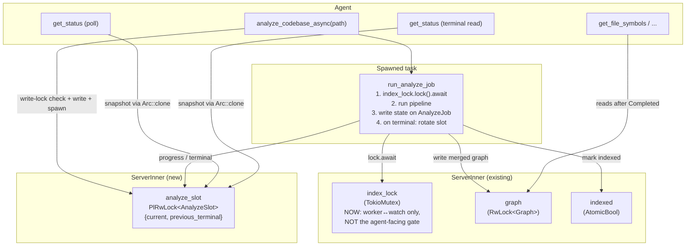
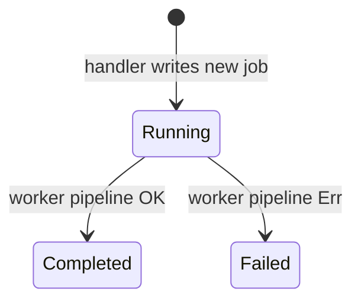
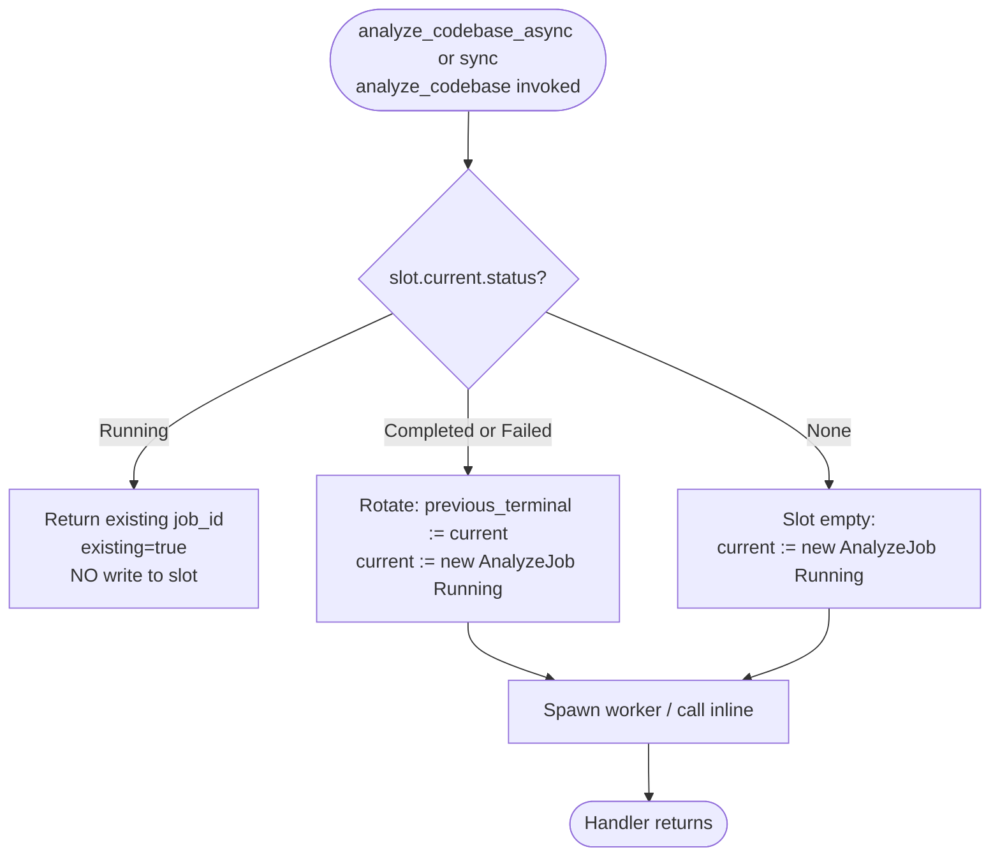
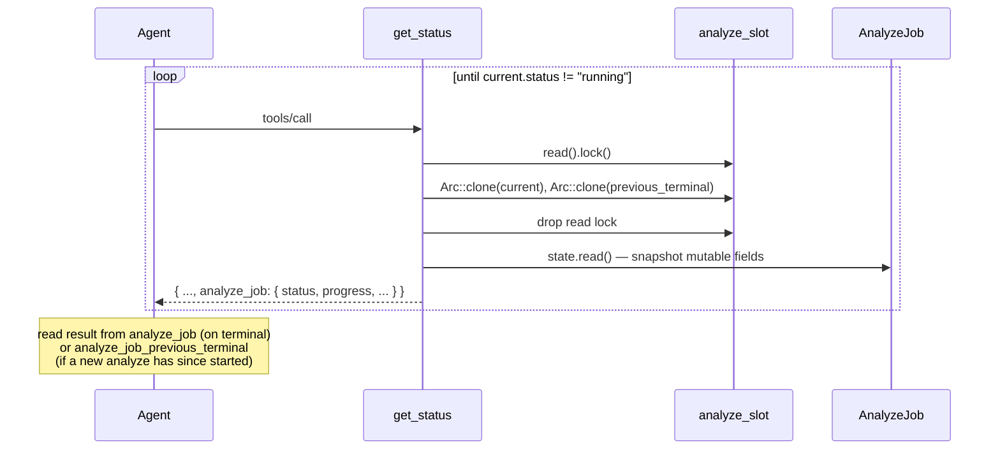
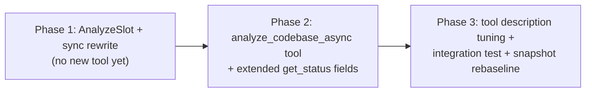

# Async analyze_codebase with Poll-Based Status

## Overview

Today's `analyze_codebase` is a synchronous MCP tool: the agent's `tools/call` stays open for the full indexing duration (130–200s on LLVM, longer on UE-scale codebases). Two failure modes follow from this:

- **Client-side timeout (`MCP_TOOL_TIMEOUT`).** Documented in CLAUDE.md and reproducible: a Claude Code session with a default `MCP_TOOL_TIMEOUT` (often well under 60s) gives up on the call long before the server finishes, surfacing `"[Tool result missing due to internal error]"` to the agent even though the server completes and writes the cache cleanly. Progress notifications do not extend the deadline.
- **Lock wedging on stalled transport.** Now fixed at the source (commit `0d32b55`: the forwarder is time-bounded so `index_lock` cannot pin), but the underlying coupling — agent's request future and server's indexing work are the same future — remains the architectural cause of every "long tool call" symptom we hit downstream.

This design splits the analyze into **kickoff** and **observe** phases:

- `analyze_codebase_async` returns immediately (sub-second) with a `job_id` after spawning the indexing work on a detached tokio task.
- `get_status` gains an optional `analyze_job` field surfacing the in-flight or most-recent job's status, progress, and (on completion) the same `AnalyzeResult` shape `analyze_codebase` returns today.
- The synchronous `analyze_codebase` is preserved — it remains the right call for short codebases or clients that prefer one-shot semantics — but it is rewritten to share the same job-state machinery so `get_status` reports its progress too.

**Single-flight model.** This design promotes the **job slot** (`analyze_job` on `ServerInner`) to the authoritative single-flight gate for analyses. `index_lock` continues to exist as a serialization primitive between the analyze worker and the watch handler — but it is no longer the gate that agents observe. The slot's `Running` state is the canonical "an analyze is in flight" signal; both sync and async handlers check it under the same write-lock protocol before deciding to start work. This change is load-bearing for the correctness of sync+async coexistence (see Design Decision 1).

What's intentionally **not** in scope:

- Cancellation of an in-flight job (no `cancel_analyze` tool). Deferred — see Design Decision 5.
- Job history beyond a one-job grace window. Two-job retention is sufficient for the observed agent flow (see Design Decision 4).
- Multi-tenant workspaces (covered by `Designs/SharedDaemon`).
- Restoring an in-flight job across process restarts. A daemon restart drops the job; the next `analyze_codebase_async` starts a new one. Acceptable because the on-disk cache is the durable artifact.

## Architecture

### Components



### Job state machine



Each `AnalyzeJob` is immutable in shape after construction; only its inner state field mutates. The slot rotation policy (see Slot rotation below) controls how terminal jobs are retained for the agent to observe.

### Slot rotation



The rotation gives the agent **one terminal-result grace window**: after a job terminates, its result remains in `previous_terminal` until a subsequent analyze itself terminates and rotates again. This protects against the realistic agent pattern of "kick off → observe terminal → kick off another → realize I needed the previous result" — see Design Decision 4.

### Data flow — async kickoff

```mermaid
sequenceDiagram
    participant Agent
    participant Tool as analyze_codebase_async
    participant Slot as analyze_slot<br/>(PlRwLock)
    participant Worker as spawned task
    participant Lock as index_lock
    participant Graph
    participant Cache as on-disk cache

    Agent->>Tool: tools/call (path, force)
    Tool->>Slot: write().lock()
    Note over Tool,Slot: SLOT WRITE LOCK HELD<br/>across check + decide + write + spawn
    alt slot.current is Running
      Tool->>Slot: read current job_id
      Tool->>Slot: drop write lock
      Tool-->>Agent: { job_id (existing), status: "running", existing: true }
    else slot.current is terminal or empty
      Tool->>Slot: rotate (previous := current; current := new Running job)
      Tool->>Worker: tokio::spawn(run_analyze_job(inner, job))
      Tool->>Slot: drop write lock
      Tool-->>Agent: { job_id (new), status: "running", existing: false }
    end

    Note over Worker: handler future returned;<br/>worker is detached and lives on the runtime

    Worker->>Lock: lock().await
    Note over Worker,Lock: serializes behind any in-flight<br/>watch reindex; fast in practice<br/>(watch reindex is one file)
    loop indexing phases
      Worker->>Graph: parse / resolve / merge
      Worker->>Slot: write().state.progress / progress_message
    end
    alt success
      Worker->>Cache: save (atomic rename)
      Worker->>Graph: install merged graph
      Worker->>Slot: write().state.status := Completed(result)
    else error
      Worker->>Slot: write().state.status := Failed(msg)
    end
    Worker->>Lock: drop guard
```

The locking protocol's load-bearing property: the slot's `PlRwLock` write guard is held across the slot-check, the slot-write, AND the `tokio::spawn`. This makes the "is another analyze in flight?" question and the "register a new in-flight analyze" action atomic with respect to other handlers. Two concurrent `analyze_codebase_async` calls (or one sync + one async) cannot both observe `None` and both spawn a worker — one acquires the write lock first, wins, and the other sees `Running` and returns `existing: true`. See Design Decision 1.

### Data flow — agent poll



Snapshot semantics: `get_status` acquires the slot read lock just long enough to clone two `Arc<AnalyzeJob>` (cheap), drops it, then acquires each job's inner `state` read lock to snapshot the mutable fields. This means JSON serialization happens with NO locks held, and the slot/state locks are held only for the constant-time duration of an `Arc::clone` and a struct read respectively. Worker progress writes therefore don't contend meaningfully with polling.

### Interfaces

#### New tool: `analyze_codebase_async`

**Args** — identical to `analyze_codebase`:
```jsonc
{
  "path": "/abs/path/to/codebase",
  "force": false              // optional, default false
}
```

**Response** (immediate, < 1KB):
```jsonc
{
  "job_id": "01716234567890000000",     // 20-char zero-padded nanosecond timestamp
  "status": "running",
  "started_at": "2026-05-23T14:32:11Z",
  "existing": false,                    // true if a job was already running and we returned its id
  "note": "poll get_status to observe progress and read the result"
}
```

When called while a job is already `Running`, the response carries the **existing** job's `job_id` with `existing: true`. Args of the duplicate call (including `force`) are ignored — see Design Decision 3.

#### Extended `get_status` — new optional fields

```jsonc
{
  // ... existing StatusResult fields unchanged ...
  "analyze_job": {                          // current slot; null when no analyze has ever started
    "job_id": "01716234567890000000",
    "status": "running",                    // "running" | "completed" | "failed"
    "path": "/abs/path/to/codebase",
    "force": false,
    "started_at": "2026-05-23T14:32:11Z",
    "finished_at": null,                    // RFC3339, present when status != "running"
    "progress": 42312,                      // files processed
    "progress_total": 72345,                // 0 during discovery phase, then set
    "progress_message": "parsing 42312/72345 files",
    "error": null,                          // string when status == "failed"
    "result": null                          // AnalyzeResult shape when status == "completed"
  },
  "analyze_job_previous_terminal": null     // present (non-null) iff slot rotated and the
                                            // previous job terminated. See Slot rotation above.
}
```

The `result` field, on `Completed`, is byte-identical to today's `analyze_codebase` JSON: `{ files, symbols, edges, root_path, warnings }`. Agents that already parse `analyze_codebase` output can reuse the same deserializer.

#### Internal state — `AnalyzeJob` shape

Mutable state is consolidated into a single inner lock — no split-brain across atomics and a separate lock:

```rust
pub struct AnalyzeSlot {
    pub current: Option<Arc<AnalyzeJob>>,
    pub previous_terminal: Option<Arc<AnalyzeJob>>,
}

pub struct AnalyzeJob {
    // Immutable after construction:
    pub job_id: String,
    pub path: String,
    pub force: bool,
    pub started_at: u64,                     // ns since UNIX_EPOCH

    // Mutable, single lock for the whole mutable surface:
    pub state: PlRwLock<JobMutableState>,
}

pub struct JobMutableState {
    pub status: JobStatus,
    pub finished_at: Option<u64>,            // 0 → None; set on terminal transition
    pub progress: u32,                       // monotonic, files processed
    pub progress_total: u32,                 // 0 → set once discovery completes
    pub progress_message: String,
}

pub enum JobStatus {
    Running,
    Completed(AnalyzeResult),
    Failed(String),
}
```

Stored on `ServerInner` as:
```rust
pub analyze_slot: PlRwLock<AnalyzeSlot>,
```

Two lock layers, each held briefly:
- **Outer (`analyze_slot.write()`)** — held by handlers during the check-and-write-and-spawn sequence (microseconds). Held by `get_status` only during two `Arc::clone`s (nanoseconds).
- **Inner (`job.state.write()`)** — held by the worker during progress writes (each ~50ns). Held by `get_status` during snapshot of a few small fields (~50ns).

Both writes (progress and terminal transition) happen under the inner lock, which gives reads a consistent view of `status` and its associated `finished_at` / payload (`AnalyzeResult` for Completed, `String` for Failed) — see Design Decision 7 for why this replaces the original AtomicU8+RwLock split. There are no `AtomicU8`/`AtomicU32` on the job — the inner `PlRwLock` is the only synchronization primitive, removing the memory-model question entirely.

#### Sync `analyze_codebase` continues to exist

The existing tool is preserved. Internally it follows the SAME slot protocol as async (check under write-lock, rotate, write new job), then calls `run_analyze_job` **inline** (not spawned) and `.await`s it before returning. The `AnalyzeResult` from the worker is the wire response. Behavior changes:
- **Wire format**: unchanged.
- **Concurrent-call behavior**: identical (errors with "indexing already in progress" when slot is `Running`). The error now comes from the slot check, not from `index_lock.try_lock` — but the user-visible string is preserved for snapshot stability.
- **Behavior under watch contention**: today, sync `analyze_codebase` calls `index_lock.try_lock` and returns "indexing already in progress" if a watch reindex happens to be mid-`try_reindex_file`. Under this design, sync handler writes the slot first, then calls `index_lock.lock().await`, which serializes behind the watch reindex (single-file, ms scale) and proceeds. This is more correct (watch is supposed to be transparent to analyze) but is a behavior change worth flagging — see Design Decision 9.

## Design Decisions

### Decision 1: Slot is the single-flight gate; `index_lock` becomes worker↔watch only

**Context:** With both sync and async `analyze_codebase` writing the slot, there are two potential gates: the slot's `current.status == Running` check, and the existing `index_lock.try_lock` call inside the worker. Which one is authoritative for "is an analyze in flight"?

**Options Considered:**
1. **Slot is authoritative.** Both handlers check + write the slot under its write lock; the worker uses `lock().await` (not `try_lock`) on `index_lock` because by construction at most one worker exists.
2. **`index_lock` is authoritative.** Handlers don't check the slot at all; the worker `try_lock`s and reports failure as Failed terminal. The slot only carries observability, not gating.
3. **Both gates apply.** Handler checks the slot AND the worker `try_lock`s; both must agree.

**Decision:** Option 1.

**Rationale:** Option 1 has one obvious gate (the slot), one obvious failure mode (`existing: true` or "indexing already in progress"), and a worker that never has to handle a lock-acquisition failure. The single-flight invariant is enforced at the moment the agent observes it (the handler's response), not deep inside a spawned task whose error path the agent never sees. Option 2 leaves the slot as observability-only, but then concurrent handlers can both spawn workers (because they both read the slot as empty before either's worker has acquired the lock), and the loser writes a `Failed` terminal the agent didn't ask for — undefined and bad UX. Option 3 requires both gates to be consistent — a debugging nightmare when they diverge.

The cost of Option 1 is that `index_lock` no longer single-flights against the watch handler in the same way — the worker uses `lock().await`, so a watch reindex in flight when an analyze begins will delay the analyze's start by the watch's duration (a few ms for one file). This is **more correct** than today's behavior (where the sync handler would error out with "indexing already in progress" during a watch reindex) — but it is a wire-behavior change for sync analyze, called out in Design Decision 9.

**The locking protocol both handlers follow:**
```rust
let mut slot = inner.analyze_slot.write();
if let Some(cur) = &slot.current {
    if matches!(cur.state.read().status, JobStatus::Running) {
        let existing_id = cur.job_id.clone();
        drop(slot);
        return /* existing_response(existing_id) */;
    }
}
// Rotate previous terminal aside, install new Running job.
let new_job = Arc::new(AnalyzeJob::new_running(...));
let prev = slot.current.take();
if prev.as_ref().is_some_and(|p| !matches!(p.state.read().status, JobStatus::Running)) {
    slot.previous_terminal = prev;
}
slot.current = Some(Arc::clone(&new_job));
drop(slot);

// async: tokio::spawn(run_analyze_job(inner, new_job));
// sync:  run_analyze_job(inner, new_job).await;
```

### Decision 2: Single most-recent slot vs. ring buffer of jobs

**Context:** Should the slot keep arbitrary history or only the current/most-recent?

**Options Considered:**
1. **Two-slot grace window** (`current` + `previous_terminal`).
2. **Single slot** — overwrite on next start.
3. **Ring buffer of N jobs.**

**Decision:** Option 1.

**Rationale:** The grace window addresses a realistic agent failure mode (kick off → see terminal → kick off again before reading result; see Design Decision 4) at minimal cost: one extra `Option<Arc<AnalyzeJob>>` field, one extra conditional during rotation. A ring buffer adds shape complexity (`analyze_jobs[]` or rotating fields), unbounded growth in pathological cases, and a need to express "current" vs. "history" in the wire shape — none of which the use case demands. The single-slot model loses results too easily under interleaved tool calls; the grace window is the minimum bound for safety.

### Decision 3: Duplicate kickoff returns existing job vs. errors

**Context:** What should `analyze_codebase_async(path, force)` do when a job is already `Running`?

**Options Considered:**
1. **Return existing job_id** with `existing: true`.
2. **Error** with `"indexing already in progress"` (parity with sync).
3. **Queue** the second call to run after the first.
4. **Reject if `force` differs** from in-flight, otherwise return existing.

**Decision:** Option 1.

**Rationale:** Async semantics fundamentally invert the question. The sync tool's error matches the sync contract ("you can't do two of these at once") but for async, "you can't kick off another one" is unhelpful — the agent's intent is "I want this indexed", and we either already have a job working on that exact thing (return its id) or we don't (start one). Option 3 (queueing) creates unbounded growth on a busy agent and silently delays results. Option 4 (force-mismatch rejection) adds a corner case agents must reason about — easier to say "args of a duplicate call are ignored" and let the agent re-issue after the current job finishes if `force` is truly required. Doc the arg-ignore in the tool description.

### Decision 4: Result staleness — single slot vs. two-slot grace window vs. opt-in retention

**Context:** A naive single-slot design loses the terminal result the instant a new analyze kicks off. Is that acceptable?

**Options Considered:**
1. **Single slot only** — accept the loss; document in the tool description.
2. **Two-slot grace window** — `current` + `previous_terminal` (this design).
3. **Opt-in retention** — `analyze_codebase_async` takes a `keep_previous: bool` arg.

**Decision:** Option 2.

**Rationale:** Option 1 was the original draft of this design; the plan-reviewer identified that it leaves a real failure mode unaddressed. Realistic agent patterns include batched tool calls and multi-step plans that may not read terminal results immediately. The two-slot grace window costs almost nothing (one Option field, one rotation rule) and provides a one-job recovery window — sufficient for the observed pattern of "agent did one wrong thing between observing terminal and reading the result." Option 3 (opt-in retention) is more flexible but pushes a configuration decision onto every caller for a behavior most callers will want — the default-on grace window is strictly better.

The grace window is **bounded**: it survives exactly one additional analyze kickoff. After two analyses in a row, the original terminal is gone. This is adequate because:
- The only path to a new analyze is an explicit `analyze_codebase` or `analyze_codebase_async` call.
- No other tool kicks off an analyze internally.
- Therefore "the previous terminal is lost" requires the agent itself to issue two analyses without reading either's result — a self-inflicted situation that documenting in the tool description sufficiently mitigates.

### Decision 5: Cancellation — in scope or deferred

**Context:** Async kickoff naturally raises "can I cancel?". Today's sync analyze has no cancel either, but it's gated by `MCP_TOOL_TIMEOUT` at the client.

**Options Considered:**
1. **Defer.** No cancel tool in v1. Job runs to natural completion or failure.
2. **Add `cancel_analyze(job_id)`** in v1.

**Decision:** Option 1.

**Rationale:** Adding cancellation requires threading a `CancellationToken` through the indexer's rayon pool — cooperative cancel at parse-batch granularity, careful interaction with `merge_file_graph`, and a story for "cancelled mid-merge → graph in indeterminate state." That's a sizable change with its own correctness obligations and tests; doing it in the same scope as the kickoff/poll split would muddy both. v1 ships the structural fix (kickoff is no longer in the agent's request window); cancellation is a follow-on whose value only matters once kickoff exists. Note that the **process** can still be killed; the on-disk cache from a prior run is intact via `Graph::save`'s atomic-rename invariant.

### Decision 6: Job-id format — timestamp string vs. ULID vs. UUID

**Context:** What does `job_id` look like?

**Options Considered:**
1. **20-char zero-padded decimal nanosecond timestamp** (`"01716234567890000000"`). No new dep.
2. **ULID** (`"01J5Q2X3..."`). 26 chars; pulls in `ulid` crate (which transitively depends on `rand`).
3. **UUID v4** (`"550e8400-e29b-41d4-a716-446655440000"`). 36 chars; pulls in `uuid` crate.
4. **Monotonic counter** (`"1"`, `"2"`, ...). Tiny, sortable, requires per-process atomic; loses uniqueness across process lifetimes.

**Decision:** Option 1.

**Rationale:** Under single-flight, the slot serializes every kickoff. Two jobs cannot start in the same nanosecond — the second is gated by the first's slot release. A decimal nanosecond timestamp is therefore unique-by-construction, lexicographically sortable, and adds zero dependencies. ULID and UUID provide cryptographic uniqueness the use case does not need. The workspace charter (per `status.rs` docstring on `format_unix_nanos_rfc3339`) is to stay slim on dependencies; one new transitive dep family (random number generation) for a value with no security or uniqueness-beyond-timestamp requirement is not justified. Reuses the existing `now_nanos_u64()` helper (`crates/code-graph-tools/src/handlers/analyze.rs`).

### Decision 7: Mutable state representation — single inner lock vs. atomics + separate lock

**Context:** The worker writes progress frequently (~70k times for an LLVM-scale index) and status/payload exactly once on terminal transition. The original draft used `AtomicU32` for progress and a separate `PlRwLock<Option<JobTerminal>>` for the terminal payload, with `AtomicU8 status` as the discriminant.

**Options Considered:**
1. **All-inside-`PlRwLock` (this design).** One inner lock; no atomics.
2. **Atomics for progress, `PlRwLock` for terminal, `AtomicU8` for status discriminant.** The original draft.
3. **Atomics for progress only; `status` and `terminal` together inside a `Mutex`.**

**Decision:** Option 1.

**Rationale:** Option 2 (the original) has a real memory-model bug: a reader doing `status.load(Acquire) == Completed` followed by a separate `terminal.read()` is **not** guaranteed to see the terminal payload, because the `Release` store on `status` only synchronizes-with `Acquire` loads on `status` — not with the `PlRwLock` operations on `terminal`. On x86 this is invisible (LOCK-prefixed atomics are sequentially consistent), but on ARM/RISC-V the rwlock unlock and the atomic store can be reordered by the hardware. The plan-reviewer caught this; the fix is to either use `SeqCst` for the cross-primitive coordination (slow, and `parking_lot` doesn't document its drop-fence strength) or to consolidate state under one lock. Consolidating is simpler, correct by construction, and the cost is negligible: each worker progress write is ~50ns of uncontended `PlRwLock` traffic; 70k writes ≈ 3.5ms total — invisible against 130s of indexing wall time. `get_status` polls are single-digit Hz at most, so contention is non-existent.

Option 3 retains the progress atomics for free (since they're advisory, never used for correctness decisions, and `Relaxed` ordering is fine). It's a defensible middle ground but the performance gain (3.5ms saved) is unmeasurable in the context. Option 1 wins on simplicity.

### Decision 8: Progress sink — fan-out vs. replace mpsc

**Context:** Today the sync indexer pushes progress through an `mpsc::channel` to a forwarder task that throttles and calls `peer.notify_progress`. The async mode has no peer, but still needs progress visible to `get_status`.

**Options Considered:**
1. **Fan-out:** the indexer's `report()` writes to BOTH the existing mpsc (when present) AND the job slot's inner state. Sync mode runs the existing forwarder; async mode passes no peer/token so the forwarder doesn't spawn.
2. **Replace** the mpsc with direct writes to `AnalyzeJob`; sync mode adds an atomic-watcher polling loop to drive the peer notifications.
3. **Two sinks**, picked per call: `ChannelProgressSink` for sync (peer path), `JobProgressSink` for async (slot path).

**Decision:** Option 1.

**Rationale:** Direct writes to the inner lock are cheap (see Decision 7). Keeping the mpsc + forwarder for sync mode preserves the throttle+peer behavior we just fixed (commit `0d32b55`) — the per-call timeout there is load-bearing; we don't want to refactor that surface while landing async. The fan-out is one extra line in `report()`: write the slot, then `try_send` to the mpsc (when present). Both sync and async modes go through the slot write; sync additionally drives the mpsc-fed forwarder for client-side progress notifications. Option 2's atomic-watcher reads stale data and adds extra latency for no benefit. Option 3 splits the indexer's progress contract into two interface variants, adding sink polymorphism for marginal benefit.

**To clarify a contradiction in the original draft:** sync mode retains its mpsc + forwarder task unchanged. The forwarder continues to read from the mpsc and notify the peer as today. Additionally, `report()` writes `progress` / `progress_total` / `progress_message` into the job slot so `get_status` reflects sync analyses too. Async mode passes `peer: None`, so the forwarder branch in `analyze_codebase`'s body short-circuits to the local-drain spawned task (existing behavior when no progress token is present). The slot writes happen in both modes via the same `report()` call.

### Decision 9: Sync handler waits for watch reindex (vs. errors today)

**Context:** Today sync `analyze_codebase` calls `index_lock.try_lock()` and returns "indexing already in progress" on contention. Under this design, sync writes the slot first, then `index_lock.lock().await`s. If a watch reindex is mid-flight, sync now waits.

**Options Considered:**
1. **Sync waits** (this design) — more correct, but changes wire behavior on watch contention.
2. **Sync retains try_lock semantics** — preserves wire compatibility, but the failure case ("watch is busy → analyze errors") is misleading: the agent reads "indexing already in progress" when no other analyze is actually running.

**Decision:** Option 1.

**Rationale:** The current behavior is a defensible byproduct of how `index_lock` was the only gate. With the slot as the gate, the question "is another analyze in flight?" is answered by the slot; the question "is the worker ready to start?" is answered by `index_lock`. They're now distinct, and only the first should produce an agent-visible "in progress" error. The watch handler's reindex is bounded (one file's worth of parse + merge, milliseconds typically), so waiting briefly is the correct trade. Snapshot tests asserting the "indexing already in progress" error need to be updated to exercise slot-based exclusion (an in-flight async analyze) rather than direct `index_lock` holding.

## Error Handling

| Failure | Surface |
|---|---|
| Args validation (empty path, non-existent dir, file-not-dir, malformed toml) | `analyze_codebase_async` returns a synchronous `tool_error` — no slot rotation, no job written. Identical wording to today's `analyze_codebase` for byte-compatibility with the snapshot suite. |
| Duplicate kickoff while slot.current is `Running` | Synchronous success response with `existing: true`, carrying the in-flight job's `job_id`. Not an error. |
| Indexing panic / parse failure inside the worker | Worker catches the `JoinError` / `Err(String)` from its inner `spawn_blocking` and writes `JobStatus::Failed(msg)` into `state`. `get_status` then reports `status: "failed"` with the message in `error`. The job stays as `current` until the next analyze rotates it to `previous_terminal`. |
| Cache save failure | Same as today: warning attached to `AnalyzeResult.warnings`. The job is `Completed`, not `Failed` (matches current sync behavior — a save miss doesn't invalidate the in-memory index). |
| Worker thread cancellation on runtime shutdown | The slot may remain in `Running` indefinitely. Acceptable: a fresh process starts with an empty slot, and the on-disk cache uses `Graph::save`'s atomic-rename, so a mid-write process kill leaves the prior cache intact. |
| Sync `analyze_codebase` called while async job is `Running` | Slot check fires; sync returns `tool_error("indexing already in progress")` — same wire text as today. |
| Watch reindex in flight when worker starts | Worker's `index_lock.lock().await` waits (typically ms). Not an error. |
| `get_status` called with no analyze ever run | Both `analyze_job` and `analyze_job_previous_terminal` are `null` — the original `StatusResult` fields are unchanged. |
| Agent kicks off two analyses in a row without reading the first | First terminal is preserved in `analyze_job_previous_terminal` until the second analysis itself terminates. After that, the original is lost. Documented loudly in the tool description: "the slot retains the most recent terminal plus one previous; read promptly." |

## Testing Strategy

### Unit tests (new)

In `crates/code-graph-tools/src/handlers/analyze.rs` and `status.rs`:

**Lifecycle:**
- `async_kickoff_returns_immediately_with_running_job` — call `analyze_codebase_async` on a small dir, assert response time < 100ms and status is `"running"`.
- `async_kickoff_then_poll_completes` — kickoff, then loop on `get_status` (tokio::time::sleep 50ms cadence) until `Completed`, assert `result.files == expected_count`.
- `sync_analyze_populates_slot_with_completed` — call sync `analyze_codebase`, after completion assert `analyze_slot.current.state.status` is `Completed(_)` with matching result.

**Single-flight (race coverage):**
- `concurrent_async_kickoffs_only_one_spawns_worker` — two tokio tasks both call `analyze_codebase_async` on an empty slot, gated by a `Barrier`; assert exactly one response has `existing: false` and exactly one has `existing: true`, both carrying the same `job_id`. Implemented with `JoinSet` + `tokio::sync::Barrier` for deterministic synchronization.
- `async_duplicate_kickoff_after_first_started_returns_existing_job_id` — kickoff, await one `tokio::yield_now()` so the slot write commits, kickoff again, assert second response has `existing: true` and same `job_id`.
- `async_kickoff_blocks_sync_analyze` — kickoff async, immediately call sync `analyze_codebase`, assert sync returns the `"indexing already in progress"` `tool_error`.
- `sync_kickoff_blocks_async_kickoff` — start sync analyze in a spawned task (it will hold the slot via inline `run_analyze_job`), immediately call async, assert async returns `existing: true` carrying sync's `job_id`. Requires the test corpus to be slow enough that sync is still in `run_analyze_job` when async is called — use the `test_recording_plugin` with a sleep injection.

**Slot rotation:**
- `terminal_job_rotates_to_previous_on_next_kickoff` — kickoff, poll to Completed, kickoff again, assert `analyze_slot.previous_terminal` carries the first job and `current` is the second (Running).
- `two_back_to_back_analyses_lose_oldest_terminal` — kickoff, poll to Completed (call this T1), kickoff (call this T2), poll to Completed, kickoff (T3), assert `previous_terminal` is T2 and T1 is gone.

**Failure paths:**
- `failed_job_surfaces_error_in_get_status` — inject a parse-blocking malformed toml, kickoff async, poll until `Failed`, assert `error` contains "failed to parse .code-graph.toml".
- `failed_job_rotates_to_previous_terminal` — failed job is still considered terminal for rotation purposes; assert next kickoff moves the failed job to `previous_terminal`.

**Progress reporting (deterministic):**
- `progress_atomics_increment_during_indexing` — use a custom `LanguagePlugin` (extending `test_recording_plugin`) that sleeps 10ms per `parse_file` call. Generate 20 fixture files. Kickoff async. Poll `get_status` every 30ms while `status == "running"`; record observed `progress` values. Assert observed sequence is monotonically non-decreasing AND at least three distinct intermediate values are seen (not just 0 → final). Determinism comes from the test plugin's controlled sleep, not from runtime timing.

**`get_status` shape:**
- `get_status_with_no_analyze_returns_null_job_fields` — fresh server, both `analyze_job` and `analyze_job_previous_terminal` are `null`.
- `get_status_completed_carries_full_analyze_result` — kickoff, poll to Completed, assert `analyze_job.result` has `files`, `symbols`, `edges`, `root_path`, `warnings` fields matching what the sync `analyze_codebase` would return.

### Integration test (new)

`crates/code-graph-tools/tests/analyze_async_lifecycle.rs`:

End-to-end through the rmcp test harness: build a server with a real (small) corpus, call `analyze_codebase_async`, poll `get_status` until terminal, then call `get_file_symbols` and assert results match what the sync path would have produced. Covers the agent's actual usage pattern.

### Regression coverage (existing tests stay green, with one update)

- Most `handlers::analyze::tests::*` keep passing as-is (sync path wire semantics unchanged).
- **`analyze_concurrent_call_returns_indexing_in_progress`** is updated: today it holds `index_lock` externally and asserts sync rejects. Under Decision 9, sync no longer rejects on `index_lock` contention. The updated test holds the **slot** in `Running` state by writing `analyze_slot.current` directly to a synthetic `AnalyzeJob`, then calls sync `analyze_codebase` and asserts the same `"indexing already in progress"` error. The wire-format assertion is preserved — only the test's "hold this thing externally" mechanism changes.
- Snapshot suite for `get_status`: existing snapshots add `analyze_job: null` and `analyze_job_previous_terminal: null` and re-baseline once. A new snapshot covers the populated `analyze_job` shape (Running and Completed variants).

### Structural Verification (Rust)

Per `shared/languages/rust.md`:

- `cargo clippy --workspace --all-targets -- -D warnings` clean.
- No `unsafe` introduced.
- No atomics on `AnalyzeJob`. The inner `PlRwLock<JobMutableState>` is the sole synchronization primitive for the job's mutable state, eliminating the memory-ordering question entirely.
- `cargo test --workspace` clean across all crates.
- `make snapshot-clean` — the rebaselined `get_status` snapshots must land alongside the change; no stragglers.

## Migration / Rollout

### Phased delivery



**Phase 1 — Slot + sync refactor.** Add `AnalyzeSlot` / `AnalyzeJob` / `JobMutableState` types and the `analyze_slot` field on `ServerInner`. Lift the analyze pipeline body into `run_analyze_job(inner, job_arc)`. Rewrite sync `analyze_codebase` to: (a) acquire `analyze_slot.write()`, check `current.status`, rotate, install new Running job, drop the write guard; (b) call `run_analyze_job(inner, job).await` inline; (c) read the terminal `AnalyzeResult` from the job and return it as the wire response. Worker uses `index_lock.lock().await` (not `try_lock`). Behavior change called out in Decision 9. The existing `analyze_concurrent_call_returns_indexing_in_progress` test is updated; no new tool surface in this phase. Tests: all other existing analyze tests stay green; new tests for slot rotation and the concurrent-handler race land here.

**Phase 2 — Async tool + extended status.** Add `analyze_codebase_async` and the `analyze_job` + `analyze_job_previous_terminal` fields on `StatusResult`. With Phase 1's worker already in place, this phase is largely additive: a new handler, a new arg struct, two new optional fields on `StatusResult`, no behavior change to the existing tools (other than the Phase 1 sync change).

**Phase 3 — Tool descriptions, integration test, snapshots.** Tune the descriptions on both `analyze_codebase_async` and `get_status` per the "Agent-facing tool descriptions" lens in CLAUDE.md (the description must operationally explain the poll pattern, name the cadence, name the response envelope shape, name the grace-window semantics). Re-baseline `get_status` snapshots. Add the end-to-end lifecycle integration test.

### Compatibility

- **Existing clients** of sync `analyze_codebase` are unaffected at the wire — same `AnalyzeResult` shape, same error wording. The behavior change (waiting for watch instead of erroring during watch contention) is silent to wire-format consumers and strictly more correct.
- **Existing clients** of `get_status` see two new optional fields (`analyze_job`, `analyze_job_previous_terminal`), `null` before any analyze. JSON-deserializers that ignore unknown fields require no change. Strict-schema clients (none in scope today) would need a one-line schema update.
- **Cache format** unchanged. No `CACHE_VERSION` bump.
- **Cache write atomicity** preserved: `Graph::save`'s temp-file + atomic-rename invariant is untouched; a mid-write process kill leaves the prior cache intact.
- **Watch handler** unchanged. The existing `try_reindex_file` `try_lock` semantics still apply for watch contention against an in-flight worker.

### SharedDaemon coherence

The future `Designs/SharedDaemon` refactor factors a `Workspace` struct out of `ServerInner`. `analyze_slot` migrates from `ServerInner` into `Workspace` at that time — it is per-indexed-path by construction under single-flight, so the move is mechanical (no semantic change). The grace-window behavior persists per-workspace, which is the right scope.

### Documentation

`CLAUDE.md` needs a small update post-Phase 2:
- Tool count: 18 → 19.
- New section under "MCP tools" describing `analyze_codebase_async` + the polling pattern + the grace-window semantics.
- A note under the existing `MCP_TOOL_TIMEOUT` paragraph that async kickoff is the structural workaround.
- The `get_status` row gains a mention of the new `analyze_job` and `analyze_job_previous_terminal` fields.
- A note under the watch handler section that sync `analyze_codebase` now waits for an in-flight watch reindex instead of erroring (Decision 9).

### Rollback

No persistent state changes (no cache format bump, no on-disk schema). Reverting Phase 2's commit removes the tool from the registry and the optional `get_status` fields; Phase 1's worker refactor is internal and safely revertible alone if needed (sync wire format is unchanged from today). Reverting Phase 3 is documentation-only.
