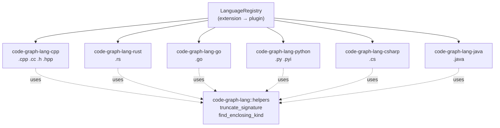
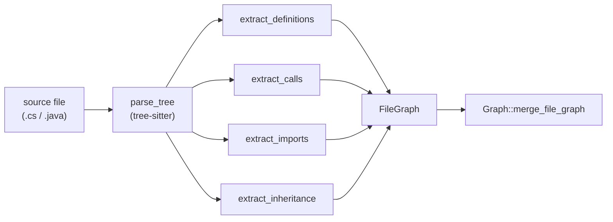
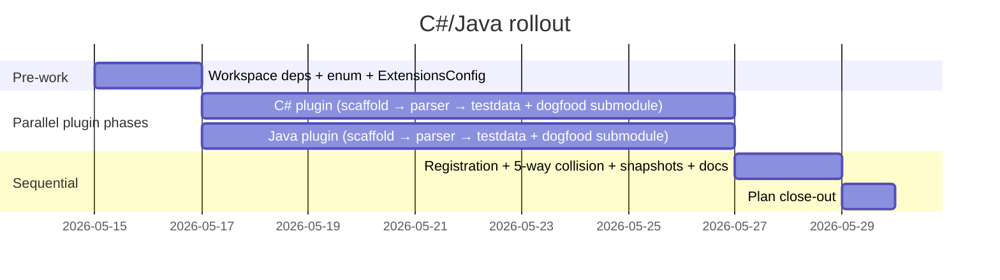

# C# and Java Language Plugins

> **Status: draft.** The four-language MCP (C++/Rust/Go/Python) shipped via the RustRewrite plan on 2026-05-07. This design picks up the next obvious extension — adding C# and Java — and surfaces the language-specific complications that diverge from the four shipped plugins. It explicitly does NOT specify a phase plan; that lives in the implementation plan that follows this design's approval.

## Overview

The plugin architecture is shipped and stable. `LanguageRegistry` dispatches by file extension to a `Box<dyn LanguagePlugin>`; each plugin owns its own `tree-sitter` grammar, queries, and per-language helpers. The `(Language, name)`-keyed `SymbolIndex` provides cross-language isolation. Phase 7's debrief flagged adding a fifth or sixth plugin as "would slot in cleanly" — this design treats that as the working hypothesis and surfaces only the parts that don't slot in cleanly.

The added languages bring two new capabilities to the four-language baseline:

- **Enterprise polyglot codebases.** Many real-world repos mix Java backends with C# tooling or vice versa; agents querying these codebases benefit from uniform graph semantics across all six languages.
- **First plugin pair shipped together.** All prior plugin work was sequential (cpp → rust → go → python). Designing C# and Java as a parallel pair tests the parallel-dispatch path the Phase 7 retro flagged: if their grammars are truly independent (which they are — different crates, different file extensions), parallel dispatch should land cleanly.

What's intentionally **not** in scope:

- **Kotlin and Scala** (other JVM languages). Java's grammar is enough for the JVM-codebase 80%; Kotlin/Scala can land later as their own designs.
- **F#** (other CLR language). Same reasoning as Kotlin/Scala — out of scope for this pair.
- **Type resolution.** Both languages have rich static type systems; `resolve_call` continues to use the scope-aware heuristic. Static-typed call dispatch with overload resolution is out of scope and would require a semantic analyzer, not a tree-sitter parser.
- **Build-system integration.** No reading of `.csproj`, `.sln`, `pom.xml`, `build.gradle`, or Maven coordinates. Imports record the dotted path as written; resolution against the project's build graph is out of scope.

## Architecture

### Plugin Topology (after this design lands)



Two new crates (`code-graph-lang-csharp`, `code-graph-lang-java`) join four existing ones. The shared `code-graph-lang::helpers` module already hosts the two consolidated helpers (extracted in Phase 7.1 and 7.7); both new plugins re-export.

### Per-Plugin Data Flow

Identical to the four shipped plugins. For reference (matches `crates/code-graph-lang-python/src/lib.rs`):



Both new plugins emit all four edge categories: `Function/Method/Class/Struct/Enum/Interface` symbols, `Calls` edges, `Includes` edges, and `Inherits` edges (unlike Go, which is structural and emits zero `Inherits`).

### Symbol Kinds

The `SymbolKind` enum at `crates/code-graph-core/src/lib.rs` already covers what both languages need (`Function`, `Method`, `Class`, `Struct`, `Enum`, `Typedef`, `Interface`). One open question (see Decisions) is whether `Record` (Java) and `Property` (C#) deserve dedicated kinds or fold into existing ones.

### Registration Touchpoints

Five files change for the pair (the `[extensions]` config plumbing was added after the four-language MCP shipped — commit `dcc6230` — and is a touchpoint earlier drafts of this design missed):

| File | Edit |
|------|------|
| `crates/code-graph-mcp/src/main.rs` | Register `CSharpParser`, `JavaParser` after the existing four |
| `crates/code-graph-parse-test/src/main.rs` | Same registration block (parse-test harness) |
| `crates/code-graph-core/src/lib.rs` | Add `CSharp` and `Java` variants to the `Language` enum |
| `crates/code-graph-core/src/config.rs` | Add `csharp: Vec<String>` and `java: Vec<String>` fields to `ExtensionsConfig`; widen `lookup_additional`, `lists_mut` (5 → 7 entries), and `additive_lists` (4 → 6 entries) so `[extensions].csharp` and `[extensions].java` are first-class additive lists |
| `.code-graph.toml.example` | Document the two new `[extensions]` lists alongside `cpp/rust/go/python`; mention the built-in defaults (`.cs` / `.java`) in the section comment |
| `Cargo.toml` (workspace) | Add `tree-sitter-c-sharp` and `tree-sitter-java` strict-pinned deps; add `crates/code-graph-lang-csharp` and `crates/code-graph-lang-java` to `members` |
| `crates/code-graph-tools/tests/mixed_language.rs` | Widen the `init` collision regression from 3-way to 5-way |

**Why `ExtensionsConfig` is load-bearing:** `LanguageRegistry::language_for_path_with_config` (`crates/code-graph-lang/src/lib.rs:444`) consults the per-root `[extensions]` config before falling back to the registry's default `by_ext` map. If `ExtensionsConfig` doesn't grow `csharp` and `java` fields, users cannot opt extra extensions (e.g., `.cake` for C#, or remap `.aj` to Java) into the new plugins, and a `[extensions].csharp = [".cake"]` line in any root's config would deserialize as an unknown field with the workspace's default-deny serde policy. This is the same plumbing rust/go/python required when they shipped — easy to overlook because their entries already exist.

### Tree-sitter Grammar Pinning

Workspace convention is strict-pin with `=` (matches Phase 1 C++ at `=0.23.4`, Phase 5 Rust at `=0.24.0`, Phase 6 Go at `=0.25.0`, Phase 7 Python at `=0.25.0`).

```toml
[workspace.dependencies]
# ... existing pins ...
tree-sitter-c-sharp = "=<latest stable>"
tree-sitter-java    = "=<latest stable>"
```

The exact versions are populated at implementation time. The `tree-sitter` core's compatibility constraint (`0.26` as of this writing) means both grammars must be built against tree-sitter 0.26's C API; verify before committing.

## Design Decisions

### Decision 1: One design, two parallel plugin phases

**Context:** All prior plugin phases shipped sequentially (C++ → Rust → Go → Python). Each phase's brief refresh, helper consolidation, and registration step assumed a serial cadence.

**Options:**
1. One unified plan with mixed C# + Java tasks (sequential through one combined phase doc).
2. Two parallel plugin plans, dispatched concurrently after the design is approved.
3. Sequential C# first, then Java.

**Decision:** Option 2 — two parallel plugin phases. Each phase's parser body is fully isolated (own crate, own grammar, own queries); they only collide at registration (`main.rs`, `parse-test/main.rs`, `mixed_language.rs`). The collision step lands sequentially after both parser bodies complete.

**Rationale:** The Phase 7 debrief explicitly noted "Adding a fifth language (if anyone ever does) would slot in cleanly" — this is the experiment that tests it. Sequential dispatch was correct for prior plugins because each one extended the same `parse_to_filegraph` skeleton; here, the skeleton is per-crate and parallel dispatch is exactly what the architecture is designed for. If parallel dispatch surfaces a coordination issue, fall back to sequential — but the default should be the architecture's claimed behavior.

### Decision 2: Inheritance edges for both single class inheritance AND interface implementation

**Context:** Java has `class Foo extends Bar implements Baz, Qux`; C# has `class Foo : Bar, IBaz, IQux` (no syntactic distinction between class extension and interface implementation in C#).

**Options:**
1. Emit `Inherits` for class extension only; ignore interface implementation.
2. Emit `Inherits` for both class extension and interface implementation, with no edge-kind distinction.
3. Add a new `Implements` edge kind alongside `Inherits`.

**Decision:** Option 2 — emit `Inherits` for both, no edge-kind distinction. Matches Python's behavior (Python doesn't distinguish ABC inheritance from regular inheritance — `class Foo(ABC, Bar)` produces two `Inherits` edges; the agent reads them uniformly).

**Rationale:** Both forms answer the same agent query: "what is this class's type lineage?" Distinguishing `Inherits` vs `Implements` would add an edge kind nobody else uses and complicates `get_class_hierarchy`. The agent reading the graph can disambiguate post-hoc from the target symbol's kind (`Class` vs `Interface`).

### Decision 3: Partial classes (C#) — multiple files contribute to the same parent

**Context:** C# allows `partial class Foo { ... }` across multiple files; the runtime sees one logical type with the union of all members. The current `(Language, name)` SymbolIndex assumes one parent declaration per name within a language.

**Options:**
1. Treat each `partial class` as a separate `Class` symbol; methods get parent `partial.cs:Foo::m`.
2. Emit one `Class` symbol per partial declaration, with the same name; rely on heuristic resolution to merge them at query time.
3. Detect partials at extraction time and merge into a single `Class` symbol, dropping the others.

**Decision:** Option 2 — one `Class` symbol per declaration; methods carry the parent text `Foo` (bare name, matching the existing inheritance `from`-field rule from Phase 7.5). At query time, `search_symbols("Foo")` returns N results (one per partial file); `get_class_hierarchy("Foo")` walks Inherits edges keyed on the bare name and merges the lineage.

**Rationale:** Option 1 would surprise agents (who expect one logical type). Option 3 would require mutation of FileGraph during extraction, which violates the "extraction is per-file, merging happens later" invariant. Option 2 falls out of the existing contracts naturally — the `from = bare class name` rule already handles the merge at hierarchy-walk time. The cost is one symbol-record per partial (negligible) and the slight surprise that `search_symbols` returns multiple "Foo" entries (acceptable; the file paths disambiguate).

**Verification:** the existing watch-mode reindex regression should be extended to cover the partial case — adding a new partial declaration mid-run, removing one, etc. Extends `watch_csharp_reindex.rs`.

### Decision 4: Anonymous classes (Java) emit no Class symbol

**Context:** Java's `new Runnable() { @Override public void run() { ... } }` creates an unnamed inner class.

**Options:**
1. Emit a synthetic `Class` symbol with a generated name (`Anonymous$1`, `Anonymous$2`).
2. Emit no Class symbol; methods inside the anonymous class take the *enclosing method or class* as parent.
3. Emit no Class symbol; methods take the source file path as parent (module-level fallback, matching Python's pattern for module-level closures).

**Decision:** Option 2 — methods inside an anonymous class take the enclosing named entity as parent. If the enclosing method is `OuterClass::handle`, the anonymous's `run` method's parent is `OuterClass::handle`'s parent (`OuterClass`). The anonymous-class boundary is invisible to the symbol graph.

**Rationale:** Synthetic names (Option 1) leak compiler internals into the graph for no agent benefit. The fallback to file-path-as-parent (Option 3) loses the link to the enclosing class entirely, which is the more useful answer to "what context does this method live in." Java codebases use anonymous classes most commonly for callbacks defined inline inside methods; reporting the enclosing class as parent matches what the agent likely wants.

**Tradeoff:** two anonymous classes inside the same enclosing method that both define a `run` method will produce two `OuterClass::run` symbols with the same ID — a name collision. Mitigation: the file path + line number disambiguate at query time. Document in CLAUDE.md as a known limitation.

### Decision 5: C# extension methods extract as members of the static class, not the extended type

**Context:** `static class Extensions { static int CountWords(this string s) { ... } }` — the `this string s` parameter makes `CountWords` callable as `myString.CountWords()`. Semantically the method extends `string`; syntactically it lives on `Extensions`.

**Options:**
1. Extract as a `Method` with parent `Extensions` (syntactic rule).
2. Extract as a `Method` with parent `string` (semantic rule — requires recognizing the `this` modifier on the first parameter).
3. Extract twice — one symbol per parent.

**Decision:** Option 1 — syntactic rule. Method's parent is the syntactic enclosing class (`Extensions`).

**Rationale:** Tree-sitter is a syntactic parser; recognizing `this` on the first parameter to remap the parent is exactly the semantic work that contradicts the "syntactic, heuristic, best-effort" contract of every other plugin's `resolve_call`. The agent reading the graph can recognize extension-method patterns from the signature text. Option 3 doubles the symbol count for a single declaration and produces inconsistent edge math.

**Documented limitation:** call sites like `myString.CountWords()` will resolve via the same scope-aware heuristic the other plugins use — they may attribute the call to the syntactic `Extensions::CountWords` (correct) or to a same-named method on `string` (incorrect, if one exists). Same class of imperfection as C++'s overloaded-function resolution.

### Decision 6: Java records and sealed types

**Context:** Java 14+ `record User(String name)` is a single-line class declaration with auto-generated members; Java 17+ `sealed interface Shape permits Circle, Square` restricts the implementation set.

**Options:**
1. Treat both as ordinary `Class` / `Interface` symbols; auto-generated members not extracted; `permits` clauses ignored.
2. Add new `SymbolKind::Record` and emit `Permits` edges for sealed types.
3. Treat records as `Class` (skip new kind) but emit `Permits` edges as a new edge kind to capture the seal-set.

**Decision:** Option 1 — both as ordinary `Class` / `Interface`; `permits` clauses ignored.

**Rationale:** Adding new `SymbolKind` variants requires touching every consumer (search filters, snapshot tests, hierarchy walker); the marginal agent-utility of distinguishing records from classes at the kind level is low. The auto-generated record members (`name()` accessor, `equals`, `hashCode`, `toString`) are extracted only if they appear in source — synthetic members are correctly invisible. `permits` is a constraint, not a relationship; agents asking "which types implement Shape" already get the answer from `Inherits` edges, so `Permits` would be redundant.

**Followup-friendly:** if future agent feedback shows record-vs-class disambiguation matters, adding `SymbolKind::Record` later is non-breaking (the enum is `#[non_exhaustive]`).

### Decision 7: Imports record dotted-path verbatim, no resolution

**Context:** `using System.Collections.Generic` (C#) and `import com.foo.Bar` (Java) name external types/namespaces. Both languages have well-defined namespace-vs-package-vs-class semantics that differ from C++'s `#include` (filesystem path) and Python's `from foo import bar` (module path).

**Options:**
1. Record the dotted path verbatim in `Includes` edges; default `resolve_include` is a no-op (matches Python).
2. Resolve against build-system metadata (`.csproj`, `pom.xml`) to produce filesystem paths.

**Decision:** Option 1 — verbatim, no resolution. Same as Python.

**Rationale:** Build-system integration is explicitly out of scope (see Overview). The agent reading the graph can interpret `System.Collections.Generic` or `com.foo.Bar` directly; resolving them to filesystem paths buys nothing without a build-graph context the parser doesn't have.

**C#-specific forms covered:**

- `using System;` → `Includes` to `System`
- `using System.Collections.Generic;` → `Includes` to `System.Collections.Generic`
- `using static System.Console;` → `Includes` to `System.Console` (the `static` modifier is dropped)
- `using FooAlias = Some.Long.Type.Name;` → `Includes` to `Some.Long.Type.Name` (alias dropped, path preserved — same rule as Python `import foo as f`)
- `global using System.Linq;` (C# 10+) → `Includes` to `System.Linq` (the `global` modifier is dropped)

**Java-specific forms covered:**

- `import com.foo.Bar;` → `Includes` to `com.foo.Bar`
- `import com.foo.*;` → `Includes` to `com.foo.*` (wildcard preserved verbatim, matching the Rust plugin's `use foo::*` rule)
- `import static com.foo.Bar.STATIC_FIELD;` → `Includes` to `com.foo.Bar.STATIC_FIELD` (treats the static-import target as the dotted path; the `static` modifier is dropped, same as C#)

### Decision 8: Attributes (C#) and annotations (Java) are transparent for extraction

**Context:** Both languages decorate declarations with attributes/annotations: `[Obsolete]`, `[HttpGet("/api")]`, `@Override`, `@Deprecated`, `@SpringBootApplication`.

**Options:**
1. Decorations are transparent — they wrap the inner declaration; queries match the inner node directly. No edge produced for the decoration itself.
2. Emit decorations as `Calls` edges (similar to C++ macro invocations).
3. Emit a new `DecoratedBy` edge kind.

**Decision:** Option 1 — transparent. Matches Python's `@property`/`@staticmethod` handling.

**Rationale:** Attributes and annotations are metadata, not behavior. An agent asking "what calls this method" doesn't want the answer "an `[HttpGet]` annotation" — that's a description of how the method is exposed, not a caller. For attributes/annotations that *do* trigger code generation (Java's `@Generated`, Roslyn's source-generator attributes), the generated code is invisible to tree-sitter regardless; treating the annotation as transparent is the only consistent rule.

**Documented limitation:** Some annotations (Java's `@Inject`, Spring's `@Autowired`) describe runtime wiring that an agent might want to query. This is out of scope for this design and any future "annotation-aware" enhancement would land as a separate edge kind.

### Decision 9: Generic type parameters preserved in signature only

**Context:** Both languages have rich generics: `class List<T>`, `static <T> T first(List<T> items)`, constraints (`where T : IComparable` in C#, `<T extends Comparable<T>>` in Java).

**Options:**
1. Strip generics from symbol names; preserve in signature text.
2. Keep generics in symbol names (`List<T>` as the bare name).
3. Strip from names; emit no signature-level generics info.

**Decision:** Option 1, **with the parent-string rule matching Rust, not Go.** For both C# and Java, the parent field preserves the generic parameter text verbatim (e.g., `List<T>` as parent, not `List`). The `Inherits` edge's `from` field follows the same rule.

**Rationale:** Two shipped plugins have *opposite* parent-text behavior for generics — Rust preserves (`Vec<T>`), Go strips (`Server` from `Server[T]`). The merge-by-bare-name heuristic this design relies on (Decision 3 partial classes, hierarchy walks) is more robust when the parent text is preserved verbatim, because `class_hierarchy` already strips generics at lookup time. Picking the Go rule would force the C# partial-class merge logic to do an extra strip step the Rust path doesn't need. Rust precedent wins.

**Edge case:** Java's wildcard generics (`List<? extends Number>`) and C#'s variance modifiers (`IEnumerable<out T>`) appear in signatures only and are not part of the structured symbol record.

### Decision 10: Method overload resolution remains heuristic

**Context:** Both languages allow method overloading — multiple methods with the same name but different signatures. Symbol IDs are name-based (`path:Class::method`), so two overloads in the same class produce duplicate IDs in the FileGraph.

**Options:**
1. Suffix the symbol ID with a parameter-type hash to disambiguate overloads.
2. Accept duplicate IDs; let the heuristic resolver pick one at call-site resolution time.
3. Emit one symbol per overload, with the bare ID, and rely on the file-line tuple to disambiguate at query time.

**Decision:** Option 3 (which is what the existing plugins already do for C++ overloads, Phase 1's documented limitation). One symbol per overload, same ID, distinguishable by `Symbol.line`.

**Rationale:** Consistency with the four shipped plugins. C++ has had this limitation since Phase 1 and no agent has filed a bug; the heuristic resolver picks "good enough" candidates. Hash-suffixing IDs (Option 1) would break wire-format compatibility and surprise agents that expect bare-name IDs.

**Documented limitation:** call resolution is heuristic — overloaded methods may resolve to the wrong candidate. Same wording as the C++/Rust/Go/Python "Known Limitations" sections.

### Decision 11: Java interface `default` methods extract as `Function`, not `Method`

**Context:** Java 8+ interfaces can define `default` methods with bodies (`default void doFoo() { ... }`) and `static` methods. The shipped Rust plugin (Phase 5) handles the analog construct by extracting trait default methods as `Function` symbols, **not** as `Method` — only `impl` ancestry promotes a function to a method. The contract lives in `CLAUDE.md` line ~152.

**Options:**
1. Java `default` methods on interfaces extract as `Method` with parent = interface name (syntactic enclosing).
2. Java `default` methods extract as `Function` (no parent), matching Rust's trait-default-method rule. Implementations of the interface produce `Method` symbols (with parent = implementing class) when the method is overridden.
3. New `SymbolKind::DefaultMethod` to disambiguate.

**Decision:** Option 2 — `Function`, no parent. Matches Rust's trait-default-method contract.

**Rationale:** The cross-language contract for "method on a type vs method-shaped declaration that floats" was set by Rust in Phase 5. Java `default` and `static` methods on interfaces are the closest analog. Using the same rule means agents querying `get_callers` get consistent results regardless of language. C# does not have this construct (interface methods cannot have bodies until C# 8+ default interface methods, which are rare in practice — see follow-up).

**C# follow-up:** C# 8+ allows default interface methods (`default void Foo() { ... }` inside an interface). Apply the same rule: extract as `Function`, no parent. Document alongside the Rust contract in CLAUDE.md.

### Decision 12: Java enum method bodies; enum constants skipped

**Context:** Java `enum` is a full class construct. `enum Planet { EARTH { double surfaceGravity() { return 9.8; } }, MARS { ... }; abstract double surfaceGravity(); }` declares enum constants with method bodies and an abstract method. C# `enum` is simpler — members are integer constants without method bodies.

**Options:**
1. Java enum methods extract as `Method` with parent = the enum type name; enum constants themselves are skipped (no `SymbolKind::Constant`). C# enum members also skipped.
2. New `SymbolKind::Constant` for enum members in both languages; C# enum members extract as `Constant` symbols.
3. Java per-constant method bodies (the `{ double surfaceGravity() {...} }` after `EARTH`) extract as `Method` with a synthetic parent (`Planet$EARTH`).

**Decision:** Option 1 — methods extract as `Method` with parent = enum type name (e.g., `Planet`); enum constants are not extracted as symbols.

**Rationale:** No `SymbolKind::Constant` exists in `crates/code-graph-core/src/lib.rs` and adding one for enum members alone is the same trade-off rejected for `SymbolKind::Record` in Decision 6 (touches every consumer; marginal agent utility). Per-constant method bodies (Option 3) would synthesize an awkward parent name; treating them as ordinary methods on the enum class is the more intuitive answer for an agent asking "what methods does `Planet` have?". C# enum simplicity falls out of the same rule — there are no method bodies to extract.

**Documented limitation:** an agent asking "what enum constants does `Planet` have?" gets no answer from the graph. The constants exist in source but produce no symbol records. Same trade-off Python's `__slots__ = ('x', 'y')` makes (the slot names are not extracted as symbols).

## Error Handling

| Category | Handling |
|----------|----------|
| Tree-sitter parse error in source file | Parser skips error nodes gracefully; partial extraction succeeds. Same contract as Python's `broken.py` fixture (Phase 7.6 surprised: tree-sitter recovers more aggressively than expected; we accept the recovered symbols). |
| Unknown extension that overlaps another plugin (e.g., `.cs` vs `.cls` for Salesforce Apex — not in scope) | `LanguageRegistry` dispatches by extension prefix match; unknown extensions return `None` and the file is skipped during analyze. |
| Grammar version mismatch on `tree-sitter` core | Caught at compile time by Cargo's resolver; strict pin (`=`) on the grammar prevents silent breakage. Same convention as the four shipped plugins. |
| Partial-class declarations across files where one file has a syntax error | The error file's symbols are skipped (or recovered partially); the other files' partial declarations succeed; `get_class_hierarchy` returns whatever is present. No special handling beyond the per-file extraction contract. |
| Imports that reference a non-existent path | No error — `Includes` edges are recorded verbatim regardless of resolution. The default `resolve_include` returns `None` for paths that don't match the FileIndex; agents see the dotted path as the `to` field. |
| Attribute/annotation arguments that are themselves expressions (`[HttpGet(SomeEnum.Get)]`) | Attribute is transparent — the inner declaration is matched by definition queries; the argument expression is part of the attribute itself and is not parsed for nested calls or references. |

## Testing Strategy

Each plugin ships the same eight test categories established by Phases 1-7 (matches `crates/code-graph-lang-python` shape):

| Test category | File location | What it pins |
|---------------|---------------|--------------|
| Object-safety + `id()` smoke | `crates/code-graph-lang-<lang>/src/lib.rs` (`#[cfg(test)]`) | `Box<dyn LanguagePlugin>` works; `id()` returns the right `Language` variant |
| Definition extraction | `crates/code-graph-lang-<lang>/src/lib.rs` | Function/Method/Class/Interface/Enum/Struct symbols, parents, namespaces; default-method-as-Function rule (Decision 11); enum-method-as-Method rule (Decision 12) |
| Call extraction | `crates/code-graph-lang-<lang>/src/lib.rs` | Direct, member-access, chained, lambda-internal calls |
| Import extraction | `crates/code-graph-lang-<lang>/src/lib.rs` | All `using`/`import` forms incl. static-import, alias, wildcard |
| Inheritance extraction | `crates/code-graph-lang-<lang>/src/lib.rs` | Single inheritance + multiple interfaces; partial class merging (C#) |
| Edge-case fixtures | `crates/code-graph-lang-<lang>/src/lib.rs` + `testdata/<lang>/edge_cases/` | Empty file (zero bytes → 0 symbols, 0 crashes), comments-only file, **syntax-error file** (a `broken.cs` and `broken.java` — pin the recovered-symbol count, mirroring the Phase 7 `broken.py` discovery), 2-level nested classes, method-with-same-name-as-free-function across files |
| Corpus regression | `crates/code-graph-lang-<lang>/tests/corpus.rs` | Pinned aggregate counts against `testdata/<lang>/MANIFEST.md` |
| Watch-mode reindex | `crates/code-graph-tools/tests/watch_<lang>_reindex.rs` | `Graph::prune_dangling_edges` for both Inherits and Calls when symbols are removed |
| Real-world dogfood | `crates/code-graph-lang-<lang>/tests/corpus.rs` (bottom, **submodule + auto-skip**) | Symbol-count baseline at ±10% against a pinned external repo. Test reads `external/<repo>/` via `env!("CARGO_MANIFEST_DIR")` and **`eprintln!`-skips when the directory is absent** — no `#[ignore]` gate; tests run as part of the regular `cargo test --workspace` suite. Pattern: `crates/code-graph-lang-rust/tests/corpus.rs:529` (ripgrep) is the canonical reference. |

### Cross-Language Collision Regression Widening

The existing 3-way `init` collision regression at `crates/code-graph-tools/tests/mixed_language.rs::cross_language_init_callers_stay_isolated` widens to **5-way**:

- C++ `void init() { ... }`
- Go `func init() { ... }`
- Python `def init(): pass`
- C# `static class Module { public static void init() { ... } }` (lowercase `init` — matches the existing 3-way fixture's name; idiomatic PascalCase `Init` is a *separate* fixture, not a substitute)
- Java `public class Module { public static void init() { ... } }` (Java convention is camelCase)

**Required:** all five fixtures use the bare name `init` (lowercase). The `(Language, name)` index key is the literal name string; using `Init` (PascalCase) for C# would make the symbol a different name key entirely and the test would no longer pin cross-language *name-key* isolation — only language-tagging. A second fixture using PascalCase `Init` can document the C# casing convention separately, but the load-bearing 5-way regression keeps the lowercase `init` form across all languages.

### Real-World Dogfood Targets

Both new plugins follow the **git-submodule + auto-skip** pattern shipped post-cutover (commits `682c68a` / `9944563`). Two new submodules are added under `external/`, pinned to a specific upstream tag in `.gitmodules`. The dogfood test reads from `external/<repo>/` and `eprintln!`-skips when the directory is absent — no `#[ignore]` gate. `make submodules` (or `git submodule update --init external/<name>`) is the opt-in.

| Language | Submodule | Upstream | Pinned tag (TBD at impl time) | Walked path inside repo | Baseline file |
|----------|-----------|----------|-------------------------------|-------------------------|---------------|
| C# | `external/efcore` | `dotnet/efcore` | a major LTS tag (e.g., `v8.0.x`) | `src/EFCore` | `testdata/csharp/efcore-baseline.txt` |
| Java | `external/commons-lang` | `apache/commons-lang` | latest stable tag (`LANG_3_X_X`) | `src/main/java` | `testdata/java/commons-lang-baseline.txt` |

**Why `testdata/<lang>/` and not `crates/code-graph-lang-<lang>/tests/baselines/`:** CLAUDE.md documents the rule — single-submodule languages (Rust→ripgrep, Go→logrus, Python→requests) keep their baseline at `testdata/<lang>/<name>-baseline.txt`; only multi-submodule languages (C++ has fmt/curl/abseil) co-locate baselines under the crate's `tests/baselines/` to keep the per-version pin tight to the test. C# and Java each ship one dogfood target, so they follow the single-submodule precedent.

**Symbol-count range is intentionally TBD.** The Phase 7 retro flagged that brief-baked numeric ranges routinely overshoot reality (`requests` was 400-1000 estimated, 284 actual). The implementation plan should use the placeholder convention recommended in `PLANNER_IMPROVEMENTS.md`: write `expected baseline: TBD; populated on first run`. Format of the baseline file matches the shipped pattern — a `symbols: N` line plus `tag:` and `commit:` headers (see `testdata/rust/ripgrep-baseline.txt` for the canonical shape).

**Implementer steps for each submodule:**

1. Add the entry to `.gitmodules` with the pinned tag.
2. `git submodule add --depth 1 -b <tag> <url> external/<name>` then commit.
3. Update the `make submodules` target's docstring (currently lists six; grows to eight).
4. Add the dogfood-baseline test to `crates/code-graph-lang-<lang>/tests/corpus.rs` following the `ripgrep_dogfood_baseline_within_ten_percent` pattern at `crates/code-graph-lang-rust/tests/corpus.rs:529`.
5. Update CLAUDE.md's "Optional: dogfood-baseline submodules" table — currently has 6 rows (rust/go/python/cpp×3); grows to 8.

### Structural Verification

| Tool | When | What it catches |
|------|------|-----------------|
| `cargo build --workspace` | Every PR | Compile errors, missing deps, version conflicts |
| `cargo test --workspace` | Every PR | All unit + integration tests across both new plugin crates and the widened collision regression |
| `cargo clippy --workspace --all-targets -- -D warnings` | Every PR | Lints, suspicious patterns; Rust language guidance minimum bar |
| `cargo fmt --all --check` | Every PR | Formatting consistency |
| `cargo audit` | Every PR | New tree-sitter grammar deps don't introduce advisories |
| Workspace `unsafe_code = "forbid"` | Compile-time | New plugins introduce zero `unsafe` (matches the shipped four) |

The two new languages themselves don't have tooling that lives in this repo's CI — the tests parse `.cs` and `.java` files but don't compile them. The relevant structural verification is the **Rust** verification of the new plugin crates.

## Migration / Rollout

Staged rollout. The four-language MCP shipped clean; this design extends without breaking changes.

1. **Workspace dependency pins.** Add `tree-sitter-c-sharp` and `tree-sitter-java` strict-pins to `[workspace.dependencies]`. Confirm grammar-side compatibility with the workspace's `tree-sitter` core version (currently `0.26`) before committing.
2. **`Language` enum extension.** Add `CSharp` and `Java` variants to `crates/code-graph-core/src/lib.rs`. Non-breaking due to `#[non_exhaustive]`. No consumer changes needed except the registration sites.
3. **`ExtensionsConfig` extension.** Add `csharp: Vec<String>` and `java: Vec<String>` fields to `ExtensionsConfig` in `crates/code-graph-core/src/config.rs`; widen `lookup_additional`, `lists_mut` (5 → 7 entries), and `additive_lists` (4 → 6 entries). Add the corresponding sections to `.code-graph.toml.example` and update the `[extensions]` table in CLAUDE.md to list the new built-in defaults (`csharp = [.cs]`, `java = [.java]`). This must land **before** the plugin scaffolds in step 4 are wired through `LanguageRegistry::language_for_path_with_config` — otherwise a user who configures `[extensions].csharp = [".cake"]` to test the new plugin gets a deserialize error from the unknown field.
4. **Plugin crate scaffolds (parallel).** Create `crates/code-graph-lang-csharp/` and `crates/code-graph-lang-java/` with the standard scaffold (Cargo.toml, lib.rs with `Parser::new`, queries.rs, helpers.rs, object-safety test). Both crates can be created and built in parallel — they share no source code beyond the consolidated helpers in `code-graph-lang::helpers`. **Ordering note:** both scaffolds depend on the `Language::CSharp` and `Language::Java` variants from step 2 (the plugins' `id()` impls reference them); steps 2 and 3 must be committed before either scaffold compiles.
5. **Per-plugin parser bodies (parallel).** Each plugin's `extract_definitions`, `extract_calls`, `extract_imports`, `extract_inheritance` plus the corresponding tests can be developed concurrently. The implementation plan should explicitly call out parallel dispatch for these tasks (validates the architecture's claim that adding a new language is independent of any other).
6. **Per-plugin testdata + corpus + watch + dogfood (parallel).** Each plugin's `testdata/<lang>/`, `tests/corpus.rs`, and `crates/code-graph-tools/tests/watch_<lang>_reindex.rs` land independently. The dogfood-baseline submodule additions (`external/efcore` and `external/commons-lang`) land in this step alongside the corresponding `make submodules` and CLAUDE.md table updates — see "Real-World Dogfood Targets" above for the implementer checklist.
7. **Registration step (sequential).** The two registrations land sequentially (or as a single commit) because they touch the same three files (`main.rs`, `parse-test/main.rs`, `mixed_language.rs`). The 5-way `init` collision regression also lands here — extending the existing 3-way fixture, not replacing it.
8. **Wire-format snapshots.** Five new `.snap` files per language (analyze_codebase, get_file_symbols, search_symbols, get_class_hierarchy, get_dependencies) — same set Phase 7 added for Python. Workflow per commit: `cargo test --workspace` to generate `.snap.new`, `cargo insta review` to accept/reject, then **`make snapshot-clean`** before committing — the pre-commit hook installed by `make install-hooks` enforces the latter. A single forgotten `cargo insta review` is the canonical way to ship a stale snapshot that fails on a clean checkout.
9. **Documentation.** README's supported-languages table grows from 4 → 6. CLAUDE.md gains `## C# Parser Limitations` and `## Java Parser Limitations` sections in the same shape as the existing four; the `[extensions]` table grows from 4 → 6 entries; the dogfood-submodules table grows from 6 → 8 rows. Architecture diagram updates.

Each step is independently reviewable. The default behavior of the existing four-language binary is unchanged at every step — files with `.cs` and `.java` extensions are simply skipped until step 6 lands.

### Sequencing of the parallel plugin phases

Two phases dispatched in parallel after step 1 (workspace deps), step 2 (enum extension), and step 3 (`ExtensionsConfig` widening) are committed:



The implementation plan that follows this design's approval should formalize this sequencing as two phase docs, dispatched after the enum extension lands.

## Open Questions

1. **Tree-sitter grammar versions.** Current latest stable releases for `tree-sitter-c-sharp` and `tree-sitter-java` on crates.io are not pinned in this design. The implementation plan should populate the exact `=X.Y.Z` versions and verify both build against the workspace's `tree-sitter` core (`0.26` as of this writing). *(Genuinely open — requires implementation-time confirmation against crates.io.)*
2. **C# extension methods: discoverability via call sites.** Decision 5 says extension methods extract syntactically (parent = static class). Agents querying "what methods does `string` have?" won't see `CountWords`. Acceptable for v1 (matches the syntactic-not-semantic contract); if it becomes a friction point, a follow-up could synthesize `Implements`-like edges from the `this` parameter to the extended type. *(Genuinely open — requires agent-feedback signal.)*
3. **Annotation-driven dependency edges.** Java `@Inject`, Spring `@Autowired`, etc., describe runtime wiring. Decision 8 leaves them transparent; if a future agent use case wants them, a separate edge kind (`AnnotatedBy` or similar) lands as its own design. *(Genuinely open — speculative; deferred to a future design if a use case materializes.)*

### Closed Open Questions

The following questions raised earlier in this design are answered by existing decisions:

- **Java records as ordinary class:** closed — see Decision 6. `SymbolKind::Record` can be added later non-breakingly if agent feedback warrants.
- **Partial-class search UX returning multiple symbols:** closed — see Decision 3. The file-path disambiguation is the documented behavior; a `partial: true` field on the symbol record can land as a separate enhancement.
- **C# `Init` vs Python `init` casing in the collision regression:** closed — see Cross-Language Collision Regression Widening. All five fixtures use lowercase `init`; PascalCase `Init` documented as a separate fixture if needed.
- **Parallel vs sequential plugin dispatch:** closed — see Decision 1 + the gantt checkpoint after step 4 (plugin scaffolds). Default parallel; fall back to sequential if scaffold-step coordination surfaces friction.
