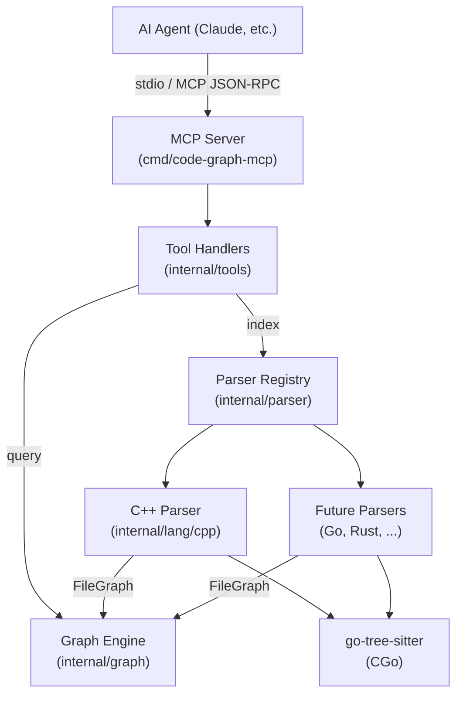
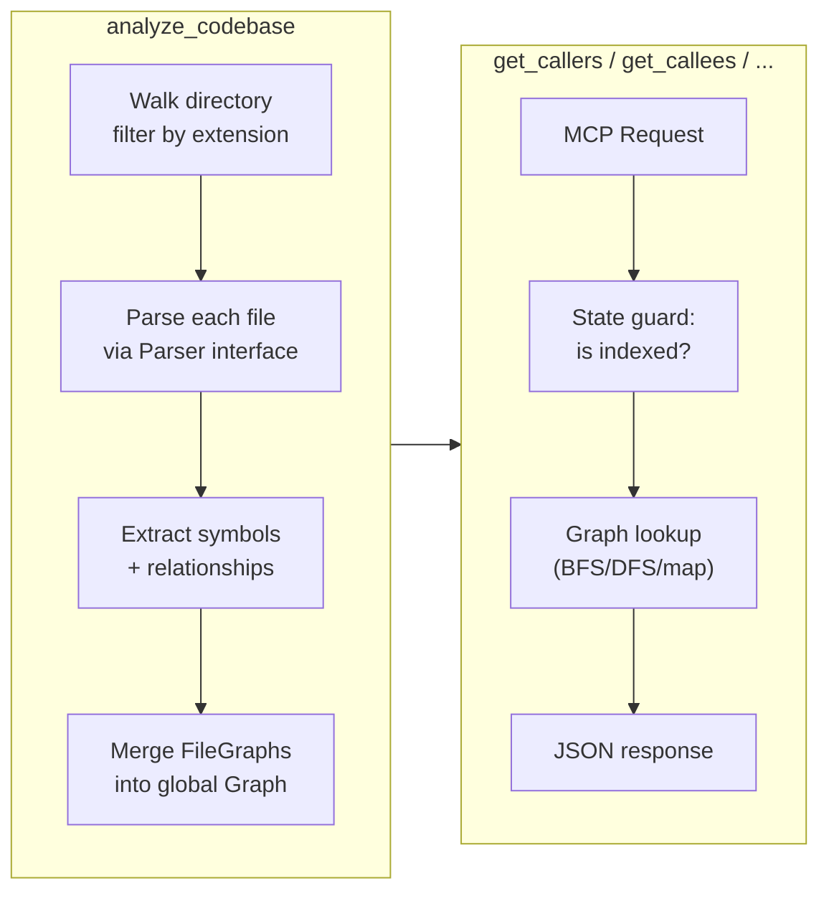

# Code Graph MCP Server — Technical Design

## Overview

A Go MCP server that builds an in-memory semantic code graph from source files using tree-sitter, then exposes graph query tools over stdio. An AI agent calls `analyze_codebase` once to index a project, then uses lightweight query tools (`get_callers`, `get_callees`, `search_symbols`, etc.) to navigate the codebase in real time — replacing exhaustive file-by-file searching.

**Scope:** Local use only (stdio transport). C++ first, pluggable parser interface for future languages. Follows the same Go patterns as `lldb-debug-mcp`.

---

## Architecture

### Component Overview



### Data Flow



### Package Layout

```
cmd/
  code-graph-mcp/
    main.go              # Entry point: NewMCPServer → Register → ServeStdio

internal/
  tools/
    tools.go             # Tools struct, Register(), state guards
    analyze.go           # handleAnalyzeCodebase — walk + parse + build graph
    query.go             # handleGetCallers, handleGetCallees, handleGetDependencies
    symbols.go           # handleGetFileSymbols, handleSearchSymbols, handleGetSymbolDetail
    structure.go         # handleDetectCycles, handleGetOrphans, handleGetClassHierarchy
    visualize.go         # handleGenerateMermaid

  graph/
    graph.go             # Graph struct, Node/Edge types, Add/Query methods
    algorithms.go        # Cycle detection (Tarjan), transitive closure, orphan detection
    graph_test.go

  parser/
    parser.go            # Parser interface, Registry, FileGraph type
    registry.go          # Global registry: extension → Parser mapping

  lang/
    cpp/
      cpp.go             # CppParser: tree-sitter C++ grammar + queries
      cpp_test.go
      queries.go         # Embedded .scm query strings
```

---

## Interfaces

### Parser Interface

```go
// parser/parser.go

// FileGraph is the output of parsing a single file.
// It contains the symbols defined in that file and
// the relationships (calls, includes, inherits) observed.
type FileGraph struct {
    Path    string
    Symbols []Symbol
    Edges   []Edge
}

// Symbol represents a named code entity.
type Symbol struct {
    Name      string     // e.g. "MyClass::doWork"
    Kind      SymbolKind // Function, Class, Struct, Enum, Method, Typedef
    File      string     // Containing file path (absolute)
    Line      int        // Start line (1-based)
    Column    int        // Start column (0-based)
    EndLine   int        // End line
    Signature string     // Full declaration text (truncated)
    Namespace string     // Enclosing namespace (e.g. "ns1::ns2", "" if global)
    Parent    string     // Enclosing class/struct (for methods, "" for free functions)
}

type SymbolKind string

const (
    KindFunction SymbolKind = "function"
    KindMethod   SymbolKind = "method"
    KindClass    SymbolKind = "class"
    KindStruct   SymbolKind = "struct"
    KindEnum     SymbolKind = "enum"
    KindTypedef  SymbolKind = "typedef"
)

// Edge represents a relationship between symbols or files.
type Edge struct {
    From     string   // Source symbol or file
    To       string   // Target symbol or file
    Kind     EdgeKind
    File     string   // File where the relationship is observed
    Line     int      // Line where the relationship is observed
}

type EdgeKind string

const (
    EdgeCalls    EdgeKind = "calls"    // Function A calls function B
    EdgeIncludes EdgeKind = "includes" // File A includes file B
    EdgeInherits EdgeKind = "inherits" // Class A inherits from class B
)

// Parser extracts symbols and relationships from source files.
type Parser interface {
    // Extensions returns file extensions this parser handles (e.g. [".cpp", ".cc", ".h"]).
    Extensions() []string

    // ParseFile parses a single file and returns its symbols and relationships.
    // content is the raw file bytes; path is used for edge references.
    ParseFile(path string, content []byte) (*FileGraph, error)

    // Close releases any resources held by the parser (e.g. tree-sitter queries).
    Close()
}
```

### Graph Engine

```go
// graph/graph.go

// Graph is a concurrency-safe in-memory directed graph of code symbols.
type Graph struct {
    mu       sync.RWMutex
    nodes    map[string]*Node       // key: unique symbol ID
    adj      map[string][]EdgeEntry // adjacency list: from → [](to, kind)
    radj     map[string][]EdgeEntry // reverse adjacency: to → [](from, kind)
    files    map[string][]string    // file path → symbol IDs in that file
    includes map[string][]string    // file path → included file paths
}

type Node struct {
    Symbol parser.Symbol
}

type EdgeEntry struct {
    Target string          // Symbol ID
    Kind   parser.EdgeKind
    File   string
    Line   int
}
```

**Symbol ID format:** `file:name` for free functions, `file:Class::method` for methods. This is a best-effort identifier — C++ name resolution is not fully semantic (no overload resolution), but is sufficient for navigation purposes.

**Path canonicalization:** All stored file paths are absolute (resolved via `filepath.Abs` at walk time). Symbol IDs use these absolute paths. `#include` directive paths are raw strings from the source (`"engine.h"`, `<vector>`); include edge resolution uses basename matching against indexed file paths. System includes (`<...>`) are recorded but not resolved to files. Agents always receive absolute paths in responses.

#### Core Graph Methods

| Method | Description |
|--------|-------------|
| `Clear()` | Reset graph to empty state |
| `MergeFileGraph(fg *parser.FileGraph)` | Add/replace all symbols and edges from one parsed file |
| `RemoveFile(path string)` | Remove all symbols/edges originating from a file |
| `Callers(symbolID string, depth int) []CallChain` | BFS upstream through reverse adjacency |
| `Callees(symbolID string, depth int) []CallChain` | BFS downstream through adjacency |
| `FileSymbols(path string) []Symbol` | All symbols defined in a file |
| `SearchSymbols(pattern string) []Symbol` | Substring/regex match on symbol names |
| `SymbolDetail(symbolID string) *Node` | Full symbol information |
| `FileDependencies(path string) []string` | Files included/imported by this file |
| `DetectCycles() [][]string` | Tarjan's SCC on file-level include graph |
| `Orphans(kind SymbolKind) []Symbol` | Symbols with zero incoming call edges, filtered by kind (empty string = all) |
| `ClassHierarchy(className string) *HierarchyNode` | Walk inheritance edges |
| `Coupling(path string) map[string]int` | Cross-file dependency counts |

### MCP Tool Definitions

All tools follow the same handler pattern as `lldb-debug-mcp`:

```go
func (t *Tools) handleFoo(ctx context.Context, req mcp.CallToolRequest) (*mcp.CallToolResult, error) {
    if err := t.requireIndexed(); err != nil {
        return mcp.NewToolResultError(err.Error()), nil
    }
    // ... extract params, query graph, marshal JSON ...
    return mcp.NewToolResultText(string(jsonBytes)), nil
}
```

#### P0 Tools

| Tool | Parameters | Returns |
|------|-----------|---------|
| `analyze_codebase` | `path` (required): absolute directory path to index; `force` (optional, default false): skip cache and re-index | Summary: file count, symbol count, edge count, languages detected, warnings |
| `get_file_symbols` | `file` (required): absolute file path | Array of symbols with kind, name, line, column, signature |
| `get_callers` | `symbol` (required): symbol ID as returned by `get_file_symbols` or `search_symbols` (format: `file:name`); `depth` (optional, default 1): max traversal depth | Call chain: caller name, file, line, depth |
| `get_callees` | `symbol` (required): symbol ID (format: `file:name`); `depth` (optional, default 1) | Call chain: callee name, file, line, depth |
| `get_dependencies` | `file` (required): absolute file path | Array of included/imported file paths (absolute where resolved, raw string otherwise) |
| `search_symbols` | `query` (required): substring or regex pattern; `kind` (optional): filter by symbol kind | Array of matching symbols with their IDs |
| `get_symbol_detail` | `symbol` (required): symbol ID (format: `file:name`) | Full symbol info: signature, location, namespace, parent scope |

#### P1 Tools

| Tool | Parameters | Returns |
|------|-----------|---------|
| `detect_cycles` | (none) | Array of cycle chains (file-level) |
| `get_orphans` | `kind` (optional) | Symbols with no callers |
| `get_class_hierarchy` | `class` (required) | Tree of base/derived classes |
| `get_coupling` | `file` (required) | Map of file → dependency count |

#### P2 Tools

| Tool | Parameters | Returns |
|------|-----------|---------|
| `generate_mermaid` | `symbol` or `file` (required), `depth` (optional), `max_nodes` (optional, default 30) | Mermaid diagram string (bounded to max_nodes) |

---

## Design Decisions

### Decision 1: Symbol Identification Strategy

**Context:** C++ has overloaded functions, namespaces, anonymous namespaces, and template specializations. We need a way to identify symbols in graph queries.

**Options Considered:**
1. Fully qualified mangled names (like linker symbols)
2. `file:name` composite keys with best-effort scope resolution
3. Numeric IDs with a lookup table

**Decision:** Option 2 — `file:name` composite keys.

**Rationale:** Mangled names require full semantic analysis (libclang territory). Numeric IDs are opaque to the agent. `file:name` is human-readable, greppable, and good enough for navigation. When an agent sees `src/engine.cpp:Engine::update`, it knows exactly where to look. Ambiguity (overloads) is handled by returning all matches and letting the agent disambiguate by file/line.

### Decision 2: Call Resolution Approach

**Context:** tree-sitter provides syntactic call sites (`call_expression` nodes), not resolved symbols. `foo()` could be a free function, a method, a macro, or a function pointer.

**Options Considered:**
1. Exact name matching (callee text → symbol name)
2. Scope-aware heuristic matching (prefer same-file, same-class, same-namespace)
3. Full semantic resolution via libclang

**Decision:** Option 2 — scope-aware heuristic matching.

**Rationale:** Exact matching produces too many false positives (common names like `init`, `size`). Full semantic resolution defeats the purpose of using tree-sitter. A simple heuristic — prefer symbols in the same class, then same file, then same namespace, then global — handles the common case well. False edges are acceptable for a navigation tool (better to show a potential caller than miss a real one).

### Decision 3: Incremental vs. Full Re-Index

**Context:** When files change, we could re-parse only changed files (tree-sitter supports incremental parsing) or re-index the entire codebase.

**Options Considered:**
1. Full re-index on every `analyze_codebase` call
2. File-level incremental: re-parse only files with newer mtime
3. Tree-sitter incremental: pass previous `*Tree` for sub-file granularity

**Decision:** Option 2 for V1 — file-level incremental with mtime checks.

**Rationale:** Full re-index is wasteful for large codebases when one file changes. Tree-sitter sub-file incremental adds complexity (must cache `*Tree` objects per file, manage memory). File-level incremental is the sweet spot: check mtime, re-parse changed files, call `graph.RemoveFile()` then `graph.MergeFileGraph()`. Simple and effective. Tree-sitter sub-file incremental can be added later if profiling shows file parsing is the bottleneck.

**Edge ownership:** `RemoveFile(B)` removes all symbols defined in B and all edges where B is the source file. Incoming edges from other files (e.g., A includes B) are stored on A's side and remain valid as long as B's path is unchanged. If B is deleted, A's include edge becomes dangling — this is acceptable for navigation and is cleaned up on the next `analyze_codebase` with `force=true`.

### Decision 4: Graph Persistence

**Context:** Should the graph survive between MCP server restarts?

**Options Considered:**
1. No persistence — re-index on startup
2. JSON serialization to disk
3. gob serialization to disk

**Decision:** Option 2 — JSON serialization, opt-in.

**Rationale:** Re-indexing a large codebase on every server start is slow. JSON is human-inspectable and debuggable. gob is faster but opaque. The graph can be saved to `.code-graph-cache.json` in the indexed directory. On `analyze_codebase`, if a cache exists and all file mtimes match, load from cache instead of re-parsing. This is opt-in behavior — agents can force a full re-index via a `force` boolean parameter.

**Serialization:** The `Graph` struct contains a `sync.RWMutex` which must not be serialized. `Graph.Save()` and `Graph.Load()` operate on a separate DTO struct (`graphCache`) that contains only the data fields (nodes, adjacency lists, file maps). `SymbolKind` and `EdgeKind` are `string` types, so they serialize naturally to human-readable JSON without custom marshalers.

### Decision 5: Concurrency Model

**Context:** The MCP server handles one request at a time over stdio (single agent), but indexing is CPU-intensive and could benefit from parallelism.

**Options Considered:**
1. Single-threaded: parse files sequentially
2. Worker pool: parse files concurrently with bounded goroutines

**Decision:** Option 2 — worker pool for indexing with two-phase collect-then-merge.

**Rationale:** Parsing is CPU-bound and embarrassingly parallel (each file is independent). A worker pool of `runtime.NumCPU()` goroutines significantly speeds up indexing of large codebases.

**Indexing contract (two-phase):**
1. **Parse phase:** Worker goroutines parse files concurrently and send `*FileGraph` results to a channel. No graph writes occur during this phase.
2. **Merge phase:** A single goroutine drains the channel and calls `graph.MergeFileGraph()` sequentially for each result. No write contention.

The `Graph`'s `sync.RWMutex` protects against query-tool reads that arrive during a re-index (readers take `RLock`, merge takes `Lock`). The indexing operation itself is protected by a `sync.Mutex` on the `Tools` struct to prevent concurrent `analyze_codebase` calls (see State Management).

---

## C++ Parser Implementation

### tree-sitter Setup

```go
// lang/cpp/cpp.go

type CppParser struct {
    language *tree_sitter.Language
    defQuery *tree_sitter.Query  // cached: symbol definitions
    callQuery *tree_sitter.Query // cached: call expressions
    inclQuery *tree_sitter.Query // cached: #include directives
    inhQuery  *tree_sitter.Query // cached: base class specifiers
}

func NewCppParser() (*CppParser, error) {
    lang := tree_sitter.NewLanguage(tree_sitter_cpp.Language())

    defQuery, err := tree_sitter.NewQuery(lang, definitionQueries)
    // ... similarly for callQuery, inclQuery, inhQuery
    return &CppParser{language: lang, defQuery: defQuery, ...}, nil
}

func (p *CppParser) Extensions() []string {
    return []string{".cpp", ".cc", ".cxx", ".c", ".h", ".hpp", ".hxx"}
}

// ParseFile creates a per-call tree-sitter parser. In the worker pool,
// each goroutine calls ParseFile independently — parser creation is cheap.
// Query objects (defQuery, callQuery, etc.) are shared and thread-safe.
func (p *CppParser) ParseFile(path string, content []byte) (*parser.FileGraph, error) {
    ts := tree_sitter.NewParser()
    defer ts.Close()
    ts.SetLanguage(p.language)

    tree := ts.Parse(content, nil)
    defer tree.Close()

    root := tree.RootNode()
    fg := &parser.FileGraph{Path: path}

    p.extractDefinitions(root, content, fg)
    p.extractCalls(root, content, fg)
    p.extractIncludes(root, content, fg)
    p.extractInheritance(root, content, fg)

    return fg, nil
}

func (p *CppParser) Close() {
    p.defQuery.Close()
    p.callQuery.Close()
    p.inclQuery.Close()
    p.inhQuery.Close()
}
```

### Query Patterns

> **Important:** These patterns are derived from tree-sitter-cpp's `tags.scm` and `highlights.scm` but must be validated against the pinned grammar version before `queries.go` is considered stable. The `cpp_test.go` corpus is the ground truth — every query pattern must have at least one test case that exercises it against a real C++ snippet. Pin the grammar version in `go.mod` and cite it in `queries.go`.

**Symbol Definitions** (derived from tree-sitter-cpp's `tags.scm`):

```scheme
;; Free functions — function_declarator holds the name
(function_definition
  declarator: (function_declarator
    declarator: (identifier) @func.name)) @func.def

;; Methods (qualified: Class::method or ns::func)
;; NOTE: The exact child structure of qualified_identifier varies by grammar
;; version. This pattern captures the full qualified text and parses
;; scope::name in Go code rather than relying on field children.
(function_definition
  declarator: (function_declarator
    declarator: (qualified_identifier) @method.qname)) @method.def

;; Classes
(class_specifier
  name: (type_identifier) @class.name
  body: (_)) @class.def

;; Structs
(struct_specifier
  name: (type_identifier) @struct.name
  body: (_)) @struct.def

;; Enums
(enum_specifier
  name: (type_identifier) @enum.name) @enum.def

;; Typedefs
(type_definition
  declarator: (type_identifier) @typedef.name) @typedef.def

;; Namespace definitions (for populating Symbol.Namespace)
(namespace_definition
  name: (namespace_identifier) @ns.name) @ns.def
```

For `@method.qname`, the Go extractor splits on `::` to derive `Parent` (class) and `Name` (method). This is more robust than relying on `scope:`/`name:` field children, which vary across grammar versions.

**Call Sites:**

```scheme
;; Free function call: foo()
(call_expression
  function: (identifier) @call.name) @call.expr

;; Method call: obj.foo() or obj->foo()
(call_expression
  function: (field_expression
    field: (field_identifier) @call.name)) @call.expr

;; Qualified call: ns::foo() or Class::staticMethod()
(call_expression
  function: (qualified_identifier) @call.qname) @call.expr

;; Template free function call: foo<T>()
(call_expression
  function: (template_function
    name: (identifier) @call.name)) @call.expr

;; Template method call: obj.foo<T>()
(call_expression
  function: (field_expression
    field: (template_method
      name: (field_identifier) @call.name))) @call.expr
```

For `@call.qname`, the Go extractor uses the full text and splits on `::` to get the callee name, using the qualifier for scope-aware matching.

**Include Directives:**

```scheme
(preproc_include
  path: [(string_literal) (system_lib_string)] @include.path)
```

**Inheritance:**

```scheme
;; Base class can be a simple type or a qualified type (ns::Base)
(class_specifier
  name: (type_identifier) @derived.name
  (base_class_clause
    [(type_identifier) (qualified_identifier)] @base.name))

(struct_specifier
  name: (type_identifier) @derived.name
  (base_class_clause
    [(type_identifier) (qualified_identifier)] @base.name))
```

---

## State Management

Following the `lldb-debug-mcp` session manager pattern:

```go
// tools/tools.go

type Tools struct {
    graph    *graph.Graph
    registry *parser.Registry
    indexed  atomic.Bool   // has analyze_codebase completed successfully?
    indexMu  sync.Mutex    // prevents concurrent analyze_codebase calls
    rootPath string        // the indexed directory path
}

func (t *Tools) requireIndexed() error {
    if !t.indexed.Load() {
        return fmt.Errorf("no codebase indexed — call analyze_codebase first")
    }
    return nil
}
```

The `Tools` struct is simpler than `lldb-debug-mcp`'s because there is no complex state machine — the server is either "not indexed" or "indexed". The `graph.Graph` handles its own `sync.RWMutex` internally.

The `indexMu` mutex prevents concurrent `analyze_codebase` calls. `handleAnalyzeCodebase` acquires `indexMu` via `TryLock()` at entry — if another indexing run is in progress, it returns `mcp.NewToolResultError("indexing already in progress")`.

---

## Error Handling

| Error Category | Handling |
|----------------|----------|
| Not indexed | `requireIndexed()` guard → `mcp.NewToolResultError("no codebase indexed — call analyze_codebase first")` |
| Invalid path | `mcp.NewToolResultError("directory does not exist: ...")` |
| Parse failure on single file | Log warning, skip file, continue indexing. Return partial results with warning count in summary. |
| Symbol not found | `mcp.NewToolResultError("symbol not found: ... (did you mean: ...?)")` — suggest closest matches |
| tree-sitter error nodes | Skip `node.IsError()` or `node.HasError()` subtrees gracefully |
| File read error | Log warning, skip file, continue |

**Principle:** Never return a non-nil Go `error` from a handler. All user-visible errors go through `mcp.NewToolResultError()`. Parse errors on individual files should never abort the entire indexing operation.

---

## Testing Strategy

### Unit Tests

| Component | Test Focus |
|-----------|------------|
| `graph/` | Add/remove nodes/edges, callers/callees traversal, cycle detection, orphan detection, concurrent read/write safety (explicit test: N reader goroutines calling `Callers`/`SearchSymbols` while `MergeFileGraph` runs, under `-race`) |
| `lang/cpp/` | Parse known C++ snippets → verify extracted symbols and edges. Test: free functions, methods, classes, templates, includes, inheritance, nested namespaces |
| `parser/` | Registry maps extensions correctly, unknown extensions are skipped |
| `tools/` | Guard behavior (not-indexed error), parameter validation, JSON response shape |

### Integration Tests

Tag: `//go:build integration`

- Index the `testdata/` directory (a small C++ project with known structure)
- Verify full round-trip: `analyze_codebase` → `get_callers` → expected results
- Verify incremental re-index: modify a file, re-analyze, confirm graph updates

### Test Data

```
testdata/
  cpp/
    main.cpp          # Calls functions from engine.cpp and utils.cpp
    engine.h          # Engine class declaration
    engine.cpp        # Engine class implementation, calls utils
    utils.h           # Free function declarations
    utils.cpp         # Free function definitions
    circular_a.h      # Circular include (A includes B, B includes A)
    circular_b.h
    orphan.cpp        # Function never called by anything
```

### Structural Verification

| Tool | When | What it catches |
|------|------|-----------------|
| `go vet ./...` | Every phase | Printf mismatches, unreachable code, suspicious constructs |
| `go test -race ./...` | Every phase | Data races (critical for concurrent graph access) |
| `staticcheck` | If available | Additional correctness beyond go vet |

The `-race` flag is mandatory given the concurrent indexing worker pool and `sync.RWMutex` usage in the graph engine.

---

## Entry Point

```go
// cmd/code-graph-mcp/main.go

func main() {
    s := server.NewMCPServer(
        "code-graph",
        "0.1.0",
        server.WithToolCapabilities(false),
    )

    g := graph.New()
    reg := parser.NewRegistry()

    cppParser, err := cpp.NewCppParser()
    if err != nil {
        fmt.Fprintf(os.Stderr, "Failed to init C++ parser: %v\n", err)
        os.Exit(1)
    }
    defer cppParser.Close()
    reg.Register(cppParser)

    t := tools.New(g, reg)
    t.Register(s)

    if err := server.ServeStdio(s); err != nil {
        fmt.Fprintf(os.Stderr, "Server error: %v\n", err)
        os.Exit(1)
    }
}
```

---

## Build

```makefile
BINARY := code-graph-mcp
GOFLAGS := CGO_ENABLED=1

build:
	$(GOFLAGS) go build -o bin/$(BINARY) ./cmd/code-graph-mcp

test:
	$(GOFLAGS) go test -race ./...

test-integration:
	$(GOFLAGS) go test -tags integration -race ./internal/tools/ -v

vet:
	go vet ./...
```

**Note:** CGo is required for tree-sitter. Cross-compilation requires per-platform C toolchains. For V1, target the host platform only.

---

## Migration / Rollout

This is a greenfield project — no migration needed. Rollout plan:

1. **Phase 1:** Scaffold project, implement C++ parser + graph engine + P0 tools
2. **Phase 2:** Add P1 tools (cycles, orphans, class hierarchy, coupling)
3. **Phase 3:** Add persistence (JSON cache), incremental re-index by mtime
4. **Phase 4:** Add P2 tools (Mermaid visualization)
5. **Future:** Add parsers for Go, Rust, Python, etc.
