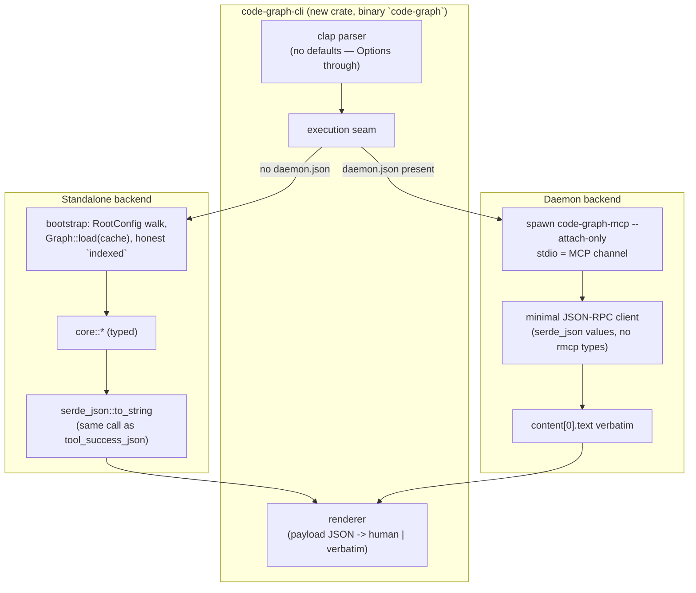

# Command-Line Interface (Track B, phase 7)

The follow-on design Designs/RepoLocalDaemon Decision 8 deferred: the
`code-graph` command surface, its output modes, its exit statuses, and how
it attaches to a daemon. Designed against the LANDED `core::` signatures
(phase 2 + phases 1/5/6 additions), which is the entire reason the
deferral existed.

## Overview

A second front-end over the typed core (FR-17 – FR-20). One binary,
`code-graph`, in a new workspace crate `code-graph-cli`. Every subcommand
executes the same `core::` function the MCP adapter executes; machine
output is byte-identical to the MCP tool payload; exit status carries the
outcome class. It attaches to a running repository daemon when one exists
and runs standalone when one does not, producing identical output either
way (FR-18, AC-40).

The load-bearing property is **one serializer, one query implementation**.
The MCP adapter's success path is `serde_json::to_string(&value)`
(`tool_success_json`, compact — no pretty-printing). The CLI's machine
mode emits exactly that: in standalone mode by serializing the same typed
value with the same call; in daemon mode by printing the daemon's payload
text verbatim. Parity is structural, not tested-into-existence — the
parity tests (AC-11) then pin it against regression.

## Non-Goals

- **No watch subcommands.** `watch_start`/`watch_stop` manage a watcher
  whose lifetime is the owning process. A one-shot CLI process cannot own
  one, and mutating a daemon's shared watcher from a drive-by invocation
  is a session concern, not a script concern. Out of scope; the MCP
  surface keeps them.
- **No async-analyze subcommands.** `analyze_codebase_async` +
  `get_analyze_status` exist to dodge a per-call wall-clock timeout no
  CLI has. `code-graph analyze-codebase` runs synchronously and blocks
  until done; job polling stays MCP-only until someone demonstrates a CLI
  need.
- **No daemon auto-spawn** (resolves the plan's open question —
  Decision 3 below). Attach if present, standalone otherwise, never
  leave a resident process behind a one-shot invocation. The unmodified
  proxy cannot deliver this — it spawns a `--serve` contender whenever
  no compatible daemon is attachable, and it runs the replacement
  protocol (up to hard-kill) against an incompatible one — so Decision 3
  specifies a new `--attach-only` proxy mode whose addition is scoped
  into task 7.2.
- **No new query logic, no reformatting of payloads in machine mode.**
  The CLI adds rendering and transport only. If a subcommand ever
  deserializes a `CallToolResult`, FR-17 is being violated in spirit
  (phase doc trap).
- **No config surface of its own.** `.code-graph.toml` discovery and
  semantics are unchanged; the CLI reads the same config the indexer
  reads, via the same `RootConfig` walk.
- **No TUI, no color, no progress bars in v1.** Human mode is plain text
  tables/trees. Additive later without touching the machine contract.

## Command surface

Subcommand names mirror MCP tool names exactly, kebab-cased. Zero mapping
to memorize: an agent that knows `mcp__code-graph__get_callers` types
`code-graph get-callers`. 21 subcommands in v1 — the 25 tools minus the
two watch tools and the two async-analyze tools (`get-callers`/
`get-callees` share one core function as they already do).

| Subcommand | Core function | Notes |
|---|---|---|
| `analyze-codebase [PATH]` | `core::analyze::analyze_codebase` | `--force`; PATH defaults to `--root` |
| `get-status` | `core::status::get_status` | ungated (works unindexed, like MCP) |
| `get-file-symbols FILE` | `core::symbols::get_file_symbols` | `--top-level-only`, `--brief`, `--count-only`, paging |
| `search-symbols QUERY` | `core::symbols::search_symbols` | `--namespace`, `--subtree`, `--brief`, `--count-only`, paging |
| `get-symbol-detail SYMBOL` | `core::symbols::get_symbol_detail` | |
| `get-symbol-summary` | `core::symbols::get_symbol_summary` | `--file`, `--count-only`, paging |
| `get-symbol-at FILE LINE` | `core::symbols::get_symbol_at` | paging |
| `get-callers SYMBOL` | `core::query::callers_or_callees` | `--depth`, `--min-confidence`, paging |
| `get-callees SYMBOL` | `core::query::callers_or_callees` | same |
| `find-overrides SYMBOL` | `core::query::find_overrides` | paging |
| `find-class-candidates NAME` | `core::structure::find_class_candidates` | bare list, no paging (matches the tool) |
| `find-path FROM TO` | `core::query::find_path` | `--node-cap`, `--min-confidence` |
| `get-dependencies FILE` | `core::query::get_dependencies` | paging |
| `detect-cycles` | `core::structure::detect_cycles` | `--subtree`, `--max-cycle-size`, paging |
| `get-orphans` | `core::structure::get_orphans` | `--kind`, `--subtree`, `--reliability`, `--brief`, paging |
| `get-class-hierarchy CLASS` | `core::structure::get_class_hierarchy` | `--depth`, `--max-nodes` |
| `get-coupling FILE` | `core::structure::get_coupling` | `--direction`, paging |
| `detect-communities` | `core::structure::detect_communities` | `--members-per-community`, paging |
| `generate-diagram` | `core::structure::generate_diagram` | `--symbol`/`--file`/`--class`, `--format`, `--direction`, `--min-confidence` |
| `blame-symbol SYMBOL` | `core::history::blame_symbol` | `--at` |
| `symbol-history SYMBOL` | `core::history::symbol_history` | `--mode`, `--window` |

**Argument convention.** Required tool args are positionals; optional args
are `--kebab-case` flags spelled exactly like their MCP argument names.
Every optional flag is an `Option<_>` in clap and flows to `core::` as
`None` when absent — **clap declares no defaults**. Defaults, clamps, and
ceilings live in `core::` alone (limit 100/1000, window 50/500, node_cap
100k/5M, …), so the two front-ends cannot drift on a default (FR-17's
"no duplicated logic" applied to argument semantics, which is where the
duplication would actually creep in).

**Global flags.** `--root <PATH>` (invocation path for config/cache/daemon
discovery; default: current directory), `--json` (machine mode),
`--quiet` (suppress stderr breadcrumbs). Paging flags `--limit`/
`--offset` appear on exactly the subcommands whose tools take them.

## Output contract

Two modes; the payload, not the renderer, is the contract.

- **Machine mode (`--json`).** For a `ToolOk::Value` success, stdout gets
  the MCP payload byte-for-byte: compact `serde_json::to_string` output,
  one line, trailing newline. For a `ToolOk::Text` success (mermaid
  diagram, non-callable advisory), stdout gets the text verbatim — the
  MCP payload for these IS raw text, and wrapping it in JSON would break
  parity by construction (AC-11's fifth shape). Errors print NOTHING to
  stdout: message to stderr, class in the exit status.
- **Human mode (default).** One renderer keyed on the response's
  structural family, fed from the payload (`serde_json::Value` — the same
  bytes machine mode would print), never from a second query path:
  - `Page<T>` envelopes → aligned columns, one row per record, and a
    trailing `total/truncated/next_offset` footer line so scripts that
    scrape human output anyway see the paging state.
  - Trees (`get_class_hierarchy`) → two-space indentation, `ref`-stubs
    marked `(ref)`.
  - Dual-page (`get_coupling --direction both`) → two labelled sections.
  - Flattened envelopes with conditional fields (`search_symbols`) →
    table plus a `did you mean:` footer only when `suggestions` is
    present (absent-vs-empty is load-bearing; the renderer must not
    assume presence).
  - Single-object responses (`find_path`, `blame_symbol`,
    `symbol_history`, `AnalyzeResult`, `StatusResult`) → labelled
    key/value lines; list fields (hops, hunks, entries) as sub-tables.
  - `ToolOk::Text` → verbatim passthrough (a mermaid diagram is already
    its own human rendering; the advisory text likewise).

Human rendering going through the payload JSON rather than the typed
value is deliberate: it forces both backends (standalone typed value,
daemon payload text) through one renderer, and it means a rendering bug
cannot mask a payload divergence — the thing AC-11 exists to catch.

## Exit status

| Status | Class | Examples |
|---|---|---|
| `0` | Success — including success-shaped "negative" answers | empty page; `found: false`; `available: false` + reason; `count_only` totals |
| `1` | Tool error (`ToolError` / `is_error: true`) | unknown symbol (did-you-mean text on stderr), bad `mode` spelling, line 0, unindexed repository |
| `2` | Operational failure — the query never ran or the channel died | cache file present but unreadable (genuine I/O error — a readable-but-corrupt cache is `Ok(None)` in `Graph::load`, i.e. "not present" → honest unindexed → `1`), daemon connection lost mid-call, child spawn failure, clap usage error |

Clap usage errors exit `2` (clap's own convention, and honest: the query
never executed). `available: false` and `found: false` are exit `0`
because they are the MCP surface's SUCCESS shapes (FR-36 precedent) — a
script that wants to branch on them reads the payload, not the status.

## Architecture

## Design Decisions

### Decision 1: Subcommands call `core::` directly; the crate never names an rmcp type
**Context:** FR-17; phase doc trap ("reaching for the MCP handlers");
gate artifact 17 flagged `pub handlers::*` as an unguarded entry surface
(hardcoded `indexed=true`).

**Decision:** `code-graph-cli` imports `code_graph_tools::core` and
`ServerInner`/`CodeGraphServer` only. It never imports
`code_graph_tools::handlers`, never constructs a `CallToolResult`, and
never depends on `rmcp`. The standalone backend passes the HONEST
`indexed` flag — computed from whether the cache actually loaded — into
the gated core functions, closing the artifact-17 follow-up for this
front-end.

**Rationale:** The handlers layer exists to adapt typed results onto the
MCP wire; a CLI that touches it inherits both the wire type and the
dishonest flag. The core layer's `ToolResult<T>` is exactly the
three-outcome surface the exit-status mapping needs (Decision 5).

### Decision 2: Standalone bootstrap loads the cache read-only; it does not analyze
**Context:** FR-18. A one-shot process needs a graph to query. The MCP
surface gets one via `analyze_codebase` (which discovers config, loads or
builds the cache, and mutates it: mtime re-index, hygiene sweep).

**Decision:** Query subcommands in standalone mode discover the project
root (the same `RootConfig` upward walk), `Graph::load` the cache
verbatim, and set `indexed = (load succeeded and the graph is non-empty)`.
No mtime revalidation, no sweep, no cache write. An absent or unreadable
cache leaves `indexed = false`, and the gated core functions return the
byte-identical "not indexed" domain error the MCP surface produces
(exit 1). `analyze-codebase` is the one subcommand that runs the full
indexing pipeline, exactly as the MCP tool does.

**Rationale:** Read-only load keeps a drive-by query from racing a
daemon's cache writes and from paying re-index cost. Staleness semantics
match the MCP surface between analyzes: the cache is the graph. The
version/endian probes in `Graph::load` already route incompatible caches
to "not present" — which lands in the honest `indexed = false` path
rather than a crash (a v-mismatch cache is exit 1 "not indexed", an
UNREADABLE cache file is exit 2 — Decision 5 draws that line).

### Decision 3: Attach-only via a new `--attach-only` proxy mode; the client is the proxy, spawned as a child
**Context:** FR-18; plan open question "auto-spawn or attach-only"; the
daemon client (discovery, admission prelude, per-transport connect, TCP
auth, handle sealing) lives inside `code-graph-mcp`'s `daemon.rs` — a
binary crate, ~5,200 lines, three transports with per-platform quirks.
**The unmodified proxy is NOT attach-only:** when no compatible active
daemon is attachable — the stale-`daemon.json` case included — it spawns
a detached `--serve` contender and attaches to it (`daemon.rs`
`spawn_contender`), leaving a resident daemon behind; and against a
live but binary-incompatible daemon it runs the replacement protocol,
up to hard-kill. A drive-by CLI query must do neither.

**Decision:** Attach-only, delivered by a new `code-graph-mcp
--attach-only` proxy mode whose implementation is scoped into task 7.2
alongside the CLI itself. Semantics: attempt attachment to a published,
compatible, live daemon within the existing deadline; on ANY other
outcome — no `daemon.json`, stale metadata, admission refused, binary
identity mismatch — serve in-process with a stderr breadcrumb. It never
spawns a contender and never initiates the replacement protocol (an
incompatible daemon is left untouched; the CLI answers in-process). The
CLI's backend choice is by `<project_root>/.code-graph/daemon.json`
existence (the documented discovery surface, FR-40): when present, the
CLI spawns `code-graph-mcp --attach-only` as a child with stdio pipes
and speaks MCP over them via a minimal JSON-RPC client built on
`serde_json` values — `initialize`, `initialized`, one `tools/call`,
EOF. The child performs all attachment work: liveness revalidation,
admission (`CG-OK`), auth, and identity gating. The CLI resolves the
child binary next to its own executable (`current_exe().parent()`),
falling back to `PATH`; if neither resolves, it prints a breadcrumb and
runs standalone.

**Rationale:** The proxy IS the client library, already shipped and
already tested on every transport and platform this workspace supports —
packaging it as a child process reuses phase 3 wholesale instead of
extracting a client crate mid-phase (a refactor with its own risk
budget, noted as future work if per-invocation spawn cost ever matters;
measured expectation is single-digit ms plus one MCP init round-trip).
The `--attach-only` flag is the honest cost of the reuse: without it the
"attach-only" Non-Goal is false against primary sources (the proxy
would auto-spawn), and a CLI invocation could kill another session's
daemon via the replacement protocol. Auto-spawn is rejected because a
script loop that silently leaves a resident daemon behind violates
least surprise, and the daemon's own idle-exit exists precisely because
residency is a policy question — the user or the agent session decides
it, not a drive-by query. A stale `daemon.json` (dead daemon) costs one
child that answers in-process — degraded latency, never a wrong answer
and never a surprise process.

### Decision 4: One serializer; machine mode prints the payload, both backends
**Context:** FR-19, AC-11, AC-40. `tool_success_json` serializes with
compact `serde_json::to_string`; `ToolOk::Text` rides as raw text.

**Decision:** Machine mode output is DEFINED as the MCP payload text.
Standalone: `serde_json::to_string(&value)` on the typed core result —
the same function, the same `Serialize` impls, therefore the same bytes.
Daemon: `content[0].text` printed verbatim. `ToolOk::Text` prints
verbatim in both modes and both backends. Human mode renders FROM that
payload (parsed to `serde_json::Value`), never from a parallel typed
path.

**Rationale:** AC-40 (daemon/standalone identity) and AC-11 (CLI/MCP
identity) collapse into one structural property instead of two test
suites chasing two renderers. The known hazard — a future adapter
switching to pretty-printing or a `Content` restructure — breaks the
parity tests loudly, which is the desired failure mode.

### Decision 5: Exit statuses map `ToolResult`'s three outcomes; operational failures are everything outside it
**Context:** FR-20, AC-12; the RepoLocalDaemon sketch (`0/1/2`).

**Decision:** `Ok(ToolOk::Value | ToolOk::Text)` → 0. `Err(ToolError)` →
1, message on stderr. Everything that prevents the core function from
running or the answer from arriving → 2: cache file present but
unreadable (I/O error, as opposed to version-mismatch → "not present" →
honest unindexed → 1), child proxy spawn/handshake failure after the
standalone fallback also fails, transport death mid-call, clap usage
errors. In daemon mode, `is_error: true` in the response maps to 1 with
the payload text on stderr — the same text the standalone `ToolError`
carries, byte-identical by Decision 4's argument.

**Rationale:** The three classes are exactly `ToolResult`'s shape plus
"the machinery failed"; anything cleverer (per-error-kind statuses)
would create a second place where error taxonomy lives. Success-shaped
negatives (`available: false`, `found: false`) are 0 on purpose — the
MCP surface deliberately made them successes (FR-36), and the CLI
changing that would fork the semantics FR-17 exists to keep single.

### Decision 6: New crate `code-graph-cli`; `clap` confined to it
**Context:** NFR-02 protects four crates; Decision 8 of RepoLocalDaemon
already scoped `clap` to the CLI binary.

**Decision:** New workspace member `crates/code-graph-cli`, binary name
`code-graph`, `#![forbid(unsafe_code)]`. Dependencies: `clap` (derive),
`serde_json`, `tokio` (the async core functions and child stdio),
`code-graph-tools`, `code-graph-core`, `code-graph-lang` + the six
grammar crates, `code-graph-graph`, `code-graph-vcs`,
`code-graph-vcs-git` (provider injected at startup exactly as `main.rs`
does — AC-23's confinement is unchanged: the trait crate stays
backend-free, the binary composes).

**Rationale:** Mirrors the existing binary's composition root pattern.
No protected crate gains a dependency; `cargo tree -p code-graph-lang`
stays clean (NFR-02 check rides in the phase's verification).

### Decision 7: Unindexed-daemon fallback — a daemon that holds no graph does not hide the cache
**Context:** FR-18/AC-40. A daemon sets `indexed` only when an analyze
(or watch reindex) completes in it — it never loads the cache at
startup. Standalone, Decision 2 answers from `Graph::load` alone. So
"daemon running but never analyzed, cache present on disk" would return
"not indexed" (exit 1) attached and real data (exit 0) standalone — the
same invocation, different output, a direct FR-18 violation. The window
is realistic: an agent session spawns the daemon on attach and the CLI
runs before the session's first analyze.

**Decision:** When the daemon backend returns the byte-exact "not
indexed" domain error for a QUERY subcommand, the CLI retries once via
the standalone read-only backend and answers from the cache (breadcrumb
on stderr unless `--quiet`). `analyze-codebase` never falls back — it
routes to the daemon whenever one is attached, so the analysis lands in
the shared graph where every session benefits. If the standalone retry
also finds no loadable cache, the original "not indexed" error stands
(exit 1) — identical to the no-daemon case.

**Rationale:** This restores AC-40 structurally rather than carving the
window out of the test plan: with or without a daemon, "cache exists"
answers and "no cache" errors identically. The alternative — teaching
the daemon to load the cache at startup — is the better long-term fix
but is a phase-3-owned semantic change to the MCP surface's
`require_indexed` contract, out of phase 7's scope; recorded as a
follow-up candidate. The fallback is bounded to the exact domain-error
text the core guard produces (both guards emit byte-identical text by
existing contract), so it cannot misfire on other tool errors.
**`get-status` carve-out:** `get_status` reports daemon-side state
(analyze slot, timestamps, graph counts) and is inherently
backend-dependent; it is excluded from the AC-40 byte-identity claim
and from this fallback (it is ungated and never returns "not indexed").

## Error handling

| Condition | Behaviour | Exit |
|---|---|---|
| No cache, no daemon | Gated subcommands return the MCP "not indexed" domain error verbatim (stderr) | 1 |
| Cache unreadable (I/O error on an existing file) | Operational message on stderr naming the path | 2 |
| Cache version/endian mismatch or corrupt bytes | Treated as "not present" (existing `Graph::load` contract: `Ok(false)`) → honest unindexed | 1 |
| `daemon.json` present, daemon dead | `--attach-only` child revalidates, serves in-process (no contender spawn); the child's in-process server is unindexed, so gated queries answer via the Decision 7 standalone retry; breadcrumb on stderr unless `--quiet` | per query (0 when a loadable cache exists, 1 otherwise) |
| `daemon.json` present, daemon binary-incompatible | `--attach-only` child leaves the daemon untouched (no replacement protocol), serves in-process; same Decision 7 retry path; breadcrumb | per query (0 when a loadable cache exists, 1 otherwise) |
| Daemon attached but never analyzed (unindexed) | Query subcommands retry standalone read-only (Decision 7); breadcrumb | per query |
| `code-graph-mcp` binary not found for attach | Breadcrumb, standalone fallback | per query |
| Child dies mid-call / malformed MCP frame | Operational message. Detection is a missing/truncated JSON-RPC response ONLY — the proxy deliberately exits `0` on mid-session daemon death, so the child's exit status is NOT a failure signal and must never be consulted | 2 |
| Unknown symbol / bad argument value | Core's `ToolError` text (did-you-mean included) on stderr | 1 |
| clap usage error | clap's message | 2 |

## Test plan (feeds tasks 7.2 / 7.3)

- **Parity (AC-11), one per structural family:** `get-callers`
  (`Page<T>`), `get-class-hierarchy` (tree), `search-symbols` flattened
  envelope BOTH with and without `suggestions` (absent-vs-empty),
  `get-coupling --direction both` (dual-page), `generate-diagram
  --format mermaid` (non-JSON text). Each test runs the MCP adapter path
  (`to_call_tool_result` → payload text) and the CLI machine path on the
  same fixture and asserts byte equality.
- **Daemon/standalone identity (AC-40):** same invocation against a
  spawned `--serve` daemon (the `daemon_serve` test harness precedent)
  and standalone; byte-equal machine output. Both sides are analyzed
  first (steady state); a SECOND test pins Decision 7's window — daemon
  attached but never analyzed, cache present — asserting the fallback
  produces output byte-equal to the no-daemon invocation. `get-status`
  is excluded from byte-identity (Decision 7 carve-out).
- **Exit statuses (AC-12):** success, unknown symbol (1), unreadable
  cache file (2). The exit-2 fixture must be a genuine I/O error, not
  corrupt bytes (those are exit 1 by the `Graph::load` contract);
  cross-platform trick: a DIRECTORY named `.code-graph-cache.db` fails
  the cache read path (`File::open` on Windows with `PermissionDenied`,
  `Mmap::map` on Unix with `ENODEV` — both non-`NotFound`, both
  propagate as `Err`) with a real I/O error on every platform, no
  permission juggling needed.
- **Unindexed domain error:** byte-equal to the MCP surface's message.
- **Attach-only child (Decision 3):** with a stale `daemon.json`, the
  invocation answers AND no new daemon process exists afterwards; with a
  live daemon, no replacement is triggered when identities mismatch.
- **AC-33 closure:** `get-symbol-at`, `find-path`, `detect-communities`
  invocable from the CLI with paging flags honored.
- **No-rmcp guard:** a compile-time/dev-dependency assertion that
  `code-graph-cli` does not depend on `rmcp` (cargo-tree-shaped test,
  precedent: `git_backend_dependency_is_confined_to_this_provider_crate`).
- **Docs reconciliation (task 7.3):** CLAUDE.md gains CLI usage, and its
  grouped tool table — which currently enumerates 23 of the 25 tools,
  omitting `find_overrides` and `find_class_candidates` — is reconciled
  in the same pass.
- **Known non-goal for parity tests:** a daemon whose graph advanced via
  a watch reindex not yet persisted to the cache diverges from
  standalone reads until the next save. Inherent to the existing "the
  cache is the graph between analyzes" semantics, predates this design,
  outside AC-40's steady-state fixtures — recorded so it is not
  rediscovered as a parity-test flake.

## Open questions — resolved here

- **Auto-spawn vs attach-only:** attach-only (Decision 3).
- **Watch/async tools in the CLI:** excluded with rationale (Non-Goals).
- **Where defaults live:** in `core::` only; clap passes `Option`s
  (Command surface section).
