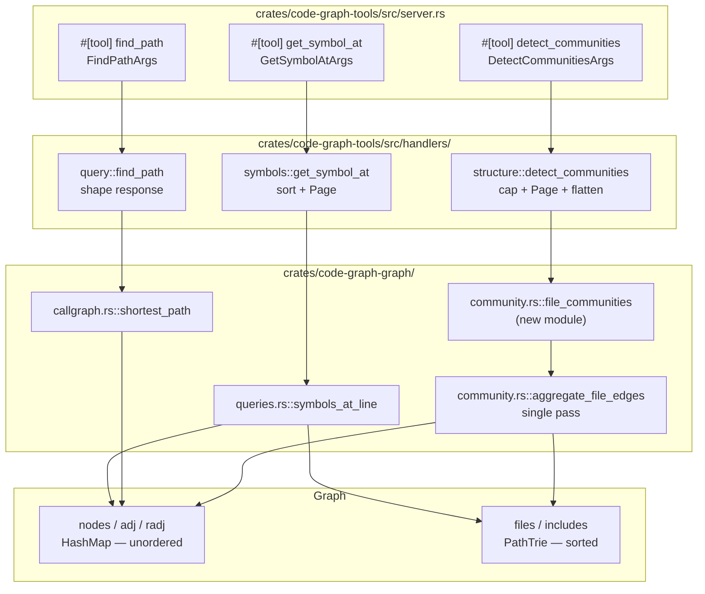
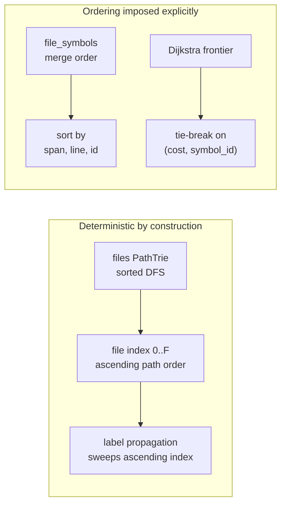
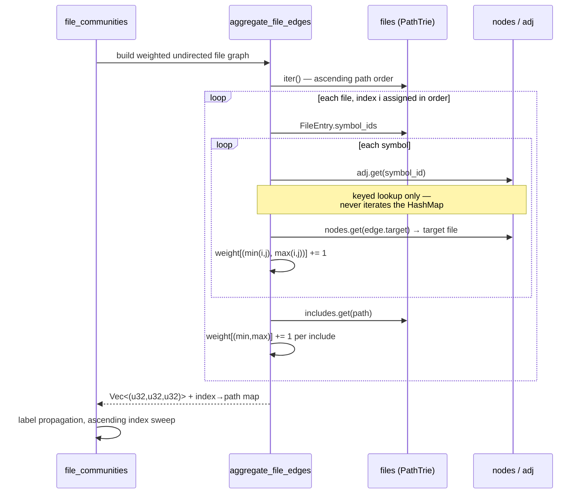

# Graph Queries (Track C)

Implementation-gate validation for this design follows the initiative scope recorded in D-0008.

## Overview

Three read-only queries added to the existing graph, answering questions the current 19-tool surface cannot answer at all:

| Tool | Question | Realizes |
|---|---|---|
| `get_symbol_at` | "What symbol is at this file and line?" | FR-21 |
| `find_path` | "How does A reach B?" | FR-22, FR-23 |
| `detect_communities` | "What are the de-facto modules here?" | FR-24, FR-25, FR-44, FR-45, FR-46 |

All three are pure functions of the in-memory `Graph`. None changes the symbol record, the cache format, or any existing tool's wire output. Track C is deliberately independent of Track A's typed-core refactor and is built against the handler conventions that exist today (FR-26, AC-33).

The load-bearing constraint throughout is **determinism** (FR-25, NFR-03). `Graph.nodes`, `Graph.adj`, and `Graph.radj` are `std::collections::HashMap` with a randomly seeded hasher — iteration order varies per process. `Graph.files` and `Graph.includes` are `PathTrie`, whose iteration is a pre-order DFS with children pre-sorted by path segment (`crates/code-graph-path-trie/src/iter.rs:29-42`), so it is deterministic and lexicographically ordered. Every design decision below that touches ordering is shaped by which of those two structures it walks.

## Non-Goals

- **`get_symbol_at` is not goto-definition.** It answers "what encloses this line", by span containment. It does not resolve the identifier *at* a position to its binding — that needs scope resolution, which `Specs/GraphPlatformExpansion` rules out as a Non-Goal. The tool description must not imply otherwise (NFR-11).
- **No column resolution.** `Symbol` has `line`, `column`, and `end_line` but no end column. Enclosure is line-granular. Two symbols opening and closing on the same line are not distinguishable; both are returned.
- **No general graph-algorithm library, and no new dependency.** Label propagation and Dijkstra are ~50 and ~60 lines respectively against the existing adjacency maps. `petgraph` is not introduced (NFR-02).
- **No symbol-level community detection in this design.** FR-44 permits it as an option; this design builds file granularity only and reserves the parameter. Symbol-level would need its own determinism story (see Decision 4) and clusters on top of heuristic call resolution.
- **No persisted index, no cache-format change.** All three queries compute from the in-memory graph per call. `CACHE_VERSION` stays at 10 (AC-15).
- **No incremental or cached community partition.** Recomputed per call. If profiling later shows it matters, a memo keyed on graph generation is an additive change that does not alter these interfaces.
- **`find_path` does not explain reachability semantically.** It reports a chain of `Calls` edges. Call resolution is a documented syntactic heuristic in all six languages; a returned path is evidence, not proof (see Error Handling).
- **Does not address the generic-class hierarchy lookup gap.** `Inherits.from` carries generic parameters verbatim while `Symbol.name` is bare; that documented gap is untouched here. `find_path` walks `Calls` only.
- **Not Track A.** Handlers return `CallToolResult` exactly as every existing handler does. Placing the algorithms in the graph crate (Decision 6) is what keeps Track A from having to move them later.
- **This design delivers only the MCP half of FR-26 / AC-33.** Both require the three queries to be reachable from the CLI as well as the MCP surface, and no CLI exists in this workspace today — the only binaries are the MCP server, the parse-test harness, and the bench tool. The spec's own Dependencies section states that Track C's *CLI exposure* depends on Track A, while its query implementations do not. So: the three algorithms and their MCP tools ship here; **AC-33 cannot be closed until a CLI exists**, and it should be verified against Track B, not against this design. The algorithms are placed in the graph crate specifically so that wiring them to a CLI later is a call site, not a port.

## Architecture

### Components

Three algorithms in `code-graph-graph` (pure, no MCP, no async, no I/O), three thin handlers in `code-graph-tools`, three tool methods in `server.rs`.



### Data Flow

The three queries differ in which structure they traverse, and that determines where ordering has to be imposed.



`aggregate_file_edges` is the one new traversal that touches the whole graph. It runs in a single pass rather than calling the existing per-file `Graph::coupling` in a loop (Decision 7):



### Interfaces

**Graph crate — new public functions.**

```rust
// crates/code-graph-graph/src/queries.rs
/// Symbols whose [line, end_line] span contains `line`, innermost first.
/// Empty when the file is unknown or no span contains the line.
pub fn symbols_at_line(&self, path: &Path, line: u32) -> Vec<Symbol>;

// crates/code-graph-graph/src/callgraph.rs
pub struct PathHop {
    pub symbol_id: SymbolId,
    pub file: PathBuf,
    pub line: u32,
    /// Confidence of the Calls edge that entered this hop. None for the source.
    pub entered_by: Option<Confidence>,
}
pub struct PathResult {
    pub hops: Vec<PathHop>,   // includes source at [0] and target at [last]
    pub heuristic_hops: u32,
    pub nodes_examined: u32,
    pub cap_reached: bool,
}
/// None when no path exists within `node_cap`; `cap_reached` distinguishes
/// exhaustion from genuine absence and is reported by the caller.
pub fn shortest_path(
    &self,
    from: &str,
    to: &str,
    node_cap: u32,
    min_confidence: Option<Confidence>,
) -> (Option<PathResult>, u32, bool);

// crates/code-graph-graph/src/community.rs  (new module)
pub enum Termination { Converged { iterations: u32 }, IterationCeiling { iterations: u32 } }
pub enum Degeneracy { Giant { share_permille: u32 }, Atomized }
pub struct FileCommunity {
    pub members: Vec<PathBuf>,   // ascending path order
    pub label: String,
}
pub struct CommunityResult {
    pub communities: Vec<FileCommunity>,  // descending size, then ascending first member
    pub node_count: u32,
    pub edge_count: u32,
    pub termination: Termination,
    pub degeneracy: Option<Degeneracy>,
}
pub fn file_communities(&self, max_iterations: u32) -> CommunityResult;
```

The shipped `PathResult` carries `hops` and `heuristic_hops` only; `nodes_examined` and `cap_reached` are returned on the outer tuple instead, where they are available on both the found and not-found paths. The four-field sketch above was the original shape — holding those two values in the struct *and* the tuple gave two copies that could disagree (review F-05).

**MCP surface — three new tools, taking the count from 19 to 22.**

`get_symbol_at` → `Page<EnclosingSymbol>`; `EnclosingSymbol = { symbol_id, name, kind, line, end_line, span_lines, parent, namespace }`, innermost first.

`find_path` → a single object, not a `Page` (the `get_class_hierarchy` precedent):
```
{ found, hops: [{symbol_id, file, line, entered_by}], hop_count, heuristic_hops,
  nodes_examined, node_cap, cap_reached }
```

`detect_communities` → `Page<Community>` flattened with envelope-level fields, following the `SearchSymbolsResponse` precedent of `#[serde(flatten)]` over `Page<T>`:
```
{ results, total, offset, limit, truncated, next_offset,       // flattened Page
  granularity, termination, iterations, node_count, edge_count,
  degenerate: null | {kind, share_permille} }
```
`Community = { label, size, members, truncated, original_len? }` — `truncated`/`original_len` mirror `Cycle` exactly: per-item truncation by the member cap, distinct from the envelope's page truncation (AC-32).

## Design Decisions

### Decision 1: Position lookup scans one file's symbols; no line index is built

**Context:** FR-21 needs symbols enclosing a line. There is no structure indexed by `(file, line)` anywhere in the graph; `FileEntry` holds only `language` and `symbol_ids` in merge order.

**Options considered:**
1. Linear scan of the file's symbols, filtering on `line <= L <= end_line`.
2. Build a sorted-by-line index per file at index time, stored in `FileEntry`.
3. An interval tree per file.

**Decision:** Option 1.

**Rationale:** The candidate set is already narrowed to one file by the `files` trie, so a scan is over tens to hundreds of symbols, not the whole graph — well inside NFR-08 for a query that returns a handful of rows. Option 2 changes `FileEntry`, which changes `PackedSymbol`/the cache encoder and forces a `CACHE_VERSION` bump — directly violating AC-15, which requires a pre-existing cache to remain readable. Option 3 is the same cache problem plus real complexity for a set this small. If profiling ever justifies an index, it can be built lazily in memory without touching the format.

### Decision 2: Innermost-first is defined by span width, with a total order for ties

**Context:** AC-13 requires a method nested in a class to be returned before the class. "Innermost" needs an operational definition, and ties must not depend on `HashMap` order.

**Decision:** Sort candidates by `(span_lines ascending, line descending, symbol_id ascending)`, where `span_lines = end_line - line`.

**Rationale:** The narrowest enclosing span is the innermost symbol; the class strictly contains the method, so its span is wider. `line` descending breaks equal-width ties toward the later-starting (more deeply nested) symbol. `symbol_id` ascending makes the order total, which matters because Java anonymous-class methods can produce two symbols with the *same* id distinguished only by `line` — a documented collision in CLAUDE.md. Without a total order the response would vary run to run and could not be snapshotted (NFR-03).

Malformed spans (`end_line < line`, which the parsers should never emit) are treated as zero-width and still sort deterministically rather than being dropped silently or panicking.

### Decision 3: Shortest path is Dijkstra over a lexicographic (hops, heuristic-count) cost

**Context:** FR-22 wants the shortest path; FR-23 wants resolved edges preferred; AC-17 requires that among equal-hop paths the all-resolved one wins. `Confidence` implements no `Ord` — the existing BFS compares it with strict equality (`min_confidence == Some(Confidence::Resolved)`), so there is no ordering to lean on.

**Options considered:**
1. Plain BFS on hops, ignoring confidence.
2. Dijkstra with scalar weights, e.g. Resolved = 1, Heuristic = 3.
3. Dijkstra over a lexicographic pair: hops first, heuristic-count second.

**Decision:** Option 3, packed as a single `u64` — `((hops as u64) << 32) | (heuristic_hops as u64)` — so the standard binary-heap Dijkstra applies unchanged. **The widen to `u64` before the shift is mandatory**: if `hops` is left as `u32`, `hops << 32` is a shift by the full bit width, which panics in debug and evaluates to `0` in release. That is precisely the class of one-line slip the arithmetic review in Structural Verification exists to catch, so it is spelled out here rather than left to the implementer.

**Rationale:** Option 1 cannot satisfy AC-17. Option 2 silently changes what "shortest" means: with 1/3 weights a two-hop resolved path beats a one-hop heuristic one, so the tool would return a longer path than exists and call it shortest — a surprise the spec never asked for. Option 3 gives exactly the stated contract: hop count is the primary key, so the returned path is always genuinely shortest; the heuristic count only breaks ties among equally short paths. Both components are non-negative and additive, so the lexicographic product is a valid Dijkstra cost and the algorithm's optimality argument holds. Packing into `u64` is safe because both fields are bounded by the node cap, which is far below `2^32`.

Ties on equal packed cost break on `symbol_id` ascending, for the same determinism reason as Decision 2.

**Traversal semantics** are deliberately identical to the existing `bfs`, so the two tools agree about what an edge is: forward adjacency (`adj`) only, `EdgeKind::Calls` only, targets failing `is_resolved_node` skipped before being enqueued, and `min_confidence: "resolved"` dropping non-resolved edges at each hop. A path from A to B therefore means "A calls … calls B", never a mix of directions.

### Decision 4: Community detection runs at file granularity

**Context:** FR-44 mandates file granularity by default and permits symbol granularity as an option.

**Decision:** Build file granularity only; accept a `granularity` parameter that today rejects anything but `"file"`, and echo the value used (AC-53).

**Rationale:** Four reinforcing reasons, in order of weight. (a) Determinism is free: the file set comes from the `files` trie in sorted order, so assigning indices `0..F` in iteration order yields a stable node numbering with no sort step, whereas symbol granularity would walk `nodes` — a `HashMap` — and need an explicit sort of up to ~770k ids on every call. (b) "De-facto modules" is a file-level question; symbol-level clusters answer something else. (c) The node count drops by three orders of magnitude on large corpora, which is what makes NFR-08 comfortable. (d) Call resolution is heuristic in all six languages, and aggregating many symbol edges into one file-pair weight averages that error out rather than clustering directly on top of it.

Accepting and validating the parameter now, rather than adding it later, means enabling symbol granularity is additive and does not change the response shape.

### Decision 5: Label propagation, parameter-free, with a fixed sweep order

**Context:** FR-45 requires a near-linear, parameter-free algorithm with a stated termination condition; FR-25 requires determinism.

**Options considered:**
1. Label propagation.
2. Louvain modularity optimisation.
3. Connected components.

**Decision:** Label propagation. Nodes are swept in ascending file index; each adopts the label carrying the greatest summed edge weight among its neighbours; ties break toward the smallest label id; a node keeps its current label when that label is among the maxima. Terminate on a full sweep with no change, or at `max_iterations` (default 50). Report which ended it (AC-54).

**Rationale:** Label propagation is O(edges) per sweep and converges in a handful of sweeps in practice, needs no resolution parameter, and its only non-determinism in the textbook formulation is the sweep order and tie-breaking — both of which we pin. Louvain gives better modularity but introduces a resolution parameter, contradicting FR-45's "no tuning parameter to produce a usable default", and is roughly three times the code; it remains addable behind an `algorithm` option without disturbing FR-24, FR-25, or the response shape. Connected components is not community detection — one hub file merges the entire graph into one blob.

"Keep current label when it is among the maxima" is the standard damping rule; without it, two adjacent nodes can swap labels forever and only the iteration ceiling stops them.

### Decision 6: Algorithms live in the graph crate, handlers stay thin

**Context:** The work could live in `code-graph-tools` alongside the handlers, or in `code-graph-graph` alongside `Graph::coupling` and `Graph::class_hierarchy`.

**Decision:** `code-graph-graph`. Handlers do argument validation, capping, sorting into wire structs, and pagination — nothing else.

**Rationale:** Consistent with where every other graph algorithm already lives, and `code-graph-graph` is documented as free of MCP, async, and I/O concerns — hand-rolled label propagation and Dijkstra add no dependency, so NFR-02 holds. It also front-runs Track A: when handlers are split into a typed core, algorithms already sitting in the graph crate do not have to move.

### Decision 7: A dedicated single-pass aggregator, not `Graph::coupling` in a loop

**Context:** `Graph::coupling(path)` and `Graph::incoming_coupling(path)` already compute per-file edge weights and are public.

**Decision:** Write `aggregate_file_edges`, one pass over the `files` trie, instead of calling `coupling` once per file. Two filters are part of the contract, not implementation detail:

- **Only `EdgeKind::Calls` from `adj`.** `EdgeKind` has four variants — `Calls`, `Includes`, `Inherits`, and `Overrides` — and `Inherits`/`Overrides` are routed into `adj`/`radj` alongside `Calls`. FR-44 specifies call and include edges; without an explicit filter, inheritance and override edges would silently become community weight. This matches what `bfs` and `coupling` already do. (CLAUDE.md's `get_dependencies` section claims the enum has three variants; that is stale and is corrected separately.)
- **Self-pairs are skipped.** An edge whose source and target resolve to the *same* file contributes nothing and is dropped before the weight table (`i == j` → skip). Intra-file calls are typically the majority of all `Calls` edges, and a self-loop is not a neighbour vote: folded into the weight table it would inflate every node's tally for its own current label on every sweep, biasing label propagation toward stasis and suppressing exactly the cross-file merging the query exists to find. This is a structural bias, distinct from the input-driven degeneracies Decision 8 catches, and it would not announce itself — the partition would simply be worse than it should be.

**Rationale:** `incoming_coupling` scans every file's include list to find files that include the target — there is no reverse-include index — so it is O(N×M) per call. Calling it once per file makes whole-graph aggregation O(F×N×M), which fails NFR-08 on any real corpus. The single pass reads each `adj` entry exactly once via keyed lookup and folds directed edges into undirected weights as it goes, giving O(symbols + edges + includes) total. `coupling` remains untouched for `get_coupling`'s per-file use.

Note the keyed-lookup detail: the aggregator drives iteration from the `files` trie and only ever calls `adj.get(id)` / `nodes.get(id)`. It never iterates a `HashMap`, so `HashMap` order never enters the result.

### Decision 8: Degeneracy is reported with explicit, testable thresholds

**Context:** FR-46 requires reporting a degenerate partition rather than presenting it as a result. "Substantially all" is not testable as written (AC-55).

**Decision:** Two named conditions, evaluated after the partition is final:
- `Giant` — the largest community holds ≥ 900‰ of nodes, and `node_count >= 10`.
- `Atomized` — the community count equals the node count, and `node_count > 1`.

Report `share_permille` on `Giant` so a caller can see how close to total the collapse was. Below ten nodes neither condition fires, because on a tiny graph "one community" is a correct answer rather than a failure.

**Rationale:** Both are the real failure modes. Label propagation on hub-heavy graphs is known to collapse into one giant community — a ubiquitous utility header that every file includes is exactly the shape that triggers it — and a graph with no edges at all produces one community per node. Either result is structurally uninformative, and returning it unflagged would read as a finding. Permille rather than percent avoids a float in the wire format. The thresholds are stated here so the test can assert them rather than infer them.

### Decision 9: Every numeric knob is server-clamped, with a stated ceiling

**Context:** NFR-08 requires the new tools to bound their work rather than degrade unboundedly. Every comparable existing knob is clamped server-side — `limit` at 1000, `max_cycle_size` at 500, `max_nodes` at 1000 — and the resolved value is echoed so a silent clamp is visible.

**Decision:** Three knobs, each with a default and a hard ceiling, clamped in the handler and echoed in the response:

| Knob | Tool | Default | Ceiling |
|---|---|---|---|
| `node_cap` | `find_path` | 100 000 | 5 000 000 |
| `max_iterations` | `detect_communities` | 50 | 500 |
| `members_per_community` | `detect_communities` | 10 | 100 |

`0` means "use the default", matching the existing `limit` convention.

**Rationale:** A caller-supplied bound is not a bound. Without a ceiling, NFR-08 rests on callers behaving, and — more sharply — Decision 3's overflow argument collapses: "both fields are bounded by the node cap, far below 2^32" is only true if the cap itself is bounded. Clamping `node_cap` at 5 000 000 makes the packing provably safe rather than incidentally safe, since hops and heuristic hops are each bounded by nodes examined. The ceiling is generous enough that no real corpus reaches it; it exists to make the invariant hold, not to constrain use.

### Decision 10: Three flat tools, and only `detect_communities` needs real paging

**Context:** The spec's Non-Goals defer mode-consolidation, so these are three flat tools (19 → 22). AC-33 requires list-returning responses to honour the pagination and byte-budget contract.

**Decision:** `get_symbol_at` returns `Page<EnclosingSymbol>` even though results are tiny; `detect_communities` returns a flattened `Page<Community>` with a *second, independent* member cap; `find_path` returns a single object with no page envelope.

**Rationale:** Uniformity is worth more than saving an envelope on `get_symbol_at` — one client deserializer covers every list-returning tool, and a deeply nested position could in principle return a long chain. `find_path` returns one path, not a list, so a page envelope would be noise; `get_class_hierarchy` sets the precedent for a non-`Page` structured response.

The two caps on `detect_communities` are genuinely independent and must not be conflated: `limit`/`offset` page over *communities* against the byte budget, while `members_per_community` caps the member list *within* each community. A community truncated by the member cap sets `truncated: true` and carries `original_len`, exactly as `Cycle` does — and, exactly as with `Cycle`, neither `truncated` notion implies the other.

## Error Handling

| Condition | Behaviour |
|---|---|
| Not indexed | `require_indexed()` first, as every query handler does. |
| `get_symbol_at`: unknown file | Tool error naming the path. Distinguishes "not indexed" from "no symbol here". |
| `get_symbol_at`: no symbol contains the line | **Success** with an empty `Page` — not an error, and never a nearest-neighbour guess (AC-14). A line between two functions legitimately encloses nothing. |
| `get_symbol_at`: `line = 0` | Tool error. Lines are 1-based throughout; 0 is a caller bug, not an empty result. |
| `find_path`: either endpoint unknown | Tool error naming which endpoint failed. Where the raw argument looks like a bare name rather than a symbol id, the message points at `search_symbols`, mirroring the existing did-you-mean affordance. |
| `find_path`: no path within the cap | **Success** with `found: false`. `cap_reached` discriminates exhaustion from genuine absence (AC-16); the two are never conflated, and a partial path is never returned. |
| `find_path`: source equals target | **Success**, `found: true`, single-hop path, `hop_count: 0`. Not an error. |
| `detect_communities`: empty graph | **Success**, zero communities, `degenerate: null`. Zero nodes is not `Atomized` — that condition requires `node_count > 1`. |
| Unknown `granularity` | Tool error listing accepted values, matching how `direction` and `min_confidence` reject unknown spellings today. |
| Handler panic | The `spawn_blocking` join error is converted by `tool_error`, as in `get_coupling`. |

All user-visible failures travel as `CallToolResult` with the error flag, never as `Err` — the workspace's stated invariant. Diagnostics outside a handler use `eprintln!`; no `tracing` dependency is added (NFR-05).

## Testing Strategy

**Unit tests in the graph crate** — algorithm correctness against hand-built `Graph` fixtures, where the exact edge set is visible in the test:

- `symbols_at_line`: nested method inside class returns method first (AC-13); line in no span returns empty (AC-14); malformed span does not panic; two same-span symbols return in a stable order across repeated calls.
- `shortest_path`: connected pair returns a chain whose first element is the source, last is the target, and every adjacent pair is a real edge (AC-16); unconnected pair returns `None`; **the AC-17 fixture is the discriminating one** — two paths of equal hop count where only one is all-resolved, asserting the resolved path wins; a cap smaller than the graph requires returns `None` with `cap_reached: true` and never a partial path.
- `file_communities`: a graph of two dense clusters joined by one edge separates into two communities; a star graph collapses and reports `Giant`; an edgeless graph reports `Atomized`; a nine-node collapse reports **no** degeneracy, pinning the `node_count >= 10` floor.
- **Self-loop bias** (Decision 7): a file with many intra-file calls and one genuine cross-file edge still merges with its neighbour. This fails if self-pairs reach the weight table.
- **Edge-kind filter** (Decision 7): a graph whose only cross-file edges are `Inherits`/`Overrides` yields no community structure — proving those edges are excluded rather than silently weighted.
- **Determinism**: run `file_communities` twenty times on one graph and assert byte-identical output, label field included. This is the test that catches an accidental `HashMap` iteration creeping into the aggregator, which is the single most likely way this design breaks (NFR-03).

**AC-18 traceability.** AC-18 requires determinism *and* capture by a snapshot test, and the two are satisfied by different tests: the 20×-run unit test above proves cross-run stability, and a committed `insta` snapshot of the `detect_communities` handler response in `snapshot_responses.rs` is the golden file. Neither alone closes AC-18; both are required, and the plan should carry them as one task so they cannot drift apart.

**Handler snapshot tests** in `crates/code-graph-tools/tests/snapshot_responses.rs`, using the existing `build_indexed_fixture()` / `parsed_sorted` / `settings_with_path_redaction` machinery — no new snapshot infrastructure is needed. Cover the response envelope of each tool, the `count_only`-equivalent and truncation paths, a member-capped community showing `truncated` + `original_len` (AC-32), and the granularity and termination fields (AC-53, AC-54).

**Tool-list snapshot** in `snapshot_tools_list.rs` picks up the three new tool schemas; the 19→22 count change rebaselines there deliberately, and is the only intended snapshot movement. Every *existing* response snapshot must pass unchanged — that is the concrete check for NFR-01.

**Performance** (NFR-08, AC-43): time `file_communities` and a worst-case `shortest_path` against the largest initialised dogfood corpus via `code-graph-bench`, and record the numbers in the plan's notes.

**AC-43 is a recorded-metric criterion, not an automated gate** — stated deliberately rather than left to inference. A wall-clock assertion in the test suite would be flaky across machines and CI load, so nothing here fails a build on regression; a human reading the recorded number is the check. What *is* automated is the cap enforcement: a unit test asserts `shortest_path` stops at `node_cap` and reports `cap_reached`, and that `max_iterations` terminates label propagation. If an automated performance gate is wanted later, the bench harness is where it belongs, not the unit suite.

### Structural Verification

Rust, per `shared/language-verification.md`:

- `cargo clippy --workspace --all-targets -- -D warnings` on every phase — the project's standing bar.
- `cargo fmt --all --check`.
- `make verify` as the single gate: clippy, fmt, full workspace tests, pending-snapshot check, and the plugin-mirror drift gate.
- **`miri` is not required.** It is the tool for `unsafe`, raw pointers, and FFI; this design introduces none, and the workspace's single `unsafe` opt-in is confined to one mmap site in `code-graph-graph/src/persist/mmap.rs` that Track C does not touch.
- Arithmetic review: the packed Dijkstra cost and the permille share both do integer arithmetic on values bounded by the node cap. Use saturating arithmetic at those two sites so a pathological graph degrades rather than panicking in debug or wrapping in release.

## Migration / Rollout

Purely additive. No cache-format change (`CACHE_VERSION` stays 10), no change to any existing tool's request or response, no configuration change, no migration step for existing users. A client that never calls the new tools cannot observe that they exist.

Rollout order within the track, each independently shippable:

1. `get_symbol_at` — smallest, and the one with the clearest immediate payoff for agents holding a `file:line` from a diff or a compiler error.
2. `find_path` — new traversal, but reuses the established edge-filtering semantics.
3. `detect_communities` — largest, and the only one adding a module and a whole-graph pass.

Two documentation updates land with the code, not after: the MCP tools table in CLAUDE.md moves from 19 to 22 with the new response shapes described, and the three tool descriptions are written under the agent-facing-description lens (NFR-11, AC-45) — arguments documented with defaults and ceilings, envelope named rather than implied, and `get_symbol_at` explicitly *not* described as goto-definition.

## Resolved Questions

**OQ-C1 — RESOLVED by Decision 9.** *What is the default node cap for `find_path`?* Filed before Decision 9 existed and left stale: Decision 9 fixes the default at 100 000 and the ceiling at 5 000 000, alongside the other two knobs. The number remains tunable from the AC-43 measurement without touching an interface, but it is no longer unsettled.

**OQ-C2 — RESOLVED, not deferred.** *How is a community's label derived?* Originally filed as cosmetic, which was wrong: `label` is part of the output, so AC-18's byte-identical requirement covers it, and an unspecified tie-break is a determinism hole rather than a styling question. Pinned now: the label is the longest directory prefix shared by the greatest number of members; **on a count tie, the lexicographically smallest prefix wins**; a community whose members share no prefix is labelled with the lexicographically smallest member path. Whether to additionally enrich the label with a central member's name remains genuinely cosmetic and is out of scope.

## Follow-On Work

**Candidate count supersedes the binary confidence tag as the signal worth reporting (FR-48, AC-57, D-0007).** `find_path` ships `PathHop.entered_by`, a per-hop `resolved`/`heuristic` tag. Phase 1's review established why that is the weaker indicator: `Heuristic` means "at least two indexed candidates shared this name and the resolver picked one by scope rule", so the tag is a one-bit projection of *how many* competed. Three candidates tells a caller what to disambiguate; "heuristic" only tells it to be uneasy.

The per-hop tag stays, because it lets a caller find the weak link without a second query and a field earns its place by removing a round-trip (D-0007). The count cannot be added here: the resolver discards it, so recovering it needs a resolver change and a cache-format bump. That is specified as FR-48 and planned as phase 9, not smuggled into this design.

This also settles the FR-23 tension the review raised: the *weighting* is internal — no numeric value, score, or cost reaches the wire — while reporting which hops were heuristically resolved is permitted, and FR-23 now says so explicitly.

## Open Questions

- Whether `get_symbol_at` should accept a column argument (OQ-C3) — **non-blocking** — `Symbol` carries no end column, so a column could filter the start position only and would not sharpen enclosure; adding an optional argument later is additive and changes no existing behaviour.
