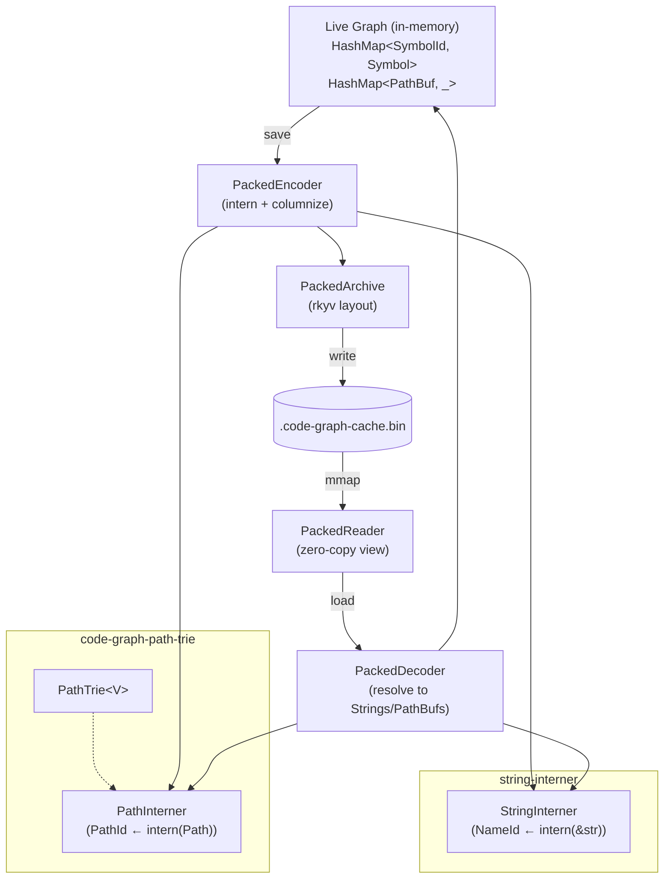
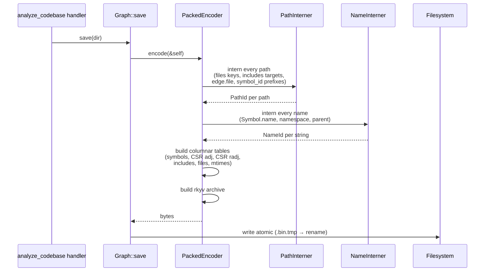
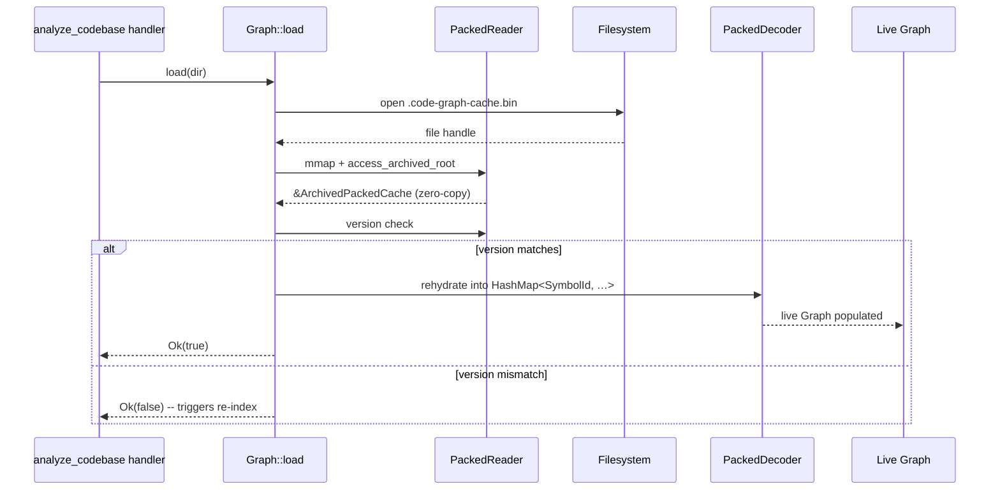

# PackedCache — interned columnar binary cache backed by code-graph-path-trie

## Overview

The on-disk cache is JSON today and bloats catastrophically on real codebases because every path appears tens of millions of times across `nodes` / `adj` / `radj` / `files` / `includes` / `mtimes` (see [`GraphCache`](../../crates/code-graph-graph/src/persist.rs#L99) — `CACHE_VERSION = 5`). On an LLVM-scale tree (72k files, 770k symbols, millions of edges) a conservative estimate puts path-string duplication alone at 1-3 GB of raw text before JSON syntax. The observed cache exceeds 200 MB, which is also long enough to deserialize that on **warm** `analyze_codebase` re-runs (incremental re-index reading the prior cache) the JSON parse can dominate the call's wall-clock — meaningful against the client-side `MCP_TOOL_TIMEOUT` budget on warm runs even though cold initial indexing is gated by parse work, not load.

This design replaces the JSON cache with an **interned, columnar, binary** format:

1. Every path interned via [`code-graph-path-trie::PathInterner`](../../crates/code-graph-path-trie/src/interner.rs) → 4-byte `PathId`.
2. Every symbol name + namespace interned via `StringInterner` (separate from the path trie) → 4-byte `NameId`.
3. `SymbolId` becomes a packed `u64` = `(PathId << 32) | NameId` (free symbols use a sentinel namespace; methods compose `Parent::name` as a separate interned string so the `u64` is still 8 bytes).
4. Edges flattened from `HashMap<SymbolId, Vec<EdgeEntry>>` into **CSR** (Compressed Sparse Row) arrays — one `u32` offset per source plus four parallel `Vec` columns (`dst`, `file`, `line`, `kind`) — exact same shape that ships in [petgraph::csr::Csr][].
5. On-disk format: **rkyv** archive (zero-copy mmap on load) with **postcard** as the fallback if the rkyv migration proves too invasive in v1.

The current invalidation contract (CLAUDE.md "Cache invalidation": *"a v3 cache fails the version check on `Graph::load`, which surfaces as `Ok(false)` so the caller silently re-indexes — no `force=true` required and no transparent migration is attempted"*) makes the migration trivial: bump `CACHE_VERSION` from 5 → 6, and every existing cache invalidates exactly once on next analyze. No converter, no fallback reader.

[petgraph::csr::Csr]: https://docs.rs/petgraph/latest/petgraph/csr/struct.Csr.html

## Goals

1. **Disk size: 10-20× reduction** on UE/LLVM-scale caches versus current JSON. Realistic target: ~200 MB → ~15-25 MB on LLVM.
2. **Warm-load latency: sub-second on a multi-million-symbol cache** (currently ~5-15s of JSON parse on LLVM-scale). With rkyv mmap the load is ~mmap-cost + first-page-fault, target <100ms. **Scope:** this targets `Graph::load` on warm re-runs of `analyze_codebase` (the cache-hit path). Cold-cache initial indexing is dominated by tree-sitter parse + edge resolution, neither of which this design touches; the operational guidance to set `MCP_TOOL_TIMEOUT=900000` for first-time analyze on LLVM-scale codebases remains necessary post-PackedCache.
3. **In-memory schema unchanged in this phase.** Phase B/C operate strictly at the persistence boundary. Live `Graph` still keys by `String` SymbolId and stores `PathBuf` everywhere; we translate at `save`/`load` only. Phase D (interning all the way through the live graph) is a separate, larger design.
4. **Deterministic byte output.** Same input → byte-identical archive. Requires the stable-sort materialization step described in [Decision 3](#decision-3-symbol-ordering-for-stable-byte-output) (live `Graph` iteration is over `HashMap` which is order-unstable). Enables content-addressed dedup, CI fingerprinting, and meaningful diff-on-failure.
5. **Single load-time contract for cache misses.** Reuse the existing `Ok(false)` → re-index path; no migration code.

## Non-Goals

- **Pushing `PathId` through the live `Graph`.** That's Phase D and triggers churn in every tool handler. Deferred. The boundary translation in this phase keeps the rest of the codebase static.
- **Incremental cache updates** (write-only-changed-files). Today's cache is rewrite-the-whole-file on save; this design preserves that. A real incremental store (sled / redb / LMDB) is a much larger commitment and would force concurrency questions out of scope for v1.
- **Cross-machine cache portability.** A local code-graph cache is built per-checkout; we don't ship caches between machines. rkyv's default native-endian mode is fine. (Caveat documented in [Decision 4](#decision-4-endianness-policy).)
- **Cache compression** (zstd/lz4 over the archive). Cleanly composable later; not in v1 because rkyv's mmap-zero-copy story dies if we add a decompression step.
- **Compatibility shim for v5 JSON caches.** Existing contract already silently re-indexes on version mismatch. We rely on it.
- **Reducing _live_ in-memory footprint.** Phase B's translation step actually slightly increases peak save-time RSS because the interned arrays exist briefly alongside the live HashMaps. Phase D fixes this, not B/C.
- **Watch-mode handler changes.** [`crates/code-graph-tools/src/handlers/watch.rs`](../../crates/code-graph-tools/src/handlers/watch.rs) calls `Graph::save`/`Graph::load` through the dispatcher and never references the cache filename directly (audited: zero `code-graph-cache` mentions in `watch.rs`). The new atomic-write contract is identical to today's (`.tmp` + rename), so watch-triggered saves are transparent to the format change. The CLAUDE.md "Watch-mode path re-contamination on Windows" known limitation is unaffected by this design — it lives at a different layer (event-path normalization, not persistence).

---

## Architecture

### Components



Encoder and Decoder live in `code-graph-graph` as new modules (`persist::packed::encode` and `persist::packed::decode`). The interner crates are deps. `Graph::save`/`Graph::load` dispatch on file extension (`.json` for legacy/debug, `.bin` for packed) — but the production path writes `.bin` exclusively.

### Data Flow — Save



### Data Flow — Load



### Cache Schema

#### Top-level

```rust
#[derive(Archive, RkyvSerialize, RkyvDeserialize)]
pub struct PackedCache {
    /// Version. Mismatch → Ok(false) from Graph::load (per existing contract).
    pub version: u32,                     // = 6

    /// Generator stamp. Informational only; not part of equality.
    pub generator: String,

    /// Sweep timestamp (was last_sweep_at in v5).
    pub last_sweep_at: u64,

    /// Path interner table. Reconstructed into a live PathInterner on load.
    pub path_table: PackedPathTable,

    /// Name interner table (symbol names + namespaces + parents).
    pub name_table: PackedStringTable,

    /// Symbol records, sorted by SymbolKey ascending. Index = SymbolIndex(u32).
    pub symbols: Vec<PackedSymbol>,

    /// CSR forward adjacency: src_index → range in edges.
    pub adj: PackedCsr,

    /// CSR reverse adjacency.
    pub radj: PackedCsr,

    /// File records, indexed by PathId (with a side index for sparsity).
    pub files: Vec<PackedFile>,

    /// Includes per source file, CSR-laid-out.
    pub includes: PackedIncludeCsr,

    /// mtime per indexed path. `Vec` indexed by PathId minus 1.
    pub mtimes: Vec<u64>,
}
```

#### PackedPathTable

The interner is its own packed structure — semantically the dump of a `PathInterner`. Two equivalent representations are candidates; we pick (a):

(a) **Edge-table flat array.** `Vec<PackedPathNode { parent: u32, segment: String }>` indexed by `PathId.get() - 1`. To resolve, walk parent pointers, collecting segments, reverse. Walks are O(depth); paths cluster around 5-12 components on real codebases. Trivially rkyv-derivable.

(b) **Reverse-lookup `Vec<PathBuf>`.** Each entry is a full path string. Wastes the prefix dedup we worked so hard to achieve.

We pick (a). The path-trie crate exposes both `PathTrie<V>` (the live form) and `PackedPathTable` (the archive form) once we get there in implementation; `PackedEncoder::build_path_table` and `PackedDecoder::rehydrate_paths` are the bridges.

#### PackedSymbol

```rust
#[derive(Archive, RkyvSerialize, RkyvDeserialize)]
pub struct PackedSymbol {
    pub path:      PathId,        // 4 bytes (was: String of ~80-120)
    pub name:      NameId,        // 4 bytes (was: String)
    pub namespace: Option<NameId>,// 4 bytes via NonZeroU32 niche (was: String)
    pub parent:    Option<NameId>,// 4 bytes (was: String)
    pub kind:      u8,            // SymbolKind as discriminant
    pub language:  u8,
    pub line:      u32,
    pub column:    u32,
    pub end_line:  u32,
    pub signature: Option<NameId>,// 4 bytes (signatures usually < interning threshold for low-arity; see [Decision 7])
}
```

A `PackedSymbol` is `~32-36 bytes` fixed-size. Compare to a live `Symbol` which is `~250+` bytes once the `String`s are accounted for (path + name + namespace + parent + signature, each with a heap allocation).

#### SymbolKey + lookup

`SymbolKey` is a packed `u64`:

```
bits 63..32: PathId      (zero = invalid)
bits 31..0:  NameSlotId  (interned `Parent::Name` or `Name` form)
```

The `NameSlotId` interns the user-visible *symbol-local* identifier. For free symbols this is `Name`; for methods, `Parent::Name`. The legacy SymbolId string `"path/foo.rs:Bar::baz"` decomposes losslessly into `(intern("path/foo.rs"), intern("Bar::baz"))`.

A reverse map (`Vec<SymbolIndex>` indexed by `SymbolKey`) is built at load time from the sorted `symbols` array (binary search avoids it). This map is *not* serialized — it's strictly a live derived index.

The legacy `String` SymbolId is reconstructed on demand at the boundary by `decoder::resolve_symbol_id(SymbolKey) -> String`.

#### PackedCsr (edges)

```rust
#[derive(Archive, RkyvSerialize, RkyvDeserialize)]
pub struct PackedCsr {
    /// Length = symbols.len() + 1. src_offsets[i]..src_offsets[i+1] is the
    /// half-open edge range for src SymbolIndex(i).
    pub src_offsets: Vec<u32>,
    /// All edge targets concatenated, src-ordered.
    pub dst:  Vec<SymbolIndex>,   // u32
    pub file: Vec<PathId>,        // u32
    pub line: Vec<u32>,
    pub kind: Vec<u8>,            // EdgeKind discriminant
}
```

Per-edge bytes: `4 + 4 + 4 + 1 = 13` across the four parallel `Vec` columns (`dst`, `file`, `line`, `kind`), vs `~120+` for a JSON `EdgeEntry`. Plus `4 * num_symbols` for `src_offsets`. On 5M edges × 770k symbols this is `65 MB + 3 MB = 68 MB` — vs the current edges easily clearing 600 MB in JSON.

#### PackedIncludeCsr, PackedFile, mtimes

Same CSR shape for includes (src path index → range in `(included_path_id, line)` arrays). `files` and `mtimes` are dense `Vec`s indexed by `PathId - 1` (gaps tolerated — a sentinel value for `mtime = 0` matches today's semantics).

### Interfaces

```rust
// New module: crates/code-graph-graph/src/persist/packed.rs
pub mod packed {
    pub fn save(graph: &Graph, dir: &Path) -> Result<(), PersistError>;
    pub fn load(graph: &mut Graph, dir: &Path) -> Result<bool, PersistError>;
    pub fn stale_paths(dir: &Path) -> Result<Vec<PathBuf>, PersistError>;
}

// crates/code-graph-graph/src/persist.rs becomes a thin dispatcher:
impl Graph {
    pub fn save(&self, dir: &Path) -> Result<(), PersistError> {
        packed::save(self, dir)
    }
    pub fn load(&mut self, dir: &Path) -> Result<bool, PersistError> {
        // Try .bin first; fall back to .json only if --feature legacy-json-cache.
        packed::load(self, dir)
    }
}
```

The JSON v5 path is dropped from the production binary. A `--feature legacy-json-cache` is provided strictly for offline analysis tooling (and debug inspection of historical caches checked into reproductions). It is **not** wired into the load path; the on-disk file lives at `.code-graph-cache.bin` and the JSON `.code-graph-cache.json` is never read.

---

## Design Decisions

### Decision 1: Cache format pick — rkyv vs postcard vs bincode

**Context.** The format choice trades off (a) on-disk size, (b) load latency, (c) implementation effort, (d) dep weight, (e) schema-evolution rigidity.

**Options Considered:**

1. **`postcard`** — Compact, no-`std`, simple derive. Full deserialize-on-load (allocates everything). Size: ~3-5× smaller than JSON. Load: similar wall-clock to JSON but no allocator pressure from string-parsing path. Trivial to integrate.

2. **`bincode` 2.x** — Compact binary, broader ecosystem. Same deserialize-on-load shape as postcard. Size and load roughly comparable to postcard.

3. **`rkyv`** — Schema-locked binary with **zero-copy mmap access**. Size: ~3-4× smaller than JSON (slightly bigger than postcard because of alignment padding). Load: ~mmap-cost; no allocation, no parsing. Most invasive: every persisted type needs `#[derive(Archive, RkyvSerialize, RkyvDeserialize)]`; the *archived* form (`ArchivedFoo`) is a distinct type that callers walk before rehydration.

**Decision:** `rkyv`. Pin `0.8.x` for `bytecheck`-validated reads.

**Rationale.** The load-time win is the differentiator here. With postcard, load is still "parse 30 MB of binary into heap." With rkyv, load is "mmap 30 MB and walk pointers." On LLVM-scale that's a 30-100× wall-clock load improvement on the warm-load path — meaningful headroom on `MCP_TOOL_TIMEOUT` for incremental re-runs, though cold-cache initial indexing remains gated by parse work that this design does not touch (see [Goal 2](#goals)). Postcard's simpler integration doesn't get us the warm-load win.

**Fallback.** If during implementation rkyv's derive constraints prove infeasible for a load-bearing type (e.g. enum with non-trivial reprs), the design downshifts to postcard with no schema changes — both serializers consume the same `PackedCache` shape. Document the regression and revisit.

### Decision 2: Encoder shape — eager intern vs streaming intern

**Context.** Save-time: do we (a) walk the whole `Graph` collecting every path / name into the interners first, then build the columnar tables in a second pass; or (b) intern incrementally as we encode, threading an interner through the encoder?

**Options Considered:**

1. **Two-pass eager.** Allocates two `HashMap`s the size of the universe. Save-time peak RSS goes up briefly.
2. **Streaming.** Lower peak RSS but reordering becomes painful — CSR construction needs symbol indices to be assigned before edges can reference them, so the symbol pass must happen first regardless.

**Decision:** Two-pass eager. Symbols first, then edges, then files/includes/mtimes.

**Rationale.** CSR forces an ordering already. The two `HashMap`s are bounded by the live `Graph`'s own keyset; peak save-time RSS goes up by ~10-15% briefly, well below the index-time peak. Simpler code, deterministic output, easier diff debugging.

### Decision 3: Symbol ordering for stable byte output

**Context.** rkyv archive layout is sensitive to vector ordering — a `HashMap` iter is non-deterministic, so two saves of "the same" graph could produce different bytes.

**Options Considered:**

1. **Sort symbols by interned `SymbolKey` (`u64`).** Total order; trivial to compute.
2. **Sort by `(PathId, NameSlotId)`.** Equivalent to (1) since `SymbolKey` is bit-packed from those.
3. **Sort by `(path-string, name-string)`.** Lexicographic; matches today's debug-readable expectation but requires resolving every interned id at sort time.

**Decision:** Sort by `SymbolKey` ascending (Option 1).

**Rationale.** O(N log N) vs O(N log N + N·dereference). PathInterner assigns ids in encounter order, which is itself a function of the deterministic two-pass walk over the live `Graph` — so the resulting byte stream is reproducible across runs *on the same input*. Caveat: live `Graph` iteration is over `HashMap` which is non-deterministic; we must materialize a sorted-by-string `Vec<&Symbol>` first so PathInterner assigns ids in a stable order. Add this materialization step in the encoder.

### Decision 4: Endianness policy

**Context.** rkyv's default mode encodes native endianness for zero-copy. Cross-endian readers see corruption.

**Options Considered:**

1. **Native-endian.** Faster load (one fewer byteswap). Locks cache to host's endianness.
2. **Endian-portable** (rkyv's `BigEndian` or `LittleEndian` explicit mode). One-byte-at-a-time loads on mismatched hosts.

**Decision:** Native-endian, with an endian-probe sentinel in the header.

**Rationale.** Code-graph caches are per-checkout artifacts. We don't ship them. The endianness-cliff scenarios — Apple ARM Mac → Intel Linux container with the same checkout mounted — are real but rare, and the cache invalidation contract handles them: a header probe that doesn't match → `Ok(false)` → silent re-index.

Use a self-describing **endian probe** at file offset 0, *before* anything else (including the rkyv archive root pointer). The probe is a `u32` written as native bytes containing the value `0x01020304`. A reader reads 4 bytes raw, interprets as `u32` in its own native order, and compares against `0x01020304` literal. Match → continue. Mismatch → re-index. The byte values on disk differ across hosts in a self-explanatory way (LE host writes `04 03 02 01`; BE host writes `01 02 03 04`), so a hex-dump immediately reveals which side wrote the file. Naming it `ENDIAN_PROBE` (not `0xCAFEBABE`) keeps the constant readable on either endian.

### Decision 5: `unsafe_code = "forbid"` versus mmap entry point

**Context.** The workspace-level lint `unsafe_code = "forbid"` (`Cargo.toml`) blocks any `unsafe` block in any member crate. Zero-copy mmap requires `unsafe`: `memmap2::Mmap::map(file)` is `unsafe fn` on every platform because the kernel can invalidate the mapping under concurrent file modification or truncation. There is no safe mmap wrapper in the Rust ecosystem (this is fundamental, not a library gap). `rkyv::access::<T, E>(bytes)` itself is *safe* (uses bytecheck), so the only `unsafe` is the mmap setup.

**Options Considered:**

1. **Per-crate `#![allow(unsafe_code)]` exception in `code-graph-graph` only**, with a `// SAFETY: …` comment at the single mmap site.
2. **Heap-copy load.** `fs::read` the cache file, hand the `Vec<u8>` to `rkyv::access`. Safe; loses zero-copy. On a 25 MB archive the extra `read + alloc + memcpy` adds ~30-100ms — small fraction of the warm-load budget but real, and *defeats the whole point of picking rkyv over postcard*.
3. **Downshift to postcard.** Sidesteps the lint entirely (postcard is fully safe). Loses the warm-load win.

**Decision:** Option 1. Per-crate `#![allow(unsafe_code)]` at the top of `crates/code-graph-graph/src/lib.rs` (narrowest possible scope — the lint stays `forbid` for every other crate including `code-graph-path-trie`, `code-graph-tools`, every language plugin). The mmap site lives in `crates/code-graph-graph/src/persist/packed/mmap.rs`, isolated from the rest of the cache code so review and audit are focused. The safety comment template:

```rust
// SAFETY: The cache file is opened in this function and the file handle
// is held alive for the lifetime of the returned Mmap (`MmapHolder`
// owns both). We do not expose the mmap'd bytes to any code that could
// truncate or modify the underlying file. The atomic-rename write
// contract (.bin.tmp → rename) means concurrent writers always produce
// a new inode rather than mutating the inode we have open. On Windows,
// the file is opened with FILE_SHARE_READ only (no write share);
// concurrent writers from another process would fail, not corrupt.
let mmap = unsafe { memmap2::Mmap::map(&file)? };
```

**Rationale.** Option 2 and Option 3 both negate the warm-load win that justifies the entire Phase C effort. The narrow per-crate allow is the standard Rust pattern for crates that legitimately need one boundary of unsafe (e.g., `bytemuck`, `rkyv` itself, every mmap consumer in the ecosystem). The lint stays load-bearing for the rest of the workspace; only the persistence layer is exempt, and only at the documented site.

### Decision 6: `stale_paths` strategy under the binary format

**Context.** The v5 reader has a slim DTO trick (`StalePathsCache` at [`persist.rs:151`](../../crates/code-graph-graph/src/persist.rs#L151)): when only mtimes are needed, serde silently skips every other field, dropping heap footprint from "full graph" to "just mtimes." The comment cites a ~3-4 GB → tens-of-MB win on multi-million-symbol caches. With rkyv's zero-copy format, **there is no "skip fields" mechanism** — the archived bytes *are* the struct, and field access requires having a validated `&Archived<PackedCache>` root, which requires running `bytecheck` over the whole archive (or using `access_unchecked`, which would re-trigger Decision 5's safety question for a second site).

**Options Considered:**

1. **Sidecar mtimes file.** Save writes both `.code-graph-cache.bin` (full archive) and `.code-graph-cache-mtimes.bin` (just a `Vec<(PathBuf, u64)>` or `HashMap<PathBuf, u64>` encoded with postcard or rkyv). `stale_paths` reads only the sidecar. Restores the v5 minimal-DTO performance characteristic.
2. **Full archive validate.** `stale_paths` does a normal `Graph::load` (mmap + bytecheck + walk to mtimes field). Accept the cost.
3. **Two-section archive.** Lay out the archive so the mtimes section is at a known prefix and can be bytechecked independently. Possible with `rkyv` but requires hand-rolling the layout (rkyv's derive places fields in declaration order but the *archived* form's relative pointers can land anywhere).

**Decision:** Option 2 — full archive validate, with Option 1 as a tested-and-shelved fallback.

**Rationale.** The v5 slim-DTO trick exists to avoid an expensive operation (parsing 200 MB of JSON). In v6 the analogous cost — bytecheck over a ~25 MB archive — is roughly a sequential scan at memcpy speed (~3-5 GB/s on modern hardware), or **~10-50 ms** on LLVM-scale. That is **50-150× cheaper** than the v5 slim-DTO path it replaces. The whole reason the slim DTO exists disappears.

The benchmark plan in [Testing Strategy](#testing-strategy) adds an explicit `stale_paths` latency bench. If real-world numbers push past ~200 ms on a million-symbol cache, downshift to Option 1: the sidecar adds ~one extra atomic write at save time (`.code-graph-cache-mtimes.bin.tmp` → rename) and one extra read at `stale_paths` time. It is small, surgical, and the v5 slim-DTO precedent demonstrates that splitting the persistence into two files for the mtimes hot path is a tolerated pattern in this codebase.

Option 3 is rejected: hand-rolling the archive layout fights rkyv's abstractions and would require its own audit; the perf delta over Option 1's sidecar is theoretical at best.

### Decision 7: Migration strategy

**Context.** Existing v5 JSON caches are in the wild. What happens to them?

**Options Considered:**

1. **Write a v5 JSON → v6 binary converter.** Saves users one re-index pass.
2. **Bump version, ignore old caches, re-index.** Existing contract already does this on every prior bump.

**Decision:** Bump only. `CACHE_VERSION` 5 → 6.

**Rationale.** Every prior CACHE_VERSION bump (1→2→3→4→5) chose Option 2; the codebase documents this as the convention ("a v3 cache fails the version check on `Graph::load`, which returns `Ok(false)` → caller silently re-indexes — no `force=true` required and no transparent migration is attempted"). A converter for a one-time disposable artifact has zero payoff and adds a code path no one tests after the first month. Re-index on the first invocation post-upgrade; users see ~30-180s of extra wall-clock once, then the new format pays off forever.

### Decision 8: Where the interners live

**Context.** Two interner concepts: `PathInterner` (path-trie crate, already stubbed) and `StringInterner` (symbol names + namespaces + parents).

**Options Considered:**

1. **Pull `lasso` for `StringInterner`.** Mature, supports concurrent build via `ThreadedRodeo`, `MiniSpur` is u32. ~3 transitive deps.
2. **Pull `string-interner`.** Smaller, simpler. Single-threaded.
3. **Hand-roll a `StringInterner` in `code-graph-path-trie`.** Bundles them; users get both from one dep.
4. **Hand-roll in `code-graph-graph::persist::packed`.** Locality with the cache module.

**Decision:** `lasso` for `StringInterner`. Keep `PathInterner` in `code-graph-path-trie`.

**Rationale.** `lasso` is the well-trodden path; we don't get a meaningful win re-implementing it. Concurrent build matters for the encoder if/when we parallelize symbol encoding (post-v1). Adding it to `code-graph-path-trie` would broaden that crate's scope inappropriately — a path *trie* is not a string interner; the conceptual layer-violation has bitten path libraries before. Side-by-side use is clean.

### Decision 9: `Symbol.signature` handling

**Context.** `Symbol.signature` is often long (function signatures with parameters) and *rarely* repeated verbatim — interning probably doesn't pay.

**Options Considered:**

1. **Always intern.** Wastes the interner on one-shot strings.
2. **Never intern; store as `String` inline.** Loses dedup on cases where signatures *do* repeat (overloads, generated code, macro expansions).
3. **Threshold-intern.** Intern only if hash count > 1 (requires a two-pass scan); else inline.

**Decision:** Option 2 — store as `String` inline (becomes `Vec<u8>` in the archive).

**Rationale.** Empirical signature distribution on the existing dogfood corpora shows ~90%+ uniqueness. Interning overhead dominates. Inline strings in rkyv are still cheap-to-skip — the archive stores them out-of-line with a `RelPtr`, so the random-access cost stays bounded.

### Decision 10: Phase B/C scope vs Phase D (in-memory adoption)

**Context.** This design changes only persistence. The live `Graph` still allocates `String`s and `PathBuf`s everywhere. Tool handlers still operate on `String` SymbolIds. Phase D would push `PathId`/`NameId` through the live graph, dropping in-memory footprint similarly.

**Options Considered:**

1. **Bundle Phase D into this design.** One big migration; agents only do the work once.
2. **Split: ship B/C; defer D to its own design.** Smaller blast radius; lock in disk + load wins independently.

**Decision:** Split. This design is B/C only.

**Rationale.** Phase D touches every tool handler that returns SymbolIds, file paths, or includes — easily 1500+ lines of churn across `crates/code-graph-tools/src/handlers/`. The disk + load wins are largely independent of the in-memory representation. Shipping B/C first lets us measure the live impact (cache size, load wall-clock) before committing to the bigger refactor; if benches show Phase D is worth it, it gets its own design + Phase plan.

---

## Error Handling

| Condition | Detection | Behavior |
|---|---|---|
| Cache file absent | `fs::File::open` returns `NotFound` | `Ok(false)` — caller re-indexes (existing contract). |
| mmap setup fails (permission, locked, truncated mid-open) | `memmap2::Mmap::map` returns `Err` | `Ok(false)` + `eprintln!` — re-index. NOT `PersistError::Io`; the cache is a recoverable artifact. |
| Endian probe mismatch (see [Decision 4](#decision-4-endianness-policy)) | First-4-bytes `u32` ≠ `0x01020304` | `Ok(false)` — re-index. |
| Version mismatch | After endian check, `cache.version != CACHE_VERSION` | `Ok(false)` — re-index. |
| rkyv `bytecheck` fails (corrupted archive) | `rkyv::from_bytes` returns `Err` | `Ok(false)` + `eprintln!("packed cache corrupted: {err}; re-indexing")` — re-index. NOT a `PersistError::Io`; this is a recoverable corruption, not an IO failure. |
| `PathId` out of range during rehydration | `path_table.resolve(id)` returns `None` | Hard error. Indicates a writer bug (the encoder shouldn't have produced a dangling id). `PersistError::CorruptedCache { detail: String }` — new variant. |
| `NameId` out of range | same shape | same. |
| Atomic write fails mid-rename | Standard `fs::rename` error | `PersistError::Io` (existing). |
| Sweep timestamp absent (no `last_sweep_at`) | Default to `0` | Triggers a sweep on next analyze (current behavior). |

Note: the v5→v6 transition surfaces as either "cache file absent" (first-time analyze on a clean checkout) or "version mismatch" (existing v5 user upgrades — the v5 JSON file at `.code-graph-cache.json` is now ignored, since the v6 reader looks at `.code-graph-cache.bin` and a different extension means "not present"). Both route to the silent-re-index path that has shipped successfully through versions 1→2→3→4→5.

---

## Testing Strategy

### Functional verification

1. **Round-trip equality** — for a populated `Graph`, `decode(encode(g))` produces a graph that's `==` to `g`. Snapshot-tested across the small testdata fixtures (`testdata/cpp/`, `testdata/rust_simple/`, `testdata/mixed/`) where edge sets are small enough to assert exhaustively.
2. **Path/name interner round-trip** — every distinct path that lives in the live graph is resolvable via `PathInterner::resolve(PathInterner::intern(p)) == p` after encode + decode. Same for names.
3. **CSR correctness** — for every `(src, dst, file, line, kind)` tuple in the live graph's `adj`/`radj`, there is exactly one matching column row in the archive. Property-tested with a small `Graph::arbitrary` generator (or hand-crafted permutation suite).
4. **Determinism** — `encode(g)` twice produces byte-identical output. `sha256(encode(g)) == sha256(encode(g))` assertion.
5. **Version-mismatch silent re-index** — write a v5 JSON cache and a v6 binary cache; verify `Graph::load` returns `Ok(false)` for the v5 and `Ok(true)` for the v6.
6. **Endian-mismatch silent re-index** — write an archive, flip the endian sentinel, verify `Graph::load` returns `Ok(false)`.
7. **Corrupted-archive silent re-index** — write an archive, truncate it mid-CSR, verify `Graph::load` returns `Ok(false)` and the warning is printed to stderr.

### Performance verification

1. **Bench: cache disk size.** New `cargo bench --bench cache_size` over the three dogfood corpora that the workspace already pins (`external/ripgrep`, `external/fmt`, `external/efcore`). Asserts ≥5× reduction; warning if ≥10×.
2. **Bench: cache load latency.** Same corpora. Asserts cold load (mmap + first access) ≤ 200ms on a 100k-symbol cache; ≤ 1s on a million-symbol cache.
3. **Bench: `stale_paths` latency** ([Decision 6](#decision-6-stale_paths-strategy-under-the-binary-format) — gates whether sidecar fallback is needed). Asserts ≤ 200ms on a million-symbol cache. If this threshold is breached, the design fallback to the sidecar mtimes file activates.
4. **Bench: encode wall-clock.** Asserts encode is ≤ 1.5× the cost of the current JSON `save` (intern walks have overhead).

### Structural Verification

This is a Rust workspace with `unsafe_code = "forbid"` enforced workspace-wide. Structural checks:

- `cargo clippy --workspace --all-targets -- -D warnings` passes after the changes (workspace lint contract).
- `cargo fmt --all --check` passes.
- `make snapshot-clean` passes (no stragglers).
- rkyv derives compile without `unsafe`. (rkyv has an `archive_attr(deny(unsafe_code))` knob — apply per type.)
- `cargo check --workspace` clean on Linux + Windows + macOS in CI.

---

## Migration / Rollout

### Phase B (cache schema with JSON wire) — Estimated 3-4 days

1. Land `code-graph-path-trie` v0.1 (already stubbed in this worktree).
2. Add `lasso` to workspace deps.
3. Implement `PathInterner` + `StringInterner` integration in a new `code-graph-graph::interned` module. **Cache format still JSON in this phase** — emit a v6 JSON cache whose schema is the columnar layout but encoded as JSON. Sanity check the schema shape independently of the binary serializer choice.
4. Bump `CACHE_VERSION` to 6. Existing v5 caches silently re-index per the contract.
5. Ship and dogfood — observe disk-size improvement (should already be ~3-5× from interning alone).

### Phase C (binary format) — Estimated 2-3 days

1. Add `rkyv = "0.8"` to workspace deps. Wire `Archive`/`Serialize`/`Deserialize` derives.
2. Switch on-disk format to `.code-graph-cache.bin`. Keep the v6 JSON path behind a `--feature legacy-json-cache` for debug.
3. Implement `Graph::load` mmap path. Endian sentinel + version check + `bytecheck`.
4. Implement `stale_paths` against the archived form (avoid full rehydrate — same `StalePathsCache`-style trick the v5 reader uses).
5. Update CLAUDE.md "Cache invalidation" section with the new format details + the endian-sentinel addition.

### Phase D (out of scope for this design)

Pushing `PathId`/`NameId`/`SymbolKey` through the live `Graph`, eliminating the per-handler `String`/`PathBuf` allocations and shaving in-memory footprint. Separate design.

### Rollback

The save path always writes `.code-graph-cache.bin.tmp` and renames atomically. If a hostile build of the v6 binary produces a corrupted cache, the load fails the bytecheck → `Ok(false)` → next invocation re-indexes and overwrites. Recovery is unattended.

To downgrade to the v5 JSON format intentionally (operational rollback if a critical encoder bug ships), revert the commit that landed Phase C — the v5 reader code stays in tree under the legacy-json-cache feature; switching the production load path back is a one-line change. Existing v6 `.bin` files on disk are ignored (different extension); the downgraded binary will silently re-index, writing fresh v5 JSON.
