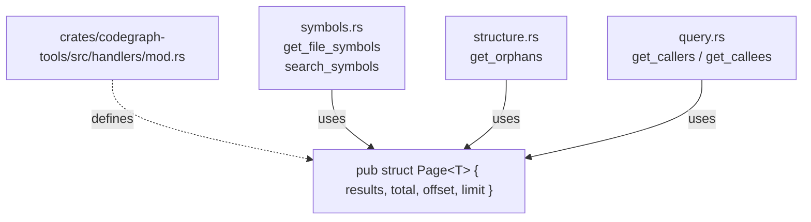

# Pagination & Output-Size Caps for UE-Scale Codebases

## Overview

The Rust rewrite shipped with `search_symbols` as the only MCP tool that paginates. First-use against a generic UE project exposed the gap: `get_orphans` exceeds MCP token limits because it returns *every* orphan as a flat array, and several other tools have no defensive cap on result size at all. UE codebases routinely reach 10k files and 500k symbols — sizes the current handlers were not stress-tested against.

This design retrofits a uniform pagination contract across the tool surface. The goal is a single, predictable envelope shape (mirrored from `search_symbols`) for every tool that returns a list of symbols or edges, plus `max_nodes`-style caps for tree-shaped tools that cannot be page-sliced. The contract stays additive where possible (new optional args with defaults) and breaking only where the existing flat-array response *must* change to carry pagination metadata.

The user's primary target codebase is Unreal Engine games — every design choice favors agents querying massive, deeply structured C++ trees over micro-optimizations for small repos.

## Goals

1. **Make `get_orphans` usable on UE-scale repos.** P0 fix — the reported failure.
2. **One pagination envelope, used everywhere.** The `search_symbols` `{results, total, offset, limit}` shape becomes the canonical contract. New paginated tools reuse it byte-for-byte.
3. **Tree-shaped results get `max_nodes` caps.** `get_class_hierarchy` follows the existing `generate_diagram` precedent (default cap, `truncated` flag in response).
4. **Defensive caps on BFS-shaped results.** `get_callers` / `get_callees` get `limit`/`offset` over the flat result list.
5. **Zero behavioral surprise for small repos.** Defaults are conservative; agents querying a 1k-symbol repo see the same content they always did, just inside a wrapper.

## Non-Goals

- **Cursor-based pagination.** The graph is static between re-indexes; offset/limit is sufficient and matches the existing convention. No client demand for cursors.
- **Optimizing `Graph::search` materialization.** The full-scan-sort-slice cost on 500k symbols is a real concern (flagged in the LLMOptimization debrief) but a separate performance project. Pagination protects the *response*, not the underlying scan.
- **Streaming MCP responses.** rmcp supports it; the RustRewrite design explicitly stayed single-shot. Unchanged.
- **`detect_cycles` pagination.** UE's include graph discipline keeps real cycles rare in practice; defer until evidence shows it's needed.
- **Re-indexing or graph-storage changes.** Pagination is a response-shaping concern, not a graph-storage concern.

---

## Architecture

### Tool inventory and treatment

| Tool | Return shape | Treatment | Default limit / cap |
|------|--------------|-----------|---------------------|
| `analyze_codebase` | Status string | unchanged (inherently bounded) | — |
| `get_file_symbols` | flat `Vec<SymbolResult>` | **add `limit`/`offset`/envelope** | limit=100 |
| `search_symbols` | already `{results,total,offset,limit}` | unchanged | limit=20 (existing) |
| `get_symbol_detail` | one `SymbolResult` | unchanged (single) | — |
| `get_symbol_summary` | counts map | unchanged (bounded by namespace × kind; see size estimate below) | — |
| `get_callers` | flat `Vec<CallChain>` | **add `limit`/`offset`/envelope** | limit=100 |
| `get_callees` | flat `Vec<CallChain>` | **add `limit`/`offset`/envelope** | limit=100 |
| `get_dependencies` | `Vec<String>` | unchanged (single-file scope) | — |
| `detect_cycles` | `Vec<Vec<String>>` | unchanged (deferred) | — |
| `get_orphans` | flat `Vec<SymbolResult>` | **add `limit`/`offset`/envelope + `brief` param** | limit=20 |
| `get_class_hierarchy` | `HierarchyNode` tree | **add `max_nodes` + `truncated` flag** | max_nodes=250 |
| `get_coupling` | `HashMap<file,count>` | unchanged (single-file scope) | — |
| `generate_diagram` | edges or Mermaid | unchanged (already capped at 30) | — |
| `watch_start`/`watch_stop` | status | unchanged | — |

Five tools change. Eight stay as-is. One (`detect_cycles`) is explicitly deferred.

### The shared `Page<T>` envelope

Today `SearchResponse` is private to `crates/codegraph-tools/src/handlers/symbols.rs`. We promote it to a generic, public envelope in the handlers module:



Same field names, same semantics, same JSON shape as the current `SearchResponse`. `total` = pre-pagination match count; `offset`/`limit` = the resolved values used (echoed). All three integer fields are `u32`, matching the existing `SearchResponse` types — preserves the wire format byte-for-byte. No `next_offset`, no `has_more`, no `truncated` on the envelope — clients compute `total > offset + len(results)` themselves, exactly as they do today for `search_symbols`.

**Materialization layer is not uniform across paginated tools.** `search_symbols` pushes pagination into the Graph layer via `SearchParams` — `Graph::search` does the sort and slice and returns a `SearchResult { matches, total }`. The new paginated tools (`get_orphans`, `get_file_symbols`, `get_callers`, `get_callees`) take a different path: the Graph layer returns the full unsorted result, and the handler does the sort + slice. This is intentional. Push-down would require touching four Graph-layer entry points; pagination is a wire-format concern, and matching the wire format is what matters for the user-visible contract. Pushing pagination into the Graph layer is a separate performance project that can ship independently. The two patterns coexist with no behavioral difference visible to callers.

`get_symbol_summary` worst case (justifies "unchanged"): UE codebases have on the order of hundreds of distinct namespaces (one per module). With ~10 `SymbolKind` variants the response is `O(namespaces × kinds)` entries, each roughly `{namespace_string, kind_string, count}` ≈ 60 bytes JSON. Worst case 500 namespaces × 10 kinds × 60 bytes ≈ 300 KB — large but stays under the practical MCP token ceiling, and the response is a count summary that agents typically request once per session. No pagination treatment.

### Pagination flow (list-shaped tools)

```mermaid
sequenceDiagram
    participant Agent
    participant Server as MCP Server
    participant Handler
    participant Graph

    Agent->>Server: tool call {limit, offset, ...filters}
    Server->>Handler: parsed args
    Handler->>Handler: normalize limit/offset (0 → default; clamp limit to MAX)
    Handler->>Graph: full query (orphans / file_symbols / callers)
    Graph-->>Handler: Vec&lt;T&gt; (full match set)
    Handler->>Handler: total = vec.len()
    Handler->>Handler: stable sort (symbol_id ascending)
    Handler->>Handler: slice [offset .. offset+limit]
    Handler-->>Server: Page { results, total, offset, limit }
    Server-->>Agent: JSON envelope
```

**Why sort before slicing:** offset/limit pagination requires deterministic ordering across calls or the second page will overlap or skip the first. `search_symbols` already sorts by symbol ID; new paginated tools follow the same rule.

**Sort keys (specified, not implicit):**
- `get_orphans`, `get_file_symbols`: by `symbol_id` ascending (matches `search_symbols`).
- `get_callers`, `get_callees`: by `(depth, symbol_id)` ascending — depth first so page 1 holds the closest callers/callees, then `symbol_id` as a stable tiebreaker. The Graph-layer BFS (`Graph::callers` / `Graph::callees`) returns a `Vec<CallChain>` in BFS-visit order, which is non-deterministic across runs because it iterates `HashMap` adjacency buckets. Without an explicit sort, page 1 + page 2 would not partition the result set deterministically.

**Why materialize-then-slice rather than push-down limit:** the `total` field requires the full match count. Push-down (early-exit at `offset+limit`) would force `total` to become an estimate or be dropped — both worse outcomes for agent UX. The materialization concern flagged in the LLMOptimization debrief is real but is a Graph-layer optimization, not a pagination contract change.

### Tree-shaped flow (`get_class_hierarchy`)

```mermaid
sequenceDiagram
    participant Agent
    participant Handler
    participant Graph

    Agent->>Handler: get_class_hierarchy {class, depth, max_nodes}
    Handler->>Handler: max_nodes default = 250
    Handler->>Graph: class_hierarchy(class, depth, max_nodes)
    Graph->>Graph: DFS up + DFS down<br/>track unique-node visited set<br/>stop expanding when |visited| &gt;= max_nodes
    Graph-->>Handler: (root_node, total_nodes_seen, was_truncated)
    Handler-->>Agent: { hierarchy, truncated, max_nodes, total_nodes_seen }
```

The hierarchy walk in `crates/codegraph-graph/src/algorithms.rs::build_hierarchy` already has per-DFS-path cycle protection (the `on_path` set) — diamond inheritance produces multiple visits of the same shared ancestor, one per path. The new `max_nodes` budget is a **separate, global, unique-name set** layered on top: it counts each ancestor once even if reached via N paths, so a diamond hierarchy doesn't burn N budget slots for one shared node. When the unique-name set reaches `max_nodes`, recursion stops adding new children but already-recursed children remain in the tree — the partial tree is well-formed. The handler wraps the result in `{ hierarchy, truncated, max_nodes, total_nodes_seen }`.

`total_nodes_seen` reports the unique-name count actually walked (which may equal `max_nodes` when truncation occurred, or be smaller if the hierarchy fits). It exists so an agent that sees `truncated: true` can decide whether to retry with a higher `max_nodes`, narrow `depth`, or pick a more specific class — without that hint, the agent has no signal of the gap between `max_nodes` and reality.

This mirrors `generate_diagram`'s `max_nodes` precedent on the budget-and-flag side, while specifying the unique-vs-visit semantics that diamond hierarchies make load-bearing.

### Wire-format examples

**`get_orphans` (after):**
```json
{
  "results": [
    { "id": "src/foo.cpp:Bar::baz", "name": "baz", "kind": "method", ... },
    ...
  ],
  "total": 8421,
  "offset": 0,
  "limit": 20
}
```

**`get_class_hierarchy` (after):**
```json
{
  "hierarchy": {
    "name": "UObject",
    "bases": [...],
    "derived": [
      { "name": "AActor", "bases": [...], "derived": [...] },
      ...
    ]
  },
  "truncated": true,
  "max_nodes": 250,
  "total_nodes_seen": 250
}
```

**`get_callers` (after):**
```json
{
  "results": [
    { "symbol_id": "...", "file": "...", "line": 42, "depth": 1 },
    ...
  ],
  "total": 312,
  "offset": 0,
  "limit": 100
}
```

### Default selection rationale

| Tool | Default limit | Why |
|------|---------------|-----|
| `get_orphans` | 20 | Mirrors `search_symbols`. Orphan lists are explored interactively; first 20 + `total` counter is enough to plan the next page. |
| `get_file_symbols` | 100 | File-scoped — most files fit comfortably under 100 symbols. UE generated files exceed but they're the exception, not the rule. A higher default avoids paginating the common case. |
| `get_callers` / `get_callees` | 100 | Depth=1 fan-in/out is usually <100 even on hot UE symbols. Higher than `search_symbols` because the per-row payload is smaller (`CallChain` is ~80 bytes vs. `SymbolResult` ~200 bytes brief). |
| `get_class_hierarchy` | max_nodes=250 | UE's `UObject` hierarchy is ~1000+ classes deep; a default of 100 would truncate on essentially every top-level UE query. 250 covers most realistic depth=1 / depth=2 walks while staying well under the MCP token ceiling (250 nodes × ~80 bytes JSON ≈ 20 KB). Agents that need more know via `truncated` + `total_nodes_seen`. |

All defaults clamp at a hard ceiling: `limit ≤ 1000`, `max_nodes ≤ 1000`. Agents requesting more get clamped silently to the ceiling (the echoed `limit` in the response shows what was actually used).

**`GetCallersArgs` and `GetCalleesArgs` stay as separate structs** even after they gain identical `limit` / `offset` fields. They diverge in `JsonSchema` description text (which surfaces in the MCP tool catalog as the documented arg description for that *specific* tool — "callers of" vs. "callees of"), and unifying them would lose that per-tool wording. The duplication is shallow — four fields each — and the cost of accidental drift is low.

### Args struct changes

All changes are additive on the args structs in `crates/codegraph-tools/src/server.rs`. `#[serde(default)]` ensures existing callers that omit the new fields get the defaults — no client breakage on the *request* side.

```rust
// New fields on existing structs:
pub struct GetOrphansArgs {
    pub kind: Option<String>,
    pub limit: Option<u32>,    // NEW
    pub offset: Option<u32>,   // NEW
    pub brief: Option<bool>,   // NEW (was hardcoded true)
}

pub struct GetFileSymbolsArgs {
    pub file: String,
    pub top_level_only: Option<bool>,
    pub brief: Option<bool>,
    pub limit: Option<u32>,    // NEW
    pub offset: Option<u32>,   // NEW
}

pub struct GetCallersArgs {
    pub symbol: String,
    pub depth: Option<u32>,
    pub limit: Option<u32>,    // NEW
    pub offset: Option<u32>,   // NEW
}
// (same for GetCalleesArgs)

pub struct GetClassHierarchyArgs {
    pub class: String,
    pub depth: Option<u32>,
    pub max_nodes: Option<u32>, // NEW
}
```

### Response shape changes (breaking on the response side)

Response-side changes ARE breaking for any client that parses the current flat-array response of `get_orphans`, `get_file_symbols`, `get_callers`, `get_callees`. This is unavoidable: pagination metadata cannot be added without an envelope.

- `get_class_hierarchy` becomes `{ hierarchy, truncated, max_nodes }` instead of returning the bare root node — also a breaking change.

Mitigation: the design ships in a single PR with a clearly named "wire-format change" tag in the commit. The MCP tool descriptions (`description` field on each `#[tool]` macro) are updated in the same commit so agents reading the tool catalog see the new shape. The RustRewrite already broke compatibility with the Go binary's cache, so MCP clients are on Rust-era schemas — no in-the-wild dual-format problem to manage.

---

## Design Decisions

### Decision 1: Reuse `search_symbols`'s envelope shape verbatim, promoted to a public `Page<T>`

**Context:** `search_symbols` already paginates with the shape `{results, total, offset, limit}`. The struct (`SearchResponse`) is private to `symbols.rs`. New paginated tools could (a) define their own parallel struct, (b) share `SearchResponse` by making it `pub`, or (c) promote it to a generic `Page<T>` in the handlers module.

**Options Considered:**
1. **Each tool defines its own envelope struct.** Clean isolation, but four near-identical structs and four near-identical `Serialize` impls. High boilerplate, easy for the field names to drift.
2. **Make `SearchResponse` `pub` and reuse it.** Zero new structs. But the type name "SearchResponse" lies about what it carries when used by `get_orphans`. The field names are correct; the type name is not.
3. **Promote to a generic `Page<T>` in `handlers/mod.rs`.** One struct, parameterized by row type. Each tool gets a `Page<SymbolResult>` or `Page<CallChain>` with no per-tool boilerplate.

**Decision:** Option 3 — `pub struct Page<T> { results: Vec<T>, total: u32, offset: u32, limit: u32 }` in `handlers/mod.rs`. `search_symbols` switches from `SearchResponse` to `Page<SymbolResult>` in the same change.

**Rationale:** Generic `Page<T>` is the same code as `SearchResponse` plus `<T>` — no real complexity. The shared name signals to future contributors that pagination is a contract, not a per-tool ad-hoc choice. Serialization output is identical: `serde` flattens the generic away and produces the exact JSON the existing `search_symbols` snapshots assert. Snapshot churn is limited to the new tools, not the existing one.

### Decision 2: Materialize-then-slice (keep `total` accurate) rather than push-down limit

**Context:** Computing `total` requires knowing the full match count, which means materializing all matches before slicing the page. The LLMOptimization debrief flagged this as a future scaling concern at 100k+ symbols. UE at 500k symbols pushes the concern into the present.

**Options Considered:**
1. **Push-down limit (early-exit at offset+limit).** Cheap; bounded work per query. But `total` becomes unknown or estimated, and clients can't tell whether more pages exist.
2. **Materialize all matches; slice the page; report exact `total`.** O(N log N) for sort + O(N) memory for the match `Vec`. Matches existing `search_symbols` semantics.
3. **Hybrid: report `total` only when result fits in a single page; otherwise drop it.** Mixed semantics, hard for agents to handle.

**Decision:** Option 2. Pagination keeps exact `total`; performance optimization is tracked separately.

**Rationale:** Agent UX is the priority. An agent that sees `total: 8421, offset: 0, limit: 20` knows it's looking at a slice of a much larger set and can plan accordingly. An agent that sees `total: undefined` or just a `truncated: true` flag has to make blind decisions or do binary-search probing. The cost is O(N log N) latency on UE-scale broad queries — bad but tolerable. The fix (early-exit + index structures) belongs in a `Graph::search` performance design that can ship after this one.

### Decision 3: `max_nodes` for trees, not `limit`/`offset`

**Context:** `get_class_hierarchy` returns a tree (`HierarchyNode { name, bases, derived }`). Naively offset/limiting children at each level produces a malformed tree (some bases visible, others hidden — no way for the client to reconstruct). `generate_diagram` already solved this by capping the *total node count* and silently dropping unvisited edges.

**Options Considered:**
1. **Apply `limit`/`offset` to children at each tree level.** Awkward — the offset would have to apply per-node, response shape gets weird, and depth interactions are confusing.
2. **Add a per-tool `max_nodes` budget; truncate when exceeded; flag `truncated` in response.** Matches `generate_diagram`'s established pattern.
3. **Flatten the tree to a list of `(parent, child)` edges and paginate the edge list.** Loses the tree structure that clients want.

**Decision:** Option 2. Per-tool `max_nodes` budget, default 250, hard ceiling 1000, response includes `truncated: bool` and `total_nodes_seen: u32`. (See the Default Selection Rationale table for why 250 over 100 — UE's `UObject` hierarchy makes a smaller default uselessly truncating.)

**Rationale:** Consistency with `generate_diagram` is worth more than a marginal UX improvement from per-level pagination. Clients that need a fuller hierarchy can request a smaller `depth` first to scope, then drill into specific subtrees. The `truncated` flag tells the agent to expect partial data; the `max_nodes` echo lets it understand what budget was used.

### Decision 4: `get_callers`/`get_callees` use `limit`/`offset` (not `max_nodes`)

**Context:** The BFS result is a flat list of `CallChain` rows even though the search is graph-shaped — depth is already a separate parameter. So the result IS pageable as a list.

**Options Considered:**
1. **`max_nodes` cap on the BFS like `generate_diagram`.** Would silently truncate and drop callers, similar to the diagram tool.
2. **`limit`/`offset` on the result list.** Natural for flat output; matches `search_symbols`.

**Decision:** Option 2. The BFS runs to completion (depth is the existing budget); the result list paginates.

**Rationale:** Depth already constrains the BFS scope. Adding a second cap (`max_nodes`) inside the BFS would be redundant and introduce non-determinism (which callers get dropped depends on BFS visit order). `limit`/`offset` on the sorted result list is deterministic, matches the rest of the design, and lets agents page through a wide fan-in (e.g. `UObject::Serialize` has hundreds of callers — page 1 gives the agent a starting set, page 2+ continues if needed).

### Decision 5: Defer `detect_cycles` pagination

**Context:** UE codebases are typically well-disciplined on include cycles. The research note found no evidence of cycle volume being a real problem.

**Options Considered:**
1. **Add `limit`/`offset` to `detect_cycles` for symmetry.**
2. **Defer until evidence shows it's needed.**

**Decision:** Option 2. Track as a follow-on if real-world usage surfaces a problem.

**Rationale:** Adding pagination to a tool that's rarely overrun adds args-struct surface and snapshot churn for no observed benefit. Cheaper to add later if needed. The design's principle is *targeted* pagination — only where evidence supports it.

### Decision 6: Add `brief` to `get_orphans`

**Context:** `get_orphans` hardcodes `brief=true` in the handler. Every other symbol-list tool exposes `brief` as a parameter.

**Decision:** Add `brief: Option<bool>` (default true). Existing callers see no behavior change; advanced callers can request full detail.

**Rationale:** Consistency. The cost is one extra arg field and one extra snapshot variant. Worth doing alongside the pagination change since both are wire-format changes to the same tool.

### Decision 7: Hard-clamp `limit` and `max_nodes` at 1000

**Context:** Without a ceiling, an agent could request `limit=999999` and get back a multi-megabyte page that breaks the MCP transport.

**Options Considered:**
1. **No clamp — trust the agent.**
2. **Clamp silently with the echoed `limit` showing the actual value used.**
3. **Reject requests that exceed the ceiling with an error.**

**Decision:** Option 2. Clamp silently; echoed `limit` reveals the actual cap to the agent.

**Rationale:** Errors for large `limit` would force agents to retry with a smaller value. Silent clamping just gives them a smaller page; the echoed `limit` field (already part of the contract) reveals the actual size used. The agent can adapt without a round-trip.

---

## Error Handling

- **Invalid `limit` / `offset` / `max_nodes`:** zero or unset → default. Negative values cannot be encoded (fields are `u32` / `Option<u32>`). Values exceeding the ceiling clamp silently to the ceiling and the response echoes the clamped value.
- **`offset >= total`:** returns `{ results: [], total: <full count>, offset: <echoed>, limit: <echoed> }`. Mirrors current `search_symbols` behavior — confirmed by the existing snapshot/test for out-of-range offsets.
- **`max_nodes = 0`:** treated as "use default", same as `limit = 0`.
- **`get_class_hierarchy` truncation:** the partial tree is returned with `truncated: true`. No error; the client decides whether to retry with smaller `depth` or larger `max_nodes`.
- **Request before `analyze_codebase`:** unchanged — handlers continue to call `ServerInner::require_indexed()` and return the existing "not indexed" `CallToolResult` error.
- **Unknown `kind` / `direction` / `format`:** unchanged from current behavior.

### `get_file_symbols` — empty-set semantics with pagination

The current handler errors with `"no symbols found in file: <file>"` when the **raw** (pre-`top_level_only`, pre-pagination) file-symbols result is empty. Pagination preserves this exactly:

- **Raw set empty (file unknown to graph or has zero indexed symbols):** error, same wording as today. Pagination args are not consulted.
- **Raw set non-empty, but `top_level_only=true` filters everything out:** envelope with `results: []`, `total: 0`. `total` reflects the post-filter, pre-pagination count. No error.
- **Raw set non-empty, filter passes, `offset >= total`:** envelope with `results: []`, `total: <full filtered count>`. No error.

The error path stays tied to "the file has no symbols at all," preserving the diagnostic value of the current message. The empty-list-with-`total` path is reserved for "filter or pagination produced an empty page from a non-empty raw set" — which is information the agent needs to keep paging or relax the filter.

No new error paths. Pagination is additive on top of the existing error contract.

---

## Testing Strategy

### Unit tests (per handler)

For each newly-paginated tool (`get_orphans`, `get_file_symbols`, `get_callers`, `get_callees`):

- **Defaults:** request with no `limit`/`offset` returns the documented default page size and `offset=0`.
- **Page 1 + page 2 cover the set without overlap:** with a fixture that has, say, 30 symbols, `limit=20 offset=0` + `limit=20 offset=20` returns all 30 with no duplicates and identical sort order.
- **`total` is pre-pagination count:** asserted against a fixture with known size.
- **Offset beyond total:** returns empty `results` with correct `total`.
- **Limit clamping at ceiling:** `limit=999999` returns at most 1000 rows and the response echoes `limit: 1000`.
- **Empty result set:** returns `{ results: [], total: 0, offset: 0, limit: <default> }`.

For `get_class_hierarchy`:

- **`max_nodes` cap reached:** fixture with a hierarchy exceeding the chosen `max_nodes` value; assert `truncated: true`, the partial tree has ≤ `max_nodes` unique nodes, and `total_nodes_seen == max_nodes`. Practical fixtures use a small explicit `max_nodes` (e.g. 5) on an existing fixture rather than building a 251+ node tree.
- **`max_nodes` not reached:** fixture under the cap; assert `truncated: false`.
- **`max_nodes` clamp at ceiling.**
- **Cycle protection still applies:** existing per-DFS-path tests must still pass.

For `get_orphans` `brief` flag:

- **`brief=true` (default):** signature/column/end_line absent (existing behavior preserved).
- **`brief=false`:** full detail emitted.

### Snapshot tests (`insta`)

The wire format must be locked. Two categories of snapshot churn:

**Existing snapshots that WILL break** (response shape change forces regeneration; must be reviewed and re-approved):
- `snapshot_responses__response_get_orphans_default_callables.snap` — flat array → envelope.
- `snapshot_responses__response_get_file_symbols_engine_cpp.snap`
- `snapshot_responses__response_get_file_symbols_go_reader.snap`
- `snapshot_responses__response_get_file_symbols_python_models.snap` — all three: flat array → envelope.
- `snapshot_responses__response_get_callers_engine_update.snap`
- `snapshot_responses__response_get_callees_engine_update.snap` — both: flat array → envelope, plus the new `(depth, symbol_id)` sort may reorder rows compared to the current BFS-visit order.
- `snapshot_responses__response_get_class_hierarchy_engine.snap`
- `snapshot_responses__response_get_class_hierarchy_rust_trait_greet.snap`
- `snapshot_responses__response_get_class_hierarchy_go_interface_reader.snap`
- `snapshot_responses__response_get_class_hierarchy_python_dog.snap` — all four: bare root node → `{ hierarchy, truncated, max_nodes, total_nodes_seen }`.
- All `snapshot_tools_list/*.snap` for the five changed tools — `inputSchema` grows new fields.

**New snapshots to add** (cover behavior the existing fixtures don't exercise):
- `snapshot_responses__response_get_orphans_paginated_offset.snap` (page 2)
- `snapshot_responses__response_get_orphans_offset_beyond_total.snap`
- `snapshot_responses__response_get_orphans_brief_false.snap`
- `snapshot_responses__response_get_file_symbols_paginated_offset.snap`
- `snapshot_responses__response_get_callers_paginated_offset.snap`
- `snapshot_responses__response_get_callees_paginated_offset.snap`
- `snapshot_responses__response_get_class_hierarchy_truncated.snap` — fixture engineered to exceed `max_nodes`.

Every snapshot in both lists must be reviewed via `cargo insta review` in the same PR.

### Cross-language regression

Run the existing 4-way collision regression in `crates/codegraph-tools/tests/mixed_language.rs` to confirm pagination doesn't perturb language-scoped queries.

### UE-scale stress (manual, not CI)

Run a one-off bench against a public UE-style fixture (e.g. UnrealEngine sample game) checked out locally:

- `analyze_codebase` → confirm index builds.
- `get_orphans { kind: "function" }` → confirm response is a single page (`limit=20`) and the JSON byte size is well under the MCP token ceiling. Confirm `total` reports the full count.
- `get_class_hierarchy { class: "UObject", depth: 2, max_nodes: 250 }` → confirm `truncated: true` (UObject hierarchy exceeds 250) and partial tree is well-formed.
- `get_callers { symbol: "UObject::Serialize", depth: 1 }` → confirm pagination is required (high `total`, page 1 returns 100 rows).

This is a manual smoke check, not a CI test (no UE source in the repo).

### Structural Verification

Per `shared/languages/rust.md`:

- **`cargo clippy --workspace --all-targets -- -D warnings`** — must pass on every commit. New args structs and the `Page<T>` envelope must be clippy-clean.
- **`cargo fmt --all --check`** — must pass.
- **`cargo test --workspace`** — full suite, including new pagination tests and updated snapshots.
- **`cargo insta review`** — interactive snapshot approval after running `cargo test`. Every snapshot under `snapshot_tools_list/` for changed tools, plus the new response snapshots above, must be reviewed and accepted.

No `unsafe` code introduced; `miri` is not required for this design.

---

## Migration / Rollout

### Single-PR delivery

Wire-format changes ship in one commit (one PR) for atomicity. Splitting across multiple PRs would leave the tool surface in inconsistent states between merges. The PR is small enough (~5 handlers + envelope + tests + snapshots) that single-PR delivery is the right scope.

### Order of operations within the PR

1. **Add `Page<T>` envelope** in `crates/codegraph-tools/src/handlers/mod.rs`. Keep `SearchResponse` as a temporary `pub use Page<SymbolResult>` alias if it eases the diff; otherwise rename usages directly.
2. **Switch `search_symbols` from `SearchResponse` to `Page<SymbolResult>`.** Existing snapshots must still match (the JSON shape is unchanged); confirm with `cargo test`.
3. **Add `Page<T>` to `get_orphans`** + new args (`limit`, `offset`, `brief`). Update handler. Update snapshot.
4. **Add `Page<T>` to `get_file_symbols`** + new args (`limit`, `offset`).
5. **Add `Page<T>` to `get_callers` / `get_callees`** + new args (`limit`, `offset`).
6. **Add `max_nodes` to `get_class_hierarchy`** + `{hierarchy, truncated, max_nodes}` response shape.
7. **Update tool descriptions** (the `#[tool]` macro `description` strings) to document the new args.
8. **Run `cargo insta review`** to approve regenerated snapshots — both the 10 existing response snapshots that change shape and the new ones added by this design (full list in Testing Strategy).
9. **Update `crates/code-graph-mcp/README.md`** (and `CLAUDE.md` if it documents tool args) to reflect new args.

### Backward compatibility

- **Request side: fully backward compatible.** All new args are optional with `#[serde(default)]`. Existing agent prompts that omit them continue to work and get the new defaults.
- **Response side: breaking for affected tools.** `get_orphans`, `get_file_symbols`, `get_callers`, `get_callees` change from flat array → envelope. `get_class_hierarchy` changes from bare root node → wrapped object. Documented in the PR description as a wire-format change.

### Rollout signal to clients

The MCP tool descriptions visible to agents are updated in the same commit. Agents that introspect the tool catalog will see the new shape immediately. There is no client-version handshake; the protocol is "whatever the server returns." The Rust binary is the only supported implementation, so there is no co-existing Go-era server to coordinate with.

### Follow-on work (not in this design)

- **`Graph::search` performance** — early-exit / index structures to avoid the full O(N log N) sort on UE-scale broad queries. Tracked as a separate performance design.
- **`detect_cycles` pagination** — defer until evidence.
- **The C++ API-export macro fix** — separate design (the second issue from the same dogfooding session, scoped on its own).
