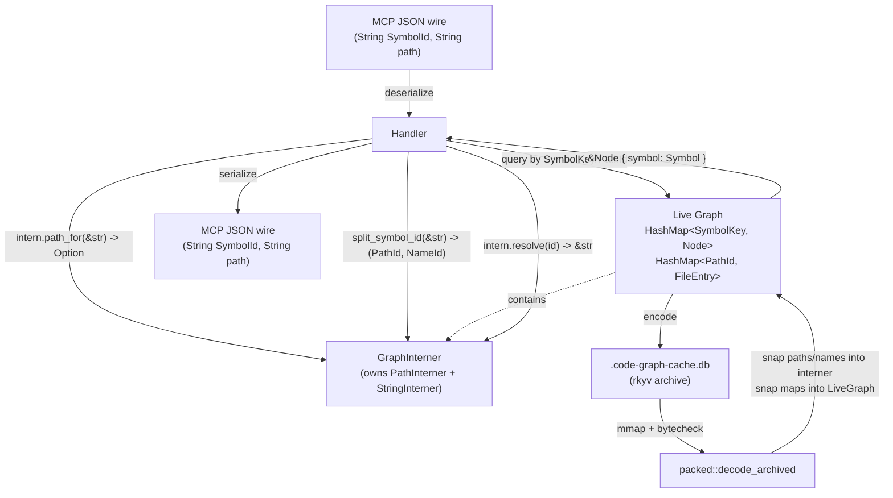

> **NOT IMPLEMENTED — superseded by Phase E.**
>
> This design (Phase D of the PackedCache plan) was reviewed and then explicitly NOT shipped. After authoring, the decision was that pushing interned `PathId`/`NameId`/`SymbolKey` through every tool handler did not exercise enough of `code-graph-path-trie`'s distinctive APIs (subtree iteration, longest-prefix lookup) to be worth the breadth of refactor described below.
>
> Instead, **Phase E** landed: `Graph.files` and `Graph.includes` swapped from `HashMap<PathBuf, V>` to `PathTrie<V>`, which delivered the subtree-iteration wins without the cross-handler churn. Downstream Phase E.3 features (Rust RCMM, Go GMM, watch directory-remove, `subtree=` MCP args) exercise `PathTrie::longest_prefix` / `iter_subtree` / `remove_subtree` against the new shape. See `crates/code-graph-path-trie/src/lib.rs` rustdoc "Production wiring status" matrix for the full ledger of wired-vs-dormant `PathTrie` features today.
>
> The text below is preserved as historical record of an evaluated design path. The performance characterization in §Overview (millions of small allocations on warm `Graph::load`) remains accurate as a description of the v7 cache's behavior — a future revision of this design (or a successor) would still be the right place to attack that, should warm-load latency become a real production concern.

# PathInternThrough — interned ids through the live Graph

## Overview

Phase D of the PackedCache plan. The PackedCache design's Decision 10 deferred this work as "a separate, larger design" because it touches every tool handler that returns SymbolIds, file paths, or includes. This is that design.

**Today** (post-Phase C): the on-disk v7 cache stores everything as `u32` interner ids, but `Graph::load` projects back to owned `String` SymbolIds and `PathBuf` keys before populating the live `Graph`. That projection allocates ~one `String` per node + ~two `String`s per edge + a `PathBuf` per file + per-include entry. On a 770k-symbol LLVM-scale cache that's millions of small allocations on every warm load — the load-time bottleneck `decode_archived` now spends the bulk of its budget on, and a 3-5× steady-state in-memory footprint penalty vs storing interned ids directly.

**After Phase D**: the live `Graph` itself owns the interners. `Graph.nodes` is keyed by `SymbolKey(u64)` (packed `(PathId, NameId)`); `Symbol.file` is a `PathId(u32)`; `EdgeEntry.target` is a `SymbolKey`; `Graph.files` is `HashMap<PathId, FileEntry>`; etc. Tool handlers project back to `String` only at the MCP JSON wire boundary. The cache load collapses to "snap the archived interner tables into the live interners, snap the archived maps into the live maps" — essentially memcpy-speed.

This is a substantial refactor. The PackedCache design's "1500+ lines of churn" estimate undercounted: handlers + queries + algorithms + diagrams + tests sum to ~18,000 LoC of code that *touches* `SymbolId` or `PathBuf`, of which probably 3000-5000 lines need meaningful changes.

## Goals

1. **Wire compatibility — no change to MCP JSON output**. Every existing tool response keeps its `String` SymbolId and `String` file path fields. Agents see no change. Projection happens at serialize time.
2. **Warm-load wall-clock**: hit the PackedCache design's "<100 ms on multi-million-symbol caches" target that Phase C alone couldn't reach. Decode becomes `O(interner_table_size + memcpy(maps))` instead of `O(N × String::from)`.
3. **In-memory footprint reduction**: 3-5× shrink on the live `Graph` on UE/LLVM-scale codebases. Every `String` SymbolId (~80-150 bytes including heap allocation) becomes a `u64` (8 bytes); every `PathBuf` becomes a `u32` (4 bytes).
4. **Query latency**: secondary win. `u64` key hashing + lookup is faster than `String` (no heap deref). `search_symbols` regex matching gets faster on interned strings (avoid re-allocating the search corpus per query — see [Decision 4](#decision-4-searchsymbols-regex-strategy)).
5. **Cache schema bump 7 → 8**, *load semantics* genuinely change. The v7 schema interns the FULL `SymbolId` string (e.g. `"path/foo.rs:Bar::baz"`) as a `names`-table entry and uses its `NameId` as the outer `nodes` map key. Phase D's live `SymbolKey` is `(PathId, local-name NameId)` — a different id space. To make load truly memcpy-shaped (not "split each archived key at load time") the archive's outer node-map keys become packed `SymbolKey`s directly and the `names` table drops the redundant full-string entries. Version bump triggers silent re-index per the existing contract; see [Decision 8](#decision-8-cache-schema-bump-v7--v8).

## Non-Goals

- **MCP wire schema changes.** Out of scope by design — every existing agent must keep working.
- **Removing `Symbol.file` as a `String` on the wire.** The wire-Symbol shape stays exactly as documented (`file: String`, `name: String`, etc.); the *internal* `Symbol` shape changes.
- **A new MCP tool surface for interned ids.** Tools could in principle expose `SymbolKey(u64)` directly to clients for faster round-trips, but that's a v8 wire-format conversation, not Phase D.
- **Sharing the interner across multiple `Graph` instances.** Each `Graph` owns its own; cross-graph id comparisons are undefined (rejected at API boundaries by the borrow checker since you'd need two `&Graph` to compare).
- **Lifetime-encoded id safety** (newtype generation tags like `slotmap`). Would catch use-after-Graph-clear bugs at compile time but adds significant API noise. Defer until a real such bug appears.

---

## Architecture

### Components



### The shape change

**Before (today):**

```rust
pub type SymbolId = String;  // "path/foo.rs:Bar::baz"

pub struct Graph {
    pub(crate) nodes:    HashMap<SymbolId, Node>,
    pub(crate) adj:      HashMap<SymbolId, Vec<EdgeEntry>>,
    pub(crate) radj:     HashMap<SymbolId, Vec<EdgeEntry>>,
    pub(crate) files:    HashMap<PathBuf, FileEntry>,
    pub(crate) includes: HashMap<PathBuf, Vec<IncludeEntry>>,
}
pub struct Node { pub symbol: Symbol }
pub struct Symbol {
    pub name: String, pub kind: SymbolKind, pub file: String,
    pub line: u32, pub column: u32, pub end_line: u32,
    pub signature: String, pub namespace: String, pub parent: String,
    pub language: Language,
}
pub struct EdgeEntry { pub target: SymbolId, pub kind: EdgeKind, pub file: PathBuf, pub line: u32 }
pub struct FileEntry { pub language: Language, pub symbol_ids: Vec<SymbolId> }
pub struct IncludeEntry { pub path: PathBuf, pub line: u32 }
```

**After (Phase D):**

```rust
/// Packed `(PathId, NameId)`. Bit layout:
///   bits 63..32 = PathId (0 = "no path", e.g. unresolved bare-token target)
///   bits 31..0  = NameId (interned local-name string; `Name` or `Parent::Name`)
#[derive(Copy, Clone, Eq, PartialEq, Hash)]
pub struct SymbolKey(pub u64);

pub struct Graph {
    pub(crate) interner: GraphInterner,
    pub(crate) nodes:    HashMap<SymbolKey, Node>,
    pub(crate) adj:      HashMap<SymbolKey, Vec<EdgeEntry>>,
    pub(crate) radj:     HashMap<SymbolKey, Vec<EdgeEntry>>,
    pub(crate) files:    HashMap<PathId,    FileEntry>,
    pub(crate) includes: HashMap<PathId,    Vec<IncludeEntry>>,
}
pub struct Node { pub symbol: Symbol }
pub struct Symbol {
    pub name: NameId, pub kind: SymbolKind, pub file: PathId,
    pub line: u32, pub column: u32, pub end_line: u32,
    pub signature: String,  // inline per PackedCache Decision 9
    pub namespace: NameId,  // 0 = absent
    pub parent: NameId,     // 0 = absent
    pub language: Language,
}
pub struct EdgeEntry { pub target: SymbolKey, pub kind: EdgeKind, pub file: PathId, pub line: u32 }
pub struct FileEntry { pub language: Language, pub symbol_ids: Vec<SymbolKey> }
pub struct IncludeEntry { pub path: PathId, pub line: u32 }
```

### The interner

`GraphInterner` is the live-Graph counterpart to the encoder-side `EncodingPathInterner` + `EncodingStringInterner` in `persist/packed.rs`. It owns BOTH a `PathInterner` (from `code-graph-path-trie`) and a `lasso::Rodeo`, exposes intern + resolve methods, and stays stable across all reads of the `Graph`. Mutations (insertion of new symbols/paths) require `&mut self` access to both the interners and the maps — the existing `&mut Graph` API contract covers this.

```rust
pub struct GraphInterner {
    paths: code_graph_path_trie::PathInterner,
    names: lasso::Rodeo,
}

impl GraphInterner {
    pub fn intern_path(&mut self, p: &Path) -> PathId;
    pub fn path_for(&self, p: &Path) -> Option<PathId>;
    pub fn resolve_path(&self, id: PathId) -> Option<&Path>;

    pub fn intern_name(&mut self, s: &str) -> NameId;
    pub fn name_for(&self, s: &str) -> Option<NameId>;
    pub fn resolve_name(&self, id: NameId) -> Option<&str>;

    /// Build a SymbolKey from an external user-supplied SymbolId
    /// string. Returns `None` if either the path-portion or the
    /// local-name-portion isn't known to the interner — i.e. the
    /// symbol isn't in the live graph.
    pub fn key_for_symbol_id(&self, sid: &str) -> Option<SymbolKey>;

    /// Project a SymbolKey back to the legacy String form for wire
    /// emission. Always returns Some for a key produced by this
    /// interner; None if the embedded ids don't resolve (corrupt
    /// key from another graph).
    pub fn symbol_id_for(&self, key: SymbolKey) -> Option<String>;
}
```

### Handler-boundary projection

Every tool handler today receives user-supplied paths / SymbolIds as JSON strings and emits the same. After Phase D the handler shape becomes:

```rust
// Before (today)
fn get_file_symbols(graph: &Graph, file_path: &str, ...) -> Result<Page<SymbolResult>, McpError> {
    let canonical = paths::normalize_user_path(file_path);
    let entry = graph.files.get(&canonical)?;
    let results = entry.symbol_ids.iter().map(|sid| {
        let node = graph.nodes.get(sid)?;
        SymbolResult { symbol_id: sid.clone(), ... }
    }).collect();
    ...
}

// After (Phase D)
fn get_file_symbols(graph: &Graph, file_path: &str, ...) -> Result<Page<SymbolResult>, McpError> {
    let canonical = paths::normalize_user_path(file_path);
    let path_id = graph.interner.path_for(&canonical).ok_or(NotFound)?;
    let entry = graph.files.get(&path_id)?;
    let results = entry.symbol_ids.iter().map(|&key| {
        let node = graph.nodes.get(&key)?;
        SymbolResult {
            symbol_id: graph.interner.symbol_id_for(key).unwrap(),
            ...
        }
    }).collect();
    ...
}
```

The projection cost is `resolve_path + resolve_name + format!("{}:{}", ...)` per emitted record — bounded and only paid for records that make it past pagination, not per-graph-symbol.

### Cache integration

The v8 cache schema (see [Decision 8](#decision-8-cache-schema-bump-v7--v8)) drops the redundant full-`SymbolId`-string interning and uses packed `SymbolKey` directly as outer map keys. Load becomes:

```rust
fn load(&mut self, dir: &Path) -> Result<bool, PersistError> {
    let holder = mmap_read_only(...)?;
    let archived = rkyv::access::<...>(...);

    // (1) Interners: O(paths + names) — one-pass clone of two string
    //     tables into the live interners. Each table is small relative
    //     to the symbol count (1-5% of symbol count for paths;
    //     unique-names < total-symbols by a factor of name reuse).
    self.interner.snap_from_archived(&archived.paths, &archived.names);

    // (2) Maps: each archived key is already a SymbolKey-shaped u64
    //     (path_id << 32 | local_name_id). The live HashMap entry is
    //     `(SymbolKey, Node { Symbol { name: NameId, file: PathId, ... } })`
    //     — every field a primitive. No String::from anywhere.
    self.nodes    = archived.nodes.iter().map(snap_node_v8).collect();
    self.adj      = archived.adj.iter().map(snap_edges_v8).collect();
    // ... etc
}
```

Per-entry work in `snap_node_v8` is HashMap insert + struct copy of `Node` (~36 bytes). No `String::from`, no per-symbol id-decomposition (the decomposition is in the SCHEMA now, not at load time). This is the load-time bottleneck removal that justified Phase D.

**What the v7 → v8 migration changes on disk**: the `names` table shrinks (no full-SymbolId entries), the `nodes` / `adj` / `radj` outer-key u32 values become u64 SymbolKey values, and `PackedSymbol.name` is now the bare local-name `NameId` only. Net disk-size impact: roughly neutral (smaller names table offsets the wider outer keys); the win is purely load-time semantic.

---

## Design Decisions

### Decision 1: `SymbolKey` as packed `u64` vs separate `(PathId, NameId)` fields

**Context.** Every `EdgeEntry.target` and every `Graph.nodes` key needs to identify a symbol. Two natural shapes: a struct `{ path: PathId, name: NameId }` (8 bytes, alignment-packed identically) or a packed `u64` with hand-rolled bit ops.

**Options Considered:**

1. **Struct `{ path: PathId, name: NameId }`.** Clean syntax (`key.path`, `key.name`); compiler hashes both fields automatically; matches Rust idioms.
2. **Packed `u64`.** Hand-rolled `pack(path, name) -> u64` / `unpack(u64) -> (path, name)`; one field on the wire; native `u64` hashing.

**Decision:** Packed `u64` newtype: `pub struct SymbolKey(pub u64)`.

**Rationale.** The hot path is hashing keys for `HashMap<SymbolKey, _>` lookups. Hashing a single `u64` is one instruction; hashing a struct field-by-field is two-plus instructions + alignment-dependent. On a 5M-edge graph the lookup loop adds up. The packed form also makes `SymbolKey` trivially `Copy + Hash + Eq` with no derive machinery. The `pack`/`unpack` helpers are 3-line functions tested once. Public API exposes a `key.path()` / `key.name()` view that unpacks under the hood, so call-site ergonomics match the struct form.

### Decision 2: Separate `Symbol` types — internal vs wire

**Context.** The wire `Symbol` (what gets serialized into MCP JSON) carries `String` fields. The internal Symbol after Phase D carries `NameId` / `PathId`. Both need to exist; the question is whether they share a type name with `serde` shape adapters or live as distinct types.

**Options Considered:**

1. **One `Symbol` type, conditional `Serialize` via `serde(serialize_with = "...")`.** Field-by-field, intercept the interned ids at serialize time and project to `String`. Keeps one type name.
2. **Two distinct types: `Symbol` (internal, interned) + `WireSymbol` (the existing shape, owned `String`s).** Conversion happens at handler boundaries.

**Decision:** Option 2. Internal type stays named `Symbol` (lives in `code-graph-core::interned::Symbol` or similar); wire type renames to `WireSymbol` and lives next to it. Handlers `From<Symbol> for WireSymbol` at projection time.

**Rationale.** The serialize-with adapter would need access to the interner mid-serialize, which means threading `&GraphInterner` through serde's serializer context — possible via thread-local or custom Serializer trait, both ugly. Two types is cleaner: explicit conversion, no global state, the type system enforces "interned ids never leak to the wire." The renaming pain is one-time and tractable (~50 sites in handlers).

### Decision 3: Where the interner lives — `Graph` vs separate

**Context.** The interner is read by every graph operation and written by every insertion. It needs the same locking story as `Graph` itself (which is `Arc<RwLock<Graph>>` in the MCP server).

**Options Considered:**

1. **Inline field of `Graph`.** `Graph` owns `GraphInterner` directly; reads share `&Graph`, writes go through `&mut Graph`.
2. **Sibling owned-by-`ServerInner`.** Server holds `Arc<RwLock<GraphInterner>>` next to `Arc<RwLock<Graph>>`. Handlers take both.

**Decision:** Option 1, inline.

**Rationale.** Every graph operation that needs id translation also needs graph data — they're inseparable. Holding two separate `RwLock`s would introduce ordering rules (always take interner before graph, or vice versa) and risk deadlocks. Inlining means one lock to take, one resource managed by `Graph`'s existing `Send + Sync` contract.

**Mutation contract**. The MCP server pattern (confirmed in `crates/code-graph-tools/src/handlers/analyze.rs`) does NOT clone `Graph` — `analyze_codebase` takes `inner.graph.write()` and rebuilds in place via `Graph::clear` + per-file `merge_file_graph`. After Phase D, `clear` also clears the interner; `merge_file_graph` interns paths/names as it goes. Both operations stay under the same `&mut Graph` borrow they already require. No new locking surface.

**Storage cost**. `GraphInterner` size scales as `sizeof(paths_unique) + sizeof(names_unique)`, both substantially smaller than `Graph.nodes` itself (paths typically <5% of node count, names often <50% of node count due to reuse like `init`/`new`/`main`). Exact figures pending Phase D.5 bench numbers; not load-bearing enough to commit to a percentage here.

### Decision 4: `search_symbols` regex strategy

**Context.** `search_symbols` does regex matching against a *composite* search corpus: today's code (`crates/code-graph-graph/src/queries.rs`) builds `format!("{}::{}", parent, name)` per candidate (or bare `name` for free functions) and matches the regex against that. After Phase D the components live in the interner as **separate `NameId`s** (the encoder interns `parent` and `name` separately, never the composite). Naive regex-over-interner-strings would only match bare names — `^MyClass::foo$` would miss every method.

**Options Considered:**

1. **Resolve-and-compose per candidate.** Walk every node, resolve `name` + `parent` from the interner, compose `Parent::name` on the fly, run regex. Same O(N) walk as today, plus two interner lookups per node.
2. **Build a sidecar searchable-name index at merge time** — `Vec<(SymbolKey, String)>` populated once per `merge_file_graph` call, holding the pre-composed `Parent::name` strings. Search iterates the Vec. Per-search cost: O(N regex applications) but no interner dereference per candidate.
3. **Intern composite names alongside bare names** — make the encoder additionally intern `format!("{}::{}", parent, name)` and store the composite `NameId` on each `PackedSymbol`. Search walks `Rodeo::iter()` (which yields `(Spur, &str)`, NOT `Rodeo::strings()` which drops the key), matches the regex, collects matching composite-NameIds, then filters `Graph.nodes` to symbols whose composite matches. O(unique_composites) regex applications.

**Decision:** Option 1 for v1. Defer 2 and 3 unless benches show search latency regresses.

**Rationale.** Option 1 preserves today's structural shape (walk every node, regex against composed string) — minimal behavioral risk and zero new data structures. The added cost vs today is two `Rodeo::resolve(spur)` calls per candidate (each is a single `Vec` index — essentially free). The composite-name interning ideas (2, 3) trade per-search speed for per-merge cost and additional state; the trade only pays off if search becomes the documented bottleneck, which today it isn't (search throughput is dominated by regex compile + pagination, not lookup).

**Caveat 1.** Anchored-zero `^...$` queries (`search_symbols` documented "did-you-mean" suggestion path) get their own short-circuit. Today: extract the anchor-stripped inner pattern, attempt exact lookup in `SymbolIndex`. After Phase D: same path — `interner.name_for(anchor_stripped)` gives `Option<NameId>`; if `Some`, look up directly without regex. If `None`, fall through to the substring "did you mean" suggester.

**Caveat 2.** `Rodeo::strings()` yields `&str` only (drops the key); `Rodeo::iter()` yields `(Spur, &str)` pairs. If Option 3 ever ships, the correct API is `Rodeo::iter()`.

### Decision 5: Watch handler interaction

**Context.** The watch handler (`crates/code-graph-tools/src/handlers/watch.rs`) receives debounced filesystem events and rebuilds the affected portion of the graph in place. Today it can intern arbitrary new paths into `Graph.files` without any interner coordination. After Phase D every new path / name must go through the interner first.

**Options Considered:**

1. **Always intern on every watch event**, even for paths already in the graph. `PathInterner::intern` is fast on hit (single trie walk), so the duplicate-lookup cost is bounded.
2. **Use a dedicated re-index pipeline** that runs the same encode-style intern walk as `Graph::save` would.

**Decision:** Option 1. The watch handler stays structurally similar to today; the only diff is that instead of `files.insert(path.clone(), entry)` it now does `let id = graph.interner.intern_path(&path); files.insert(id, entry)`. Same for `nodes` (interns the name as it goes).

**Rationale.** The watch handler's mental model is "small incremental update;" the encode-style re-walk is "full graph encode" and the wrong granularity. The intern-as-you-go pattern preserves the watch handler's existing structure with minimal local change.

**Caveat.** Watch events that delete a file leave dangling interner entries — the PathId / NameIds were assigned but the symbols/files referencing them are gone. PackedCache design Decision 6's tolerance for "dense interner with gaps" still applies; the interner never reuses ids for the lifetime of the Graph instance. Gaps compact on the next `analyze_codebase` re-build (fresh Graph, fresh interner) which is the existing watch-reindex contract.

### Decision 6: `SymbolId` (the `String` typedef) — keep, rename, or delete

**Context.** `code_graph_core::SymbolId` is currently `pub type SymbolId = String;`. Many handlers + tests + tool descriptions reference `SymbolId` as a type name. After Phase D the internal graph uses `SymbolKey(u64)`; the wire still uses `String`.

**Options Considered:**

1. **Keep `SymbolId = String`, name the internal one `SymbolKey`.** Wire stays semantically named `SymbolId`; the two distinct concepts get distinct types.
2. **Repurpose `SymbolId` to mean the internal `SymbolKey`.** Cleanest from a Phase D vantage but breaks every existing reference.
3. **Delete `SymbolId` entirely, force callers to write `String` or `SymbolKey` explicitly.** Most explicit; most churn.

**Decision:** Option 1. `SymbolId` stays as the `String` wire type alias; `SymbolKey` is the new internal `u64` type.

**Rationale.** The CLAUDE.md docs use `SymbolId` to refer to the wire format extensively; preserving the name preserves that mental model. The internal `SymbolKey` is a fresh name with no docs gravity; it can be Phase-D-specific without legacy. Tool description strings that currently say "Symbol ID: `path:name`" need no edits — the wire format hasn't changed.

### Decision 7: Migration sequencing

**Context.** This refactor can't ship as a series of incrementally-mergeable PRs because the `Graph` shape change is atomic — every reader/writer flips together. The question is what intermediate states the developer touches during implementation.

**Options Considered:**

1. **Big-bang in one commit.** Define new types, rewrite Graph + every handler + every test in one go. 5-10k LoC diff.
2. **Phase-gated work on a feature branch with intermediate-passing builds.** Define new types alongside old; flip one consumer at a time; delete old when last consumer flips.

**Decision:** Option 2, but the "feature branch" is THIS worktree branch. Sequencing inside the branch:

1. Land `GraphInterner` + `SymbolKey` + new internal `Symbol` types (no graph changes). Compiles, unused.
2. Add a parallel `InternedGraph` type next to `Graph`. Implement encode/decode against it; cache load can now produce either shape behind a feature flag.
3. Port handlers one at a time to a new `&InternedGraph` API. Tests for each.
4. Once all handlers ported, flip the default; rename `InternedGraph` → `Graph`, delete the old.
5. Update tests, docs, snapshot tests.

**Rationale.** Step (1) is reviewable in isolation and adds zero risk. Step (2) is reviewable in isolation and adds opt-in risk. Step (3) is per-handler so the diff stays focused. Steps (4) + (5) are the unavoidable big-bang moment but they happen against a codebase that's already proven the new shape works.

### Decision 8: Cache schema bump v7 → v8

**Context.** v7 stores the full `SymbolId` string (`"path/foo.rs:Bar::baz"`) as a `names`-table entry and uses its `NameId` as the outer key in `nodes`/`adj`/`radj`. `PackedSymbol` redundantly also carries `path: PathId` + `name: NameId-of-bare-name`. After Phase D the live `Graph.nodes` key is `SymbolKey = (PathId, local-name NameId)` — packed as `u64`. The two id spaces don't coincide: the v7 outer key (`NameId` of the full SymbolId string) does not equal the Phase D `SymbolKey`.

**Options Considered:**

1. **Don't bump.** Keep v7. At load time, every archived outer key must be: resolve the full-SymbolId-string from `names`, split into `(path-portion, local-name-portion)`, look up `path-portion` in the live `PathInterner`, look up `local-name-portion` in the live name interner, pack into `SymbolKey`. Per-symbol, this is one string allocation + one string split + two interner lookups. NOT memcpy. Closes maybe 30-50% of the load gap.
2. **Bump to v8.** Outer map keys become `u64` SymbolKey directly; `names` table no longer holds full SymbolId strings (drops a meaningful chunk of disk size); `PackedSymbol.name` continues to hold the bare local-name NameId. Load becomes O(interner_setup + memcpy(maps)) — the "near-memcpy" claim made in Goal 2.

**Decision:** Option 2 — bump to v8.

**Rationale.** Option 1 only realizes a fraction of the available speedup because the per-symbol decomposition work happens at every load. Option 2 moves that decomposition into the encoder (paid once per analyze) instead of the decoder (paid every cold load). The v6→v7 bump (Phase C) cost users a one-time re-index of ~30-180s on first invocation post-upgrade; v7→v8 has the same one-time cost in exchange for sub-100ms loads thereafter. The math overwhelmingly favors the bump.

**Disk-size impact**. The v8 cache is roughly disk-size-neutral vs v7: dropping full-SymbolId strings from `names` saves ~50-80 bytes × num_symbols; widening outer map keys from `u32` to `u64` (`SymbolKey`) costs +4 bytes × num_symbols. On a 770k-symbol cache that's roughly +3 MB outer-key growth offset by -40 MB names-table shrink — net ~10% smaller.

**Migration**. Existing v7 caches fail the version check on load → silent re-index per the long-standing contract. No converter, same as every prior bump.

**Caveat — corruption-detection check**. The per-symbol `DecodeError::InconsistentSymbolId` check (currently `derived_symbol_id_string == stored_symbol_id_string`) must be reformulated for v8 since there's no longer a stored SymbolId string to compare against. New check: re-pack `(PackedSymbol.path, PackedSymbol.name → if parent_present format!("{parent}::{name}") else name)` into a SymbolKey and assert it matches the outer key. Catches the same class of mistranslation bug.

---

## Error Handling

| Condition | Detection | Behavior |
|---|---|---|
| User-supplied SymbolId not in interner | `interner.key_for_symbol_id(s).is_none()` | Tool returns "not found" — same UX as today's `HashMap::get(s) == None`. |
| User-supplied path not in interner | `interner.path_for(&p).is_none()` | Same. |
| Snap from archived: id out of interner range | Caught by `decode_archived` at load time | Returns `DecodeError`; surfaces as `Ok(false)` per existing contract → silent re-index. |
| Watch handler inserts a node whose SymbolKey collides with an existing key | Same as today's `HashMap::insert` overwrite semantics | Overwrite wins; same as the `merge_file_graph`'s "remove stale before inserting" pattern. |
| Hostile call: cross-graph `SymbolKey` passed to the wrong `Graph` | Returns `None` from `resolve_*` → tool reports not-found | Borrow checker doesn't catch this (no lifetime tag); we accept it as a soft failure mode. See [Non-Goals](#non-goals). |

---

## Testing Strategy

### Functional verification

1. **`Symbol`-shape round-trip.** New `Symbol { name: NameId, file: PathId, … }` serializes to `WireSymbol { name: String, file: String, … }` via projection; reverse goes through `intern_name` / `intern_path`. Round-trip equality across the boundary.
2. **`Graph` round-trip via cache.** Build a graph, save, load, compare. Existing `save_load_round_trip` test extends; the assertion is now against `stats()` since field-level equality requires interner-equivalent comparison (which we add).
3. **Handler-boundary projection.** Every existing handler integration test runs unchanged. Snapshot tests pin the JSON wire shape, so any field that accidentally leaks an interned id surfaces immediately.
4. **`search_symbols` regex against interner table.** Pin: query for a name that occurs in N files; result count matches today's count; suggestions list (anchored-zero `^…$` no-match case) matches today's behavior.
5. **Watch handler re-index after file modification.** Pin: modify a file's content (new symbol added), trigger reindex, query — new symbol's `SymbolKey` is freshly assigned, old symbols' keys preserved.
6. **`get_class_hierarchy` diamond dedup.** Existing diamond-graph test holds, since `HierarchyNode.ref` uses string class names, projected at emit time.
7. **Determinism**: encode twice produces byte-identical caches (already pinned by Phase B/C tests).

### Structural verification

- `cargo clippy --workspace --all-targets -- -D warnings` clean.
- `cargo fmt --all --check` clean.
- `make snapshot-clean` (no `*.snap.new` leftovers from MCP-shape changes).
- `unsafe_code` allowance unchanged: still only `code-graph-graph` opts in, still only the mmap site.

### Performance verification

1. **Bench: cache load latency.** Same dogfood-v7 binary, same corpora. **Target: 2-5× reduction** in load wall-clock vs the direct-archived decode of commit `16fdb6d` (currently 7ms on `crates/`; Phase D should hit ~1-3ms). Extrapolated to LLVM-scale: 2.4s → <500ms.
2. **Bench: live `Graph` RSS.** Build a graph, measure `tikv-jemallocator::epoch` snapshot before & after `merge_file_graph` loop. **Target: 3-5× reduction** on UE/LLVM-scale.
3. **Bench: `get_file_symbols` p99.** Most-common hot-path tool call. **Target: parity or better** — the new path adds one interner lookup but removes a `String` hash; should net even or faster.

---

## Migration / Rollout

### Phase D.1 — Foundation (estimated 1-2 days)

1. Add `code-graph-core::interned::SymbolKey` type + `pack` / `unpack` helpers.
2. Add `code-graph-core::interned::Symbol` (new internal shape with `NameId` / `PathId` fields). The legacy `Symbol` is renamed `WireSymbol` in the same commit.
3. Add `code-graph-graph::interner::GraphInterner` wrapping `code_graph_path_trie::PathInterner` + `lasso::Rodeo`.

Lands behind no flag; both old and new types coexist. Old `Graph` keeps using `WireSymbol`. New code unused.

### Phase D.2 — Parallel `InternedGraph` + v8 cache (estimated 3-4 days)

1. Add `InternedGraph` next to `Graph` in `code-graph-graph`. New shape, new interner.
2. Implement `merge_file_graph` + `remove_file_unsafe` + `clear` against `InternedGraph`.
3. Update `code-graph-graph::persist::packed` for v8:
   - `PackedCacheV6` → `PackedCacheV8` (new struct; old kept compiled but unused in production until cutover).
   - Outer map keys become `u64` SymbolKey; `PackedSymbol.name` stays bare local-name NameId.
   - Encoder accepts `&InternedGraph` (already-interned, no re-walk).
   - Decoder uses `decode_archived_v8` returning `InternedGraph` parts directly.
   - Bump `CACHE_VERSION` to `8` in the same change.
4. **Shared-helper port strategy**: the read-side modules (`queries.rs`, `algorithms.rs`, `diagrams.rs`, `callgraph.rs`) are NOT trait-abstracted across `Graph` / `InternedGraph` — instead each module gets a parallel `*_interned.rs` sibling implementing the same surface against `&InternedGraph`. The codebase is temporarily double-sized in the graph crate (~6k LoC → ~12k) for the duration of D.2 + D.3. Trait abstraction was considered and rejected: the methods touch `Symbol` fields field-by-field, and a `trait GraphAccess` covering all of those would be a sprawling monomorphization site with worse codegen and ugly call sites. Duplication-then-deletion is the smaller maintenance surface for a finite-lifetime port window.
5. Round-trip tests for `InternedGraph` standalone (save/load through v8 archive).

### Phase D.3 — Per-handler port (estimated 4-6 days)

Per-graph-module port (each its own commit, snapshot tests stay green):

1. `code-graph-graph::queries_interned` (search / detail / summary).
2. `code-graph-graph::algorithms_interned` (Tarjan SCC, hierarchy walk, orphans).
3. `code-graph-graph::diagrams_interned` (Mermaid render, edge dedup).
4. `code-graph-graph::callgraph_interned` (BFS-based callers/callees).

THEN per-handler port (in `code-graph-tools`):

5. `handlers/query.rs` (consumes `queries_interned`).
6. `handlers/structure.rs` (consumes `algorithms_interned` + parts of `queries_interned`).
7. `handlers/symbols.rs` (consumes `callgraph_interned` — heaviest).
8. `handlers/analyze.rs` (writes — last because every read must work first).
9. `handlers/watch.rs` (incremental — last because every fresh-build path must work first).

Each port:
- Switch consumer from `&Graph` to `&InternedGraph`.
- Update JSON projection: build `WireSymbol` via `From<(&Symbol, &GraphInterner)>` at the serialization boundary.
- Run existing snapshot tests; expect zero diff.

The dependency-order rule is **graph-layer-first**: a handler can't port until its graph-layer dependencies have an `_interned` variant. This prevents a half-ported state where handlers reach for nonexistent APIs.

### Phase D.4 — Cutover (estimated 1 day)

1. Delete legacy `Graph` / `WireSymbol` / `SymbolId = String` (rename `SymbolId` back to point at the wire type if any docs still need it — see Decision 6 caveat).
2. Rename `InternedGraph` → `Graph` and `interned::Symbol` → `Symbol`.
3. Update tool description strings if any reference the old types by name.
4. Update CLAUDE.md sections on `Symbol`/`SymbolId` to reflect the new mental model (interned internally, projected at wire).

### Phase D.5 — Bench + tune (estimated 1-2 days)

1. Re-run `dogfood_v7` on `crates/`, `testdata/`, AND a real submodule (`external/ripgrep` initialized).
2. Record load wall-clock delta + cache size (cache size unchanged; load should drop substantially).
3. If load doesn't drop ≥2×, profile and pick from PackedCache "Future Optimizations" Section A (CSR) or B (parallel decode).

### Rollback

Revert Phase D.4's cutover commit. Steps D.1–D.3 leave the codebase in a buildable two-shape state that can ship indefinitely if needed; the cutover is the single load-bearing irreversibility.

### Estimated total effort

**8-13 days** of focused work. Mid-point estimate: **10 days**. Risk skews high not low because the per-handler ports require touching test snapshots that pin wire shapes and any divergence requires careful triage to distinguish "real bug" from "snapshot drift."
