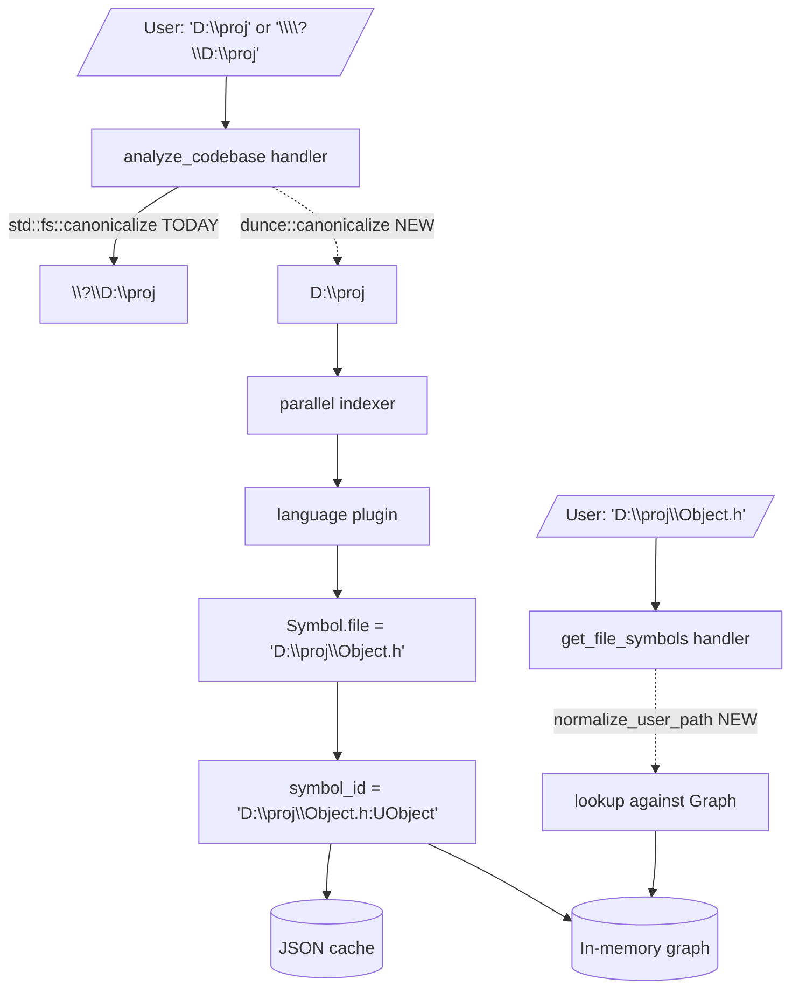

# Path Normalization — Windows extended-path leak and incoming-path canonicalization

## Overview

On Windows, `std::fs::canonicalize` returns the verbatim NT extended-path form (`\\?\D:\...`). The indexer feeds that to every parser, so it lands in `Symbol::file` (a `String`), which becomes a literal prefix in every `symbol_id` (`crates/code-graph-core/src/lib.rs:112`) and in every key in `Graph::files` / `Graph::includes`. Two consequences observed on a generic UE4 project against 81k files and 4.4M edges:

1. **Leak.** `analyze_codebase` returns `root_path = "\\\\?\\D:\\..."` (`crates/code-graph-tools/src/handlers/analyze.rs:113`). Every `symbol_id` rendered by `get_file_symbols`, `search_symbols`, etc. embeds the same `\\?\` prefix. Users see it in every tool response.
2. **Silent lookup failure.** Every tool that takes a file path as input (`get_file_symbols`, `get_coupling`, `get_dependencies`, `generate_diagram(file=…)`) feeds it through `Path::new(file)` unchanged. A user pastes `D:\…\Object.h` (the form they read off `search_symbols`' suggestion text or `id_to_file`'s rsplit), hits the lookup against the `\\?\D:\…` key, gets zero matches, and reasonably concludes the file is empty. This was reported as "the single most painful bug I hit."

This design fixes both leaks at their roots: canonicalize **once** at index time using the `dunce` crate (returns the user-friendly `D:\…` form whenever the path doesn't actually require the extended form), and normalize **every** incoming path argument through a shared helper before hitting the graph. Both changes are no-ops on Linux/macOS; the Windows-only fix carries no portability cost.

## Goals

1. **No `\\?\` prefix in any user-visible string.** `root_path`, `symbol_id`, `Symbol.file`, `Page<SymbolResult>.results[].symbol_id`, and Mermaid output are all clean.
2. **`get_file_symbols("D:\\…\\Object.h")` resolves on a Windows index** built from the same logical path, regardless of whether the user supplied the extended-path form or the short form.
3. **Zero behavioral surprise on Linux/macOS.** Existing tests pass byte-identical; no extra filesystem calls outside `analyze_codebase`.
4. **Existing on-disk caches with `\\?\` keys keep working.** Caches written by the prior version stay loadable; new indexes write clean keys.

## Non-Goals

- **Network/UNC paths** (`\\server\share\…`). Outside MVP scope; `dunce` already handles these correctly (preserves UNC, strips only the extended prefix on local paths).
- **Case-insensitive matching on Windows.** Lookup remains exact-string against the canonical form. Users supplying `d:\foo\BAR.h` against an index of `D:\Foo\bar.h` are still out of luck; case-folding is a separate, larger problem.
- **Symlink resolution semantics changes.** `dunce::canonicalize` resolves symlinks identically to `std::fs::canonicalize` (and so does `dunce::simplified` for already-canonical inputs); the only delta is the extended-path prefix.
- **Lexical-only path normalization** (i.e., resolving `..` without filesystem). Stretch goal; see [Decision 3](#decision-3-incoming-path-normalization-strategy).
- **`watch_start`/`watch_stop` argument normalization.** Watch reuses the cached `root_path`; there is no user-supplied path on those tools.
- **Re-contamination via watch event paths.** The watch handler (`crates/code-graph-tools/src/handlers/watch.rs`) receives file paths from `notify-debouncer-full` as `PathBuf`. On Windows, these can arrive with `\\?\` prefixes (the OS layer may use extended-form notifications for paths near the 260-char ceiling or for watch handles opened on the canonical form). This design's index-time canonicalization fix does NOT touch the watch reindex code path, so a clean post-fix graph CAN be re-contaminated by the first watched file modification on Windows. Fixing this requires routing watch event paths through `paths::simplify` (or, better, `paths::canonicalize`) before merging the reindexed `FileGraph`. **Deferred to a follow-up.** This MVP intentionally does not solve it, and the follow-up should land before the design is declared "complete" for Windows users running watch mode.

---

## Architecture

### Where paths flow



The diagram shows the **two** new touch points: replace `std::fs::canonicalize` at the analyze entry, and route every incoming file-path arg through a single `normalize_user_path` helper before graph lookup.

### Components changed

| Crate / file | Change |
|---|---|
| `Cargo.toml` (workspace) | Add `dunce = "1"` as a workspace dep. |
| `crates/code-graph-core/Cargo.toml` | Add `dunce` dependency. |
| `crates/code-graph-core/src/paths.rs` (new) | `pub fn canonicalize(p: &Path) -> io::Result<PathBuf>` wraps `dunce::canonicalize`. `pub fn simplify(p: &Path) -> PathBuf` wraps `dunce::simplified` (cheap, infallible). `pub fn normalize_user_path(p: &str) -> PathBuf` is the helper used by query handlers — see [Decision 3](#decision-3-incoming-path-normalization-strategy). |
| `crates/code-graph-tools/src/handlers/analyze.rs:61` | Swap `std::fs::canonicalize` → `code_graph_core::paths::canonicalize`. |
| `crates/code-graph-tools/src/handlers/symbols.rs` | `get_file_symbols`: route `file` arg through `normalize_user_path` before `graph.read().file_symbols(...)`. |
| `crates/code-graph-tools/src/handlers/structure.rs` | `get_coupling` (`:320`), `generate_diagram(file=…)` (`:422`): same. |
| `crates/code-graph-tools/src/handlers/query.rs` | `get_dependencies` (`:133`): same. |
| `crates/code-graph-graph/src/graph.rs` (and `persist.rs`) | On `Graph::load` (JSON cache deserialization): walk the deserialized `GraphCache` and apply `paths::simplify` to **every** path-bearing field — see [Decision 5](#decision-5-existing-cache-migration) for the full enumeration. Partial migration is worse than no migration: a graph with `files` keys stripped but `nodes` SymbolId keys still prefixed would return zero symbols on every file lookup with no error. |

`crates/code-graph-tools/src/handlers/mod.rs` already houses `suggest_symbols`, `byte_budget_take`, etc.; `normalize_user_path` joins them as a shared handler-layer helper — but the helper itself lives in `code-graph-core` so the indexer (which is in a different crate hierarchy) can also call it without an upward dependency.

### Why `dunce` and not roll-our-own

`dunce` is a 60-line crate that's been the de-facto Windows path-canonicalization shim for the Rust ecosystem since 2018 (used by `cargo`, `rust-analyzer`, `ripgrep`, `tokio`, et al.). Its behavior is precisely what we need:

- `dunce::canonicalize(p)` → calls `std::fs::canonicalize` and strips `\\?\` iff the resulting path is also valid in the short form (no path components > 255 chars, no NTFS-special device names, no other extended-form-only requirements).
- `dunce::simplified(p)` → infallible, lexical-only `\\?\` strip; safe to call on already-canonical paths.
- On non-Windows: both functions are identity wrappers around `std::fs::canonicalize` / `Path::to_path_buf`.

Rolling our own is a tarpit (UNC handling, the 260-char short-form ceiling, device names like `\\?\COM1`); `dunce` already handles it correctly and is a stable, near-frozen dependency.

### The shared helper

```rust
// crates/code-graph-core/src/paths.rs

use std::io;
use std::path::{Path, PathBuf};

/// Canonicalize for index-time use (filesystem-bound). On Windows, returns
/// the short `D:\…` form whenever possible; falls back to the
/// extended-path form only when the short form is invalid (rare).
pub fn canonicalize(p: &Path) -> io::Result<PathBuf> {
    dunce::canonicalize(p)
}

/// Lexical `\\?\` strip — no filesystem call. Use on already-canonical
/// paths (e.g., cache deserialization migration).
pub fn simplify(p: &Path) -> PathBuf {
    dunce::simplified(p).to_path_buf()
}

/// Normalize a user-supplied file-path argument before lookup. Tries
/// `dunce::canonicalize` first (handles `D:\…` ↔ `\\?\D:\…` and resolves
/// relative segments / symlinks against the on-disk file). Falls back to
/// `dunce::simplified` if the path doesn't exist on disk — covers the case
/// where the file has been deleted since indexing but the user is still
/// trying to look it up in the cached graph.
pub fn normalize_user_path(p: &str) -> PathBuf {
    let path = Path::new(p);
    match dunce::canonicalize(path) {
        Ok(canonical) => canonical,
        Err(_) => dunce::simplified(path).to_path_buf(),
    }
}
```

The fallback exists because `analyze_codebase` runs against the filesystem (the path must exist), but query handlers run against the **graph**, which is a snapshot of a past filesystem state. A file present at index time and deleted before the query should still be discoverable in the graph — refusing the lookup because the file no longer exists would punish the agent for a stale graph rather than helping it.

### Interfaces

```rust
// New, pub(crate) where possible:
pub fn canonicalize(p: &Path) -> io::Result<PathBuf>;
pub fn simplify(p: &Path) -> PathBuf;
pub fn normalize_user_path(p: &str) -> PathBuf;
```

No public API breaks. Handler signatures unchanged.

---

## Design Decisions

### Decision 1: Pull `dunce` vs. open-code the prefix strip

**Context:** We could write a `path.starts_with("\\\\?\\")` check inline and call it done.

**Options Considered:**
1. Inline `\\?\` strip in `analyze.rs`.
2. Use `dunce`.

**Decision:** Use `dunce`.

**Rationale:** Inline stripping mishandles UNC paths (`\\?\UNC\server\share\` → must become `\\server\share\`, not `UNC\server\share`). It also doesn't gracefully handle the rare cases where a path genuinely requires the extended form (path > 260 chars, etc.) — `dunce::canonicalize` only strips when the short form remains valid. The 60-line dependency is stable (released 2018, last meaningful change 2022) and is already a transitive dep of crates we depend on (`notify-debouncer-full` → `notify` → `dunce` is plausible — see `cargo tree` before assuming). Zero ongoing maintenance vs. real cross-platform correctness.

`dunce` is added as an **unconditional** workspace dependency (not gated on `[target.'cfg(windows)'.dependencies]`), consistent with the rest of the workspace's cross-platform shims. On Linux/macOS the crate compiles to identity wrappers — zero behavioral change, negligible binary size cost.

### Decision 2: Canonicalize at index time, not at query time

**Context:** Two places to normalize: at write (index time, paths land in symbol IDs) or at read (query handlers strip prefixes from outputs).

**Options Considered:**
1. Strip `\\?\` from every outgoing string in tool responses.
2. Canonicalize once at index time so the graph never contains `\\?\`-prefixed strings in the first place.

**Decision:** Index time.

**Rationale:** Symbol IDs are agent-visible *and* round-trippable — agents extract them from one tool response and feed them into another (`search_symbols` → `get_callers`). If the strip happens at response time, every consumer must independently strip too (and a missed call site re-leaks). Canonicalizing once at write produces clean strings everywhere, including in the on-disk JSON cache. Outgoing strip is the strictly worse choice with more touch points and more failure modes.

The performance cost is one extra path-walk per file at index time; on a 81k-file UE codebase this is a fraction of a second relative to the multi-minute parse cost. Migration of existing caches is the only complication, handled in [Decision 5](#decision-5-existing-cache-migration).

### Decision 3: Incoming-path normalization strategy

**Context:** When a query handler receives a `file: &str`, what is the cheapest correct way to map it to the graph's storage key?

**Options Considered:**
1. **Pure lexical normalization** — call `dunce::simplified`, resolve `..` against current dir lexically. No filesystem call. Fast.
2. **Filesystem canonicalization** — `dunce::canonicalize`, fall back to `simplified` on `NotFound`. One stat per query.
3. **Lookup-time fuzzy match** — try the user's path verbatim, fall back to scanning `Graph::files` for a basename match. No filesystem call but `O(n)` per miss.

**Decision:** Option 2 (canonicalize, fall back to simplify).

**Rationale:** Option 1 misses the equivalence between `\\?\D:\proj\file.h` (graph key) and `D:\proj\file.h` (user input) — lexical strip of `\\?\` works on the input, but the user could also supply `D:\proj\.\sub\..\file.h`, which only resolves via the filesystem. Option 3 is `O(n)` per miss against 81k files, which is acceptable once but punishing on a tight query loop. Option 2 is one stat call (~10µs on a warm cache) and handles every form including relative paths against cwd, symlinks, and case sensitivity per filesystem semantics. The fallback to `simplified` covers the stale-graph case (file deleted since indexing) without refusing the lookup. The fallback is safe for *all* `dunce::canonicalize` error kinds — not just `NotFound`; permission errors, broken symlinks, paths with null bytes all fall through to the same lexical-only path, with the worst outcome being a graph miss on a malformed input (no panic, no error path). The added latency is unobservable next to the cost of `tool_success_json` serialization on the resulting page.

### Decision 4: `analyze_codebase` error wording on canonicalize failure

**Context:** Today `analyze.rs:64` returns `"directory does not exist: {path_raw}"` echoing the *user's* input string. With `dunce::canonicalize`, the input string is what we want to echo (no `\\?\` to strip) — no change needed.

**Decision:** No change to error text.

**Rationale:** The user's input is already what they expect to see in the error; the fix is upstream (the success path) and doesn't touch the error path. Snapshot tests on the error wording at `handlers/analyze.rs` (Phase 3.7 of RustRewrite per the comment) stay valid.

### Decision 5: Existing-cache migration

**Context:** A user with a JSON cache built by the prior code has `\\?\D:\…` strings throughout. After this fix, the indexer writes `D:\…`. We need cache load to succeed without forcing a re-index.

**Options Considered:**
1. Bump cache schema version; refuse to load old caches; force re-index.
2. On load, walk every path-bearing field of the deserialized `GraphCache` and apply `paths::simplify` in place.
3. Detect mismatch lazily on first lookup and rewrite the cache.

**Decision:** Option 2.

**Rationale:** A full re-index on a UE codebase is multi-minute; forcing it on every user post-upgrade is a hostile experience for a fix they didn't ask for. Option 3 leaves caches in a half-migrated state. Option 2 is a one-time pass during `Graph::load` (already iterating every node and edge) — cheap and idempotent. Caches without `\\?\` keys (the common case post-fix and on non-Windows) hit the `dunce::simplified` no-op path. No schema version bump needed because the JSON shape is byte-identical; only string contents change.

**Migration must touch every path-bearing field in `GraphCache`.** A half-migration (e.g., `files` keys stripped, `nodes` SymbolId keys still prefixed) produces silent data inconsistency — `graph.files.get(Path::new("D:\\proj\\Object.h"))` returns a `FileEntry`, but the `symbol_ids` inside it still embed `\\?\D:\…:Symbol`; the downstream `graph.nodes.get(sid)` hits a missing key, every file lookup returns empty. No exception is raised. The enumeration of fields to rewrite, derived from the actual `GraphCache` struct in `crates/code-graph-graph/src/persist.rs`:

| Field | Path location | Rewrite |
|---|---|---|
| `files: HashMap<PathBuf, FileEntry>` | map key | strip key |
| `files[...].symbol_ids: Vec<String>` | each entry is a `SymbolId` of form `<file>:<name>` | strip the `<file>` portion of each |
| `nodes: HashMap<SymbolId, Symbol>` | map key | strip the `<file>` portion of each key |
| `nodes[...].file: String` | the `Symbol.file` field on every node value | strip |
| `adj: HashMap<SymbolId, Vec<EdgeEntry>>` | map key | strip the `<file>` portion |
| `adj[...].target: SymbolId` | each `EdgeEntry.target` field | strip the `<file>` portion |
| `adj[...].file: PathBuf` | each `EdgeEntry.file` field | strip |
| `radj: HashMap<SymbolId, Vec<EdgeEntry>>` | same as `adj` | same |
| `includes: HashMap<PathBuf, Vec<PathBuf>>` | map key AND inner `Vec` values | strip both |
| `mtimes: HashMap<PathBuf, u64>` | map key | strip |

The migration is conceptually a single closure passed over the deserialized `GraphCache` that rebuilds the maps with simplified keys/values. Idempotent on already-clean inputs because `dunce::simplified` is a no-op on non-extended paths. Implementation lives in `crates/code-graph-graph/src/persist.rs` as a private `simplify_cache(cache: &mut GraphCache)` called immediately after `serde_json::from_reader` and before the cache is moved into `Graph`. UNC extended-path keys (`\\?\UNC\server\share\…`) are rewritten to short UNC form (`\\server\share\…`) per `dunce::simplified`'s stated behavior — the correct outcome for cross-machine path identity.

The anti-regression test (Testing Strategy item 6) MUST assert each field above is stripped, not just `files` and `includes` keys.

### Decision 6: Round-tripping clarity in tool descriptions

**Context:** The CLAUDE.md "Agent-facing tool descriptions" lens requires that strings under `#[tool(description=…)]` accurately describe production behavior. Today they say nothing about path forms.

**Decision:** Add a one-line note to the `file` parameter description on every file-taking tool: "Path is resolved against the indexed graph; `\\?\` extended-path prefix is handled automatically."

**Rationale:** Agents reading tool descriptions need to know that they can pass paths in their natural form. Without this note, an agent that's been burned by the bug will continue to pre-`\\?\`-prefix paths defensively (a worse habit that may break under non-Windows roots).

---

## Error Handling

| Failure | Detection | Response |
|---|---|---|
| `analyze_codebase` given a non-existent path | `dunce::canonicalize` returns `NotFound` | Existing `"directory does not exist: {path_raw}"` (no change) |
| `analyze_codebase` given a path that requires extended form (>260 chars, special device) | `dunce::canonicalize` returns the extended form; indexer indexes it; symbol IDs contain `\\?\` | **Accept.** Users with paths >260 chars genuinely need the extended form; we don't try to be cleverer than the OS. Documented in tool description: "Most paths return in short form; rare cases requiring `\\?\` (very long paths) keep the extended prefix." |
| Query handler given a file path with no corresponding graph entry | `normalize_user_path` returns a `PathBuf`; `graph.files.get(&path)` returns `None` | Existing "no symbols found in file" response (no change) |
| Query handler given a file path that's been deleted since indexing | `dunce::canonicalize` fails; fallback `dunce::simplified` returns the user's path verbatim | Lookup proceeds normally; if the cached graph has the key, returns hits; otherwise the existing not-found response. **No new error path.** |
| Old cache with `\\?\` keys loaded post-upgrade | `Graph::load` detects extended-form strings during deserialization | Silently rewrites keys via `paths::simplify`. No user-visible event. |

---

## Testing Strategy

### Unit tests

1. `crates/code-graph-core/src/paths.rs` — three tests covering `canonicalize`, `simplify`, and `normalize_user_path` with a tempdir on all platforms. On non-Windows, assert no `\\?\` ever appears. On Windows, assert `\\?\D:\…` → `D:\…` round-trip.
2. Cache migration test in `crates/code-graph-graph` — synthesize a JSON cache with `\\?\D:\…` strings in **every** path-bearing field per the Decision 5 table (`files` keys, `nodes` keys + `Symbol.file` values, `adj`/`radj` keys + `EdgeEntry.file` + `EdgeEntry.target`, `includes` keys + inner `Vec` values, `mtimes` keys, `FileEntry.symbol_ids` strings). Call `Graph::load`, then assert each field comes back simplified. Failure of any one assertion fails the test — the partial-migration silent-corruption bug is the explicit regression target.

### Integration tests

3. `crates/code-graph-tools/tests/path_normalization.rs` (new) — analyze a tempdir, capture `root_path` from the response, assert it contains no `\\?\`. Run `get_file_symbols` on every file in the temp dir using the *short* form path, assert non-zero symbols on each. (On Linux CI this is largely a non-regression check; the test runs on all platforms but only exercises the strip logic on Windows.)

### CI coverage gap (honesty disclosure)

The Windows-specific behavior of this fix is **not** verified by the current Linux-only CI matrix. `dunce::simplified` is documented as an identity function on non-Windows targets, so even a unit test that constructs a literal `"\\\\?\\D:\\…"` `PathBuf` cannot exercise the strip on Linux — the underlying `Path` semantics treat the leading backslashes as a single component on Unix, not as an extended-path prefix. The fix is exercisable only on Windows or under a Windows cross-compile harness. Concretely:

4. **Required follow-up: Windows CI job.** Add a GitHub Actions matrix entry for `windows-latest` running `cargo test --workspace` and the path-normalization integration test. Until that lands, the test in step 3 above is best-effort; a passing CI run on Linux does NOT mean the fix works for Windows users.
5. **Manual smoke (interim).** On Windows, against a synthetic 100-file fixture with one path that genuinely exceeds 260 chars: assert the long path keeps `\\?\` prefix and short paths drop it. Run before each release until automated coverage exists.
6. **`#[cfg(windows)]`-gated unit test.** Add a Windows-only unit test in `paths.rs` that constructs a `\\?\D:\…` `PathBuf` and asserts `paths::simplify` returns `D:\…`. This runs only on Windows CI (once added) and is the load-bearing strip-correctness regression test.

### Structural Verification

- `cargo clippy --workspace --all-targets -- -D warnings` after every commit (per `shared/languages/rust.md`).
- After this fix, **no snapshot on any platform should contain `\\?\`**. If a Windows run produces snapshots with `\\?\`, the fix is incomplete — do not blanket-accept with `cargo insta review`; investigate the missed normalization path first. The Linux-only CI cannot observe this regression; reviewers on Windows-touching PRs must verify locally.

### Anti-regression

7. A test fixture in `crates/code-graph-tools/tests/path_normalization.rs` that builds a graph, serializes it via `Graph::save`, manually rewrites the JSON to insert `\\\\?\\` prefixes into **every** path-bearing field of `GraphCache` (per the Decision 5 enumeration), then calls `Graph::load` and asserts: (a) load succeeds, (b) no `\\?\` survives in any field, (c) every symbol/edge round-trips to the simplified form, (d) `graph.file_symbols(Path::new("D:\\proj\\file.h"))` returns the expected symbols (end-to-end check that key consistency survives the migration).

---

## Migration / Rollout

1. **PR 1: `dunce` integration + `paths` module.** Adds the crate dep and the helper module. Swaps `analyze.rs` to `paths::canonicalize`. No query-handler changes. Cache-migration logic in `Graph::load`. Snapshot updates if any.
2. **PR 2: Normalize incoming paths.** Routes `get_file_symbols`, `get_coupling`, `get_dependencies`, `generate_diagram(file=…)` through `normalize_user_path`. Updates tool descriptions to note path-form tolerance.
3. **PR 3: Documentation.** CLAUDE.md "Core invariants" gets a new bullet: "All stored file paths are absolute and `\\?\`-prefix-stripped (via `dunce`); incoming file-path args are normalized through `paths::normalize_user_path` before graph lookup."

Both PRs are independently shippable; PR 2 makes PR 1 user-visible on Windows. PR 3 is paperwork.

**Rollback:** Drop the `dunce` dep, revert `paths.rs`, revert handler call sites. The cache migration is forward-compatible; reverting would write `\\?\`-prefixed entries against an existing simplified cache, triggering stale-detection and a re-index on next run. No data is lost.
