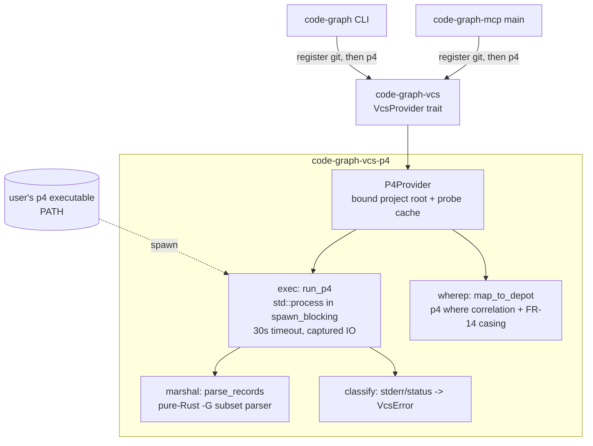
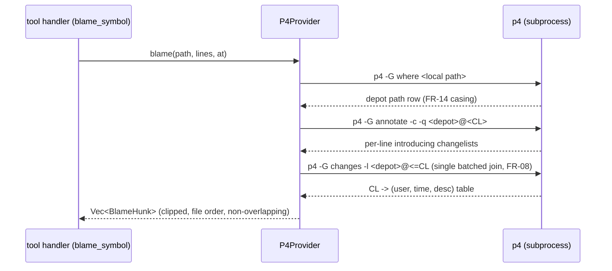

# Perforce VCS Provider (code-graph-vcs-p4)

## Overview
`code-graph-vcs-p4` is the second `VcsProvider` backend: a single-crate
subprocess integration that answers the four trait ops (`blame`,
`revisions_touching`, `read_at`, `resolve_rev`) by spawning the user's own
`p4` executable with `-G` structured output and parsing the result in pure
Rust (PerforceVcsProvider:FR-01, PerforceVcsProvider:FR-03,
PerforceVcsProvider:FR-04). It mirrors `code-graph-vcs-git`'s shape
deliberately: one `lib.rs` provider bound at construction to one project
root, blocking work behind `tokio::task::spawn_blocking`, an in-crate
hermetic fixture harness, `#![forbid(unsafe_code)]`, and injection from the
binaries only — `code-graph-tools` continues to depend on the trait crate
alone. No Perforce code is linked or compiled (D-0015, D-0004); `RevId`
stays fully opaque per one-way D-0002, carrying submitted changelist
numbers as decimal strings that never surface as a typed CL field on any
wire shape.

## Non-Goals
- **Not a general Perforce client.** No sync, submit, edit, shelve, spec
  mutation, or login — read-only queries over submitted state only
  (spec Non-Goals). Ticket lifecycle belongs to the user's own `p4`.
- **No persistent connection or daemon-side session reuse.** Every op is a
  fresh process; the D-0015 boundary. Connection pooling is the named
  extension point deliberately left out — it requires a superseding ledger
  decision before any implementation.
- **No output-locale handling.** Error classification matches p4's English
  message text; a `P4LANGUAGE`-localized environment degrades to the
  generic `Operation` error message, never to a wrong classification
  (patterns that don't match fall through, they never misfire).
- **No view-map interpretation in Rust.** The provider never parses client
  view lines itself; `p4 where` is the single mapping oracle
  (PerforceVcsProvider:FR-09). Re-implementing view semantics (overlays,
  exclusions, ditto mappings) is explicitly out.
- **Registry policy stays in the binaries.** The crate exports the
  provider; registration order (git before p4,
  PerforceVcsProvider:FR-13) is enforced at the injection sites in
  `code-graph-mcp` and `code-graph-cli`, not inside this crate.

## Architecture

### Components

- **`P4Provider`** — implements the trait; constructed
  `P4Provider::open(project_root)` by the binaries at startup, mirroring
  `GitProvider`: detection is an identity check against the bound root
  plus offline config presence (PerforceVcsProvider:FR-02). Holds two
  lazily-filled `OnceLock`s: the server's `caseHandling` (`DD-6`) and the
  resolved client root from `p4 info`/`p4 where`.
- **`exec`** — the only place a process is created. Builds argv
  (`p4 -G <cmd> …`), spawns `std::process::Command` inside
  `spawn_blocking` with stdin null and stdout/stderr piped (never
  inherited — PerforceVcsProvider:FR-03), enforces the 30-second
  per-invocation timeout by a `try_wait` poll loop that kills the child
  on expiry (`DD-1`, PerforceVcsProvider:FR-11).
- **`marshal`** — pure-Rust parser for exactly the marshal subset `p4 -G`
  emits: version-0 streams of `{`-opened dictionaries with `s` (length-
  prefixed bytes) keys/values and `i` (little-endian i32) values,
  terminated by `0`, concatenated until EOF (PerforceVcsProvider:FR-04).
  Values stay `Vec<u8>`; metadata fields decode lossily at the edge
  (`String::from_utf8_lossy`), file content never passes through marshal
  (`DD-3`).
- **`wherep`** — depot/client path correlation: `p4 -G where <local>`,
  selecting the un-excluded mapping row; comparisons case-fold when the
  cached `caseHandling` says `insensitive` (PerforceVcsProvider:FR-14).
  Resolved mappings are cached per path on the provider instance
  (`DD-10`), so repeat ops on the same file spawn no second `where`;
  out-of-view answers become the trait's unavailability shape
  (PerforceVcsProvider:FR-09) and are cached too (negative cache) —
  `symbol_history`'s window walk probes the same path repeatedly.
- **`classify`** — the exit-status + stderr pattern table producing
  existing `VcsError` variants only (`DD-8`, PerforceVcsProvider:FR-10).

### Data Flow
Blame is the richest path; the others are prefixes of it:

- `resolve_rev`: `p4 -G changes -m1 -s submitted <spec>` (or the client
  view default when `spec` is the provider-default request) → CL number →
  `RevId` (PerforceVcsProvider:FR-05).
- `revisions_touching`: `p4 -G changes -m <limit> -l <depot path>` —
  already newest-first in p4's output, mapped 1:1 onto `RevisionWindow`
  with `truncated: false` unless the provider imposed its own bound
  (it does not in v1; the flag is plumbed for parity)
  (PerforceVcsProvider:FR-06).
- `read_at`: raw `p4 print -q <depot>@<CL>` WITHOUT `-G` — bytes pass
  through untouched (`DD-3`, PerforceVcsProvider:FR-07).
- `blame` with `lines: None` annotates the whole file; `at: None` first
  resolves the provider-default revision exactly as FR-05 defines it
  (PerforceVcsProvider:FR-08).

### Interfaces
- Public surface: `P4Provider::open(&Path) -> Result<P4Provider, VcsError>`
  (matching `GitProvider::open` exactly: `Unavailable` for the ordinary
  no-config case, any other error earns the injection sites' existing
  breadcrumb arm) + `impl VcsProvider` (`id() == "perforce"`, frozen —
  PerforceVcsProvider:FR-01). Nothing else is exported.
- Environment contract: the child inherits the parent environment
  unmodified (`P4CONFIG`/`P4PORT`/`P4CLIENT`/`P4TICKETS` all flow
  through); cwd is the bound project root so `P4CONFIG` upward walks
  resolve identically to the user's own shell.
- Subprocess contract: argv always begins `p4 -G` except `read_at`'s raw
  `p4 print`; stdout/stderr always piped; stdin always null; exit status
  and stderr routed to `classify`.

## Design Decisions

### DD-1 — std::process inside spawn_blocking, poll-based timeout
**Context:** PerforceVcsProvider:FR-11 requires bounded invocations;
NFR-03 requires blocking work inside `spawn_blocking` (the git provider's
established pattern).
**Options:** (a) `tokio::process::Command` with `tokio::time::timeout` +
`kill_on_drop`; (b) `std::process::Command` inside `spawn_blocking`,
timeout via `try_wait` poll loop (50ms cadence) with explicit
`child.kill()` on expiry; (c) `wait-timeout` crate.
**Decision:** (b), with MANDATORY concurrent output draining: stdout and
stderr are each drained to completion by a dedicated reader thread
spawned immediately after the child, while the spawning thread runs the
`try_wait` poll loop. The kill path fires on deadline; the reader
threads are then joined (pipe EOF follows the kill), and only then is
status + output assembled.
**Rationale:** Matches NFR-03's letter and the git provider's execution
shape exactly; adds zero dependencies ((c) rejected for a new dep that a
20-line poll loop replaces; (a) rejected because it moves process
lifetime onto the async runtime where a daemon shutdown mid-call could
orphan the child — the poll loop's kill path is owned by the same thread
that spawned it). The reader threads are load-bearing, not a nicety:
without them any child producing more than the OS pipe buffer (~64KB —
every real `p4 print`, every long `changes -l`) deadlocks against the
undrained pipe, and the timeout would kill a healthy operation and
misreport it as a hang (review finding). Timeout constant: 30 seconds
per invocation, uniform across ops (FR-11's "order tens of seconds").

### DD-2 — Hand-rolled marshal subset parser, no fallback implementation
**Context:** PerforceVcsProvider:FR-04 requires structured parsing without
executing Python and permits a `-ztag` fallback only as a design choice.
**Options:** (a) in-crate parser for the version-0 marshal subset p4
emits; (b) `-ztag` line-format parsing; (c) an external marshal crate.
**Decision:** (a), and `-ztag` is NOT implemented — one format per
command, no runtime probing, and the fallback clause stays unexercised.
**Rationale:** D-0004 conformance is the binding constraint — pure Rust,
no Python interpreter, no new dependency. The subset is tiny (dict open,
`s` strings, `i` ints, dict close, EOF loop — ~120 lines with tests);
`-ztag` needs fragile
continuation-line handling for multi-line descriptions, which is exactly
where blame metadata lives; external crates (c) are unmaintained and
overshoot the subset. Absence check 2026-08-20: no maintained pure-Rust
python-marshal crate on crates.io (search "marshal python").

### DD-3 — read_at bypasses -G: raw `p4 print -q`
**Context:** PerforceVcsProvider:FR-07 returns exact bytes; `-G` wraps
file content in marshal records and text-mode conversions.
**Decision:** `p4 print -q` with raw captured stdout; `-G` never touches
file content.
**Rationale:** Byte fidelity is the requirement — fingerprinting runs on
these bytes (`symbol_history`), so any wrapper stripping is a corruption
risk; `-q` suppresses the header line, leaving pure content. The
depot-side file TYPE still governs line endings exactly as the server
stores them, which matches the git provider's read-at-revision semantics
(blob bytes as committed).

### DD-4 — Blame metadata join: single `p4 changes -l` over the depot path
**Context:** PerforceVcsProvider:FR-08 fixed the join at one batched call
(user resolution 2026-08-20).
**Decision:** `p4 -G changes -l <depot>@<=CL` — every submitted CL in the
file's history up to the blamed revision, keyed into a `CL -> Commit`
map; annotate rows join against it.
**Rationale:** Without `-I` (DD-5), `annotate -c` only ever attributes to
changelists present in that file's own revision history, so the file's
`changes` list is a complete join table by construction — no per-CL
`describe` needed, keeping blame at exactly two metadata spawns plus the
`where` mapping call.

### DD-5 — No `-I` integration following in v1
**Context:** `p4 annotate -I` follows integration history (branch
copies/merges) when attributing lines; default annotate stops at this
file's revision history.
**Decision:** v1 does not pass `-I`.
**Rationale:** Parity with the documented git-provider boundary (history
stops at path creation; renames not followed — the path-level behavior
adjacent to D-0005's symbol-matching rule, which the tool layer applies
identically over any provider) and a hard prerequisite for
DD-4's completeness argument — `-I` can attribute lines to changelists
from OTHER depot paths, which would break the single-join-table
guarantee. Turning it on later is an additive design change that must
revisit DD-4 in the same stroke.

### DD-6 — One `p4 info` probe, cached per provider instance
**Context:** PerforceVcsProvider:FR-14 forks path comparison on the
server's `caseHandling`; detection must stay offline
(PerforceVcsProvider:FR-02).
**Decision:** `caseHandling` (and the client root) come from a single
`p4 -G info` call made lazily on the FIRST trait op, stored in a
`OnceLock`; `detect()` never triggers it.
**Rationale:** Zero network in detection, one probe per process lifetime,
and a failed probe classifies through the normal FR-10 table (the op that
triggered it reports the actionable error). A daemon outliving a server
case-config change is accepted staleness — servers do not change case
handling live.

### DD-7 — Fixture harness runs p4d over `rsh:` (portless, hermetic)
**Context:** PerforceVcsProvider:FR-12 requires per-test throwaway
servers with auto-skip; TCP port allocation is the classic flaky-fixture
source.
**Options:** (a) `p4d -p 127.0.0.1:0`-style TCP with port discovery;
(b) `P4PORT=rsh:p4d -r <root> -i` — p4 spawns a private p4d over stdio
per connection, no listener at all.
**Decision:** (b), with (a) as the documented fallback if a platform's
`p4` build lacks rsh support.
**Rationale:** No ports, no listener lifetime management, no collision
with concurrent tests; each test's server state is just its `-r` root
directory. Skip logic: `which p4 && which p4d` at harness init, else
`eprintln!` setup hint and return (dogfood-submodule pattern).

### DD-8 — Error classification: ordered stderr-pattern table onto existing variants
**Context:** PerforceVcsProvider:FR-10/FR-11 require distinct actionable
errors; the spec pins mapping onto existing `VcsError` variants.
**Decision:** an ordered table checked top-down against combined
stderr+marshal `data` fields, each row naming its target `VcsError`
variant explicitly (the tool layer's rendering is variant-sensitive):

| Signal | Variant |
|---|---|
| `not in client view` / out-of-view `where` result / no Perforce config | `Unavailable` — success-shaped rendering (PerforceVcsProvider:FR-09) |
| `no such file(s)` at a revision (read_at/annotate absence) | `NotFound` — `symbol_history`'s `removed` transitions depend on distinguishable absence, exactly the git provider's absence-at-revision contract |
| unresolvable revision spec (PerforceVcsProvider:FR-05) | `NotFound` naming the bad spec (git parity) |
| session expired / password invalid | `Operation` naming `p4 login` |
| connect failure | `Operation` naming the endpoint |
| DD-1 timeout kill | `Operation` naming the command and the 30s bound |
| spawn failure (no `p4` on PATH) | `Operation` naming the missing executable |
| unmatched | `Operation` with the raw first stderr line |

**Rationale:** English-pattern matching is the only classification
signal a subprocess offers; the fall-through design means an unmatched
localized message degrades to generic, never misclassifies (Non-Goals).
The `Unavailable`-vs-`NotFound` split mirrors the git provider's
deliberate variant discipline (its absence-at-revision path routes
`NotFound` into the success-shaped "no history" rendering), so the tool
layer needs zero changes.

### DD-10 — Per-path depot-mapping cache (spawn-budget conformance)
**Context:** PerforceVcsProvider:FR-08's amended spawn budget (annotate +
batched join + a cached mapping call) and PerforceVcsProvider:NFR-04's
one-spawn-per-op rule with two named exceptions. An uncached `p4 where`
per op would put every `read_at` and `revisions_touching` at two spawns
permanently.
**Decision:** `P4Provider` holds a `Mutex<HashMap<PathBuf, DepotMapping>>`
(key normalized under the FR-14 casing rule; value = depot path or an
out-of-view marker). One `where` spawn per distinct path per provider
lifetime; steady-state ops are single-spawn (plus blame's join).
**Rationale:** The client view is fixed for the life of a bound provider
(a view changed mid-daemon is the same accepted-staleness class as
DD-6's `caseHandling`); caching negatives keeps repeated unavailability
probes (history walks over a deleted path) from respawning. The cache is
per-instance and never persisted — a daemon restart re-resolves.

### DD-9 — Provider bound to one root; detect is identity + config presence
**Context:** `GitProvider::detect` is an identity check against its bound
root (phase-gate F1 lesson: a yes-for-any-tree provider hijacks the
registry). PerforceVcsProvider:FR-02 defines offline detection signals.
**Decision:** `P4Provider::open(root)` succeeds only when the FR-02
signals are present at construction time (`.p4config` on the upward walk
per `P4CONFIG`, or `P4PORT`+`P4CLIENT` env); `detect(tree)` re-checks
those signals AND that `tree` resolves into the bound root — same
identity discipline as git.
**Rationale:** Keeps registry semantics uniform across providers and
makes PerforceVcsProvider:AC-09's dual-marker behavior a pure
registration-order question (FR-13) instead of a detection-strength
contest.

## Error Handling
- **Detection-time:** `open()` returning `Unavailable` is silent (provider
  simply not registered); other `open()` failures get the injection
  sites' stderr breadcrumb — the exact match-arm split `main.rs` already
  applies to `GitProvider::open`.
- **Op-time:** every failure funnels through `classify` (`DD-8`) into
  existing `VcsError` variants; the tool layer's existing rendering
  (success-shaped unavailability vs. tool error) is unchanged. The
  spawn-failure case (no `p4` on PATH) is classified per op invocation —
  PerforceVcsProvider:AC-04 — because PATH can change between daemon
  start and the call.
- **Timeout:** `DD-1`'s kill path reaps the child (kill + wait) before
  returning, so no zombie survives a timed-out op; the error names the
  command and the 30s bound.
- **Partial marshal streams:** a truncated `-G` stream (killed child,
  crashed p4) fails parsing closed — `Operation` naming the parse
  position — never a partially-populated success.
- **Stderr hygiene:** child stderr is captured and folded into errors
  only; it is never echoed to the daemon's stderr wholesale (MCP framing
  protection, PerforceVcsProvider:FR-03).

## Testing Strategy
- **Marshal parser unit tests** (no binaries needed, run everywhere):
  golden byte-streams for each record shape p4 emits — single dict,
  multi-record stream, i32 values, multi-line description strings,
  truncated stream (error), non-UTF-8 bytes in values (lossy decode at
  the edge only).
- **Classification unit tests** (no binaries): the `DD-8` table against
  captured stderr fixtures — expired ticket, bad P4PORT, no-such-file,
  missing executable, localized/unknown fall-through.
- **Detection tests** (no binaries): FR-02 signal matrix including the
  poison-`p4`-on-PATH guard proving no spawn occurs
  (PerforceVcsProvider:AC-03), and the `DD-9` identity check.
- **Harness integration tests** (auto-skip without `p4`/`p4d`,
  PerforceVcsProvider:FR-12/AC-08): fixture submits crafted changelists,
  then exercises AC-01 (blame hunks vs. known CLs), AC-02
  (symbol_history transitions via the tool layer against a p4-backed
  fixture), AC-05 (out-of-view path), AC-07 (auth failure via
  `P4PASSWD`-protected fixture; connect failure via dead endpoint;
  timeout via a stub `p4` script that sleeps), AC-09 (dual-marker
  registry order), AC-10 (`p4d -C1` casing matrix per FR-14).
- **Trait-conformance parity:** reuse `code-graph-vcs`'s existing
  registry tests' shape for ordering (AC-09) at the injection sites.
- **Platform matrix (PerforceVcsProvider:NFR-02):** the binary-free
  tiers (marshal, classification, detection) run on Windows, Linux, and
  macOS unconditionally. The harness tier targets Windows and Linux
  natively: unix uses `DD-7`'s `rsh:` transport; Windows starts on the
  documented TCP fallback (ephemeral `p4d -p 127.0.0.1:<picked-port>`)
  until the first harness spike verifies `rsh:` on Windows p4 builds —
  whichever the spike settles is recorded back into `DD-7`, and the
  choice changes no test assertions (transport is a harness detail). A
  timed-out child on Windows dies via the same `child.kill()` API
  (TerminateProcess under std), covered by the AC-07 timeout row on
  both platforms.
- **Fixture-capture verification items** (spec Constraints: output
  behavior derives from captured `p4d` output, never memory — each
  becomes a pinned fixture assertion during implementation):
  1. The changes-revspec spelling for "at or before CL" (`@<=CL` vs the
     range form `@0,@CL`) — `DD-4`'s argv is provisional until captured.
  2. `DD-4`'s join-table completeness against a branched/integrated
     file.
  3. `p4 print -q` byte fidelity for text-type files with CRLF content,
     on Windows AND Linux, against the submitted bytes
     (PerforceVcsProvider:FR-07) — if client-side line-ending
     translation is observed, the design is amended with the mitigation
     before implementation proceeds.
  4. The provider-default revision argv, provisionally
     `p4 -G changes -m1 -s submitted //<client>/...` with the client
     name from the cached `p4 info` probe (a bare `changes -m1` is
     server-wide, not view-scoped).
  5. `-s submitted` passed uniformly on every `changes` invocation
     (resolve_rev, revisions_touching, blame join) unless capture shows
     a filespec already excludes pending changes.

### Structural Verification
- `#![forbid(unsafe_code)]` (PerforceVcsProvider:NFR-01) — enforced at
  crate root, verified by compilation.
- `cargo clippy --workspace --all-targets -- -D warnings` and
  `cargo fmt --all --check` via `make verify` (workspace gates).
- `cargo tree -p code-graph-vcs-p4` inspection recorded as
  PerforceVcsProvider:AC-06 evidence: no Perforce crate, no `cc`-built
  Perforce source, no new native-library dependency.
- Dependency budget: `code-graph-vcs` + `tokio` (already-workspace) +
  `async-trait` (already-workspace). Anything beyond that list is a
  design deviation requiring review.

## Migration / Rollout
Purely additive; no cache-format, wire-format, or trait change.

1. New crate `crates/code-graph-vcs-p4` (workspace member + CLAUDE.md
   workspace-map row).
2. Injection: `code-graph-mcp` main and `code-graph-cli` register git
   THEN p4 (PerforceVcsProvider:FR-13) — two call-site edits.
3. No config surface: the provider reads only Perforce's own environment
   contract; `.code-graph.toml` gains no keys in v1.
4. Rollback = deleting the two registration lines; no persisted state to
   migrate (fingerprint sidecar entries key on `"perforce"` and simply go
   cold).

## Open Questions
None.
