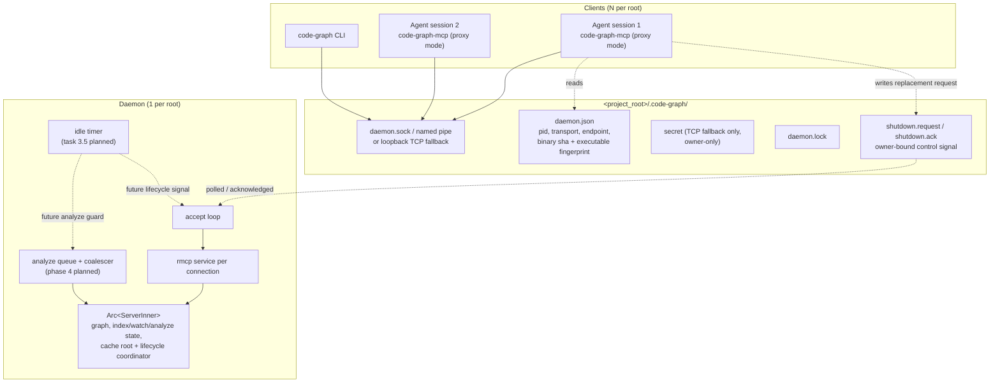

# Repository-Local Daemon and CLI (Track B)

Implementation-gate validation for this design follows the initiative scope recorded in D-0008.

## Overview

Today every agent session spawns its own `code-graph-mcp`, builds or loads its own graph, and holds its own copy in memory. Two sessions on one repository pay the indexing cost twice and cannot see each other's index. This design makes the graph a per-repository service: one daemon per project root, N clients attached, with the existing stdio binary demoted to a thin proxy so no client configuration changes (FR-06 – FR-16, D-0001).

It also adds a command-line front-end over the same core (FR-17 – FR-20), and replaces the current analyze-contention error with a coalescing queue (FR-41 – FR-43).

The scoping decision that makes this tractable is **repository-local** (D-0001). A multi-tenant daemon needs a keyed registry of graphs, per-root locking, and a workspace-selection protocol. One daemon per root needs none of that: `ServerInner` already *is* exactly one graph, one index lock, one watch handle, one analyze slot. The daemon reuses it unchanged.

## Non-Goals

- **No multi-tenancy, no cross-workspace queries, no state outside the repository** (D-0001, superseding `Designs/SharedDaemon`). No discovery file under `~`, no port registry, no `list_workspaces`.
- **No new wire protocol.** Decision 3 proxies MCP JSON-RPC verbatim. Designing an RPC schema, versioning it, and keeping it in sync with the tool surface is work this design declines to do.
- **No remote access.** Loopback and local-user only, always (NFR-06).
- **No daemon supervision.** No restart-on-crash, no systemd/launchd unit, no health endpoint. A dead daemon is replaced by the next client that fails to connect.
- **No shared cache-file locking between daemon and non-daemon processes.** Two daemons for one root is prevented (FR-13); a daemon racing a stray direct-mode process on the same cache file is out of scope, as it is today.
- **The CLI does not reimplement query logic.** It calls the same core as the MCP adapter, which is why it depends on Track A (Decision 8).
- **Track C's queries are not exposed here.** They arrive with their own tools; this design carries whatever tool surface exists.

## Architecture

### Components



The graph/query state in `ServerInner` keeps its existing semantics and one `Arc<ServerInner>` is shared by several rmcp services instead of one. Task 3.4 adds lifecycle-only state beside it: the active cache project root and an analyze/persist/watch-cleanup coordinator used to drain mutation before replacement exit. Phase 4 later adds the planned queue/coalescer.

### Data Flow

Attach is the only genuinely new control flow:

```mermaid
sequenceDiagram
    participant Cl as client (stdio proxy or CLI)
    participant M as daemon.json
    participant L as daemon.lock
    participant D as daemon

    Cl->>Cl: discover project root (RootConfig::load walk)
    Cl->>M: read
    alt metadata identity matches and exact owner holds the OS lock
        Cl->>D: connect on recorded endpoint
        alt connect succeeds
            D-->>Cl: attached
        else stale endpoint
            Cl->>Cl: treat as absent
        end
    else metadata identity differs
        Cl->>L: validate exact active owner
        Cl->>D: publish owner-bound shutdown.request
        D-->>Cl: publish shutdown.ack, drain, exit
    end
    alt no live daemon
        Cl->>D: spawn a daemon contender
        D->>L: exclusive create
        alt daemon won the lock
            D->>D: bind listener, publish daemon.json
        else daemon lost the lock
            D->>D: exit; client retries connect with backoff
        end
    end
    alt still no daemon
        Cl->>Cl: serve in-process, report fallback (FR-16)
    end
```

### Interfaces

**Binary modes.** One binary, three modes, selected by argument. The no-argument command spelling is unchanged, but task 3.4 makes its default behavior the transparent proxy path:

| Invocation | Mode |
|---|---|
| `code-graph-mcp` (no args) | stdio proxy; attaches or spawns, falls back in-process |
| `code-graph-mcp --serve` | daemon; not intended for direct use |
| `code-graph-mcp --no-daemon` | today's behaviour, in-process, never attaches |
| `code-graph <subcommand>` | CLI (Decision 8) |

**`<project_root>/.code-graph/daemon.json`** — the only discovery surface (FR-40):

```json
{ "pid": 12345, "transport": "uds",
  "endpoint": "/abs/path/.code-graph/daemon.sock",
  "binary_sha": "1db21d6-dirty",
  "executable_fingerprint": "0000000001234567-89abcdef01234567",
  "started_at": "2026-08-08T12:00:00Z",
  "owner": { "pid": 12345, "start_time": 1786200000,
             "nonce": "0123456789abcdef0123456789abcdef" } }
```

**New config section**, added to `RootConfig` alongside the existing five:

```toml
[daemon]
enabled = true           # false => always in-process
idle_timeout_secs = 1800 # automatic idle exit after 1800 seconds; 0 = never exit
```

## Design Decisions

### Decision 1: The daemon reuses `ServerInner` verbatim

**Context:** A daemon needs to hold graph state for many connections. `ServerInner` holds exactly that for one.

**Options considered:** (1) Reuse `Arc<ServerInner>` as-is, one per daemon process. (2) Introduce a `Workspace` type keyed by root, as `Designs/SharedDaemon` sketched.

**Decision:** Option 1.

**Rationale:** D-0001 makes the daemon repository-local, so "many workspaces" cannot arise by construction. Every field already has the right lifetime and the right sharing semantics: `graph` behind `PlRwLock`, `index_lock` serialising worker against watch, `analyze_slot` single-flight, `watch` a single handle. `CodeGraphServer` is already `Clone` with all state behind `Arc<ServerInner>` precisely so rmcp's dispatch can hold it by value — which means N concurrent services over one `Arc` is the shape the type was already built for. Option 2 is the multi-tenant design this supersedes, and would add a keyed map and per-root locking for a case that cannot occur.

### Decision 2: The client is a byte proxy; the daemon speaks MCP over the socket

**Context:** Something must cross the process boundary. The tool surface is ~22 tools with rich response shapes.

**Options considered:** (1) Define an RPC protocol for graph queries. (2) Proxy MCP JSON-RPC verbatim: the daemon runs the same rmcp service over the socket, the client pumps bytes between stdio and the socket.

**Decision:** Option 2.

**Rationale:** rmcp's IO transport is generic over `AsyncRead + AsyncWrite`, and a Unix stream, a Windows named pipe, and a TCP stream all satisfy it — so the daemon can serve the *existing* `CodeGraphServer` over a socket with no new serialization code and no second definition of the tool surface. The client becomes a bidirectional copy loop, which is the smallest correct thing and cannot drift from the tool surface because it does not know what a tool is. Option 1 means designing, versioning, and maintaining a protocol that duplicates MCP's job, and every new tool would need adding twice.

**Two separate facts underpin this, and only together do they make it safe.** First, the `server` feature already enabled in this workspace pulls in `transport-async-rw`, whose `AsyncRwTransport` is generic over `AsyncRead + AsyncWrite` — so no new rmcp feature is required. Second, and this is the load-bearing one: stdio and socket transports frame through the **same** `JsonRpcMessageCodec`, newline-delimited identically regardless of the underlying stream. That is *why* a naive byte copy preserves message boundaries — not merely because the transport is generic. A proxy that had to understand framing would need to parse MCP, which is exactly what this decision avoids.

A consequence worth stating: because the proxy is byte-level, protocol version skew is impossible — but *binary* skew is not, which is what Decision 5 handles.

### Decision 3: Linux UDS first, loopback TCP with a credential as fallback (FR-38, FR-39, FR-40)

**Context:** FR-38 – FR-40 and NFR-06/07. Native platform completion is governed separately by NFR-12/13. (Resolves the spec's OQ-02.)

**Decision:** The Linux MVP uses a Unix domain socket at `<project_root>/.code-graph/daemon.sock`. If UDS establishment fails, it falls back to a TCP listener bound to `127.0.0.1:0` and requires a per-instance credential stored at `<project_root>/.code-graph/secret` with owner-only permissions. The client sends `CG-AUTH <64 lowercase hex>\n`, capped at 73 bytes with a two-second read timeout and constant-time comparison; after successful validation, the daemon acknowledges with `CG-OK\n` before either side passes the stream to rmcp's MCP codec. Both lines are transport authentication, not a graph-query protocol. The transport enum and accept-loop boundary retain macOS/Windows seams; native macOS support is deferred to Phase 10 (NFR-12) and Windows named-pipe/ACL support to Phase 11 (NFR-13). Those branches may remain ignored or best-effort during the Linux MVP. The active transport is recorded in `daemon.json`, and fallback is reported rather than silent.

**Rationale:** A Linux UDS carries filesystem access control, so NFR-06 is satisfied by `0700` runtime-directory and `0600` socket modes. Loopback TCP does **not** exclude other local users, so fallback adds the per-instance credential. The fallback exists because a socket file cannot always be created inside the repository. Recording the transport in metadata rather than probing means the client connects on the first attempt and never rattles a door the daemon is not serving (FR-40). Keeping platform differences behind the same listener/client enums prevents Linux code from hard-coding UDS assumptions while avoiding unsupported macOS/Windows claims in the MVP.

`tokio` is already present with `features = ["full"]`, which covers the Linux UDS/TCP implementation and the deferred transport seams. Task 3.2 adds direct `getrandom`, safe `sysinfo`, and `fs2` dependencies for CSPRNG-backed credentials, process identity, and an OS lock that releases on crash; all stay in the binary crate, outside the protected core crates. No MVP acceptance claim depends on unexercised Windows ACL code (NFR-02).

### Decision 4: Exclusive-create lockfile with crash-released OS ownership

**Context:** FR-13 — several sessions may start at once against a root with no daemon. Nothing in the workspace does single-instance today; there is no precedent to follow.

**Decision:** A client that finds no live daemon may spawn a daemon contender. Each daemon contender atomically attempts to create `<project_root>/.code-graph/daemon.lock`, then holds an exclusive `fs2` OS lock on that file for its lifetime. The file records pid, process start time, and a random nonce. The winner binds and publishes metadata; losers exit and their clients retry with bounded backoff. After a crash the OS releases ownership even though the file remains, so exactly one contender locks that same inode and replaces a dead/malformed identity in place. The winning daemon removes its own lock and metadata on clean exit. Lock ownership is never transferred from a proxy parent to a daemon child.

**Rationale:** Exclusive create resolves a clean start, while the held OS lock resolves stale-file takeover without a pathname delete/recreate race between contenders. Binding the socket itself as the lock is tempting and wrong: a crashed daemon leaves the socket file behind, so bind-fails-therefore-running produces a permanent deadlock. Pid plus start time distinguishes PID reuse; the nonce binds metadata cleanup to one instance.

The OS lock is the single-instance authority. If it is contended, a daemon or starter owns it; if it can be acquired, no process retained ownership through a crash. The recorded pid/start-time identity is a conservative startup check and cleanup binding, not a substitute for the OS lock. Endpoint connection probing has one narrower job: deciding whether a POSIX socket inode is live before unlinking it.

**Stale socket inodes are a separate hazard from stale locks.** On POSIX, `bind()` on a Unix-socket path fails with `EADDRINUSE` when the path already exists as a socket inode — **even when nothing is listening on it**. An unclean daemon exit therefore leaves a file that permanently blocks every future daemon for that root unless it is unlinked. But blindly unlinking before binding reintroduces the very race the lock exists to prevent: two starters could each unlink the other's live socket.

The rule: **a daemon may unlink a pre-existing socket path only after it holds `daemon.lock` and has independently confirmed nothing is listening — by attempting a connection, not by testing file existence.** Connection refused means the inode is an orphan and may be removed; connection accepted means a live daemon owns it and this starter must abandon its spawn and attach instead. File existence proves nothing either way, and using it as the test is the natural mistake here.

Named pipes and TCP do not have this problem — a pipe vanishes with its owning process and a TCP port is released by the kernel — so this is a POSIX-specific step in the bind path, not a general one.

**Clients re-probe rather than probing once.** If the winning daemon dies after taking the lock but before writing metadata, a client that checked liveness once at first failure would ride out its whole backoff and fall back in-process even though the daemon slot is now free. The client backoff loop therefore re-checks lock staleness and may spawn another contender on each attempt, not only at entry. Self-healing on the *next* session is not good enough when the whole point is to avoid redundant in-process fallbacks.

### Decision 5: Binary identity, not protocol version, gates attachment

**Context:** FR-12. A developer rebuilds the binary while a daemon from the previous build is running.

**Decision:** `daemon.json` records the same build SHA `get_status` already reports (`CODE_GRAPH_GIT_SHA`, stamped by `code-graph-tools/build.rs`, with a `-dirty` suffix) plus a deterministic fingerprint of the executable bytes. Attachment requires both fields to match. A client whose identity differs asks the daemon to shut down and replaces it. Metadata written by an older binary without a fingerprint is incompatible by construction.

**Rationale:** The proxy is byte-level, so there is no protocol version to compare — the relevant question is whether the daemon runs the same executable behavior. A clean build SHA is useful but a dirty SHA is never sufficient evidence of identity: during active development different rebuilt binaries share the same `<sha>-dirty` string. The executable fingerprint distinguishes those rebuilds while allowing two sessions launched from the exact same dirty executable to share one daemon. It is a local compatibility discriminator, not a cryptographic integrity primitive; active lock ownership remains the process-authorization boundary.

**The shutdown mechanism is an owner-bound repository-local control signal, and it routes through the graceful path.** "Ask the daemon to exit" is not an MCP call: Decision 2 declines to add any graph-query protocol, and a hidden control tool would contradict both that and the unchanged-tool-surface guarantee. After validating metadata against the live OS-lock owner, the client publishes `.code-graph/shutdown.request` containing that exact pid/start-time/nonce identity. The daemon accepts only its own identity, publishes `shutdown.ack`, and enters the same graceful cleanup path as Ctrl-C. Both files are owner-only regular files under the already owner-restricted runtime directory, use no graph-query wire protocol, and are removed by owner/stale cleanup. This uniform file signal avoids unsafe or platform-specific process-control APIs on the graceful path; safe `sysinfo` hard kill remains the bounded last resort.

Two details that follow: after acknowledgement, the daemon closes new analyze/watch admission, drains admitted analyses and cache writes, joins watcher cleanup, and performs one final save to the active cache project root before removing runtime state. The client allows a longer bounded acknowledged-drain window than the initial request-ack window. If the exact OS-lock owner still does not exit, the client revalidates ownership, escalates to a hard kill, accepts that the cache may be stale, and falls back in-process. A refusal to die must not wedge the session, and one proxy invocation replaces at most one incompatible owner so competing builds cannot oscillate forever.

### Decision 6: Idle timer counts only when there is nothing to lose

**Context:** FR-10, FR-11.

**Decision (implemented in task 3.5):** `[daemon].idle_timeout_secs`, default 1800, `0` meaning never. The timer runs only when attached connections are zero **and** no analyze job is in flight. A new attachment or analyze transition restarts the full interval. When an analyze reaches a terminal state with no connections attached, the timer starts again **from zero**, not from where it paused. On expiry it atomically closes new connection/analyze admission before closing the listener; graceful shutdown then persists the cache and removes `daemon.json` and the lock.

**Rationale:** The zero-restart rule is the one that is easy to get wrong: resuming a partial count means a long analyze that finishes at T-1s gets one second of grace, and the next client attaches to a corpse. Persisting before exit is what makes idle exit invisible — the next session loads the cache instead of re-indexing (AC-07).

### Decision 7: Analyze requests queue and coalesce by path containment (FR-41, FR-42, FR-43, D-0010)

**Context:** FR-41 – FR-43. Today `analyze_codebase` inspects the slot and returns `"indexing already in progress"` on contention. With N attached sessions, that error goes from rare to routine.

**Decision:** Replace the error with a queue. A request is admitted, and before running is tested against the queue: **X covers Y when Y's path is equal to or nested under X's path, and X forces or Y does not force.** A covered request does not run; its caller receives the covering request's outcome, flagged as coalesced. Per D-0010, the shared queue has at most 32 pending entries (not counting current or terminal history): coverage is evaluated before the cap so covered analyzes still coalesce, while an additional distinct analyze or community job is rejected with a retryable queue-full tool error and does not retain an admission guard.

**Rationale:** The force asymmetry is the whole subtlety. A non-forcing run skips unchanged mtimes, so it does *not* perform the invalidation a forcing request asked for — a forced `/a/b/c` absorbed into a plain `/a/b` would silently no-op the very thing the caller wanted. Containment alone is not sufficient and would produce a bug that only shows up as "force didn't work". The four cases are enumerated as a test in AC-51.

**The queue is a new structure, not a reinterpretation of the existing slot.** `AnalyzeSlot` today holds exactly `current: Option<Arc<AnalyzeJob>>` and `previous_terminal: Option<Arc<AnalyzeJob>>` — there is nowhere to put "admitted but not yet started". This design adds a third field, `pending: Vec<Arc<AnalyzeJob>>`, ordered by admission and capped at 32 by D-0010. Admission runs the coverage rule against the running job **and** every pending entry before enforcing that cap; a covered request is not appended and is instead attached to its coverer. When the running job terminates, the head of `pending` is promoted to `current` under the same rotation that exists today, freeing exactly one admission slot.

Three consequences the coverage rule alone does not settle:

- **`AnalyzeJobView` needs a queued state.** `status` is currently `"running" | "completed" | "failed"`, which cannot express "admitted, not started". A fourth value `"queued"` is added, with `progress`/`progress_message` absent until it starts. This is an additive change to a documented enum, so clients matching on the three known values must be assumed to exist — the tool description and CLAUDE.md must call it out.
- **`analyze_job` reports the running job only.** Pending entries are exposed as a count plus their ids rather than by widening `analyze_job` into a list, which would break the single-job wire shape every current client reads. The one-rotation `previous_terminal` grace window is untouched.
- **Sync `analyze_codebase` must not wait behind an unbounded queue.** Today it installs itself as `current` and runs immediately. Under a queue it could block behind N ahead of it, and CLAUDE.md already documents `MCP_TOOL_TIMEOUT` killing long sync analyses — a queue turns that from a large-corpus problem into an any-corpus problem. **Rule: a sync request that would be admitted behind one or more already-pending jobs returns immediately with its `job_id` and `status: "queued"`, directing the caller to poll `get_status`.** A sync request that is coalesced still returns its coverer's result, and one that starts immediately still behaves exactly as today. Blocking is preserved only where it cannot bite.

This also resolves the spec's OQ-06 at the cause: with coalescing, concurrent sessions produce far fewer jobs, so the slot's existing one-rotation `previous_terminal` window stops being contended and its documented semantics need no change.

### Decision 10: The job slot generalizes beyond analyze (FR-49, AC-58)

**Context:** `analyze_codebase_async` exists because a UE4-scale analyze exceeds the client's wall-clock tool timeout and `spawn_blocking` cannot help — the timer is client-side. Phase 1's review found `detect_communities` has the same shape: whole-graph label propagation, measured only at 841 files, with no async escape.

**Decision:** When Decision 7 reshapes `AnalyzeSlot` into a queue, generalize it to hold long-running *query* jobs as well, and give `detect_communities` an async form on that machinery. Do not build a second, parallel job mechanism.

**Rationale:** The slot is already being reshaped for the analyze queue — adding a `pending` vector, a `Queued` status, and coalescing. Generalizing the job concept in the same pass costs far less than touching `AnalyzeSlot` and `AnalyzeJobView` again later, and it means one polling vocabulary rather than two. Building `detect_communities_async` standalone would duplicate the job-id, progress, and terminal-result plumbing that already exists for analyze.

### Decision 8: The CLI is a separate binary and depends on Track A

**Context:** FR-17 – FR-20 require a CLI whose output matches the MCP payload and which does not duplicate query logic.

**Decision:** A new `code-graph` binary using `clap`, calling the same core functions the MCP adapter calls. **This part of Track B is blocked on Track A** and must be sequenced after it.

**Rationale:** Handlers currently return `CallToolResult` — an MCP wire type carrying a pre-serialized JSON string. A CLI built against that would have to deserialize JSON back out of the envelope to render a human-readable table, which is both absurd and a second place for shapes to drift. Track A's typed core is what makes FR-17's "no duplicated logic" achievable rather than nominal. The daemon half of Track B has no such dependency and can land first.

`clap` is not currently a workspace dependency and will be added for this binary only.

**The CLI's own interface design is deliberately deferred, not omitted.** This design fixes only what constrains the daemon: that the CLI is a separate binary, that it calls the typed core, and that it is sequenced after Track A. The command surface, the human-vs-machine output convention (FR-19), and the exit-status mapping (FR-20) are settled in a follow-on design once the typed core exists and its function signatures are known — designing a command surface against a core that has not been written yet would be guesswork, and the shapes it must render are exactly what Track A produces. The sketch to start from: a `--json` flag selecting machine output, subcommands mirroring tool names, and exit `0` / `1` / `2` for success / tool error / operational failure. AC-11, AC-12, and AC-40 are that follow-on's acceptance gate.

### Decision 9: Watch becomes daemon-owned (FR-14, FR-15)

**Context:** FR-14. `watch_start` stores a single `WatchHandle` in `ServerInner`; with N clients, N calls would contend.

**Decision:** The handle stays exactly where it is. Because all clients share one `ServerInner`, the first `watch_start` wins and subsequent calls hit the existing `"watch mode is already active"` path; `watch_stop` from any client stops the shared watcher. The daemon tears the watcher down on idle exit.

**Rationale:** This is what the current code already does when given a shared `ServerInner` — the design work is recognising that the existing semantics are correct under sharing, not changing them. The user-visible improvement (one OS watcher instead of N) falls out. The wording of the already-active message is worth revisiting, since under a daemon it now means "another session started it", but that is a description change, not a behaviour change.

## Error Handling

| Condition | Behaviour |
|---|---|
| No daemon and spawn fails | Serve in-process and report the fallback (FR-16). Never fail the session. |
| Daemon dies mid-session | The established byte proxy reaches socket EOF/error and ends; a newly launched stdio session retries attachment and falls back in-process if the daemon remains unavailable. The proxy cannot synthesize a tool error or switch an already-initialized MCP session without parsing protocol frames, which Decision 2 deliberately forbids. |
| `daemon.json` present, endpoint dead | Treat as absent, remove stale metadata, proceed to the spawn path. |
| Lock held by a live starter | Retry connect with bounded backoff, then fall back in-process. |
| Lock held by a dead pid | Remove and retry once. |
| TCP fallback, wrong or missing secret | Refuse the connection. Never downgrade to unauthenticated. |
| Binary identity mismatch | Publish an owner-bound shutdown request, wait for acknowledgement and bounded drain, then respawn. If the exact owner will not exit, hard-kill, fall back in-process, and report. |
| `[daemon].enabled = false` | In-process, no metadata written. |
| Cache write fails on idle exit | Log via `eprintln!` and exit anyway — the cache is a warm-start optimisation, and refusing to exit would leak a process. |
| Orphaned socket inode blocking bind (POSIX) | Unlink only while holding the lock and only after a connection attempt is refused (Decision 4). Never on file existence alone. |
| Daemon ignores shutdown signal | Escalate to a hard kill after a bounded grace period, accept a possibly stale cache, fall back in-process (Decision 5). |
| Sync analyze admitted behind pending jobs | Return immediately with `job_id` and `status: "queued"`; do not block (Decision 7). |

All user-visible failures remain `CallToolResult` with the error flag. Diagnostics use `eprintln!`; no `tracing` (NFR-05).

## Testing Strategy

**Unit** — the coalescing coverage rule as a pure function over `(path, force)` pairs, exhaustively over the four AC-51 cases plus disjoint paths; the idle-timer state machine driven by a mock clock, including the analyze-in-flight hold and the restart-from-zero rule; stale-lock detection with a fabricated dead pid.

**Integration** — these need real processes and are the tests that actually prove the feature:

- Two clients, one root: one indexes, the other queries without indexing (AC-04).
- Spawn from a clean root creates `.code-graph/` and nothing outside the repository — assert by snapshotting the set of paths written (AC-05).
- Short idle timeout: exits with no clients; does not exit with a client attached; does not exit with an analyze in flight and no clients (AC-06).
- Cache reflects the last index after idle exit; next start loads rather than re-indexes (AC-07).
- Task 3.2: N simultaneous `--serve` contenders produce one daemon owner and no leaked contender processes, repeated to exercise the race. Task 3.3 completes AC-08 with simultaneous real clients that attach to that winner.
- Mismatched binary identity (including a byte-distinct executable with the same dirty SHA) does not attach (AC-09).
- Daemon prevented from starting: every existing tool still answers in-process (AC-10).

**Wire compatibility** — the existing snapshot suite must pass unchanged against a daemon-backed server, which is the concrete check that the proxy is transparent (NFR-01).

**Security** — TCP fallback refuses a connection with no secret and with a stale secret; the secret file is owner-only; the socket is not reachable from another machine (AC-25, AC-48).

**Linux MVP platform gate** — run UDS, loopback-TCP fallback, permissions, lifecycle, and POSIX stale-socket-inode coverage natively on Linux (AC-42, NFR-07). Leave an orphaned `.sock` file, confirm the daemon starts anyway, and confirm it refuses to unlink one that is live. The transport/process/path/permission seams remain explicit, but passing Linux does not claim macOS or Windows correctness. Phase 10 owns native macOS completion (AC-59); Phase 11 owns named-pipe, ACL, TCP fallback, and Windows-path completion (AC-60).

**Warm-attach benchmark (AC-26, NFR-09)** — time-to-first-successful-query against two corpora of materially different size, `external/ripgrep` and `external/abseil-cpp`, measured both warm-attach and cold-start, with all four numbers recorded in the plan's notes. The pass condition is that warm attach does not scale with corpus size while cold start does. Recorded metric, not an automated gate, for the same flakiness reason as Track C's AC-43.

**CLI (AC-11, AC-12, AC-40)** — deferred with the CLI itself to after Track A, per Decision 8. Named here rather than omitted: output-shape parity across the five distinct response shapes (AC-11), the three exit-status classes (AC-12), and daemon-vs-standalone output identity (AC-40) are all untestable until the binary exists, and they are the acceptance gate for that step rather than for the daemon.

### Structural Verification

- `cargo clippy --workspace --all-targets -- -D warnings`; `cargo fmt --all --check`; `make verify` as the gate.
- No `unsafe` is introduced, so `miri` is not required.
- Process-spawning tests must be leak-free: every integration test kills its daemon on both the pass and fail path, or CI accumulates orphans that make later runs flaky. A test harness guard type with a `Drop` impl is the mechanism.

## Migration / Rollout

Additive and reversible at every step. The configured command spelling is unchanged; from step 4 the no-argument process proxies by default, and `--no-daemon` restores direct in-process behavior exactly.

1. **`[daemon]` config section**, parsed and ignored. Zero behaviour change.
2. **Daemon mode + transport + metadata + lock.** Reachable only via `--serve`; nothing attaches yet.
3. **Proxy mode**, default off behind `[daemon].enabled = false`. Opt-in testing.
4. **Flip the default to on with binary identity replacement**, graceful drain, and in-process fallback proven by AC-10. The first user-visible change.
5. **Idle timeout.**
6. **Analyze queue and coalescing** — replaces the contention error. The largest behaviour change in the track: it retires a documented error, adds a `"queued"` status to `AnalyzeJobView`, adds the optional coalescing field (OQ-B3), and changes when sync `analyze_codebase` blocks. All four need CLAUDE.md and the tool descriptions updated in the same commit.
7. **CLI** — after Track A, with its own interface design (Decision 8).

Documentation lands with the code: the `[daemon]` section in `.code-graph.toml.example` and CLAUDE.md, the `.code-graph/` directory added to `.gitignore`, the analyze-contention behaviour change, and the note that watch is now shared.

## Resolved Questions

**OQ-B3 — RESOLVED.** *Does the coalesced-caller response fit the existing `AnalyzeResult`?* Evolve the wire format with an **additive optional field** rather than introducing a second shape. The field carries the coalescing fact and the identity of the request that satisfied it, is annotated `skip_serializing_if` so it is **absent** — not `null` — whenever coalescing did not occur, and is added to the *shared* shape so `analyze_codebase`'s body and `analyze_job.result` stay structurally identical and one client deserializer still covers both (the property CLAUDE.md documents). Byte-identity of the non-coalesced path is therefore preserved, satisfying NFR-01 without special-casing.

  Note the deliberate asymmetry with `analyze_job` / `analyze_job_previous_terminal`, which serialize explicit `null` so a client can distinguish "no analyze ever" from "old server". That reasoning does not apply here: absence and "not coalesced" are the same fact, so an explicit `null` would add a field to every response to convey nothing.

## Open Questions

- The idle-timeout default of 1800 seconds (OQ-B1) — **non-blocking** — the mechanism, the config key, and the `0` sentinel are fixed; only the number is a guess and it is tunable without touching an interface.
- Whether the CLI auto-spawns a daemon or only attaches to a running one (OQ-B2) — **non-blocking** — FR-18 requires identical output in both modes either way, so this is a latency question for one-shot commands, not a correctness one.
