# Response-Shape Polish — summary pagination, hierarchy ref-dedupe, diagram direction, coupling split, dependency metadata

## Overview

The Rust rewrite shipped a clean `Page<T>` envelope contract for a subset of tools (per `Designs/Pagination`). Running the server against a generic UE4 project exposed five tools whose response shapes are unbudgeted, unstructured, or actively misleading, plus several polish items that compound the experience:

| Tool | Problem | Severity |
|---|---|---|
| `get_symbol_summary` (global) | Returns 196 KB on UE; exceeds MCP token cap; no envelope, no pagination | Significant |
| `get_class_hierarchy` | At depth=3 with diamond inheritance, full sub-tree serialized N times | Significant |
| `generate_diagram(symbol=...)` | Mixes callers + callees with no labels; file nodes appear as callers when resolver fails; same-pair duplicates render | Significant |
| `get_coupling(direction="both")` | Flat `{path: count}` map; no incoming/outgoing split; unsorted; `.ini` false-positive in include resolver | Significant |
| `get_dependencies` | Flat `Vec<String>` of file paths; no edge kind, no line, no direction | Significant |
| `get_symbol_summary` empty-namespace key | Returns `{"": {…}}` for global-scope symbols — ugly and ambiguous | Polish |
| `detect_cycles` truncation | Doc claims `truncated` always false; impl does paginate but lies in the envelope | Polish (correctness) |
| `detect_cycles` per-cycle size | A 200-file WebRTC SCC ships as a single huge `Vec<String>` node | Polish |
| Fuzzy match coverage | Great on `get_class_hierarchy`; missing on `search_symbols` anchored-zero and not yet on the right path for `get_symbol_detail` | Polish |
| Watch ignore presets | A naive recursive watch of a UE root re-indexes on every build of `Intermediate/`, `Saved/`, `Binaries/`, `DerivedDataCache/` | Polish |

Treating these together because they share infrastructure (the `Page<T>` envelope, the fuzzy-match helper, the byte-budget helper) and because the fixes are all small handler-layer changes — none of them touches the graph or the parsers. Path normalization (`Designs/PathNormalization`) is a prerequisite for clean Mermaid output and for the `.ini` filter; UE macro support (`Designs/UeMacroSupport`) is independent.

The design assumes `Designs/Pagination`'s contracts as canonical and extends them — same `Page<T>` envelope, same `byte_budget_take` helper, same `count_only` sentinel shape. Where today's tools return a non-`Page<T>` shape, this design changes them. Where they return a `Page<T>` but the contract is half-honored (`detect_cycles`), this fixes the contract.

## Goals

1. **`get_symbol_summary` on UE never exceeds the configured `[response].max_bytes`.** Default 100 KB; today's UE response is 196 KB and gets rejected; post-fix, the response is paginated and stays under the cap.
2. **`get_class_hierarchy` response size scales with unique nodes, not with diamond paths.** A hierarchy with one shared base referenced from 10 derived classes emits the base's subtree once.
3. **`generate_diagram(symbol=...)` separates direction.** Default behavior unchanged (both directions for compatibility), opt-in single-direction reduces ambiguity. File-node leaks fixed. Duplicate-edge bug confirmed and patched.
4. **`get_coupling(direction="both")` returns labeled, sorted, enveloped results** with incoming and outgoing separated. `.ini` and other non-source files filtered from include resolution at the parser layer.
5. **`get_dependencies` returns edge metadata** (kind, line, optionally direction). Backwards-incompatible shape change; cross-link to `Designs/PathNormalization` PR cadence so both ship together.
6. **`detect_cycles` envelope honesty.** `truncated` and `next_offset` match actual paging state.
7. **Fuzzy match is consistent.** Anchored-exact queries on `search_symbols` that return zero get a soft note. `get_symbol_detail` already has it; no change. Polish.
8. **UE watcher presets.** A documented, opt-in ignore list for `[discovery].extra_ignores` covering UE engine-side scratch dirs.

## Non-Goals

- **New tools.** Everything here is shape adjustments to existing tools.
- **Streaming responses.** rmcp supports them; Pagination kept us single-shot. Unchanged here.
- **Cursor pagination.** Offset/limit continues to suffice; the graph is static between re-indexes.
- **Fixing `Graph::search` allocation cost.** Out of scope; same reason as Pagination's non-goal.
- **Per-tool `max_bytes` overrides.** The single root-level `[response].max_bytes` is sufficient.

---

## Architecture

### Tool inventory and treatment

| Tool | Today | This design |
|---|---|---|
| `get_symbol_summary` | `HashMap<String, HashMap<&'static str, u32>>` | `Page<SummaryRow>` where `SummaryRow = { namespace, kind, count }`. `namespace == ""` rendered as `<global>`. Default `limit = 100`, max 1000. |
| `get_class_hierarchy` | `{ hierarchy: HierarchyNode (recursive), truncated, max_nodes, total_nodes_seen }` | Same outer shape; `HierarchyNode` gains an optional `ref: true` field. First-visit emits full subtree; repeat visits emit `{name: "X", ref: true}` with no children. `total_nodes_seen` semantics unchanged. |
| `generate_diagram(symbol=...)` | Both directions mixed; same-pair duplicates possible; file-name fallback labels | New optional `direction: "callees" \| "callers" \| "both"` (default `"both"` for compat). Edges carry a `direction` field. Fallback to `mermaid_label` for unresolved targets returns `None` and the edge is dropped (not emitted as a file basename). Per-pair dedupe is enforced at `raw_edges` accumulation time, not just post-walk. |
| `get_coupling(direction="both")` | Flat `HashMap<String, u32>` | `{ incoming: Vec<CouplingEntry>, outgoing: Vec<CouplingEntry> }` where `CouplingEntry = { file, count }`. Sorted descending by count. `direction="incoming"` and `direction="outgoing"` return `Page<CouplingEntry>`. |
| `get_dependencies` | `Vec<String>` | `Page<DependencyEntry>` where `DependencyEntry = { file, kind, line }`. `kind` is the `EdgeKind` (typically `"includes"` for C++/C#, `"imports"` for the rest). |
| `detect_cycles` | `Page<Vec<String>>` with hardcoded `truncated=false` | Same shape; `truncated` and `next_offset` set correctly. Per-cycle size cap: `max_cycle_size` parameter (default 50, max 500). Cycles exceeding the cap are truncated with a `[truncated at N files]` sentinel string appended. |
| `search_symbols` | `Page<SymbolResult>` | Same shape; on `total == 0` AND query starts with `^` and ends with `$`, append a `suggestions: Vec<String>` field (omitted otherwise) listing top-5 substring matches. |
| `get_symbol_detail` | Already calls `suggest_symbols` on not-found | No change. |

### `Page<T>` byte-budget enforcement (refresher)

Per `Designs/Pagination`: `byte_budget_take` walks records, serializes incrementally, stops when the cumulative serialized size would exceed `[response].max_bytes`. The envelope reports `truncated: true` when the cut hit before `limit`, with `next_offset` pointing past the last emitted record. New tools below all route through this helper.

### `get_symbol_summary` — pagination

```mermaid
flowchart LR
    A[graph.symbol_summary&#40;file&#41;] --> B[HashMap&lt;ns, HashMap&lt;kind, count&gt;&gt;]
    B --> C[flatten to Vec&lt;SummaryRow&gt;]
    C --> D[sort by &#40;ns, kind&#41; asc]
    D --> E[byte_budget_take limit/offset]
    E --> F[Page&lt;SummaryRow&gt;]
```



```rust
#[derive(Serialize)]
pub struct SummaryRow {
    pub namespace: String, // "<global>" when source was empty string
    pub kind: &'static str,
    pub count: u32,
}
```

Default `limit = 100` matches `get_file_symbols`. `count_only = true` returns the standard sentinel page with `total` set to the **row count** — `summary.values().map(|m| m.len()).sum::<usize>() as u32` — i.e., the number of `(namespace, kind)` pairs, NOT the sum of symbol counts. This matches the `Page<T>` contract where `total` is the pre-pagination record count; test that `page1.total == count_only.total` for the same query. Sort is `(namespace, kind)` ascending — stable across calls; agents can reconstruct the full map by paging through.

The empty-string namespace key (`s.namespace == ""` for global-scope symbols) maps to the literal string `"<global>"` in `SummaryRow.namespace` **only in this tool's output**. This is the **only** namespace renaming applied; non-empty namespaces pass through verbatim.

**UX warning:** `<global>` is a display label, not a query token. To filter global-scope symbols in `search_symbols` (which filters by the raw `Symbol.namespace` field), use `namespace=""`, NOT `namespace="<global>"`. Document this asymmetry in both tool descriptions: `get_symbol_summary` notes "namespace `<global>` represents the empty namespace; pass empty string to `search_symbols` to filter"; `search_symbols` notes "use `namespace=\"\"` for global-scope symbols (the `<global>` label in `get_symbol_summary` output is display-only)."

### `get_class_hierarchy` — ref-dedupe

Today (`crates/code-graph-graph/src/algorithms.rs:194-315`):

```rust
pub struct HierarchyNode {
    pub name: String,
    pub bases: Vec<HierarchyNode>,    // fully inlined every visit
    pub derived: Vec<HierarchyNode>,  // fully inlined every visit
}
```

After:

```rust
pub struct HierarchyNode {
    pub name: String,
    #[serde(default, skip_serializing_if = "Vec::is_empty")]
    pub bases: Vec<HierarchyNode>,
    #[serde(default, skip_serializing_if = "Vec::is_empty")]
    pub derived: Vec<HierarchyNode>,
    /// `Some(true)` iff this node is a back-reference to a previously
    /// emitted full node by the same name. When true, `bases` and
    /// `derived` are empty; clients resolve by walking the tree for the
    /// first node with `ref` absent. Omitted (None) on full nodes — the
    /// common case — so leaf nodes still serialize as
    /// `{"name": "X"}`.
    #[serde(default, skip_serializing_if = "Option::is_none")]
    pub r#ref: Option<bool>,
}
```

`build_hierarchy` walk: today `visited_unique: HashSet<&str>` is consulted only for the `max_nodes` budget. The walk has TWO existing guards that must not be conflated with the new `ref`-stub semantics:
- `on_path: HashSet<&str>` — per-DFS-path; prevents infinite recursion on a true inheritance cycle (`A : public B`, `B : public A`).
- `visited_unique: HashSet<&str>` — global; used for budget accounting.

After:
- **Check order: `on_path` first, then `visited_unique`.** If the candidate name is in `on_path`, emit a bare leaf `{name}` (today's cycle-guard behavior — preserved as-is for safety). Only if the name is NOT in `on_path` but IS in `visited_unique`, emit the new ref stub `{name, ref: true}`. First visit (neither set contains the name) emits the full subtree and inserts into both sets.
- `on_path` continues to handle true cycles; `visited_unique` continues to count for the budget AND now gates ref-stub emission. The two guards remain distinct; `visited_unique` gains one new responsibility but doesn't replace `on_path`.
- The **first** time a name is reached (DFS pre-order) it gets its full subtree.
- All subsequent reaches via non-cyclic paths are `{name, ref: true}` stubs.
- Cyclic reaches (same name already on the current DFS stack) emit `{name}` (no `ref` field) — unchanged.
- `total_nodes_seen` counts unique names (unchanged from today's contract per CLAUDE.md).
- Clients reconstruct full info by maintaining a name→node map as they walk; the first non-ref occurrence is canonical.

This is the same shape DOT/Graphviz uses for shared nodes — name as ID, body once. Decoupling the tree from a flat node list (e.g., `{nodes: [...], edges: [...]}`) is cleaner but a bigger break; the `ref` flag stays inside the existing recursive shape for minimal surgery.

### `generate_diagram(symbol=...)` — direction + dedupe + file-leak

Today (`crates/code-graph-graph/src/diagrams.rs:184-269`):
1. BFS walks both `adj` (callees) and `radj` (callers) from `start_id`, no direction param.
2. `raw_edges` pushes every visited edge unconditionally; `seen: HashSet<(String, String)>` dedupes only when materializing the result.
3. `mermaid_label` for an unresolved target (target string not a key in `self.nodes`) returns `Path::file_name()` — produces `"Platform.cpp"`-style file-basename pseudo-nodes when the call resolver bottomed out on a path string.

After:

```rust
pub enum DiagramDirection {
    #[serde(rename = "callees")] Callees,
    #[serde(rename = "callers")] Callers,
    #[serde(rename = "both")] Both,
}

pub fn diagram_call_graph(
    &self,
    start_id: &str,
    direction: DiagramDirection,
    depth: u32,
    max_nodes: u32,
) -> Option<DiagramResult>;
```

Changes:
1. **Direction param** (default `Both` at the tool boundary for back-compat). Walking `adj` is gated on `direction != Callers`; walking `radj` is gated on `direction != Callees`.
2. **Edge direction tag.** `DiagramEdge` gains a `direction: "calls" | "called_by"` field — additive to both the JSON output (existing `format=json` consumers see one extra field, no removal) and the Mermaid output. The Mermaid renderer produces `n0 -->|calls| n1` for outgoing edges (solid arrow) and `n0 -.->|called by| n1` for incoming (dashed arrow), resolving the ambiguity the user reported. The dashed-line addition lives in `render_mermaid` — call out the new branch in its doc comment.
3. **Drop-not-render unresolved targets.** `mermaid_label` returns `Option<String>`: `Some(name)` for resolved symbols, `None` for unresolved. Edges with a `None` endpoint are filtered out at result-build time. Resolution-failure cleanup belongs in the parser, not here; emitting a file-basename pseudo-node is a worse signal than emitting nothing.
4. **Dedupe at accumulation.** Move the `seen: HashSet<(String, String)>` check into the BFS loop so `raw_edges` is naturally dedupped; the post-pass becomes redundant and is removed. (Today's `seen` is correctly placed but may miss because edges from `adj` and `radj` both push for the same logical edge across direction swaps — investigated under [Decision 3](#decision-3-generate_diagram-dedup-investigation).)

### `get_coupling` — incoming/outgoing split

Today: `Graph::coupling` returns a flat `HashMap<PathBuf, u32>`. Handler at `crates/code-graph-tools/src/handlers/structure.rs:308-354` serializes it directly.

After:

```rust
#[derive(Serialize)]
pub struct CouplingEntry {
    pub file: String,
    pub count: u32,
}

// direction="incoming" or "outgoing": Page<CouplingEntry>
// direction="both":
#[derive(Serialize)]
pub struct CouplingBoth {
    pub incoming: Page<CouplingEntry>,
    pub outgoing: Page<CouplingEntry>,
}
```

Sorted descending by `count`, tie-broken by `file` ascending. `direction="both"` gives each side its own `Page<T>` with independent pagination; default `limit = 50` per side.

**Byte-budget enforcement for `CouplingBoth`:** Two pages share a single `[response].max_bytes` cap. The naive 50/50 split mis-allocates when one side is small. Algorithm:

1. Serialize `incoming` first with `byte_budget_take` using the full `max_bytes` as its cap. The helper returns a `Page` and the byte count consumed.
2. Subtract the consumed bytes (plus a small fixed overhead for the `CouplingBoth` outer JSON: `{"incoming":<page>,"outgoing":` — about 28 bytes) from the cap; pass the remainder to a second `byte_budget_take` call for `outgoing`.
3. If `incoming` exhausted the budget entirely, `outgoing` gets an empty page with `truncated: true` and `next_offset: 0`.

This sequential allocation is what the existing `byte_budget_take` helper supports out of the box; no new helper needed.

**Paging continuation on a partial `direction="both"` response:** When `incoming.truncated` or `outgoing.truncated` is true, the client re-calls with `direction="incoming"` (or `"outgoing"`) and `offset = next_offset` — the directional response is a plain `Page<CouplingEntry>` with the full byte budget for that one side. This is a two-mode API surface (the `"both"` mode is an overview that's expected to fit; directional modes are for paging through a heavy side); document it in the tool description string.

**`.ini` false-positive — filter location:** The include resolver in `crates/code-graph-lang-cpp` accepts include paths that resolve against the file index by basename, including any non-source files happening to live near `#include` directives. The natural fix is to drop `Includes` edges to files whose extension isn't registered with any language plugin.

The C++ plugin's `resolve_include` does not have access to the `LanguageRegistry`, and adding it would change the `LanguagePlugin` trait (breaking change to all six language plugins). **The correct location is the indexer's edge-resolution loop** (`crates/code-graph-tools/src/indexer.rs` — the call site that already holds the `&LanguageRegistry`). After `plugin.resolve_include(...)` returns a `PathBuf`, the indexer checks `registry.language_for_path(&resolved).is_some()` and skips the edge if not. The same check runs in the watch handler's reindex path (`crates/code-graph-tools/src/handlers/watch.rs`). Applied universally — not just C++ — because any language could theoretically pick up junk paths from a sloppy include resolver, and the check is cheap (`O(1)` hashmap lookup on the file extension).

**Cache consequence:** existing graphs indexed before this fix still carry `.ini` edges. Users must re-run `analyze_codebase` to apply the filter. mtime-based stale detection won't catch this (file mtimes are unchanged); document `force=true` in PR 4 release notes.

### `get_dependencies` — edge metadata

Today: `Vec<String>` of file paths from `self.includes` (`HashMap<PathBuf, Vec<PathBuf>>`).

**Reality check from review:** `Includes` edges lose their `line` field at `merge_file_graph` (`crates/code-graph-graph/src/graph.rs:148-153`) — the incoming `Edge.line` is silently dropped when the path is pushed into `self.includes`. There is no parallel "edge list for includes" to query; recovering `line` requires a graph-layer change to widen `self.includes`. Two options:

**Option A (preferred — preserves `line`):** Widen `Graph::includes` to carry line numbers.

```rust
// crates/code-graph-graph/src/graph.rs
#[derive(Serialize, Deserialize, Clone)]
pub struct IncludeEntry {
    pub path: PathBuf,
    pub line: u32, // 1-based; 0 if the parser didn't supply one
}

// HashMap<PathBuf, Vec<PathBuf>> → HashMap<PathBuf, Vec<IncludeEntry>>
pub(crate) includes: HashMap<PathBuf, Vec<IncludeEntry>>,
```

`merge_file_graph` pushes `IncludeEntry { path, line: edge.line }` instead of just `path`. `Graph::file_dependencies` returns `&[IncludeEntry]`. `Graph::coupling` walks `IncludeEntry::path` and ignores `line`. Cache schema bump (`GraphCache` is the on-disk form) — old caches need `force=true` re-index to apply.

**Option B (MVP — skip `line`):** Keep `Graph::includes` as `HashMap<PathBuf, Vec<PathBuf>>`. Omit `line` from `DependencyEntry`:

```rust
#[derive(Serialize)]
pub struct DependencyEntry {
    pub file: String,
    pub kind: &'static str, // "includes" or "imports"
}
```

**Decision:** Ship Option A. The graph-layer change is small (one type widening + four call sites), and the cache schema bump is the same kind we'd need eventually anyway (the alternative is a follow-on PR that breaks caches again). Old caches automatically force a full re-index on schema mismatch via the existing stale-check path. Document the cache-bump consequence in the PR description.

Returned as `Page<DependencyEntry>` with `DependencyEntry { file, kind, line }`. `kind` is the `EdgeKind` serialized — `"includes"` for C/C++/C#, `"imports"` for Rust/Go/Python/Java (matches the existing JSON shape for `Edge` records).

### `detect_cycles` — envelope honesty + per-cycle cap

Today (`crates/code-graph-tools/src/handlers/structure.rs:41-89`): `skip(offset).take(limit)` is applied, but `truncated` and `next_offset` are hardcoded `false`/`None`. Docstring at `server.rs:662` says `truncated` is always false — true, but only because the impl lies.

After, the response element type changes to a structured `Cycle` so per-cycle truncation is machine-readable (don't mix human-readable sentinels into a `Vec<String>` of file paths — clients passing the list to filesystem APIs would choke on a sentinel):

```rust
#[derive(Serialize)]
pub struct Cycle {
    pub files: Vec<String>,
    /// True iff `files` was tail-truncated to `max_cycle_size`. The full
    /// cycle had `original_len` files; only the first `max_cycle_size`
    /// are present.
    #[serde(default, skip_serializing_if = "Clone::clone")]  // bool-omit-when-false
    pub truncated: bool,
    /// Only present when `truncated` is true.
    #[serde(default, skip_serializing_if = "Option::is_none")]
    pub original_len: Option<u32>,
}
```

Return type becomes `Page<Cycle>` (was `Page<Vec<String>>`). This is a shape break for `detect_cycles`; document it in the tool description.

Handler changes:
- Compute `truncated = (offset + emitted) < total` after the `skip(offset).take(limit)` step.
- Compute `next_offset = if truncated { Some(offset + emitted) } else { None }`.
- Per-cycle cap via `max_cycle_size` parameter (default 50, max 500). Cycle with `files.len() > max_cycle_size` gets `files.truncate(max_cycle_size); cycle.truncated = true; cycle.original_len = Some(original);`. No string sentinel injected; clients read `truncated` to detect.
- Docstring at `server.rs:662` rewritten: "Returns `Page<Cycle>` where each `Cycle` has `files: Vec<String>` (file paths), `truncated: bool`, and `original_len: Option<u32>` (present only when truncated). The byte budget at `[response].max_bytes` does NOT apply here; cycle-level pagination is by-count via `limit`/`offset`. Per-cycle file-list truncation kicks in at `max_cycle_size` (default 50, max 500); a truncated cycle reports `truncated: true` and the original file count in `original_len`."

### Fuzzy match — `search_symbols` anchored-zero soft note

Today: `search_symbols` returns `Page<SymbolResult>` with `results: []` when the regex matches nothing. No suggestions.

After: if `total == 0` AND the query starts with `^` AND ends with `$`, run `suggest_symbols` (the helper at `crates/code-graph-tools/src/handlers/mod.rs:199-213`) on the inner pattern (stripped of `^…$`) and attach a `suggestions: Vec<String>` field to the response.

Two viable shape options:

**A — Inline field on `Page<T>` via `#[serde(flatten)]`:**
```rust
#[derive(Serialize)]
pub struct SearchSymbolsResponse {
    #[serde(flatten)]
    pub page: Page<SymbolResult>,
    #[serde(default, skip_serializing_if = "Vec::is_empty")]
    pub suggestions: Vec<String>,
}
```

**B — `suggestions` as an optional field on `Page<T>` itself, gated on a marker type or kept generic:** widens the canonical envelope across all tools; rejected because it puts a tool-specific field on a shared shape.

**Decision: Option A.** `#[serde(flatten)]` on `Page<SymbolResult>` works at the call site (the inner struct is concrete, not generic at the use point); add a compile-time smoke test in the PR. Suggestions limited to 5, deduped, never injected when the regex isn't anchored-exact (preserves the existing snappy "0 matches" for substring queries). `skip_serializing_if = "Vec::is_empty"` ensures the `suggestions` field is **absent**, not `[]`, in non-anchored-zero results — important for response-size discipline; the explicit absent-vs-empty test is in the testing strategy.

**Tool description update (CLAUDE.md "Agent-facing tool descriptions" lens):** the `#[tool(description=…)]` string for `search_symbols` must document the optional `suggestions` field, its triggering condition (anchored-exact `^…$` zero-match), and its shape (`Vec<String>` of symbol-id suggestions, up to 5).

### UE watcher ignore presets

Today: `[discovery].extra_ignores` accepts gitignore-syntax globs added to defaults. Running against a generic UE project flags that on a multi-gigabyte UE tree, `Intermediate/`, `Saved/`, `Binaries/`, `DerivedDataCache/` will trigger constant re-indexes if a watcher is started.

After: ship a recommended preset documented in `.code-graph.toml.example`:

```toml
[discovery]
# Recommended UE preset (uncomment to enable):
# extra_ignores = [
#   "Intermediate/", "Saved/", "Binaries/", "DerivedDataCache/",
#   ".vs/", ".idea/", ".vscode/",
#   "*.uasset", "*.umap",  # binary asset files
# ]
```

No code change — `extra_ignores` already exists. The change is a documentation addition. Watch-mode performance is bounded by the user's choice to opt in; no engineering work for MVP.

---

## Design Decisions

### Decision 1: `get_symbol_summary` shape — rows vs nested map

**Context:** The current shape is a nested map; pagination requires either a flat list or a custom "namespace-level slice" pagination.

**Options Considered:**
1. Keep nested map; add a `namespace_limit` arg that picks the top-N namespaces alphabetically.
2. Flatten to `Vec<SummaryRow>` and paginate via the standard `Page<T>` envelope.
3. Two-level: outer page over namespaces, each namespace inline-renders its kinds.

**Decision:** Option 2.

**Rationale:** Option 1 keeps the shape but invents a new pagination primitive (`namespace_limit`) that nothing else in the API uses; agents have to learn a one-off. Option 3 is "almost rows but not quite" — clients still need to flatten to operate on it, and the byte-budget calculation is awkward when the inner kind list can itself blow up. Option 2 uses the existing `Page<T>` infrastructure 1:1; agents already know it from `search_symbols`, `get_orphans`, etc. The cost is a row-shape JSON that's slightly more verbose than a nested map, but pagination caps total bytes, so the verbosity is bounded.

### Decision 2: `get_class_hierarchy` — ref flag vs flat node list

**Context:** Diamond duplication can be fixed by either annotating the recursive tree or restructuring to a flat node-with-edges shape.

**Options Considered:**
1. Add `ref: Option<bool>` to `HierarchyNode`; keep recursive tree.
2. Replace `HierarchyNode` with `{nodes: HashMap<String, Node>, root: String}` where each `Node` has `base_ids` and `derived_ids`.
3. Emit `bases: Vec<String>` (names) and a sibling `nodes: HashMap<String, HierarchyNode>` for lookup.

**Decision:** Option 1.

**Rationale:** Option 2 is the cleanest data model but is a full shape break for a tool that agents already pattern-match on. Option 3 is half-and-half — clients still have to walk to find the canonical, with a different lookup mechanism. Option 1 is the minimal change: add one field with a `skip_serializing_if` so the common case (no refs, no diamonds) is byte-identical; clients that don't know about refs render the partial tree without error. Long-term, Option 2 is the right answer; we ship Option 1 now and revisit if the hierarchy API needs another iteration.

### Decision 3: `generate_diagram` dedup — concrete patch

**Context:** The user reported `n6 -->|calls| n0` emitted 3 times. Today's code at `diagrams.rs:250` has a `seen: HashSet<(String, String)>` post-pass that dedupes on raw `(from_id, to_id)` pairs. Any case where two distinct IDs collapse to the same rendered Mermaid label produces visually-identical duplicates the existing dedupe can't catch.

**Decision:** Dedupe on the **rendered** `(label, label)` pair *and* the direction tag, after `mermaid_label` runs. The dedupe is intentionally lossy: two distinct symbols that render to the same label collapse into one edge in the output.

**Rationale:** The user's reported 3x duplicate is almost certainly the "different IDs, same rendered label" case — UE's macro-blindness leaves many call targets unresolved, and `mermaid_label`'s file-basename fallback collapses them to the same string. After this design's "drop unresolved targets" change (which makes `mermaid_label` return `None` for unresolved targets and the resulting edge is filtered out), the most common collision source is gone. The remaining collision source is genuinely-distinct symbols whose `parent::name` happens to be identical (template specializations, methods in unrelated classes with the same name, etc.) — these are rare in practice but real. We accept the lossy dedupe for visual coherence: the Mermaid output is meant to be human-scannable, and identical-looking parallel edges are noise.

**Test that pins the reported case:** Build a synthetic fixture where `mermaid_label` collisions are deliberately introduced (two functions named `Tick` in different files, both calling a third function). Without the fix, today's output emits two `Tick -->|calls| Update` edges. With the fix, one edge survives. Assert the edge count is exactly 1 after the patch. This pins the user-reported triple-duplicate scenario (and any future N-duplicate variant) as a regression target.

**Acknowledged loss:** the design's `DiagramResult.edges` no longer represents every underlying graph edge — it represents every *visually distinct* rendered edge. Document this in the tool description: "Edges that render to the same Mermaid label collapse into one." Clients that need the underlying ID-level graph should query `get_callers`/`get_callees` instead, where every ID is preserved.

### Decision 4: `get_coupling(direction="both")` shape — single map vs split object

**Context:** Today's `{path: count}` flat map loses the direction information at the merge step. Two structured alternatives.

**Options Considered:**
1. `{ incoming: Page<CouplingEntry>, outgoing: Page<CouplingEntry> }` (split object).
2. `Page<{file, count, direction}>` (rows with direction tag).

**Decision:** Option 1.

**Rationale:** Option 2 forces clients to group by `direction` post-fetch (annoying) and complicates pagination — paging through alphabetically-sorted entries gives no useful "first incoming, then outgoing" ordering, and paging by count gives jumbled directions. Option 1 hands each side its own page; clients can render them as side-by-side lists without grouping. The byte budget is enforced across the union, so a heavy-incoming repo gets a `truncated: true` on the incoming page without sacrificing the outgoing page.

For `direction="incoming"` or `"outgoing"`, the response is just `Page<CouplingEntry>` (no wrapper) — consistent with the rest of the API.

### Decision 5: `get_dependencies` shape break

**Context:** Today's `Vec<String>` is the minimal shape. Adding edge metadata requires moving to `Vec<DependencyEntry>` (with `file`, `kind`, `line`), which breaks clients that depend on the array-of-strings shape.

**Options Considered:**
1. Break the shape; ship in a major-version-style release.
2. Keep `Vec<String>` and add a sibling `dependencies_detailed: Vec<DependencyEntry>` field.

**Decision:** Option 1.

**Rationale:** Pre-1.0 MCP API; no formal compatibility commitment yet. The `Vec<String>` shape is strictly less informative than `Vec<DependencyEntry>` (the latter contains a superset of fields). Carrying both is ongoing pain for a one-time migration cost. Update CLAUDE.md tool description to call out the shape change explicitly so agents reading it know to migrate. Path normalization (`Designs/PathNormalization`) breaks `Symbol.file` rendering for Windows users in the same release; bundling both gives users one round of expectation-resetting instead of two.

### Decision 6: `detect_cycles` byte budget — applied or not?

**Context:** `Designs/Pagination` explicitly deferred byte budget for `detect_cycles`. Running against a generic UE project shows by-count pagination is in play but mislabeled.

**Options Considered:**
1. Apply byte budget; respect `[response].max_bytes` like every other paginated tool.
2. Leave byte budget off; fix the truncated/next_offset envelope to honestly reflect by-count pagination.

**Decision:** Option 2 (envelope honesty only).

**Rationale:** A 200-file SCC is one logical entity; chopping it mid-vec for byte budget produces an incoherent partial cycle. The per-cycle node cap addresses the actual size pain in a structured way. Pagination's deferral rationale still applies — cycles are by-count units, not byte-size units. The bug is the envelope lying, not the strategy. Fix the envelope, keep the strategy, add the per-cycle cap.

### Decision 7: Filter `.ini` and other non-source files at parser layer, not handler layer

**Context:** `.ini` in coupling/dependencies is a parser bug (include resolver matched a non-source path string).

**Options Considered:**
1. Filter at handler layer (`get_coupling`/`get_dependencies` exclude non-source extensions).
2. Filter at parser layer (the C++ plugin's `resolve_edges` skips `Includes` edges where the target's extension isn't registered).

**Decision:** Option 2.

**Rationale:** The bad data shouldn't be in the graph in the first place. Option 1 leaves the corrupted edges in place, requiring every downstream consumer to know to filter. Option 2 keeps the graph correct by construction; the cost is one new lookup per `Includes` edge in `resolve_edges` (`registry.has_extension(ext)`), negligible.

### Decision 8: `search_symbols` suggestions — only on anchored-exact-zero

**Context:** Adding suggestions to every zero-result `search_symbols` adds noise on substring queries that legitimately match nothing yet.

**Options Considered:**
1. Always suggest on zero results.
2. Suggest only when the query is anchored-exact (`^…$`).
3. Suggest only when the query has no regex metacharacters (an exact-string query).

**Decision:** Option 2.

**Rationale:** Anchored-exact is the strongest signal of "the user thinks the symbol exists with this exact name." Substring queries (`*Tick*`) returning zero often means "this concept doesn't exist in the codebase," and suggesting "did you mean X" against fuzzy substring matches is noise. Option 3 is fine too but `^…$` is the convention the rest of the codebase uses (and the example pattern the user explicitly mentioned in feedback). Cheap to relax later.

---

## Error Handling

| Failure | Detection | Response |
|---|---|---|
| `get_symbol_summary` with no namespace/kind matches (empty graph or filter) | `summary.is_empty()` after flatten | Standard empty `Page<SummaryRow>` with `total = 0`. |
| `get_class_hierarchy` ref cycle (A → B → A in `Inherits`) | Existing `on_path` set prevents infinite recursion | Same as today — the second visit to A in the *same DFS path* doesn't recurse. New: visits to A from *different DFS paths* emit `{name: "A", ref: true}`. The combination handles both legitimate diamonds and (rare) cyclic inheritance gracefully. |
| `generate_diagram(direction=callers)` on a leaf symbol | `radj.get(start_id)` returns `None` | Empty `DiagramResult { center, edges: [] }` — same as today's empty case. |
| `get_coupling(direction="both")` for a file with no edges | Both maps empty | `{ incoming: empty Page, outgoing: empty Page }`. |
| `get_dependencies` for a file with no includes | Edge query returns empty | Empty `Page<DependencyEntry>`. |
| `detect_cycles(max_cycle_size=0)` | Validation: `if max_cycle_size == 0 { resolved_max = 50 }` (default) | Default applied; no error. Mirrors `limit=0` semantics elsewhere. |
| `search_symbols` with non-anchored zero-result query | `total == 0`, query lacks `^…$` | No suggestions field. Standard empty page. |
| `search_symbols` with anchored-zero query but `suggest_symbols` also returns zero | Empty suggestions list | Field omitted via `skip_serializing_if = "Vec::is_empty"`. |

---

## Testing Strategy

### Unit tests

1. `get_symbol_summary` row-flatten + sort stability across calls (page 1 union page 2 = full set, no overlap, no gap).
2. `get_symbol_summary` empty-namespace renames to `<global>` in the output, not in the graph.
3. `get_symbol_summary` `count_only` returns sentinel page with correct `total`.
4. `HierarchyNode` ref emission: build a diamond fixture (D inherits from B1 and B2; both inherit from A); call `get_class_hierarchy("D", up_to_bases)`; assert A appears full once and ref'd once.
5. `HierarchyNode` no-diamond fixture: `ref: None` on every node (back-compat).
6. `generate_diagram(direction=callees)` filters out `radj` traversal.
7. `generate_diagram` drops edges to unresolved targets (mermaid_label returns None).
8. `generate_diagram` dedupes on rendered (label, label) pair, not just (ID, ID).
9. `get_coupling(both)` incoming/outgoing separation; sorted desc by count; byte-budget enforced across union.
10. `get_coupling(incoming)` and `(outgoing)` return `Page<CouplingEntry>`.
11a. **Indexer-layer:** feed the indexer a synthetic `.cpp` file containing `#include "../Config/Settings.ini"` plus a normal `.h` include, run `resolve_edges`, assert the resulting `Graph::includes` map has **no** `.ini` entry but does have the `.h` entry. Pins the filter at the correct architectural boundary (the graph never holds the bad edge in the first place).
11b. **Handler-layer:** `get_dependencies` against the same fixture returns entries for the `.h` include only, carrying `kind: "includes"` and `line: <line of #include>`. Round-trips the indexer-layer guarantee through the response shape.
12. `detect_cycles` `truncated` and `next_offset` set correctly when `total > limit`.
13. `detect_cycles` per-cycle truncation: cycle with 100 files + `max_cycle_size=50` returns 51 entries (50 + sentinel).
14. `search_symbols(^NotFound$)` returns empty page with `suggestions: ["NotFoundClass", …]`.
15. `search_symbols(NotFound)` (non-anchored) returns empty page WITHOUT suggestions field.

### Integration tests

16. Synthetic UE-style fixture with diamond inheritance (Tickable diamond); `get_class_hierarchy("UObject", down)` at depth=3; assert response byte-size before and after; verify ref count.
17. `get_symbol_summary` against the `external/ripgrep` baseline (5k symbols) — assert response stays under 100 KB even on global call.
18. `get_dependencies` against a fixture with `.ini`, `.cpp`, `.h` includes — assert only `.cpp` and `.h` appear.

### Snapshot tests

19. `insta` snapshots for new response shapes:
    - `get_symbol_summary` page (with at least one `<global>` row to pin the rename).
    - `get_class_hierarchy` diamond case (asserts `ref: true` on the stub node and the full subtree on the first visit).
    - `get_class_hierarchy` no-diamond case (asserts NO `ref` field appears anywhere — catches a `skip_serializing_if = "Option::is_none"` misconfiguration that would emit `"ref": null`).
    - `get_coupling(both)` (verifies the two-page envelope and the byte-budget allocation).
    - `get_dependencies` (verifies `kind`/`line` presence).
    - `detect_cycles` with one truncated `Cycle` (asserts `truncated: true`, `original_len: <N>`, and `files.len() == max_cycle_size`).
    - `search_symbols(^NotFound$)` with `suggestions` field present.
    - `search_symbols(NotFound)` (non-anchored) confirming `suggestions` field is **absent** (not `[]`).

### Structural Verification

- `cargo clippy --workspace --all-targets -- -D warnings` after every commit.
- `make snapshot-clean` passes before commit (per CLAUDE.md pre-commit hook).
- `make fmt-check` clean.

### Anti-regression

20. Tool descriptions under `#[tool(description=…)]` updated; CLAUDE.md "Agent-facing tool descriptions" lens applied: every changed description re-reads coldly to confirm the verb in suggested actions ("raise `limit` for more rows") operationally produces the claimed result.
21. `Page<T>` envelope shape (`{results, total, offset, limit, truncated, next_offset}`) must be byte-identical to existing paginated tools for the new tools using it. Verify with a snapshot diff against `search_symbols` envelope.

---

## Migration / Rollout

Five logical chunks; each shippable independently. Order by user impact (most painful first).

1. **PR 1: `get_symbol_summary` pagination.** Highest user impact (the UE 196 KB rejection). Includes `<global>` rename. Adds `count_only`. Updates tool description.
2. **PR 2: `get_class_hierarchy` ref-dedupe.** `HierarchyNode.ref` field. Algorithm change in `build_hierarchy`. CLAUDE.md update for the response shape.
3. **PR 3: `generate_diagram` direction + dedupe + file-leak fix.** New `direction` param (default `Both` for compat). `mermaid_label` returns `Option<String>`. Label-pair dedupe.
4. **PR 4: `get_coupling` split + `get_dependencies` shape + `.ini` filter.** Three changes that touch related code; ship together because the parser-layer filter (Decision 7) affects both query results.
5. **PR 5: `detect_cycles` envelope honesty + per-cycle cap.** Two surgical fixes.
6. **PR 6: Polish bundle.** `search_symbols` suggestions on anchored-zero. CLAUDE.md update for UE watcher preset. `.code-graph.toml.example` update for watcher preset.

PRs 1, 2, 5, 6 are pure handler-layer or graph-layer changes — small. PR 3 touches `diagrams.rs` core. PR 4 touches both handlers and the C++ parser (the extension filter).

**Rollback per PR:** Each PR is a focused change to a well-bounded surface; revert by `git revert`. The two breaking shape changes (PR 1 for `get_symbol_summary`, PR 4 for `get_dependencies`) are pre-1.0 acceptable; CLAUDE.md tool descriptions are updated in the same PR so agents reading the current description see the current shape.

**Coordinated rollout with related designs:** PR 1 (summary) is independent. PR 4's parser-layer `.ini` filter is independent. PR 6's UE watcher preset is `.code-graph.toml.example` text only. None of these block on `Designs/PathNormalization` or `Designs/UeMacroSupport`, but PR 3's "drop file-leak fallback" is most useful *after* `UeMacroSupport` lands (fewer unresolved targets → fewer edges affected); ship them in either order.
