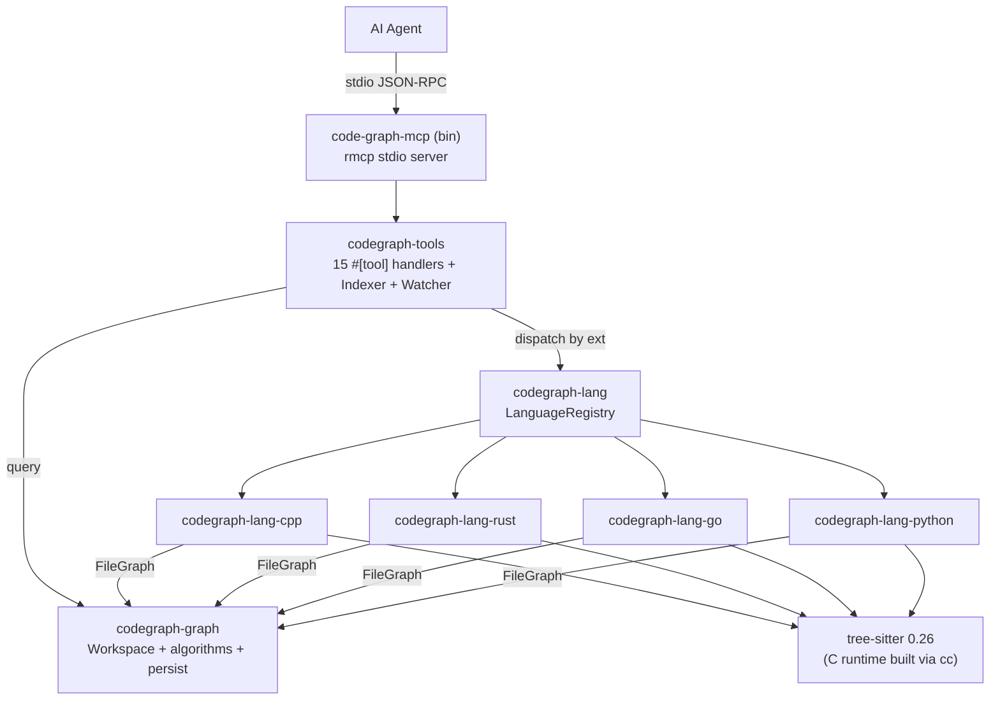
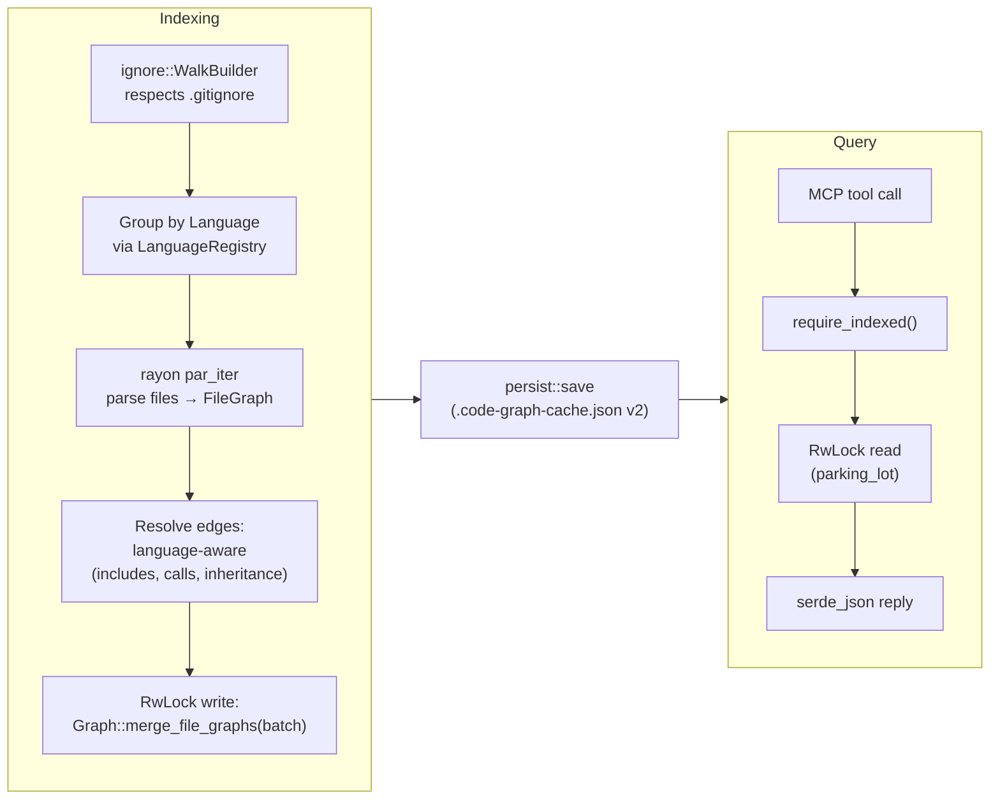

# Rust Rewrite of code-graph-mcp

## Overview

Wholesale port of `code-graph-mcp` from Go (mcp-go + go-tree-sitter via CGo) to Rust (rmcp + native tree-sitter crates). The Go codebase is retired in full; the Rust binary becomes the single supported implementation.

The rewrite is **feature-complete on day one** for everything currently shipped:

- C++ parser with all 7 documented limitations preserved (they are intentional, not bugs)
- 15 MCP tools (analyze_codebase, get_file_symbols, search_symbols, get_symbol_detail, get_symbol_summary, get_callers, get_callees, get_dependencies, detect_cycles, get_orphans, get_class_hierarchy, get_coupling, generate_diagram, watch_start, watch_stop)
- LLM-optimized output (brief default, namespace filter, pagination envelope, top-level-only, namespace summary, transitive class hierarchy with diamond-safe traversal)
- Mtime-based incremental re-index + JSON cache persistence
- fsnotify-style watch mode with debouncing
- Worker-pool indexing with MCP progress notifications

It additionally incorporates **the three planned-but-undelivered language parsers** (Rust, Go, Python) as first-class deliverables, replacing the Go-implementation plans wholesale. Every `Plans/{GoParser,PythonParser,RustParser}/` artifact is treated as input to be re-expressed against the Rust codebase, not preserved as-is.

It also introduces a deliberate **multi-language dispatch layer**: file extensions route to a language plugin that owns parsing, naming conventions, and scope-resolution heuristics, so a Python `__init__` can never collide with a C++ `init` during call resolution. The graph stores symbols tagged by language; queries can filter or scope by language; and the registry is the single point that "knows" which extensions belong to which source tree.

**What's intentionally out of scope:**
- Behavioral changes to the MCP tool surface (parameters, response shapes, did-you-mean wording stay identical so existing agent prompts keep working)
- Replacing the in-memory graph with a database
- Sub-file (tree-sitter incremental) re-parsing — file-level mtime checks remain the granularity
- Distribution/packaging changes beyond cross-compilation (no Homebrew/cargo-install polish in this design)
- **Multi-tenancy / cross-session graph sharing.** This rewrite ships the stdio-only, one-process-per-session model. Sharing one in-memory graph across multiple Claude sessions (and isolating multiple workspaces — git worktrees, Perforce streams, branch clones — within one daemon) is the planned next step *after* this rewrite stabilizes; the architecture is captured in **`Designs/SharedDaemon/`** and is intentionally deferred so the foundational port lands first. The `Workspace`-vs-`ServerInner` refactor that SharedDaemon needs is informed by — but not blocked by — this design's concurrency model.

---

## Goals

1. **Eliminate CGo build complexity.** No `CGO_ENABLED=1`, no glibc linkage, no per-platform `gcc/clang/mingw` lookup in the Makefile. Rust binaries cross-compile from a single host using `cargo-zigbuild`.
2. **Keep the wire-format contract.** Every MCP tool returns the same JSON keys and shapes. Existing `.code-graph-cache.json` cache files from the Go binary are *not* required to load (we ship cache version 2 and re-index on first run), but the schema is stable enough for future round-trips.
3. **Treat planned languages as part of the rewrite, not follow-on work.** The Rust binary ships C++ + Rust + Go + Python parsers in one go, in that priority order.
4. **Make multi-language a designed feature, not an emergent property.** Extension dispatch, language-scoped resolution, and language-aware search are explicit in the architecture.
5. **Apply every lesson from the LLMOptimization debrief** (`brief=true` default everywhere it makes sense, per-DFS-path cycle protection in tree expansions, UTF-8-safe truncation, wide candidate pools for did-you-mean, pagination envelopes).

## Non-Goals

- Semantic name resolution (the parser stays syntactic; overload resolution and template instantiation remain heuristic).
- Backwards compatibility with the Go binary's cache file or process.
- Async streaming of tool responses (rmcp supports it; we stay with single-shot text responses).
- Custom tree-sitter grammars or pure-Rust runtime experiments.

---

## Architecture

### Crate Layout

A Cargo workspace with one binary crate plus modular library crates per concern. Each language parser is its own crate so a future contributor can vendor a single grammar without rebuilding the whole tree.

```
code-graph-mcp/
├── Cargo.toml                  # workspace
├── Cargo.lock
├── rust-toolchain.toml         # pinned channel
├── crates/
│   ├── code-graph-mcp/         # bin: MCP server entry point
│   ├── codegraph-core/         # types: Symbol, Edge, FileGraph, SymbolKind, EdgeKind, Language
│   ├── codegraph-graph/        # in-memory Graph + algorithms + diagrams + persist
│   ├── codegraph-tools/        # MCP tool handlers + state guards + indexer + watcher
│   ├── codegraph-lang/         # LanguagePlugin trait + LanguageRegistry
│   ├── codegraph-lang-cpp/     # C++ parser (priority 1)
│   ├── codegraph-lang-rust/    # Rust parser (priority 2)
│   ├── codegraph-lang-go/      # Go parser  (priority 3)
│   ├── codegraph-lang-python/  # Python parser (priority 4)
│   └── codegraph-parse-test/   # bin: dev CLI harness equivalent of cmd/parse-test
└── testdata/
    ├── cpp/        # carried over from Go repo unchanged
    ├── rust/
    ├── go/
    └── python/
```

The split between `codegraph-graph` and `codegraph-tools` mirrors the Go layout (`internal/graph/` vs `internal/tools/`) and keeps the graph engine independent of MCP — it stays unit-testable with no async runtime.

### Component Overview



### Data Flow



### Language Dispatch (the multi-language source-tree concept)

The user-facing model: every file in the indexed directory belongs to exactly one **language source tree** identified by its extension. C++ headers and source (`.cpp .cc .cxx .c .h .hpp .hxx`) all dispatch to the C++ tree; `.rs` to the Rust tree; `.py .pyi` to the Python tree; `.go` to the Go tree. The registry is built once at startup and is the single mapping point.

```rust
// codegraph-core
#[derive(Copy, Clone, Eq, PartialEq, Hash, Serialize, Deserialize)]
pub enum Language { Cpp, Rust, Go, Python }

pub struct Symbol {
    pub language: Language,        // NEW: tag every symbol
    pub name: String,
    pub kind: SymbolKind,
    pub file: PathBuf,
    pub line: u32,
    pub column: u32,
    pub end_line: u32,
    pub signature: String,
    pub namespace: String,
    pub parent: String,
}

// codegraph-lang
pub trait LanguagePlugin: Send + Sync {
    fn id(&self) -> Language;
    fn extensions(&self) -> &'static [&'static str];
    fn parse_file(&self, path: &Path, content: &[u8]) -> Result<FileGraph, ParseError>;
    /// Language-specific call resolution. Default impl mirrors the Go heuristic
    /// (same file > same parent > same namespace > global). Languages override
    /// to add language-specific scoping (e.g. Python prefers same-module).
    fn resolve_call(&self, callee: &str, ctx: &CallContext, index: &SymbolIndex) -> Option<SymbolId> {
        default_scope_aware_resolve(callee, ctx, index)
    }
    /// Optional: language-specific include/import resolution (e.g. Go modules
    /// resolve to package paths, not file paths; Python import paths are dotted).
    fn resolve_include(&self, raw: &str, file_index: &FileIndex) -> Option<PathBuf> {
        default_basename_resolve(raw, file_index)
    }
}

pub struct LanguageRegistry {
    by_ext: HashMap<&'static str, Language>,
    plugins: HashMap<Language, Box<dyn LanguagePlugin>>,
}

impl LanguageRegistry {
    pub fn for_path(&self, p: &Path) -> Option<&dyn LanguagePlugin> {
        let ext = p.extension()?.to_str()?.to_ascii_lowercase();
        self.by_ext.get(ext.as_str()).and_then(|l| self.plugins.get(l).map(|b| &**b))
    }
}
```

Why a single `Graph` (not per-language sub-graphs):

- 99% of queries are language-scoped *implicitly* by where the agent points them (file path, symbol ID). The remaining 1% (cross-language search by name, full-graph cycle detection) want a unified view.
- Per-language sharded graphs would force every cross-cutting query (`get_symbol_summary`, `search_symbols` without a language filter, the Mermaid file-graph centered on a polyglot directory) to merge results, which is exactly the cost we'd be trying to avoid.
- Tagging every `Symbol` with `language` gets us both: cheap full-graph queries when wanted, fast filters when not.

### Symbol IDs and Cross-Language Disambiguation

Symbol ID format is unchanged from Go: `file:Name` for free functions/classes, `file:Parent::Name` for methods. Because the file path uniquely identifies the language (via extension), language is implicit in the ID and we don't widen the ID format. Search and resolution explicitly filter by language so a Python `init` and a C++ `init` cannot collide during call edge resolution.

For agent ergonomics, `search_symbols` gains an optional `language` parameter (alongside the existing `kind` and `namespace`). Default behavior is unchanged — search is global.

### MCP Server (rmcp)

Replaces the mcp-go `server.NewMCPServer` + `s.AddTool` + `server.ServeStdio` chain with the rmcp macro-driven pattern.

```rust
// crates/code-graph-mcp/src/main.rs
use rmcp::{ServerHandler, ServiceExt, transport::stdio};

#[tokio::main]
async fn main() -> anyhow::Result<()> {
    let registry = build_default_registry()?;
    let server = CodeGraphServer::new(registry);
    server.serve(stdio()).await?.waiting().await?;
    Ok(())
}

// crates/codegraph-tools/src/lib.rs
#[derive(Clone)]
pub struct CodeGraphServer {
    inner: Arc<ServerInner>,
}

struct ServerInner {
    graph: RwLock<Graph>,                       // parking_lot
    registry: LanguageRegistry,
    indexed: AtomicBool,
    index_lock: tokio::sync::Mutex<()>,         // exclusive analyze_codebase
    root_path: RwLock<Option<PathBuf>>,
    watch: RwLock<Option<WatchHandle>>,
}

#[tool_router]
impl CodeGraphServer {
    #[tool(description = "Index a codebase and build the code graph...")]
    async fn analyze_codebase(
        &self,
        Parameters(args): Parameters<AnalyzeArgs>,
        peer: Peer<RoleServer>,
    ) -> Result<CallToolResult, McpError> { /* ... */ }

    // ... 14 more #[tool] handlers ...
}

#[tool_handler]
impl ServerHandler for CodeGraphServer { /* default impl */ }
```

The `#[tool_router]` macro generates the dispatch table; `#[tool_handler]` wires it to the `ServerHandler` trait that rmcp's stdio loop expects. Tool descriptions and JSON schemas are derived from doc comments and parameter structs (`schemars`-derived). Progress notifications during `analyze_codebase` are sent via `peer.notify_progress(...)`.

Key adaptation from Go: handlers are `async`, and the parsing pool runs synchronously inside `tokio::task::spawn_blocking` so the rayon pool doesn't starve the tokio reactor.

### Concurrency Model

```mermaid
sequenceDiagram
    participant A as Agent
    participant T as Tokio handler
    participant B as spawn_blocking
    participant D as Discovery pool<br/>(ignore::WalkBuilder, N=cfg.discovery.max_threads)
    participant R as Parsing pool<br/>(rayon, N=cfg.parsing.max_threads)
    participant G as Graph (RwLock)

    A->>T: analyze_codebase
    T->>T: index_lock.try_lock()
    T->>T: RootConfig::load(.code-graph.toml)
    T->>B: spawn_blocking(index_phase)
    B->>D: build_parallel().run() — extension-filtered walk
    D-->>B: Vec<DiscoveredFile>
    B->>R: pool.install(|| par_iter(files).map(parse))
    R-->>B: Vec<FileGraph>
    B->>B: resolve_edges (sequential, language-aware)
    B->>G: write lock; merge; write
    G-->>B: ok
    B-->>T: AnalyzeResult
    T-->>A: JSON (incl. concurrency-clamp warnings)
```

Locking rules:

- `Graph` is wrapped in `parking_lot::RwLock`. Query handlers take a read lock for the duration of the query and serialize the response.
- `analyze_codebase` takes a single write lock on the graph for the *merge* phase only — parsing happens with no lock held.
- A `tokio::sync::Mutex` (the **index lock**) prevents concurrent `analyze_codebase` calls from racing each other. `try_lock` returns "indexing already in progress" identical to the Go behavior.
- **Watch-driven `reindex_file` also acquires the index lock.** This is the locking rule that closes the race the Go implementation has: the Go `reindex_file` reads a file/symbol snapshot under a graph read-lock, drops it, resolves edges, then takes the graph write-lock to merge — but in the gap, an `analyze_codebase` could clear-and-rebuild the graph, leaving the watch-merge with stale edge targets. In Rust, `reindex_file` acquires the index lock for the entire snapshot+resolve+merge sequence so a concurrent `analyze_codebase` is serialized behind it.
- **Watch event arrival during an active analyze**: when the watch loop receives a debounced event, it first attempts `index_lock.try_lock()`. If the lock is held (because `analyze_codebase` is running), the event is **dropped** rather than queued — the in-flight analyze will pick up the file's current state anyway. This avoids both the race and an unbounded queue of stale events. (The Go code does not have this guard; the Rust port adds it.)
- **Sequencing at startup**: `watch_start` calls `require_indexed()` first, identical to Go. So a watch loop is only ever spawned after the first successful analyze. There is no "events fire before initial index completes" window.

### State Management

```rust
pub struct ServerInner {
    graph: RwLock<Graph>,
    registry: LanguageRegistry,
    indexed: AtomicBool,                 // any successful analyze sets this
    index_lock: tokio::sync::Mutex<()>,  // single-flight analyze_codebase
    root_path: RwLock<Option<PathBuf>>,  // last indexed dir; needed for watch
    watch: RwLock<Option<WatchHandle>>,  // active watcher, if any
    config: RwLock<RootConfig>,          // last-loaded .code-graph.toml; see Configuration
}

fn require_indexed(&self) -> Result<(), McpError> {
    if !self.indexed.load(Ordering::Acquire) {
        return Err(McpError::tool_error(
            "no codebase indexed — call analyze_codebase first",
        ));
    }
    Ok(())
}
```

Every query handler calls `self.require_indexed()` first, identical to the Go pattern.

---

## Interfaces

### Core Types (`codegraph-core`)

```rust
#[derive(Copy, Clone, Eq, PartialEq, Hash, Debug, Serialize, Deserialize)]
#[serde(rename_all = "lowercase")]
pub enum Language { Cpp, Rust, Go, Python }

#[derive(Copy, Clone, Eq, PartialEq, Hash, Debug, Serialize, Deserialize)]
#[serde(rename_all = "lowercase")]
pub enum SymbolKind {
    Function, Method, Class, Struct, Enum,
    Typedef, Interface, Trait,                // Interface for Go, Trait for Rust
}

#[derive(Copy, Clone, Eq, PartialEq, Hash, Debug, Serialize, Deserialize)]
#[serde(rename_all = "lowercase")]
pub enum EdgeKind { Calls, Includes, Inherits }

#[derive(Clone, Debug, Serialize, Deserialize)]
pub struct Symbol {
    pub language: Language,
    pub name: String,
    pub kind: SymbolKind,
    pub file: PathBuf,
    pub line: u32,
    pub column: u32,
    pub end_line: u32,
    pub signature: String,
    #[serde(skip_serializing_if = "String::is_empty", default)]
    pub namespace: String,
    #[serde(skip_serializing_if = "String::is_empty", default)]
    pub parent: String,
}

#[derive(Clone, Debug, Serialize, Deserialize)]
pub struct Edge {
    pub from: String,
    pub to: String,
    pub kind: EdgeKind,
    pub file: PathBuf,
    pub line: u32,
}

pub struct FileGraph {
    pub path: PathBuf,
    pub language: Language,
    pub symbols: Vec<Symbol>,
    pub edges: Vec<Edge>,
}
```

The shape is structurally identical to the Go `parser.Symbol` / `parser.Edge` / `parser.FileGraph`, with `Language` added to `Symbol` (and `FileGraph` for indexing telemetry). `KindInterface` and `KindTrait` are added now rather than added later, removing the migration step that the Go GoParser/RustParser plans called out.

### Graph Engine (`codegraph-graph`)

```rust
pub struct Graph {
    nodes: HashMap<SymbolId, Node>,
    adj:   HashMap<SymbolId, Vec<EdgeEntry>>, // out edges
    radj:  HashMap<SymbolId, Vec<EdgeEntry>>, // reverse
    files: HashMap<PathBuf, FileEntry>,       // path -> {language, symbol_ids}
    includes: HashMap<PathBuf, Vec<PathBuf>>,
}

pub struct FileEntry {
    pub language: Language,
    pub symbol_ids: Vec<SymbolId>,
}

pub type SymbolId = String; // "path:Name" or "path:Parent::Name"

impl Graph {
    pub fn merge_file_graph(&mut self, fg: FileGraph) { /* identical to Go */ }
    pub fn remove_file(&mut self, path: &Path) { /* identical to Go */ }
    pub fn clear(&mut self);

    // Query methods (mirror Go signatures)
    pub fn file_symbols(&self, path: &Path) -> Vec<&Symbol>;
    pub fn symbol_detail(&self, id: &SymbolId) -> Option<&Symbol>;
    pub fn search(&self, params: SearchParams) -> SearchResult;
    pub fn symbol_summary(&self, file: Option<&Path>) -> SummaryByNamespace;
    pub fn callers(&self, id: &SymbolId, depth: u32) -> Vec<CallChain>;
    pub fn callees(&self, id: &SymbolId, depth: u32) -> Vec<CallChain>;
    pub fn file_dependencies(&self, path: &Path) -> Vec<PathBuf>;
    pub fn detect_cycles(&self) -> Vec<Vec<PathBuf>>;
    pub fn orphans(&self, kind: Option<SymbolKind>) -> Vec<&Symbol>;
    /// Returns the inheritance tree for a named symbol. The starting symbol must
    /// have `kind` in `{Class, Struct, Interface, Trait}`. Widening from the Go
    /// `{Class, Struct}` filter is required by the new Go (Interface) and Rust
    /// (Trait) parsers — without it, a Rust trait hierarchy lookup would return
    /// `None` even when correctly indexed. Diamond-safe via per-DFS-path tracking.
    pub fn class_hierarchy(&self, class: &str, depth: u32) -> Option<HierarchyNode>;
    pub fn coupling(&self, path: &Path) -> HashMap<PathBuf, u32>;
    pub fn incoming_coupling(&self, path: &Path) -> HashMap<PathBuf, u32>;
    pub fn diagram_call_graph(&self, id: &SymbolId, depth: u32, max_nodes: u32) -> Option<DiagramResult>;
    pub fn diagram_file_graph(&self, file: &Path, depth: u32, max_nodes: u32) -> Option<DiagramResult>;
    pub fn diagram_inheritance(&self, class: &str, depth: u32, max_nodes: u32) -> Option<DiagramResult>;

    pub fn stats(&self) -> GraphStats;
    pub fn all_file_paths(&self) -> Vec<&Path>;
    pub fn all_symbols(&self) -> Vec<&Symbol>;
}

pub struct SearchParams {
    pub pattern: String,
    pub kind: Option<SymbolKind>,
    pub namespace: String,         // substring filter
    pub language: Option<Language>, // NEW: per-language search
    pub limit: u32,                // default 20
    pub offset: u32,               // default 0
}

pub struct SearchResult {
    pub symbols: Vec<Symbol>,
    pub total: u32,
}
```

**Wire-format invariant — collections never serialize as `null`.** Every method that returns a collection (`file_symbols`, `file_dependencies`, `detect_cycles`, `orphans`, `coupling`, `incoming_coupling`, `all_file_paths`, `all_symbols`, `SearchResult::symbols`) returns `Vec<_>` (or `HashMap<_>`), never `Option<Vec<_>>`. An empty result serializes as `[]` (or `{}`), not `null`. This is the LLMOptimization debrief carry-forward — the Go implementation regressed this for `get_file_symbols` once already (`var results []symbolResult` → `null`), and it's now structurally impossible in Rust by choice of return type. The same rule extends to handler-side response envelopes: `SearchResponse::results` is `Vec<SymbolResult>` (initialized empty, not `Option`), and the diagram `edges-JSON` format always returns `[]` for an empty diagram, not `null`.

Algorithms ported as-is:

- BFS for `callers` / `callees` with a `visited` set (handles cycles).
- Tarjan's SCC for `detect_cycles` over the include graph.
- Per-DFS-path tracking (`on_path: HashSet<&str>` with insert-on-enter / remove-on-leave) for `class_hierarchy` so diamond inheritance fully expands shared ancestors. **This is the post-implementation fix from the LLMOptimization debrief, ported in from day one — no chance to regress it.**
- Tarjan recursion stack uses an explicit `Vec` rather than recursion to avoid stack overflow on huge include graphs (the Go version recursed; we get this for free in Rust by making it iterative).

### MCP Tools (15)

The tool surface, parameters, and JSON response shapes are unchanged. Every tool maps 1:1 to a Go handler in `internal/tools/`.

| Tool | Same parameters as Go? | Notes |
|---|---|---|
| `analyze_codebase` | yes (`path`, `force`) | Adds optional `language` filter (advanced; default = all languages). Progress notifications via `peer.notify_progress`. |
| `get_file_symbols` | yes (`file`, `top_level_only`, `brief`) | `brief` defaults `true`. |
| `search_symbols` | yes + new `language` | `language` filter ('cpp' \| 'rust' \| 'go' \| 'python'); `brief` defaults `true`; `limit` default 20; pagination envelope `{results, total, offset, limit}`. **Validation:** at least one of `query`, `kind`, `namespace`, **or `language`** must be provided — a `language`-only search is explicitly accepted (Go's "at least one filter" guard is widened to include the new parameter rather than left to silently reject the new use case). |
| `get_symbol_detail` | yes (`symbol`) | Always full detail (`brief=false` semantics). Did-you-mean uses 100-candidate pool. |
| `get_symbol_summary` | yes (`file`) | Per-namespace counts grouped by kind. |
| `get_callers` | yes (`symbol`, `depth`) | Did-you-mean on symbol-not-found. |
| `get_callees` | yes (`symbol`, `depth`) | |
| `get_dependencies` | yes (`file`) | Returns `[]` (empty array, never `null`) when the file has no include edges or is unknown to the graph. |
| `detect_cycles` | yes (no params) | |
| `get_orphans` | yes (`kind`) | Default = callables only. |
| `get_class_hierarchy` | yes (`class`, `depth`) | Diamond-safe. |
| `get_coupling` | yes (`file`, `direction`) | `outgoing` / `incoming` / `both`. |
| `generate_diagram` | yes (`symbol` \| `file` \| `class`, `depth`, `max_nodes`, `format`, `styled`) | Mermaid + edges-JSON. |
| `watch_start` | yes (no params) | Uses `notify-debouncer-full` instead of raw fsnotify. Debounce window 250 ms. |
| `watch_stop` | yes (no params) | Returns error `"watch mode is not active"` when called while not watching (mirrors Go behavior). |

The wire-format guarantee is what protects existing agent prompts from breaking. Test coverage for that guarantee is in the Testing Strategy section below.

### Persistence (`codegraph-graph::persist`)

```rust
#[derive(Serialize, Deserialize)]
struct GraphCache {
    version: u32,                                  // 2 (incompatible with Go's v1)
    generator: String,                             // "code-graph-mcp/rust-0.x"
    nodes: HashMap<SymbolId, Symbol>,
    adj: HashMap<SymbolId, Vec<EdgeEntry>>,
    radj: HashMap<SymbolId, Vec<EdgeEntry>>,
    files: HashMap<PathBuf, FileEntry>,            // includes Language now
    includes: HashMap<PathBuf, Vec<PathBuf>>,
    mtimes: HashMap<PathBuf, i64>,                 // unix nanos, identical to Go
}
```

Cache file name remains `.code-graph-cache.json`. We bump the version to 2 because `FileEntry` widens to carry `Language`. A v1 file is silently re-indexed on first load (matching Go's `cache.Version != 1` → `return false` behavior).

`stale_paths(dir)` and `cache_path(dir)` retain their Go signatures.

**Atomic save.** `Graph::save(dir)` writes the JSON to `<dir>/.code-graph-cache.json.tmp`, calls `File::sync_all()` to flush, then `std::fs::rename` to swap atomically. This closes the partial-write window the Go implementation has (a crash mid-`os.WriteFile` leaves a partial cache that fails to load on the next start, forcing an unnecessary full re-index). On Windows, `rename` is replaced via `std::fs::rename` semantics which (since Rust 1.66 on NTFS) atomically replaces the destination if it exists. This is referenced in the Risks & Mitigations table; it's stated here so implementors don't miss it.

### Watch Mode

`notify-debouncer-full` replaces the raw `fsnotify.Watcher`. The Go implementation's per-event reaction is racy on bursty saves (editors emit `Remove`+`Create` for atomic saves; some IDEs emit 3-5 events per save); the debouncer coalesces them into a single re-parse per file per debounce window (250 ms).

```rust
pub struct WatchHandle {
    debouncer: Debouncer<RecommendedWatcher, FileIdMap>,
    cancel: tokio::sync::oneshot::Sender<()>,
}

async fn watch_loop(
    server: Arc<ServerInner>,
    mut events: tokio::sync::mpsc::Receiver<DebouncedEvent>,
    cancel: tokio::sync::oneshot::Receiver<()>,
) {
    tokio::pin!(cancel);
    loop {
        tokio::select! {
            _ = &mut cancel => return,
            Some(ev) = events.recv() => {
                for path in ev.paths {
                    server.reindex_file(&path, matches!(ev.kind, EventKind::Remove(_))).await;
                }
            }
        }
    }
}
```

`reindex_file` mirrors `Tools.reindexFile` from `internal/tools/watch.go`: build a fresh file/symbol index from the current graph, run language-aware edge resolution against it, then `merge_file_graph`.

### Configuration (`codegraph-core::config`)

Performance on massive codebases is dictated as much by *discovery* (walking millions of paths) as by parsing. The Go implementation has a single `filepath.Walk` goroutine and is already a bottleneck on monorepos in the 100k+ file range. The Rust port replaces this with an **explicitly thread-pool-driven discovery walker** whose concurrency is configurable, with sane defaults and a hard cap at logical CPU count to prevent users from oversubscribing the host.

A TOML configuration file at the **root of the indexed directory** controls discovery and parsing concurrency:

```toml
# <root>/.code-graph.toml — optional; missing-file behavior is documented defaults

[discovery]
# Parallelism for the source-discovery walker. 0 = auto (NumCPU).
# Hard-capped at NumCPU at load time; values above the cap are clamped with a warning.
max_threads = 0
respect_gitignore = true       # use `ignore::WalkBuilder` defaults (.gitignore, .ignore, global)
follow_symlinks = false        # match Go's default
extra_ignore = []              # additional glob patterns excluded from discovery

[parsing]
# Parallelism for the rayon parsing pool. 0 = auto (NumCPU). Hard-capped at NumCPU.
max_threads = 0
```

```rust
// codegraph-core/src/config.rs
#[derive(Clone, Debug, Deserialize, Default)]
pub struct RootConfig {
    #[serde(default)]
    pub discovery: DiscoveryConfig,
    #[serde(default)]
    pub parsing: ParsingConfig,
}

#[derive(Clone, Debug, Deserialize)]
pub struct DiscoveryConfig {
    #[serde(default)]
    pub max_threads: usize,         // 0 means "auto"
    #[serde(default = "yes")]
    pub respect_gitignore: bool,
    #[serde(default)]
    pub follow_symlinks: bool,
    #[serde(default)]
    pub extra_ignore: Vec<String>,
}

impl RootConfig {
    /// Load `<root>/.code-graph.toml`. Returns Default if absent. Returns errors
    /// only on TOML parse failure; we never silently ignore a malformed config.
    pub fn load(root: &Path) -> Result<Self, ConfigError> { /* ... */ }

    /// Resolve `0` → auto and clamp to NumCPU. Called once at analyze entry,
    /// after load, before either pool is constructed.
    pub fn resolve_concurrency(&mut self) -> Vec<String> {
        let cap = std::thread::available_parallelism().map(|n| n.get()).unwrap_or(1);
        let mut warnings = Vec::new();
        for (label, n) in [("discovery", &mut self.discovery.max_threads),
                           ("parsing",   &mut self.parsing.max_threads)] {
            if *n == 0 { *n = cap; }
            else if *n > cap {
                warnings.push(format!("{label}.max_threads={n} exceeds NumCPU={cap}; clamping to {cap}"));
                *n = cap;
            }
        }
        warnings
    }
}
```

The config file itself never contains the cap; the cap is enforced at load time against the running host's `available_parallelism()`. This means the same config is portable across hosts: a `max_threads = 0` (auto) always picks the right value, and a user-pinned `max_threads = 16` on a 32-core host runs at 16 but on a 4-core host gets clamped to 4 (with a warning surfaced via the `analyze_codebase` response's `warnings` array — same channel the existing parse-error warnings use).

**Loading semantics:** `analyze_codebase` calls `RootConfig::load(absolute_root)` at entry, before any walking starts. Missing file → `RootConfig::default()` (both pools auto-sized to NumCPU). Parse errors → `analyze_codebase` returns an `McpError::tool_error` with the TOML diagnostic — we don't silently fall back, because a typo in a thread-count is the kind of silent perf-degradation that wastes hours. The loaded config is stored on `ServerInner.config` so the watch loop's `reindex_file` and any subsequent re-analyze use the same settings without re-reading the file.

### Discovery (parallel walker)

`codegraph-tools::discovery` owns the parallel walker. It's the single point that combines (1) the language registry's extension table, (2) `.gitignore` semantics from `ignore::WalkBuilder`, and (3) the user-controlled `discovery.max_threads`.

```rust
pub struct Discovered {
    pub files: Vec<DiscoveredFile>,
    pub warnings: Vec<String>,
}

pub struct DiscoveredFile {
    pub path: PathBuf,
    pub language: Language,
}

pub fn discover(
    root: &Path,
    registry: &LanguageRegistry,
    cfg: &DiscoveryConfig,
    progress: &dyn ProgressSink,
) -> Discovered {
    let (tx, rx) = crossbeam_channel::unbounded::<DiscoveredFile>();
    let warnings_tx = crossbeam_channel::unbounded::<String>().0;

    let mut builder = ignore::WalkBuilder::new(root);
    builder
        .threads(cfg.max_threads)               // <-- the explicit thread-pool knob
        .standard_filters(cfg.respect_gitignore) // .gitignore, .git/info/exclude, global ignore
        .follow_links(cfg.follow_symlinks)
        .hidden(false);                          // we still descend into dotfile dirs unless ignored

    for pat in &cfg.extra_ignore {
        builder.add_ignore_path_from_pattern(pat).ok();
    }

    builder.build_parallel().run(|| {
        let tx = tx.clone();
        let warn = warnings_tx.clone();
        // The closure is invoked once per worker thread; it returns a per-entry handler.
        Box::new(move |entry| {
            match entry {
                Ok(e) if e.file_type().map(|t| t.is_file()).unwrap_or(false) => {
                    if let Some(lang) = registry.language_for_path(e.path()) {
                        let _ = tx.send(DiscoveredFile {
                            path: e.into_path(),
                            language: lang,
                        });
                    }
                    // Files with no registered extension are silently skipped — this
                    // is the "supported languages" filter the user requested.
                }
                Err(err) => { let _ = warn.send(format!("walk error: {err}")); }
                _ => {}
            }
            ignore::WalkState::Continue
        })
    });

    drop(tx);
    let files: Vec<_> = rx.into_iter().collect();
    progress.report(0, files.len(), &format!(
        "Discovered {} source files across {} languages",
        files.len(),
        files.iter().map(|f| f.language).collect::<HashSet<_>>().len()
    ));
    Discovered { files, warnings: drain_warnings(warnings_tx) }
}
```

Key properties:

- **Workers are bounded by config.** `WalkBuilder::threads(N)` is the knob; the discovery pool is independent of rayon's parsing pool. The two pools never run simultaneously on overlapping work, so they do not contend — discovery completes before parsing begins.
- **Filtering is in-thread, not post-walk.** Each worker checks `registry.language_for_path` against the visited path; non-source files are dropped immediately. We never collect a million `.o` / `.png` / `node_modules/*.js` entries into a `Vec` only to filter them out later.
- **Cross-thread collection is via `crossbeam-channel`.** `Sender`/`Receiver` are `Send + Sync` and lock-free for SPSC/MPSC use; no `Mutex<Vec>` contention. The receiver is drained on the main thread once all workers exit.
- **Walk warnings (permission denied, broken symlinks) flow via a sibling channel** and surface in the `analyze_codebase` warnings array alongside parse warnings, identical to the Go behavior.

**Why a separate pool from rayon's parsing pool.** The discovery workload is I/O-bound (`stat`, `readdir`); the parsing workload is CPU-bound (tree-sitter). Sharing a thread pool would either (a) leave parsing-sized cores idle during discovery or (b) leave discovery-sized cores I/O-blocked during parsing. Sizing them independently — and letting users tune them independently in `.code-graph.toml` — is the correct factoring. Default values are the same (`NumCPU` for both), so the no-config-file user gets sensible behavior automatically.

### Indexer

The indexer (in `codegraph-tools::indexer`) is the workhorse. It replaces `internal/tools/analyze.go`. It composes config loading, discovery, and parsing into the three-phase flow.

```rust
pub struct IndexResult {
    pub files: usize,
    pub symbols: usize,
    pub edges: usize,
    pub root_path: PathBuf,
    pub warnings: Vec<String>,
}

pub fn index_directory(
    root: &Path,
    registry: &LanguageRegistry,
    cfg: &RootConfig,
    progress: &dyn ProgressSink,
) -> Result<Vec<FileGraph>, IndexError> {
    // 1. Discover source files in parallel (config.discovery.max_threads).
    let discovered = discovery::discover(root, registry, &cfg.discovery, progress);

    // 2. Build a per-job rayon pool sized by config.parsing.max_threads.
    //    A scoped pool prevents `analyze_codebase` from monopolizing rayon's
    //    global pool, which other concurrent work (search, BFS) could touch.
    let pool = rayon::ThreadPoolBuilder::new()
        .num_threads(cfg.parsing.max_threads)
        .thread_name(|i| format!("codegraph-parse-{i}"))
        .build()
        .map_err(IndexError::PoolInit)?;

    // 3. Parse files in parallel inside that pool.
    let total = discovered.files.len();
    let counter = std::sync::atomic::AtomicUsize::new(0);
    let parsed: Vec<FileGraph> = pool.install(|| {
        discovered.files
            .par_iter()
            .map(|df| {
                let plugin = registry.plugin_for(df.language);
                let content = std::fs::read(&df.path)?;
                let fg = plugin.parse_file(&df.path, &content)?;
                let n = counter.fetch_add(1, Ordering::Relaxed) + 1;
                progress.report(n, total, &format!("Parsing: {}", df.path.display()));
                Ok::<_, IndexError>(fg)
            })
            .collect::<Result<_, _>>()
    })?;

    Ok(parsed)
}

pub fn resolve_all_edges(
    fgs: &mut [FileGraph],
    registry: &LanguageRegistry,
) {
    let file_index = build_file_index(fgs);
    let symbol_index = build_symbol_index(fgs);
    for fg in fgs.iter_mut() {
        let plugin = registry.plugins.get(&fg.language).unwrap();
        for edge in &mut fg.edges {
            match edge.kind {
                EdgeKind::Includes => {
                    if let Some(p) = plugin.resolve_include(&edge.to, &file_index) {
                        edge.to = p.to_string_lossy().into_owned();
                    }
                }
                EdgeKind::Calls => {
                    let ctx = CallContext { caller: &edge.from, file: &fg.path, language: fg.language };
                    if let Some(id) = plugin.resolve_call(&edge.to, &ctx, &symbol_index) {
                        edge.to = id;
                    }
                }
                EdgeKind::Inherits => { /* unchanged */ }
            }
        }
    }
}
```

**Progress notifications across the rayon ↔ tokio boundary.** The rayon parse pool runs inside `tokio::task::spawn_blocking`, so it cannot directly await `peer.notify_progress(...)`. Instead, the indexer takes a `tokio::sync::mpsc::Sender<ProgressEvent>` and pushes events from rayon worker threads (`Sender` is `Send + Sync`, blocking-thread-safe). A small tokio task — spawned by the `analyze_codebase` handler before `spawn_blocking` — owns the receiver and forwards each event to `peer.notify_progress`. When the blocking job completes, the sender is dropped and the receiver task exits cleanly. This pattern avoids requiring `Peer<RoleServer>: Send` to cross the blocking boundary (rmcp 1.5 makes no such guarantee for the trait object) and matches the Go implementation's "post-parse goroutine" trick that had to exist anyway because mcp-go's stdio transport doesn't reliably flush notifications from the handler goroutine.

```rust
// crates/codegraph-tools/src/indexer.rs
pub trait ProgressSink: Send + Sync {
    fn report(&self, progress: usize, total: usize, message: &str);
}

pub struct ChannelProgressSink(tokio::sync::mpsc::Sender<ProgressEvent>);
// blocking_send because we're called from rayon threads, not async context
impl ProgressSink for ChannelProgressSink {
    fn report(&self, progress: usize, total: usize, message: &str) {
        let _ = self.0.try_send(ProgressEvent { progress, total, message: message.into() });
        // try_send drops events if the channel is full — progress is best-effort
    }
}
```

Two changes from Go:

1. **Walking uses `ignore::WalkBuilder`** instead of `filepath.Walk`. This automatically respects `.gitignore`, `.git/info/exclude`, and global git ignore — fixing a real complaint from the 8,908-file C++ codebase usage where `build/`, `.cache/`, and `node_modules/` directories needed manual exclusion. (Adds an env-overridable `--no-ignore` knob via the `force` flag for parity, although that flag's primary purpose remains "skip cache".)
2. **Edge resolution is per-language**. The Go implementation has a single `resolveCall` and `resolveInclude` shared across all (one) parsers; the Rust version dispatches via `LanguagePlugin::resolve_call` / `resolve_include` so Python's import resolution doesn't run C++'s basename matching, and Go's package paths aren't filename-matched.

Index symbols are scoped to a single `Language` per entry to make cross-language collisions impossible during call resolution:

```rust
pub struct SymbolIndex {
    by_name: HashMap<(Language, String), Vec<SymbolEntry>>,
}
```

This is a meaningful behavior change vs the Go implementation, and it's the main place the multi-language design pays off.

---

## Per-Language Parsers

The four parsers live in separate crates with parallel structure:

```
crates/codegraph-lang-cpp/
├── src/
│   ├── lib.rs                # CppParser struct, NewCppParser equivalent
│   ├── queries.rs            # const QUERY strings (definitions, calls, includes, inheritance)
│   ├── extract.rs            # extract_definitions, extract_calls, extract_includes, extract_inheritance
│   ├── helpers.rs            # find_enclosing_kind, resolve_namespace, resolve_parent_class, split_qualified, strip_include_path, truncate_signature, is_cpp_cast
│   └── tests.rs
└── Cargo.toml
```

### C++ Parser (priority 1 — port the existing implementation)

**Source of truth**: `internal/lang/cpp/cpp.go` and `internal/lang/cpp/queries.go`. The Rust parser is a behavior-preserving port — same query strings (they target tree-sitter-cpp 0.23.4, identical version), same node-walking helpers, same symbol shapes.

The 7 documented limitations from `CLAUDE.md` are preserved verbatim:

1. Macro-generated definitions invisible to tree-sitter
2. Complex template metaprogramming may produce error nodes (skipped)
3. Call resolution is heuristic (scope-aware, not semantic)
4. C++ cast expressions filtered (`is_cpp_cast`)
5. Forward declarations excluded
6. Template method calls (`obj.foo<T>()`) fall through to method-call pattern
7. Function pointer typedefs handled via the alternation pattern in queries.rs

Test corpus: every test in `internal/lang/cpp/cpp_test.go` is ported to Rust with `pretty_assertions::assert_eq` and `rstest` parameterized cases. The 24-test corpus becomes the smoke-test suite for the C++ parser.

The signature truncation function is rewritten in Rust:

```rust
pub fn truncate_signature(s: &str) -> String {
    for (i, c) in s.char_indices() {
        if c == '{' || c == ';' {
            return s[..i].trim_end_matches([' ', '\t', '\n', '\r']).to_owned();
        }
        if i >= 200 {
            // i is on a char boundary by construction (char_indices)
            return format!("{}...", &s[..i]);
        }
    }
    s.to_owned()
}
```

`char_indices` guarantees `i` is a UTF-8 boundary, eliminating the `s[:200]` mid-rune slicing bug from the Go implementation by construction.

### Rust Parser (priority 2 — replaces `Plans/RustParser/`)

Same query patterns as the planned Go-based Rust parser, expressed in the Rust crate:

- `function_item` for free functions and impl methods (distinguished by enclosing `impl_item`)
- `struct_item` / `enum_item` / `trait_item` / `type_item` for definitions
- `mod_item` populates `Symbol.namespace`
- `impl_item.type` provides `Symbol.parent` for methods. **Trait-impl disambiguation:** for `impl Trait for Type { fn method }`, `Symbol.parent` is always the *implementing type* (`Type`), not the trait name. The trait relationship is captured separately via `EdgeKind::Inherits`. This rule is load-bearing: if `parent` were ever set to the trait, the symbol ID `file:Type::method` would not resolve and the method would be unreachable from `get_callers` / `get_callees`.
- `impl Trait for Type` produces `EdgeKind::Inherits` from Type to Trait
- `use_declaration` is recursively expanded for `use foo::{a, b}`, `use foo::*`, aliased imports
- `macro_invocation` produces call edges (matches LegacyGraph-MCP behavior)

Trait kind: `SymbolKind::Trait`. `class_hierarchy` accepts traits alongside classes/structs/interfaces.

The `use_tree` recursive expansion is the most novel logic; a dedicated helper module (`use_tree.rs`) walks the nested `use_list` / `scoped_use_list` / `use_wildcard` / `use_as_clause` nodes and emits one include edge per terminal name, joining the parent scope to each leaf.

### Go Parser (priority 3 — replaces `Plans/GoParser/`)

- `function_declaration` / `method_declaration` for free funcs and methods
- Method receivers extracted from `receiver: (parameter_list ...)` — pointer or value receiver both yield the same `parent`
- `type_spec` with `struct_type` → struct; with `interface_type` → interface
- `package_clause` → namespace
- `import_spec` → include edges; both single and grouped imports; `import f "fmt"` records the path, not the alias
- Calls captured at two patterns (mirroring `Plans/GoParser/01-Foundation-And-Core.md` task 1.6): `call_expression > function: (identifier)` for direct free-function calls (`foo()`, `helper()`) and `call_expression > function: (selector_expression field: (field_identifier))` for method and package-qualified calls (`obj.Method()`, `fmt.Println()`)
- `go` and `defer` statements wrap call expressions and are captured naturally

`SymbolKind::Interface` is used for Go interfaces. There are no inheritance edges (Go interfaces are structural; deciding implementation requires type checking).

### Python Parser (priority 4 — replaces `Plans/PythonParser/`)

- `function_definition` distinguished method vs free function via enclosing `class_definition`
- `class_definition` → class; `superclasses: argument_list` → inherit edges
- `decorated_definition` does not block matching (queries match the inner node)
- `call` (not `call_expression`) for invocations
- `import_statement` and `import_from_statement` produce include edges keyed by the *module path*, not the imported symbol name (per the Python parser plan)
- `__init__` etc. are ordinary methods

Extensions: `.py`, `.pyi`.

---

## Design Decisions

### Decision 1: rmcp vs alternative MCP SDKs

**Context:** Go uses `mark3labs/mcp-go`. Rust has multiple MCP SDKs; the official one (`rmcp`) only stabilized in the last several months.

**Options:**
1. `rmcp` (modelcontextprotocol/rust-sdk, official) — async, macro-driven, schemars-derived schemas
2. Hand-rolled JSON-RPC over stdio
3. A community SDK (e.g. mcp-rs, varied quality)

**Decision:** rmcp.

**Rationale:** Official, post-1.0, actively shipping in April 2026, supports stdio + tool macros + progress notifications + JSON schema derivation. Hand-rolling JSON-RPC trades one-time cost for ongoing protocol-version maintenance. Community SDKs lack the macro tooling that makes 15 tool registrations tractable.

**Consequence:** The whole binary is async (tokio). The graph and parser layers stay synchronous and live behind `spawn_blocking` boundaries.

### Decision 2: Native tree-sitter Rust crates vs alternatives

**Context:** Go used `go-tree-sitter` via CGo. Rust has a native binding.

**Options:**
1. `tree-sitter` (official, current, vendored C runtime via `cc` build script)
2. Pure-Rust runtime experiments (`tree-sitter-rust-runtime`, etc.)
3. Sticking with libclang or LSP for C++ (rejected in the original Brainstorm)

**Decision:** `tree-sitter 0.26` + grammar crates per language.

**Rationale:** Same parser, same query language, same grammars (`tree-sitter-cpp 0.23.4` is bit-identical to what Go used) — guarantees behavior preservation in the C++ parser. The vendored-C runtime is compiled by `cc-rs` from a Cargo build script with no external toolchain config; this is dramatically simpler than CGo cross-compilation. Pure-Rust runtimes are not production-ready.

**Consequence:** A C compiler is still required at build time, but the developer-facing complexity is gone (`cargo build` is sufficient). Cross-compilation uses `cargo-zigbuild` from a single host.

### Decision 3: Graph storage — single in-memory graph, language-tagged

**Context:** The user prompt asks for "multi-language source-tree" support. Implementations range from per-language sharded graphs to a single graph with a language tag.

**Options:**
1. Single `Graph` with `Language` field on every `Symbol` and `FileEntry`
2. `Workspace { graphs: HashMap<Language, Graph>, cross_lang: CrossLangIndex }` with explicit per-language sub-graphs
3. SQLite with `language` column (rejected: same reasons the Brainstorm rejected SQLite)

**Decision:** Option 1.

**Rationale:** Cross-language queries (full-graph search, multi-language directories, `get_symbol_summary` over polyglot codebases) are common; sharding forces every cross-cutting query to merge results. The `Language` tag is small, gives fast filtering when wanted, and keeps the graph engine simple. The "source tree" concept the user asked for lives in the *dispatch* layer (`LanguageRegistry`), not in storage — which is where it belongs anyway.

**Consequence:** Search and orphan queries with no language filter scan all symbols. At ~100K symbols this is still sub-millisecond. If a future polyglot monorepo blows past that, language sharding can be added without changing the public API.

### Decision 4: `ignore` walker vs `walkdir`

**Context:** Go's `filepath.Walk` requires manual exclusion of `build/`, `node_modules/`, etc.

**Options:**
1. `walkdir` — direct port of `filepath.Walk` semantics
2. `ignore` (ripgrep's walker) — respects `.gitignore` automatically

**Decision:** `ignore::WalkBuilder`.

**Rationale:** Real-world usage on the 8,908-file C++ codebase repeatedly hit the wall of indexing build artifacts. `.gitignore` is universal and zero-config. We retain a `respect_gitignore: false` escape hatch for users who actually want to index ignored files (rare but valid).

### Decision 5: `parking_lot::RwLock` over `std::sync::RwLock`

**Context:** The graph is a hot read path during query handling.

**Decision:** `parking_lot::RwLock`. No poisoning, faster, smaller, fairer. The trait surface is identical to std.

### Decision 6: Cache version bump (1 → 2)

**Context:** Adding `Language` to `FileEntry` is a schema change.

**Decision:** Bump cache version to 2. v1 caches (from the Go binary) are silently re-indexed.

**Rationale:** The Go binary's cache file contains no language information; backfilling it is fragile (would need to re-derive language per file from extension during load — fine, but it's simpler to re-index). Re-indexing once is acceptable; the user already accepts re-indexing on `force=true` and on stale-mtime detection.

### Decision 7: Edge resolution is per-language

**Context:** Go resolves all calls and includes through one shared algorithm.

**Decision:** `LanguagePlugin::resolve_call` and `resolve_include` are trait methods with default implementations that match the Go behavior. Languages override when their semantics differ.

**Rationale:** Python `from foo.bar import baz` resolution wants module paths, not basenames. Rust `use foo::bar` wants module trees. Go imports are package paths, not filenames. Forcing one resolver to handle all four cases produces noisy false positives (the exact issue the multi-language source-tree framing is designed to prevent). The `SymbolIndex` is keyed by `(Language, String)` so an `init` from Python cannot collide with an `init` from C++ during call resolution.

### Decision 8: Parallel discovery with a separate, configurable thread pool

**Context:** Source discovery on massive codebases (100k+ files; the original C++ codebase that drove LLMOptimization was 8,908 files and discovery was already a measurable fraction of analyze time) is I/O-bound and embarrassingly parallel. Go's `filepath.Walk` is single-threaded.

**Options:**
1. Continue with a single-threaded walker (what Go does); accept the cost on monorepos
2. Use `ignore::WalkBuilder::build_parallel()` with rayon's *global* pool sized to `NumCPU`
3. Use `ignore::WalkBuilder::build_parallel()` with an *independently sized* discovery pool, configurable via `.code-graph.toml`, hard-capped at `NumCPU`
4. Replace `ignore` with a custom async walker built on `tokio::fs`

**Decision:** Option 3.

**Rationale:** Discovery is I/O-bound; parsing is CPU-bound. The two workloads benefit from differently-sized pools (you want more discovery threads than parse threads on a slow disk; the inverse on a fast NVMe with many small files). A single shared pool can't optimize for both. Exposing both pool sizes in `.code-graph.toml` lets users tune to their environment without rebuilding. Capping at `NumCPU` prevents thread-bomb misconfigurations from oversubscribing the host. Option 4 (async walker) is rejected because `ignore::WalkBuilder` already handles `.gitignore` semantics correctly, has years of ripgrep production usage behind it, and a tokio-native walker would replicate that work for negligible gain on stdio-server workloads (we're not concurrently serving thousands of analyze requests; one analyze at a time, per the index lock).

**Consequence:** A new dependency (`crossbeam-channel` for cross-thread file collection — was already an option; now a hard requirement), a small new crate-public type (`RootConfig`), and an extra startup cost (~µs for the TOML parse on every `analyze_codebase`). Users who don't author a config file pay nothing — defaults match what they would have set anyway.

### Decision 9: Default ordering of language deliveries

**Context:** The user specified C++ first, then Rust, Go, Python.

**Decision:** Honor the order. Phase plan:

1. C++ port (priority 1) — ships everything the Go binary ships, in Rust
2. Rust parser (priority 2) — replaces `Plans/RustParser/`
3. Go parser (priority 3) — replaces `Plans/GoParser/`
4. Python parser (priority 4) — replaces `Plans/PythonParser/`

**Rationale:** C++ is the only one with an existing test corpus and known-good baseline; getting it green first proves the architecture. Rust second is a deliberate user choice (probably reflecting "we're building this in Rust, so we should be able to dogfood it on this very codebase as soon as Rust support exists" — Phase 6 indexes the Rust binary's own source as part of validation). Go and Python follow the original plan order but are downstream of Rust.

---

## Error Handling

| Category | Handling |
|---|---|
| Not indexed | `require_indexed()` → `McpError::tool_error("no codebase indexed — call analyze_codebase first")` |
| Invalid path | `McpError::tool_error("directory does not exist: {path}")` |
| Parse failure on a single file | Push warning into `IndexResult::warnings`, skip file, continue |
| Symbol not found | Did-you-mean with up to 5 suggestions from a 100-candidate pool — same wording as Go |
| Tree-sitter error nodes | Skip via `node.has_error()`, identical to Go |
| File read error | Warning, skip, continue |
| `analyze_codebase` while indexing | Try-lock → `McpError::tool_error("indexing already in progress")` |
| Watch start while watching | `McpError::tool_error("watch mode is already active")` |
| Cache version mismatch | Silent re-index (return false from load) |

The cardinal rule is unchanged from Go: handlers never return a non-`Ok(CallToolResult)` for user-visible errors. The `Err(McpError)` channel is reserved for protocol errors (malformed request, deserialization failure) that rmcp will surface as JSON-RPC errors anyway.

`Symbol`/`Edge`/`FileGraph` are panic-free — every parser uses `Result<FileGraph, ParseError>` and converts node text via `&[u8]` slicing through `node.utf8_text(content)?`.

---

## Testing Strategy

### Unit Tests

Each crate has its own test module. The Rust toolchain's `cargo test --workspace` is the entrypoint; `cargo nextest run --workspace` is the recommended runner for parallel execution.

| Crate | Coverage |
|---|---|
| `codegraph-core` | Symbol/Edge/FileGraph round-trip serialization, `Language` ↔ extension mapping invariants |
| `codegraph-graph` | merge/remove, callers/callees BFS (linear / diamond / cycle / unknown / depth=0), Tarjan SCC, orphans, class hierarchy with diamond-fixture (4-level chain — same fixture as the Go regression test, ported faithfully), search pagination boundaries, namespace summary |
| `codegraph-graph::persist` | Save/load round-trip, version mismatch → re-index, mtime invalidation triggers stale-paths reporting |
| `codegraph-lang-*` | Per-grammar query patterns: every test in the Go corpus ported, plus per-language grammar peculiarities (Python decorated_definition, Rust use-tree, Go method receivers) |
| `codegraph-tools` | Tool dispatch, parameter validation, `require_indexed` guard, did-you-mean wording |

### Integration Tests

Behind a `#[cfg(test)]` integration crate (no Rust equivalent of `//go:build integration`; we use `tests/` directory in `code-graph-mcp` with serial test ordering for the global state).

- `analyze_codebase` over `testdata/cpp/` produces 17 symbols and 21 edges matching the original `MANIFEST.md`
- `analyze_codebase` over `testdata/{rust,go,python}/` matches each respective MANIFEST
- **Mixed-language indexing** of a directory containing all four language testdata trees, verifying language-scoped search and that no cross-language edges leak (`init` calls in Python don't show up as callers of C++ `init`)
- Wire-format compatibility test: a snapshot of every tool's JSON response shape against the Go implementation's outputs (a `tests/snapshots/` directory of golden files; `cargo insta` for review). This is the single biggest defense against accidentally breaking an existing agent prompt.

### Stress / Real-World Validation

Same gates the Go implementation passed:

- `fmtlib/fmt`: 0 crashes, 32 symbols, 244 edges, spot-check recognizable methods
- This Rust workspace itself: indexed via the Rust parser; the binary indexes its own source code. (Phase 2 acceptance gate.)
- Phase 4-6: a real Go project (the original mcp-go repo or this codebase pre-rewrite) and a real Python project (`requests` or similar small lib).

### Wire-Format Regression Suite

The most important new test category. For every MCP tool, snapshot both the JSON tool definition (description + schema) and a representative response body. These golden files are checked into `tests/snapshots/` and reviewed via `cargo insta review`. A divergence means an agent prompt is about to break — and that's a deliberate decision, not a drift.

### Structural Verification

| Tool | When | What it catches |
|---|---|---|
| `cargo clippy --workspace --all-targets -- -D warnings` | Every PR | Common mistakes, anti-patterns, performance issues |
| `cargo fmt --check` | Every PR | Style consistency |
| `cargo test --workspace` | Every PR | Unit + integration |
| `cargo nextest run --workspace` | Optional, faster | Same coverage, parallel |
| `miri` | Manually after FFI changes | Undefined behavior in tree-sitter FFI boundary (rare; we don't write `unsafe`) |

The minimum bar is `cargo clippy -- -D warnings` per the project's language-verification.md guidance for Rust.

---

## Migration / Rollout

This is a wholesale replacement. There is no co-existence phase, no feature flag, no parallel-run-and-compare. The Go binary is removed in the cutover commit.

### Phase Plan (high-level — full plan to be authored by `/planner:plan` in a follow-up)

| Phase | Title | Inputs from existing artifacts | Deliverable |
|---|---|---|---|
| **0** | Workspace scaffold | `Plans/CodeGraphMCP/01-Scaffold-And-Core-Types.md` | Cargo workspace, core types, language trait, registry, **`RootConfig` TOML loader with NumCPU clamp**, parse-test bin compiles |
| **1** | C++ parser port | `Plans/CodeGraphMCP/02-Cpp-Parser.md`, `Plans/CodeGraphMCP/03-Real-World-Validation.md`, `internal/lang/cpp/` | `codegraph-lang-cpp` parses `testdata/cpp/` correctly; 24-test corpus all green; fmtlib/fmt cleanly indexed |
| **2** | Graph engine + LLM optimization | `Plans/CodeGraphMCP/04-Graph-Engine.md`, `Designs/LLMOptimization/`, `Designs/LLMOptimization/notes/01-Implementation.md` | All graph methods + diamond-safe hierarchy + pagination + namespace summary + brief mode + **`RenderMermaid` Mermaid string generator** (lives in `codegraph-graph` so Phase 3's `generate_diagram` handler is a thin parameter-marshalling wrapper with no graph logic of its own). |
| **3** | MCP server + 15 tools + persistence | `Plans/CodeGraphMCP/05-MCP-Server-And-P0-Tools.md`, `Plans/CodeGraphMCP/06-P1-Tools-And-Polish.md` + `internal/tools/`, `internal/graph/persist.go` | Wire-format-compatible binary serving all 15 tools; cache v2; **parallel discovery walker with `discovery.max_threads` and the separate parsing pool with `parsing.max_threads`, both surfaced via `.code-graph.toml`**; concurrency-clamp warnings appear in `analyze_codebase` response |
| **4** | Watch mode | `internal/tools/watch.go` | `watch_start`/`watch_stop` with debouncing |
| **5** | Rust parser | `Plans/RustParser/` (all phases) | `codegraph-lang-rust` ships; testdata/rust/ + own-source dogfooding gate |
| **6** | Go parser | `Plans/GoParser/` (all phases) | `codegraph-lang-go` ships; testdata/go/ |
| **7** | Python parser | `Plans/PythonParser/` (all phases) | `codegraph-lang-python` ships; testdata/python/ |
| **8** | Cross-compile + release polish | `Makefile` cross-compile targets | `cargo-zigbuild` produces all 6 platform binaries from one Linux host; release docs |

Each phase is independently verifiable with green CI before the next starts. Phases 5–7 are independent of each other and could be parallelized; the prompt-specified order (Rust → Go → Python) is preserved.

### Cutover

- The Go source tree (`cmd/`, `internal/`, `go.mod`, `go.sum`, original `Makefile`) is removed in a single PR after Phase 3 ships green and the wire-format snapshot tests pass.
- The CLAUDE.md at the repo root is rewritten in the same PR to describe the Rust build commands, removing all Go references.
- Existing `.plans/Plans/{CodeGraphMCP,GoParser,PythonParser,RustParser}/` are marked `superseded` (status field) with a related-link to this design's plan when authored. Their content is preserved for historical reference.
- The existing `Designs/CodeGraphMCP/` and `Designs/LLMOptimization/` are also marked `superseded` and link forward to this design.
- `testdata/cpp/` is preserved; new testdata directories for Rust, Go, Python land in their respective phases.

### Risks & Mitigations

| Risk | Mitigation |
|---|---|
| rmcp API churn between 1.x minor versions | Pin `rmcp = "=1.5.0"` initially; bump deliberately. The macro surface is the most likely churn point. |
| tree-sitter-cpp grammar version drift | Pin `tree-sitter-cpp = "=0.23.4"` (same as Go); upgrade is its own PR with query review |
| Wire-format regression against existing agent prompts | Snapshot tests over every tool's response shape; `cargo insta review` is mandatory in PRs that touch tool handlers |
| Cross-platform builds without per-platform toolchain | `cargo-zigbuild` from a single Linux CI host; verify each platform binary can analyze `testdata/cpp/` as a smoke test |
| `parking_lot` vs `std` lock confusion | Re-export `parking_lot::RwLock as RwLock` in `codegraph-graph` so call sites don't import both |
| Cache file corruption (partial writes during crash) | Write to `.code-graph-cache.json.tmp`, fsync, rename — same pattern Go could have used but didn't |
| User over-configures `discovery.max_threads` (e.g., 256 on a 4-core laptop) | Clamp at load to `available_parallelism()`; surface clamp as a warning in the `analyze_codebase` response |
| Malformed `.code-graph.toml` silently breaks indexing | Parse errors fail the `analyze_codebase` call with the TOML diagnostic; never silently fall back to defaults — the cost of "the config didn't take" debugging far exceeds one explicit error message |

---

## Open Questions

1. **Watch debounce window.** 250 ms is a reasonable default but should be configurable; do we expose it as a tool parameter or env var? (Lean: env var, not tool param — agents shouldn't tune editor latency.)
2. **rmcp tool description source.** rmcp can derive from Rust doc comments via `schemars`. The Go descriptions are inline strings. Decision: copy the Go strings verbatim into `#[tool(description = "...")]` so the wire format snapshots match byte-for-byte; revisit doc-comment-driven descriptions in a follow-up.
3. **Should `LanguagePlugin` be object-safe or generic?** Object-safe (`Box<dyn LanguagePlugin>`) for registry storage; this is the design's assumption. Generic specialization (`fn parse_with<P: LanguagePlugin>(p: &P)`) doesn't pay off for 4 plugins.
4. **Single-process worker pool sizing.** The Go version uses `runtime.NumCPU()`. Rayon's default global pool also sizes to logical cores; we accept that. A cap may be needed for very large machines (64+ cores) where parsing throughput plateaus and lock contention rises — defer to benchmarks.
5. **Python `Plans/PythonParser/` deferred behaviors.** That plan called out "abstract base classes" and `@abstractmethod` as design checkpoints; these are not part of any extracted symbol or edge today. The Rust port keeps them out of scope; revisit if user asks.
6. **Should `get_class_hierarchy` gain a `max_nodes` cap?** The LLMOptimization debrief flagged this as a real risk: `generate_diagram` already has `max_nodes` (default 30); `class_hierarchy` does not, so a user passing `depth=10` against a deep inheritance graph could produce a very large response. The Rust port matches Go's parameter set (only `class` and `depth`) for wire-format compatibility; revisit if benchmarks on large polyglot codebases or production usage flag this as a problem. A non-breaking addition is straightforward (new optional `max_nodes` parameter with default 100, response truncated with a `truncated: true` field).
7. **`analyze_codebase` `language` filter parameter** — the design's MCP Tools table lists this as "advanced; default = all languages." It is **deferred** from the rewrite per Phase 3 task 3.4's verification field; analyze always indexes all registered languages in this rewrite. Picked up alongside SharedDaemon if user demand emerges.

## Successor Work

This design is the foundation. After it ships and soaks, the planned next step is:

- **`Designs/SharedDaemon/`** — replace the one-process-per-session model with a long-running daemon that hosts multiple workspaces (one per indexed root path) and serves multiple Claude sessions. Solves the "two Claude tabs on the same project re-index from scratch" inefficiency, isolates worktrees / Perforce streams / branch clones inside one daemon naturally (tenancy keyed by absolute path), and unlocks new tools (`list_workspaces`, `select_workspace`) plus cross-session watch-mode fan-out. Status: deferred draft, picked up after the rewrite stabilizes.
