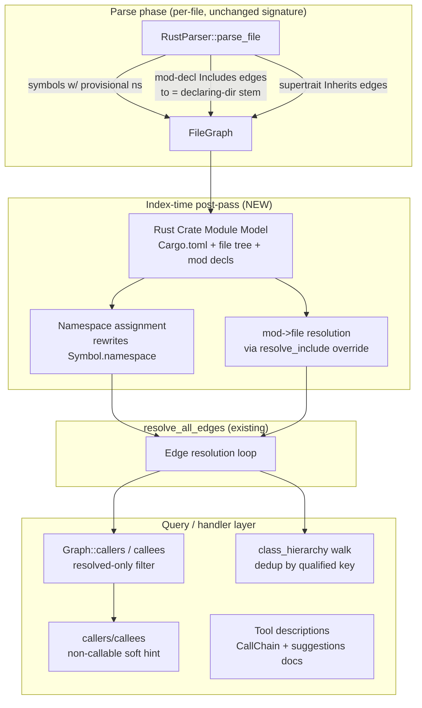
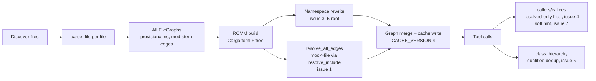
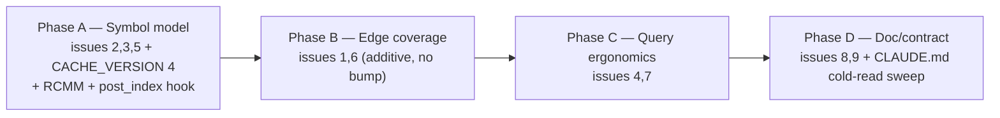

# Rust Support Gaps — Semantic Fidelity Remediation

## Overview

Dogfooding `code-graph-mcp` against the real Rust crate `ark-core` surfaced 9 defects
where Rust analysis is **silently wrong, silently empty, or undocumented**. Three High-severity
items make whole tools (`get_dependencies`, `detect_cycles`, `generate_diagram(file=)`) return
empty envelopes that read as "analysis ran, found nothing" when in fact the analysis never ran;
mis-classify trait APIs; and collapse the namespace dimension. Three Medium items add query
noise and duplicate hierarchy edges. Three Low items are documentation/ergonomic gaps.

The remediation is unified by one architectural observation: **issues 1, 3, and 5 all stem from
the absence of a Rust crate module model.** The parser sees one file at a time and has no notion
of crate root, module tree, or `mod`→file mapping. Building that model once, at index time, and
threading it into namespace assignment + `mod`-declaration edge resolution fixes the High-severity
cluster with a single new component. The remaining issues are localized parser-query, graph-layer,
and tool-description changes.

### Confirmed scope decisions (from requirements clarification)

| # | Issue | Decision |
|---|-------|----------|
| 1 | `mod`/`use` not modeled as edges | **Mod-declaration file graph only.** Resolve `mod foo;` (and inline `mod foo {}`) to `foo.rs` / `foo/mod.rs`, emit file-level `Includes` edges. `use`/`extern crate` paths remain intentionally unresolved (existing documented limitation, now explicitly scoped — no crate-aware `use`-path resolver). |
| 3 | Namespace only `<global>`/`tests` | **Full crate-path namespace.** Derive `crate_name::a::b` from Cargo.toml + file layout + `mod` decls. CACHE_VERSION bump. |
| 4 | callers/callees include unresolved noise | **Default-filter, match diagram.** Always drop edges whose target is not a real indexed symbol, exactly like `generate_diagram`. No new flag, no per-row boolean. |
| 2 | Trait default methods mis-classified | **Default methods → `Method` (parent = trait); ALSO extract abstract trait signatures** as symbols. Rust traits become a deliberate, scoped exception to the cross-language "forward declarations excluded" invariant. |

Issues 5, 6, 7, 8, 9 have no contested trade-offs and are designed below directly.

## Architecture

### Components

The spine is a new index-time component, the **Rust Crate Module Model (RCMM)**. It is built
once after all files are parsed and before edge resolution, then consulted by namespace
assignment and `mod`-edge resolution.



**RCMM responsibilities:**
- Discover Cargo.toml(s) among the indexed file set → map each crate's `src` root directory to a crate name (`[package].name`, `-`→`_`).
- For every `.rs` file, compute its canonical module path: `crate_name` (for `lib.rs`/`main.rs`), `crate_name::foo` (for `foo.rs` or `foo/mod.rs`), composed with any in-file inline `mod` nesting and `#[path = "…"]` overrides.
- Provide `mod foo;` → resolved child file path for `Includes` edge resolution.

**Per-issue component map:**

| Issue | Component touched | File(s) |
|---|---|---|
| 1 | RCMM mod-resolution + Rust `resolve_include` override + parser emits mod-decl edges | `code-graph-lang-rust/src/{lib,helpers,queries}.rs`, RCMM module |
| 2 | Parser symbol classification (`find_enclosing_trait`) | `code-graph-lang-rust/src/{lib,helpers,queries}.rs` |
| 3 | RCMM namespace assignment post-pass | RCMM module, `code-graph-tools/src/indexer.rs` |
| 4 | `Graph::callers`/`callees` resolved-only filter | `code-graph-graph/src/callgraph.rs` |
| 5 | `class_hierarchy` dedup by qualified key (+ root fix via #3) | `code-graph-graph/src/algorithms.rs` |
| 6 | Parser supertrait query pattern | `code-graph-lang-rust/src/{queries,lib}.rs` |
| 7 | Non-callable soft hint | `code-graph-tools/src/handlers/query.rs` |
| 8, 9 | Tool description strings | `code-graph-tools/src/server.rs` + CLAUDE.md |

### Data Flow



### Interfaces

**New `LanguagePlugin` post-index hook (flagged trait-shape change — see Decision 2):**

```rust
/// Optional whole-graph post-parse pass. Runs once over the FULL merged
/// FileGraph set after parsing, before resolve_all_edges. Default: no-op.
/// Rust overrides to (a) rewrite Symbol.namespace to the crate-qualified
/// module path and (b) resolve each mod-declaration Includes edge's `to`
/// in place to the absolute child-file path (or drop it if unresolvable).
/// Object-safe: `&self`, concrete params, no Self return, no generics.
fn post_index(&self, _graphs: &mut [FileGraph], _file_index: &FileIndex) {}
```

**Stateless threading model (resolves review Critical 1 + 2 as one mechanism).**
`post_index` is the *only* place RCMM data exists. It does all crate-aware work eagerly and
writes results into the `graphs` slice in place — it stores **no state on `&self`**, so no
interior mutability and no `&mut self`/object-safety problem:

- Namespace: overwrite each Rust `Symbol.namespace` with the RCMM-computed
  crate-qualified path.
- `mod` edges: for each parser-emitted `mod`-declaration `Includes` edge, RCMM resolves the
  declaring file + module name to a concrete child file using its module tree, probes the
  passed `FileIndex` for that file, and **rewrites `edge.to` to the resolved absolute path**
  (already an indexed path). If unresolvable, RCMM removes the edge here.

**Rust `resolve_include` override (issue 1) is therefore trivial and stateless:** by the
time `resolve_all_edges` runs, every surviving Rust `mod` edge's `to` is already an absolute
path that exists in the index. The override returns `Some(path)` verbatim when `raw` is an
absolute path the `FileIndex` knows, and `None` for everything else — `use`/`extern crate`
raw dotted paths (`"std::io"`, `"ark_core::reactor"`) keep emitting and keep returning
`None` → dropped exactly as today. This needs **no exact-path map on `FileIndex`** (review
Critical 1) and **no RCMM state surviving past `post_index`** (review Critical 2).

**`post_index` call sites (corrected post-approval — plan-review Critical 1+2).** The first
draft said `post_index` runs once "at the end of `index_directory` … over the full merged
set." That was factually wrong: `index_directory` is a pure fresh-parse function with **no
cache merge** (a stale analyze re-parses every file, so its returned `Vec<FileGraph>` is
*already* the complete set), and the watch handler is a **separate** re-index path that
never calls `index_directory`. The intent — every re-index path runs `post_index` over its
complete graph set — is unchanged; it requires **two** call sites:

- **Analyze path:** at the end of `index_directory` (`crates/code-graph-tools/src/indexer.rs`),
  after the rayon parse loop produces the full `Vec<FileGraph>`, build one `FileIndex` over
  it and loop `registry.plugins()` calling `post_index(&mut graphs, &file_index)` before
  returning. (Needs a new `LanguageRegistry::plugins()` iterator — the `plugins` map is
  private with no iteration API today.)
- **Watch path:** in `crates/code-graph-tools/src/handlers/watch.rs` `try_reindex_file`,
  after the existing+newly-parsed graph set and its `FileIndex` are built and **before** the
  `resolve_include`/`resolve_call` loop, call `post_index` over that set. Omitting this
  silently regresses Rust namespaces to `""`/inline-only on every watched file save
  (`watch_rust_reindex` does not currently assert on namespace values).

`resolve_all_edges` (called later by the handler) still rebuilds its own `SymbolIndex`/
`FileIndex` — fine: it now sees corrected namespaces and pre-resolved absolute `mod` edge
targets. Recomputing over each path's complete set every run keeps incremental/watch
re-index correct (a one-file edit can change a crate's module tree); the pass is cheap (tree
walk + string writes) relative to parsing. This correction adjusts call-site mechanics only
— no change to any of Decisions 1–10.

**`Graph::callers` / `Graph::callees` (issue 4):** filter the BFS frontier so any hop whose
resolved target is not present in `Graph::nodes` is excluded. Filtering happens **inside the
graph methods** so the handler's `total` is computed post-filter (see Decision 7).

**`get_callers`/`get_callees` handler (issue 7):** when the result is empty AND the target
symbol exists but its `SymbolKind` is non-callable (`Struct`, `Enum`, `Trait`, `Typedef`,
`Field`, `Interface`), return a soft hint message instead of a bare empty envelope.

## Design Decisions

### Decision 1: Unify issues 1/3/5 behind a Rust Crate Module Model

**Context:** The parser's `parse_file(path, content)` is per-file and crate-blind. Issue 3
(crate-qualified namespace) and issue 1 (`mod foo;`→file resolution) both require knowledge
that only exists across files: Cargo.toml location, crate name, and the file/directory tree.
Issue 5 (duplicate `bases:[{Lifecycle},{Lifecycle}]`) is a downstream symptom — bare,
namespace-less names collide in `adj`/`radj`.

**Options Considered:**
1. Solve each issue independently (per-file heuristics, three separate code paths).
2. One shared index-time crate model consumed by namespace assignment + mod-edge resolution + collision defense.

**Decision:** Option 2. Build the RCMM once; namespace assignment and `mod`-edge resolution
are both views over it.

**Rationale:** The three High-severity issues share a single missing abstraction. Three
independent heuristics would duplicate Cargo.toml discovery and module-tree walking and risk
divergent module-path spellings between the namespace (`ark_core::reactor`) and any future
resolution. One model keeps them consistent and is the smaller surface long-term.

### Decision 2: RCMM runs as an index-time `LanguagePlugin::post_index` hook

**Context:** CLAUDE.md flags the `LanguagePlugin` trait shape as load-bearing: "If a task
says 'use `tracing::warn!`', check `Cargo.toml`; flag the deviation, do NOT silently add."
The same conservatism applies to adding trait methods. The crate model needs the full file
set + `FileIndex`; `parse_file` cannot supply it; `resolve_call`/`resolve_include` are
per-edge, not whole-graph.

**Options Considered:**
1. Hardcode a Rust branch in `indexer.rs` (`if any Rust files { run_rust_crate_pass() }`).
2. Add a narrowly-scoped `post_index` trait hook, default no-op, Rust overrides.
3. Reuse no extension point — do it in the indexer as a free function dispatched by language id.

**Decision:** Option 2 — add `post_index`, **explicitly flagging this as a deliberate
`LanguagePlugin` trait-shape change requiring sign-off** (per the "flag your own
recommendation's risk" expectation and CLAUDE.md trait invariant).

**Rationale:** Option 1 leaks Rust internals into the cross-language indexer (the exact
separation the plugin trait exists to preserve). Option 3 is Option 1 with indirection. A
default-no-op hook is the principled extension point, costs other plugins nothing, and keeps
crate-awareness inside `code-graph-lang-rust`. The cost — one new trait method — is real and
is called out here rather than slipped in; reviewer should confirm the trait change is
acceptable before implementation.

**Object-safety / threading:** `post_index(&self, &mut [FileGraph], &FileIndex)` is
object-safe (no generics, no `Self` return) so `Box<dyn LanguagePlugin>` storage is
unaffected. It takes `&self` and stores nothing — all RCMM work is eager and written into
`graphs` in place (see "Stateless threading model" above), so there is no `&mut self`,
`Mutex`, or interior-mutability requirement. The default body underscores both params to
stay clean under `clippy -D warnings`.

**Risk I am flagging against my own recommendation:** a new trait method is a public-surface
change to the most load-bearing trait in the workspace. If the reviewer prefers zero trait
churn, Option 1 (indexer-side, language-gated free function dispatched on `Language::Rust`)
is the fallback; it works but concedes the clean separation. I recommend the hook but do not
want this trade-off buried.

### Decision 3: `mod`-declaration file graph; `use`/`extern crate` stay unresolved

**Context:** `extract_uses` (`code-graph-lang-rust/src/lib.rs:315–367`) already emits
`Includes` edges for `use`/`extern crate`; `resolve_include` defaults to basename match,
which is a designed no-op for dotted Rust paths (RustRewrite Plan Task 5.1: "leaving them
unresolved is the intended behavior"). `mod foo;`, by contrast, maps deterministically to a
sibling `foo.rs` or `foo/mod.rs` — no crate-name guessing, no false edges.

**Options Considered:**
1. Crate-aware `use`-path resolver (resolve `use crate::a::b` to files).
2. `mod`-declaration resolver only.
3. Don't model edges; emit an explicit "not modeled" envelope marker.

**Decision:** Option 2 (confirmed by requirements clarification). The parser emits one
provisional `Includes` edge per `mod` declaration — both `mod foo;` (external) and
`mod foo { … }` (inline; resolves to the declaring file → self-edge, suppressed). The edge
carries `from = declaring file path` (the parser knows `path`) and `to = modname` as a bare
provisional token, plus the `mod` line. **Resolution happens in `post_index`, not in
`resolve_include`** (this is the Critical-1/2 fix): RCMM holds the crate module tree, so it
maps `(declaring_file, modname)` → the concrete child file via Rust's module rules —
sibling `dir/foo.rs`, then `dir/foo/mod.rs`, with `#[path = "x.rs"]` attribute overriding —
checks that file is in the `FileIndex`, and **rewrites `edge.to` to that absolute path in
place** (or removes the edge if no candidate is indexed). The Rust `resolve_include`
override is then a stateless pass-through: absolute indexed path → `Some(path)`, anything
else (every `use`/`extern crate` dotted token) → `None` → dropped exactly as today. No
`FileIndex` exact-path map is required; no RCMM state outlives `post_index`. `use`/`extern
crate` edges keep emitting and keep being dropped — behavior identical to today, now an
explicit, intentional scope boundary rather than an accident.

**Rationale:** `mod` resolution is exact; a heuristic `use`→file mapping risks emitting
*false* dependency edges, which corrupts `detect_cycles`/`get_coupling` worse than missing
edges. The danger the feedback raised — empty `detect_cycles` reading as "no cycles" — is
resolved for real Rust crates because the intra-crate module tree (the thing that actually
forms cycles) is now modeled. Edge `{path, line}` shape is unchanged → **no CACHE_VERSION
bump for this issue** (the bump from Decision 5/9 forces the re-index that materializes the
new edges anyway).

### Decision 4: Trait method classification + abstract signature extraction

**Context:** `find_enclosing_impl` (`helpers.rs:138–147`) only walks to `impl_item`. A
`function_item` inside a `trait_item` body falls through to `(Function, "", "")` — wrong
`kind`, no parent, no namespace. Abstract trait methods (`fn f(&self);`,
`function_signature_item`) currently produce no symbol at all under the cross-language
"forward declarations excluded" invariant. Feedback: "trait APIs aren't navigable by parent."

**Options Considered:**
1. Fix default-method classification only; keep abstract signatures excluded.
2. Fix classification AND extract abstract trait signatures (full trait API navigable).

**Decision:** Option 2 (confirmed). Add `find_enclosing_trait`; a `function_item` or
`function_signature_item` whose nearest definition ancestor is a `trait_item` (and not an
`impl_item`) → `SymbolKind::Method`, `parent = trait_name`. **No new `SymbolKind` variant**
(CLAUDE.md invariant: enum stable, readable strings) — trait methods are `Method`, identical
to impl methods; trait identity lives on the `Inherits` edge (Decision 6) and via the
parent. Symbol ID stays `file:Trait::method`.

**Rationale:** Option 2 is what makes trait APIs queryable by parent and corrects the
`function`/`method` summary skew. The cost is a **deliberate, Rust-trait-scoped exception to
the cross-language "forward declarations excluded" invariant**, which must be documented as
such in CLAUDE.md (the cross-language summary table "Forward decls excluded" row for Rust
becomes "trait method signatures excepted") so it is not mistaken for inconsistency by a
future cold reader. This inverts an existing anti-regression test (see Testing Strategy) —
that inversion is intentional and called out, not silent.

### Decision 5: Crate-qualified namespace derivation rules

**Context:** `resolve_mod_namespace` (`helpers.rs:154–168`) only collects inline `mod_item`
ancestors within one file; file-split modules (`pub mod reactor;` in `lib.rs`, body in
`reactor.rs`) get namespace `""`. Crate name is never known.

**Decision:** RCMM assigns `Symbol.namespace` from: `crate_name` (root module: `lib.rs`,
`main.rs`, or a bin target's root) → append path-derived segments (`src/foo.rs` →
`crate::foo`; `src/foo/bar.rs` → `crate::foo::bar`; `src/foo/mod.rs` → `crate::foo`) →
append in-file inline `mod` nesting (composing with `nested_mods_produce_namespace_a_b_c`
behavior, which must still pass) → apply `#[path]` overrides. `-` in crate names → `_`.
Files with no discoverable Cargo.toml fall back to today's inline-mod-only behavior (no
crash, documented). Empty namespace still renders `<global>` per existing `get_symbol_summary`
contract.

**Issue 5 (duplicate bases) resolution:** crate-qualified namespaces remove the *accidental*
bare-name collisions at the root (distinct `Lifecycle`s in different modules no longer
collapse). As **defense in depth**, before `build_hierarchy` recurses over the collected
bases/derived `Vec<String>` (`algorithms.rs:388–430`), the target list is deduplicated.
**Dedup key = the target name string** — identical to the `visited_unique` key already used
for the diamond `ref:true` contract, and identical to the `adj`/`radj` key, so the three
stay consistent. **Tiebreak = first-encountered wins**, matching the existing DFS first-visit
semantics (`visited_unique`/`on_path`). This is safe because Rust `Inherits` edges are
emitted with bare type names: two edges to the same target name are a tree-sitter
duplicate-match artifact, not a genuinely distinct relationship, so collapsing them loses no
real edge. Result: an identical edge appearing twice yields one node (or one `ref:true` stub
per the diamond contract), never `[{X},{X}]`. Both layers ship together: namespace fixes the
cause, dedup guarantees the invariant even for legitimately repeated edges.

**Rationale:** Fixing only the dedup masks the namespace defect (filter stays useless);
fixing only the namespace leaves the hierarchy walk fragile to any future duplicate. The
user explicitly chose "full crate-path namespace + fix collisions" — both layers.

### Decision 6: Supertrait `Inherits` edges via new query pattern

**Context:** `INHERITANCE_QUERIES` (`queries.rs:116–120`) matches only `impl_item`. `pub
trait ReactorService: Lifecycle` is a `trait_item` with a `bounds`/`type_bound_clause` field
— no edge emitted today; undocumented gap.

**Decision:** Add a **separate second `Query` object** (`supertrait_query`, alongside the
existing `inh_query`), not a second pattern crammed into the existing one. Reason (review
Major 3): the existing `extract_inheritance` loop accumulates `@impl.type` + `@impl.trait`
across captures *within one match* then emits a single edge — a `trait_item` with N
supertrait bounds yields N targets for one sub-trait, which the accumulate-then-emit shape
cannot express. The new query matches `trait_item` with a `bounds`/`type_bound_clause` field
(captures `@sub.name`, `@sub.bound`); a **second, independent loop** in `extract_inheritance`
iterates its matches and emits one `Inherits` edge (`from = sub_trait`, `to = super_trait`)
per `@sub.bound`. Lifetime/`?Sized`/marker bounds (`'a`, `?Sized`) are filtered (not type
paths to nameable traits). The existing `impl`-loop is untouched, so
`inherent_impl_produces_no_inheritance_edge` and `trait_impl_produces_one_inheritance_edge`
cannot regress. `EdgeKind::Inherits` reused (no enum change). Additive edges only → **no
CACHE_VERSION bump for this issue**.

**Rationale:** Restores the `ReactorService → Lifecycle` relationship to
`get_class_hierarchy`/`detect_cycles`/diagrams with a localized parser change. Inherent-impl
no-edge behavior (`inherent_impl_produces_no_inheritance_edge`) must remain green — the new
pattern is `trait_item`-scoped and cannot match `impl` blocks.

### Decision 7: Resolved-only filter lives in `Graph::callers`/`callees`, not the handler

**Context:** Unresolved `Calls` edges are retained with `edge.to` = raw callee string
(`"Ok"`, `"tracing::debug"`); `generate_diagram` already drops these via
`mermaid_label`→`None`; call tools don't. The handler computes `total = chains.len()` *after*
the `Graph::callers`/`callees` call returns (`handlers/query.rs:~94`), so `total` is
consistent whether the filter sits in the handler or the graph — `total` correctness is
**not** the discriminator between the two options (correcting the prior draft's rationale,
per review Major 6).

**Options Considered:**
1. Filter in the handler after BFS returns the chains.
2. Filter inside `Graph::callers`/`callees` so the BFS frontier never includes unresolved hops.

**Decision:** Option 2. A hop is kept only if its resolved target id is a key in
`Graph::nodes` (the same notion of "real symbol" the diagram uses). `total`, pagination, and
`next_offset` are all derived from the already-filtered chain set and self-consistent.

**Rationale:** The real discriminator is **BFS traversal correctness at depth ≥ 2**, not
`total`. If unresolved hops are left in the graph BFS, they enter the `visited` set and a
shared raw token (e.g. `"Ok"` reached from two different resolved callers) is marked visited
on first encounter, which can suppress legitimate re-traversal and distort depth attribution
for resolved neighbors. Filtering inside the graph keeps the unresolved tokens out of
`visited` entirely, so resolved sub-graphs are walked faithfully. Reusing the diagram's
"present in `nodes`" predicate also keeps the two tools consistent — the explicit goal of
the feedback. **Critical preservation:** a callable symbol whose only callees were unresolved now
yields an *empty envelope* (not an error) — it is still a known symbol with zero resolved
edges, identical to the existing "known symbol, no callers" semantics
(`callers_known_symbol_with_no_callers_returns_empty_envelope` must stay green). The
unknown-symbol did-you-mean path (`callers_unknown_symbol_with_suggestions`) is untouched —
filtering never reclassifies a real symbol as unknown.

### Decision 8: Non-callable soft hint keyed strictly on `SymbolKind`

**Context:** `get_callers(struct_id)` returns silent `total:0`; `get_symbol_detail(bad_id)`
returns a clean error. The Go-parity contract (`handlers/query.rs:8–9`) intentionally returns
`[]` for a known symbol with no callers and errors only for unknown symbols.

**Decision:** Preserve that contract for *callable* kinds. Add one branch: result empty AND
symbol exists AND `kind ∈ {Struct, Enum, Trait, Typedef, Field, Interface}` → return a soft
hint ("`Foo` is a struct; structs have no call edges — did you mean `get_class_hierarchy` or
`get_symbol_detail`?") rather than a bare empty page. Callable-with-no-callers (including the
post-Decision-7 "only-unresolved-callees" case, which is a `Function`/`Method`) still returns
the empty envelope unchanged.

**Rationale:** Targets the actual ergonomic gap (querying call edges on a non-callable) with
zero risk to the load-bearing empty-envelope and did-you-mean tests, because the new branch
is gated on a kind set disjoint from those tests' fixtures.

### Decision 9: Issues 8 & 9 are documentation-contract fixes under the tool-description lens

**Context:** `CallChain` `file` = callsite, `symbol_id` = definition site (differ across
crates at depth ≥ 2) — documented internally (`callgraph.rs:27–41`) but not in the
agent-facing `#[tool(description=…)]`. `search_symbols.suggestions` is fully specified in
CLAUDE.md's "Response shapes" but absent from the tool description string.

**Decision:** Update the `get_callers`/`get_callees`/`search_symbols` description strings in
`server.rs` to state the `file` vs `symbol_id` semantics and the `suggestions` field
(anchored-`^…$`, `total==0`, ≤5 ids, absent when empty, never on `count_only`). Treat under
CLAUDE.md's **"Agent-facing tool descriptions"** lens: a missing field semantic is
functionally a bug because agents pattern-match on these strings.

**Rationale:** Pure contract surface; no code, no cache, no test changes. Bundled with the
behavior-changing phases so descriptions and behavior never diverge (CLAUDE.md "Documentation
read cold" lens).

### Decision 10: Single CACHE_VERSION bump 3 → 4 covers the symbol-shape changes

**Context:** Issue 2 changes cached symbol `kind`/`parent`; issue 3 changes cached
`namespace`. Issues 1 & 6 only add edges (same shape). `CACHE_VERSION` is `3`
(`persist.rs:44`); v2→v3 precedent: stale version → `Graph::load` returns `Ok(false)` →
caller silently re-indexes, no `force=true`, no migration attempted.

**Decision:** One bump to `4`. Symbol-shape changes (issues 2, 3) require it; the forced
re-index it triggers also materializes the new `mod` `Includes` edges (issue 1) and
supertrait `Inherits` edges (issue 6) with no separate action. Document in CLAUDE.md
"Cache invalidation": v3 (or earlier) cache fails the check → silent re-index, no
`force=true`, no transparent migration (identical to the v2→v3 line already present).

**Rationale:** Coupling the additive issues to the mandatory bump avoids a confusing
"`force=true` to see your module graph" footgun and keeps the cache-invalidation story to
one new sentence.

## Error Handling

- **No Cargo.toml found for a `.rs` file:** RCMM falls back to the existing inline-mod-only
  namespace; symbols get `<global>` as today. No panic, no error envelope — degraded, not
  broken. Logged via `eprintln!` once per crate-less root (CLAUDE.md: workspace has no
  `tracing`; `eprintln!` is the out-of-handler channel).
- **`mod foo;` with no matching `foo.rs`/`foo/mod.rs` in FileIndex** (e.g. file ignored by
  discovery, or `cfg`-gated platform module): `resolve_include` returns `None`, edge dropped
  — same path as any unresolved include, no error.
- **`#[path]` pointing outside the indexed set:** treated as unresolved → dropped.
- **Malformed Cargo.toml:** RCMM skips that crate (fallback namespace), `eprintln!` warning;
  never aborts the index.
- **Non-callable soft hint (issue 7):** returned as a `CallToolResult` *success* with an
  advisory message, not `Err` — consistent with the core invariant "user-visible errors
  travel as `CallToolResult`, not `Err`"; it is guidance, not failure.
- **Filtered-to-empty callers/callees (issue 4):** empty `Page<T>` envelope (`truncated:
  false`, `next_offset: null`) — a valid natural-end page, not an error.

## Testing Strategy

### Behavioral coverage (new/changed behavior, by issue)

- **Issue 1:** `mod foo;` in `lib.rs` with `foo.rs` present → one `Includes` edge `lib.rs → foo.rs` with the `mod` line; `foo/mod.rs` layout resolves too; `#[path]` override resolves; `mod` with no file → no edge; `detect_cycles` finds a real `a mod b; b mod a;` cycle; `get_dependencies(lib.rs)` non-empty; `generate_diagram(file=lib.rs)` non-empty. `use std::io;` still produces **no** surviving edge (scope boundary held).
- **Issue 2:** trait default method → `kind:method`, `parent:Trait`, namespace = crate path; trait abstract signature (`fn f(&self);`) → symbol, `kind:method`, `parent:Trait`; `top_level_only:true` drops them; `impl Trait for Type` method parent still `Type` not `Trait` (`trait_impl_method_parent_is_type_not_trait` green).
- **Issue 3:** symbol in `src/reactor.rs` of crate `ark-core` → namespace `ark_core::reactor`; `src/a/b.rs` → `ark_core::a::b`; `mod.rs` collapses; inline `mod tests` composes (`nested_mods_produce_namespace_a_b_c` adapted to crate prefix and green); no-Cargo.toml fallback path covered.
- **Issue 4:** `get_callees` on a fn calling `Ok`/`info`/`to_string` + one project fn → only the project fn; `total` equals filtered count; a fn whose only callees are unresolved → empty envelope (not error); unknown symbol → still did-you-mean error.
- **Issue 5:** struct impl-ing a trait once → exactly one `bases` entry; same-named traits in two modules → distinct, no `[{X},{X}]`; diamond `ref:true` contract preserved.
- **Issue 6:** `trait Sub: Super` → `Inherits Sub→Super`; multiple supertraits → multiple edges; lifetime/`?Sized` bounds filtered; inherent impl still no edge. **Pre-flight at implementation:** inspect `get_class_hierarchy_for_rust_trait` — if its fixture trait has no supertrait it stays green trivially (leaf); if the fixture trait *does* declare a supertrait it currently expects empty `bases`, so Decision 6 changes its expectation → move it to the "deliberate anti-regression test changes" list rather than treating the new `bases` entry as a regression.
- **Issue 7:** `get_callers(struct_id)` → soft-hint success message; `get_callers(fn_with_no_callers)` → empty envelope (unchanged); `get_callers(unknown)` → did-you-mean.
- **Issues 8, 9:** description strings contain the `file`/`symbol_id` distinction and the `suggestions` semantics; CLAUDE.md "must contain phrase" checks (`grep`) pass.

### Deliberate anti-regression test changes (called out, not silent)

- **`trait_item_produces_trait_kind`** (`code-graph-lang-rust/src/lib.rs`): currently asserts
  abstract trait declarations produce **zero** symbols. Decision 4 inverts this — the test is
  **replaced** with one asserting abstract signature → `Method`/`parent=Trait`. This is an
  intentional contract change, not a regression.
- Snapshot tests under `crates/code-graph-tools/tests/snapshots/` touching Rust output
  change (namespace, trait kinds, new edges) → reviewed and `cargo insta accept`-ed
  intentionally. `make snapshot-clean` (pre-commit hook) must be green — no stray
  `*.snap.new`.

### Must-stay-green anti-regression set

`trait_impl_method_parent_is_type_not_trait`,
`call_inside_trait_impl_method_has_type_qualified_from_not_trait`,
`inherent_impl_produces_no_inheritance_edge`, `trait_impl_produces_one_inheritance_edge`,
`macro_rules_definition_produces_zero_symbols`, `nested_mods_produce_namespace_a_b_c`
(adapted for crate prefix), `resolve_all_edges_drops_include_to_non_source_target`,
`callers_known_symbol_with_no_callers_returns_empty_envelope`,
`callers_unknown_symbol_with_suggestions`, `get_class_hierarchy_for_rust_trait`,
`get_class_hierarchy_for_go_interface`, `response_shape_acceptance`, `watch_rust_reindex`.

### Structural Verification

Per `shared/languages/rust.md` and CLAUDE.md commands:

- `make lint` — `cargo clippy --workspace --all-targets -- -D warnings`, **every phase** (Rust minimum bar: clippy warnings-as-errors).
- `make fmt-check` — `cargo fmt --all --check`.
- `make test` — `cargo test --workspace`, including the dogfood-baseline `external/ripgrep`
  Rust submodule (auto-skips if uninitialized): re-measure and update
  `testdata/rust/ripgrep-baseline.txt` because namespace/trait-method/edge changes shift the
  symbol count beyond ±10% — update `symbols: N` + headers in the same commit (SHA-bump
  protocol).
- `make snapshot-clean` — no `*.snap.new` (pre-commit hook enforced).
- `make leak-scan` — no plan-pointer strings leak into source.
- `miri`: **not required** — no new `unsafe`, no raw pointers, no FFI introduced.

## Migration / Rollout

**Cache:** `CACHE_VERSION` 3 → 4 (Decision 10). On first run after upgrade, any v1/v2/v3
cache fails the version check → `Graph::load` returns `Ok(false)` → caller **silently
re-indexes; no `force=true`, no transparent migration** (identical to the existing v2→v3
behavior, one new CLAUDE.md sentence).

**Phasing** (suggested; final breakdown is a `/plan` artifact):



- **Phase A first:** RCMM + `post_index` hook is the spine; issue 3 forces the cache bump;
  issue 5's root fix depends on issue 3. Decision 2's trait-shape change is confirmed here
  before downstream work builds on it.
- **Phase B** reuses the RCMM module tree built in A for `mod`→file resolution; no cache
  bump (re-index already forced by A).
- **Phase C** is graph/handler-local, independent of A/B, but sequenced after so the
  resolved-only `total` semantics are validated against the post-A symbol set.
- **Phase D** consolidates tool-description + CLAUDE.md updates. Per the "Documentation read
  cold" lens, each of A–C also updates its own CLAUDE.md sections in-phase; D is the
  final consistency sweep (cross-language summary table, Rust limitations list, Response
  shapes, Cache invalidation) so no sibling section contradicts another.

**CLAUDE.md edits required** (tracked so the cold-read lens passes):
- Rust "Supported"/"Limitations": default+abstract trait methods now `Method`/parent=Trait;
  supertrait `Inherits` edges; `mod` decls now emit file `Includes` edges; namespace now
  crate-qualified; `use`/`extern crate` explicitly scoped-out (not an accident).
- **Rust limitation 2 (explicit rewrite, both sites — review Minor):** the per-language
  prose limitation currently states `function_signature_item` produces no symbols. Rewrite
  to: "Abstract trait method signatures (`function_signature_item` inside a `trait_item`)
  are extracted as `Method` symbols with `parent = trait_name`; other forward declarations
  (bare function signatures outside traits) remain excluded." Update this prose block AND the
  Cross-language summary table row in the same commit so the two sections never contradict.
- Cross-language summary table: Rust "Forward decls excluded" → trait-signature exception.
- Response shapes: `get_callers`/`get_callees` now resolved-only; `CallChain` `file` vs
  `symbol_id`; `search_symbols.suggestions`.
- Cache invalidation: `CACHE_VERSION` 4, silent-re-index sentence.
- Known cross-cutting limitations: remove/replace the implicit "Rust has no Includes" gap.

**Rollback:** revert is a code revert + `CACHE_VERSION` back to 3; next run silently
re-indexes onto the old shape. No data migration to unwind.
