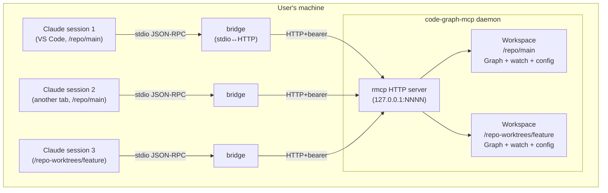
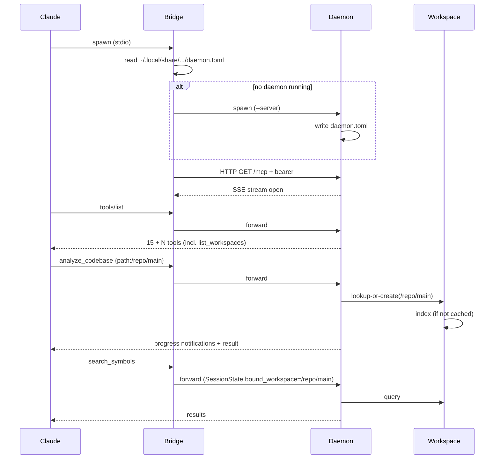

# Shared Daemon for Multi-Tenant Code Graph Sharing

> **Status: deferred.** This design captures the planned next step after the RustRewrite (`Designs/RustRewrite/`) ships and stabilizes. It is intentionally less detailed than RustRewrite — enough for a future contributor to pick up cold, not enough to start implementation. Specific dependency pins, response-shape changes, and phase plan are deferred to the implementation plan that will follow this design's approval.

## Overview

The current code-graph-mcp design (per `Designs/RustRewrite/`) uses rmcp's stdio transport, which forces one process per Claude session. Two sessions indexing the same codebase do redundant work: each parses every file independently, each holds a separate copy of the graph in memory, and they don't see each other's edits live (the JSON cache file is a snapshot warm-start, not live sharing).

This design replaces "one process per session" with "one daemon hosting many sessions and many workspaces." A long-running server holds the graph state; Claude sessions connect to it as clients; a thin stdio bridge keeps the user-facing MCP client config unchanged.

The user-visible wins:

- **Index once, query from many sessions.** Two Claude tabs on the same project share the same graph instantly. Edits made via watch mode in one session are immediately visible in another.
- **Multiple worktrees / Perforce streams coexist cheanly.** A single daemon hosts one workspace per indexed root path. Worktrees, branch-based clones, Perforce client workspaces, and submodule checkouts each get their own isolated workspace inside the same daemon — the natural identity is the absolute root path, so the right thing falls out without special-casing.
- **Cross-workspace queries become possible.** A new `list_workspaces` tool lets an agent ask "which other indexed roots does this daemon know about?" — opening the door to comparison queries (does function X exist in main?) without re-indexing.

What's intentionally **not** in scope:

- Replacing the in-memory graph with a database (still rejected for the same reasons as the original Brainstorm).
- Distributed daemons (one daemon per host; remote sharing across machines is out of scope).
- Authentication for multi-user shared hosts beyond a per-daemon bearer token.
- Backwards compatibility with the existing stdio-only RustRewrite binary's wire format if a deliberate vNext breaks it (snapshot tests rebaseline at the design's approval).

## Architecture

### Process Topology



Three roles in three processes:

- **Bridge** — Replaces the current `code-graph-mcp` stdio binary in Claude's MCP client config. Reads JSON-RPC from stdio, forwards to the daemon over HTTP, pipes responses back. Tiny; ~hundreds of lines. Can be the same binary as the daemon, with a `--bridge` flag that swaps modes.
- **Daemon** — Same `code-graph-mcp` binary in `--server` mode. Listens on `http://127.0.0.1:NNNN/mcp` (port chosen at startup, written to a discovery file). Holds all workspaces. Multi-connection-aware via rmcp's HTTP transport.
- **Discovery file** — `~/.local/share/code-graph-mcp/daemon.toml` (XDG / equivalent) records the running daemon's port and bearer token. Bridges read it on startup.

### Tenancy Model

Inside the daemon, state shape changes from one `Arc<ServerInner>` to per-workspace state under a workspace map:

```rust
struct DaemonInner {
    workspaces: parking_lot::RwLock<HashMap<PathBuf, Arc<Workspace>>>,
    sessions: parking_lot::RwLock<HashMap<SessionId, SessionState>>,
    discovery: DiscoveryHandle,  // writes daemon.toml on start, removes on shutdown
}

struct Workspace {
    // Most of the current ServerInner moves here, scoped per-tenancy
    graph: parking_lot::RwLock<Graph>,
    registry: Arc<LanguageRegistry>,    // shared across workspaces
    indexed: AtomicBool,
    index_lock: tokio::sync::Mutex<()>,
    config: parking_lot::RwLock<RootConfig>,
    watch: parking_lot::RwLock<Option<WatchHandle>>,
    subscribers: parking_lot::RwLock<Vec<Peer<RoleServer>>>, // for watch fan-out
}

struct SessionState {
    bound_workspace: Option<PathBuf>,  // set by the session's first analyze_codebase
    peer: Peer<RoleServer>,            // the per-connection notification sink
}
```

**Tenancy is keyed by absolute path.** When `analyze_codebase` arrives with a `path` parameter, the daemon resolves it to its absolute form and looks up (or creates) a `Workspace`. Two sessions calling `analyze_codebase` with the same absolute path bind to the same workspace; sessions calling different paths bind to isolated workspaces. Because git worktrees, Perforce client workspaces, and feature-branch clones all live at distinct absolute paths, tenancy isolation falls out without any per-VCS knowledge.

Subsequent queries from a session (`get_callers`, `search_symbols`, etc.) are routed against the workspace the session is bound to. A session can re-bind by calling `analyze_codebase` with a different path; the prior binding is dropped (the workspace itself stays alive as long as another session uses it, or until idle eviction).

### Connection Lifecycle



Daemon lifecycle:

- **Auto-spawn from bridge.** The bridge's startup checks for a reachable daemon (read `daemon.toml`, attempt a health-check HTTP call). If unreachable, the bridge `fork`+`exec`s the binary with `--server`, waits for `daemon.toml` to exist, then connects. First-session-after-reboot pays a small startup cost; subsequent sessions are instant.
- **Idle eviction.** A workspace with no live sessions and no recent activity (configurable, default 30 min) is dropped — its graph is freed and its cache file is left on disk for the next analyze. The daemon process itself self-terminates after N seconds (default 600) with zero workspaces and zero connections, then re-spawns on demand.
- **Graceful shutdown.** A `code-graph-mcp --shutdown` subcommand sends a signed shutdown request to the running daemon for cases where users want to free memory explicitly.

### Concurrency Model

Concurrency rules carry over from the RustRewrite design with one widening:

- **Per-workspace `index_lock`** instead of a single global one. Two sessions doing `analyze_codebase` on the same path serialize; on different paths run in parallel. This is correct.
- **Watch event drop on contention** rule unchanged: a watch event arrives while that workspace's `index_lock` is held → drop the event.
- **Watch fan-out**: each `Workspace` carries a `Vec<Peer>` of subscribed sessions. When a watch-driven re-index merges, every subscribed session's peer gets a custom notification (`notifications/code_graph/file_reindexed` or similar — name TBD). Sessions opt in by calling `watch_start`; opt out by calling `watch_stop` or by disconnecting (the daemon prunes dead peers on send failure).
- **Session-local progress**: `analyze_codebase` progress notifications stay session-local — they go to the calling session's `Peer` only, not to other sessions watching the workspace. Other sessions see the result of the analyze as a graph snapshot change but don't get spammed with progress messages from someone else's command.

### New Tools

Two new tools are added, with the rest unchanged in shape:

| Tool | Parameters | Returns |
|---|---|---|
| `list_workspaces` | none | array of `{path, indexed, last_activity, file_count, symbol_count}` for every workspace the daemon currently knows about |
| `select_workspace` | `path` (required) | binds the calling session to an already-indexed workspace without re-indexing — replaces the implicit binding done by `analyze_codebase` |

`select_workspace` is what enables cross-workspace queries from a single session (an agent on `/repo-worktrees/feature` can `select_workspace /repo/main`, query, then re-select its own workspace).

`analyze_codebase`'s response shape stays compatible but gains a `cache_status` field indicating whether the result was a fresh index, a load from disk cache, or a *hit on a workspace already loaded by another session* (the new case enabled by sharing).

### Cache File Ownership

Today every process can write `.code-graph-cache.json`. With the daemon, only the daemon writes — and only when its in-memory graph diverges from disk. Migration period (when both stdio and daemon binaries might coexist) requires file locks: the daemon takes `fs2::FileExt::try_lock_exclusive` on the cache file before writing; a stale stdio process would back off rather than racing. Once the stdio mode is retired, file locks become precautionary.

## Design Decisions

### Decision 1: HTTP transport, not Unix domain socket

**Options:** (a) HTTP on `127.0.0.1` with bearer-token auth, (b) Unix domain socket, (c) Windows named pipe + Unix socket per-platform.

**Decision:** HTTP on `127.0.0.1` with bearer auth. Reason: rmcp 1.5 supports HTTP/SSE natively; we don't have to ship a custom transport. Bearer tokens close the local-multi-user attack surface adequately for this tool's threat model (it indexes user-readable source files; nothing privileged). Unix sockets are cleaner on POSIX but force a per-platform code path.

### Decision 2: Tenancy keyed by absolute path

**Options:** (a) Absolute root path, (b) explicit workspace name from config, (c) git remote + branch.

**Decision:** Absolute root path. Reason: it's the only universal identity that handles all cases (worktrees, branches, Perforce streams, simple checkouts) without VCS-specific code. A user who wants to index "the same logical project from two paths" (e.g., a symlink farm) can resolve symlinks to canonical paths via `std::fs::canonicalize` before binding — open question whether this is on by default.

### Decision 3: Bridge auto-spawns the daemon

**Options:** (a) Bridge auto-spawns, (b) user runs `code-graph-mcp --server` manually, (c) systemd / launchd unit.

**Decision:** Auto-spawn from bridge, with idle self-termination. Reason: zero-config UX matches the current stdio binary's behavior. Users with strong opinions can disable auto-spawn (`--no-spawn` flag on the bridge) and run their own daemon under their own process supervisor.

### Decision 4: Watch mode is workspace-scoped, fan-out by subscription

**Options:** (a) Watch is per-session (fragmented), (b) watch is workspace-global with fan-out (chosen), (c) watch is daemon-global.

**Decision:** Per-workspace global with fan-out. A session subscribes by calling `watch_start`; the daemon adds its peer to the workspace's subscriber list and turns on the underlying file watcher if not already active. Multiple sessions on the same workspace share the watcher (one `notify-debouncer-full` instance, one debounce window). The first `watch_start` activates; the last `watch_stop` (or last disconnect) deactivates. Notifications fan out to all subscribers.

### Decision 5: Shipping order

**Options:** (a) New binary, (b) new mode in the existing binary.

**Decision:** New mode (`--server` and `--bridge` flags) in the existing `code-graph-mcp` binary. Reason: simpler distribution; the current stdio mode remains the default so users without the daemon config keep working. The bridge mode is `--bridge` (or auto-detected: if `daemon.toml` is reachable, behave as bridge; else behave as standalone stdio). Open question whether the bridge auto-detect is safe enough to be the default or whether opting in via Claude's MCP config is required.

## Error Handling

| Category | Handling |
|---|---|
| Daemon unreachable from bridge | Bridge auto-spawns; if spawn fails (binary missing, port conflict), bridge falls back to standalone stdio mode and surfaces a one-time warning in the first response's warnings array |
| Port conflict on daemon startup | Try a small range (e.g., 5 random ports); if all fail, write the failure to stderr and exit; bridge surfaces the failure |
| Bearer token mismatch | HTTP 401; bridge reports `mcp.NewToolResultError("daemon authentication failed; delete daemon.toml and retry")` |
| Workspace not yet indexed | Same as today's `require_indexed` error — but a session can rebind with `select_workspace` to attach to a workspace some other session has already indexed |
| Workspace evicted while session bound | Next query from that session returns "workspace was evicted; re-run analyze_codebase to reindex"; subsequent successful analyze re-binds |
| Concurrent analyze on same workspace | `index_lock.try_lock` → "indexing already in progress" — same as today |

## Testing Strategy

- **Multi-session integration tests.** Spawn a daemon in-process; open two simulated Claude sessions concurrently; verify both see the same graph after one of them runs analyze. Verify session A's watch notifications reach session B if both subscribed.
- **Tenancy isolation tests.** Two sessions on different paths share zero state; symbol named `init` in workspace A doesn't appear in workspace B's queries.
- **Lifecycle tests.** Bridge auto-spawn behavior; idle eviction triggers; daemon self-terminates; auto-respawns on next session.
- **Crash recovery.** Kill the daemon mid-analyze; restart; verify cache file is intact (atomic-rename invariant from RustRewrite).
- **Wire-format compatibility.** Snapshot tests get a vNext baseline. Existing snapshot suite from RustRewrite Phase 3 carries forward unchanged for tools whose shape didn't change; the two new tools (`list_workspaces`, `select_workspace`) and the modified `analyze_codebase` response (with `cache_status` field) get fresh snapshots.

### Structural Verification

| Tool | When | What it catches |
|---|---|---|
| `cargo clippy --workspace --all-targets -- -D warnings` | Every PR | Common mistakes; minimum bar per Rust language guidance |
| `cargo test --workspace` | Every PR | Unit + integration |
| Multi-session integration suite (`tests/daemon/`) | Every PR | Cross-session sharing, tenancy isolation, watch fan-out |
| `miri` on the FFI boundary | After major rmcp upgrades | Rare; only if `unsafe` blocks land (currently none) |

## Migration / Rollout

Staged migration with no flag-day. The RustRewrite ships first (stdio-only, single-tenant). This design is picked up after that ships and stabilizes.

1. **Add `--server` mode** to the existing binary. Existing stdio default is unchanged. Internally, factor out `Workspace` from `ServerInner` so both modes share the same per-workspace state shape — this is the invasive refactor and should land in its own commit before the daemon-specific work begins.
2. **Add `--bridge` mode** to the same binary. Document the Claude MCP config update users would make to opt into bridge mode.
3. **Multi-tenant routing.** Wire the workspace map; route `analyze_codebase` to the right tenant; bind sessions on first analyze.
4. **`list_workspaces` and `select_workspace` tools.** New wire-format additions; snapshot tests rebaseline.
5. **Watch fan-out.** Subscriber list per workspace; activate/deactivate on first/last subscription.
6. **Lifecycle & discovery.** Auto-spawn, idle eviction, daemon.toml, bearer tokens.
7. **Documentation update.** README, CLAUDE.md, sample MCP client config showing the bridge invocation. Default stays stdio for users who don't opt in.

Each step is independently shippable behind the `--server` flag; the stdio default keeps working throughout. The cutover (changing the recommended config to use the bridge) happens only after multi-session integration tests are green and the daemon has soaked for some time on a real polyglot workspace.

## Open Questions

1. **Symlink canonicalization at workspace lookup**: `/repo` and `/home/me/repo` (a symlink) — same workspace or two? Default: canonicalize, but expose `[discovery] canonicalize_paths = false` in `.code-graph.toml` for users with intentional symlink farms.
2. **Bridge auto-detection vs explicit opt-in**: should the binary, when invoked without flags, look for a daemon and auto-bridge if found? Or require `--bridge` explicitly? Auto-detect is more user-friendly; explicit is more honest. Likely answer: auto-detect with a clear `[mode]` field in client logs.
3. **Per-workspace `.code-graph.toml` semantics under sharing**: if two sessions index the same path with different concurrency configs (one user customized their `.code-graph.toml` since the daemon last loaded it), whose config wins? Likely answer: the most recent `analyze_codebase` reloads the config and applies it to the workspace going forward — sessions can't override each other.
4. **Cross-workspace `generate_diagram`**: should a Mermaid diagram centered on a symbol be allowed to traverse into a different workspace's graph if the agent has `select_workspace`'d both? Probably no for v1 (would require unifying SymbolIndex across tenants, which defeats the isolation rationale).
5. **Daemon resource caps**: should the daemon enforce a maximum number of concurrent workspaces or aggregate memory? Probably yes via `[daemon] max_workspaces = N` in a daemon-level config; eviction is LRU.
6. **Logging and observability**: a single daemon serving N sessions wants a real log destination (currently the stdio binary just goes to stderr). File-based logging in `~/.local/state/code-graph-mcp/daemon.log`? Optional?
7. **Authentication on shared dev hosts**: bearer token in a 0600 file in the user's home dir is enough for personal machines. For shared hosts (lab machines, jump boxes), is a stronger story needed? Probably out of scope for v1; document the threat model and recommend a one-daemon-per-OS-user setup.

These are intentionally open. The implementation plan that follows this design's approval will close them with explicit decisions backed by benchmarks or stakeholder input.
