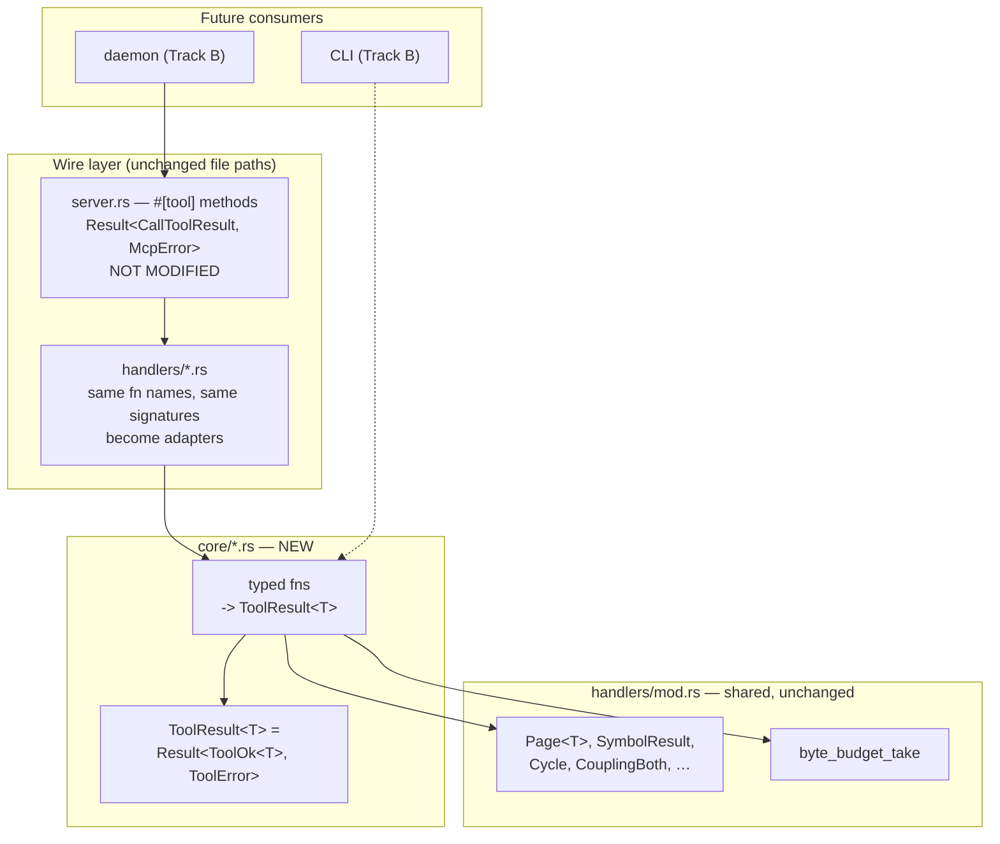
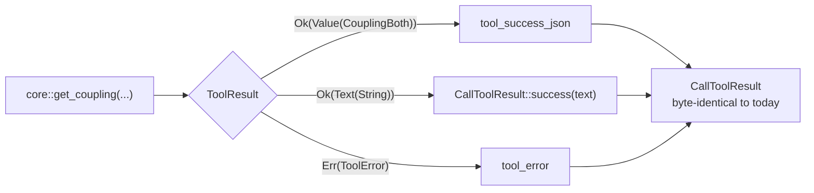

# Typed Core Layering (Track A)

## Overview

Every tool-facing handler returns `CallToolResult` — an rmcp wire type carrying a pre-serialized JSON string. A CLI or socket front-end calling one of them would have to deserialize JSON back out of the envelope to reach structured data. This design introduces a typed core that returns domain values, with the existing handlers demoted to thin adapters (FR-01 – FR-05).

The starting position is better than the spec assumed. All 18 handler functions — serving 19 tools, since `get_callers` and `get_callees` share `callers_or_callees` — return `CallToolResult` **directly**; the `Result<CallToolResult, McpError>` wrapper lives only in the `#[tool]` methods in `server.rs`. So the layering already half exists — what is missing is that the handler layer speaks the wire type instead of a domain type.

The design's central claim is that this refactor can be done **without touching a single one of the ~306 existing test assertions** and without touching `server.rs` at all. Decision 3 explains how, and it is what turns Track A from a risky sweep into a mechanical, incrementally verifiable change.

## Non-Goals

- **No behaviour change and no wire change.** Byte-identical output for all 19 existing tools; the existing snapshot suite must pass unmodified (NFR-01, AC-02). Any observable difference is a bug in this refactor, not an improvement.
- **No re-shaping of response types.** `Page<T>`, `SearchSymbolsResponse`, `CouplingBoth`, `AnalyzeResult` and the rest keep their fields, order, and serde attributes exactly. Renaming or tidying them is a different, breaking change.
- **No migration of existing test assertions.** See Decision 6 — 306 call sites are left working as they are, deliberately.
- **No CLI, no daemon.** Track A only makes them possible. The CLI is Track B's Decision 8.
- **`byte_budget_take` is not moved into the wire layer.** It shapes payload, not transport (FR-05).
- **No error taxonomy beyond what exists.** Handlers today produce a human-readable string; this design preserves that and does not introduce error codes, categories, or i18n.

## Architecture

### Components



### Data Flow



### Interfaces

```rust
// crates/code-graph-tools/src/core/mod.rs  (new)

/// A successful outcome. Two variants because two tools legitimately
/// return prose rather than a document — see Decision 2.
pub enum ToolOk<T> {
    Value(T),
    Text(String),
}

/// A user-visible failure. Carries the same human-readable message the
/// handler produces today; it is NOT an operational error type.
pub struct ToolError(pub String);

pub type ToolResult<T> = Result<ToolOk<T>, ToolError>;

// Adapter, the single place that knows about rmcp (FR-02):
pub fn to_call_tool_result<T: Serialize>(r: ToolResult<T>) -> CallToolResult;
```

`require_indexed` gains a core-level sibling returning `Result<(), ToolError>`; the existing `Result<(), CallToolResult>` form stays for `server.rs` (FR-04). **This is the one place where "logic just moves" is false — see Decision 8.**

## Design Decisions

### Decision 1: `Result<ToolOk<T>, ToolError>`, not a three-variant enum

**Context:** FR-03 requires representing three outcomes: a structured payload, a plain-text success, and a user-visible error.

**Options considered:** (1) One enum `Outcome<T> { Value(T), Text(String), Error(String) }`. (2) `Result<ToolOk<T>, ToolError>` — success split from failure at the `Result` boundary.

**Decision:** Option 2.

**Rationale:** Errors are a different channel from successes, and `Result` is how Rust says so — `?` composes, `map` works on the success arm only, and a caller that forgets the error case gets a compile error rather than a silently unhandled variant. Option 1 makes every consumer match three arms even when two are irrelevant. The nesting is not accidental complexity: `ToolOk` genuinely has two shapes, and hoisting `Text` to the top level would put a success next to a failure.

Critically, `ToolError` is **not** an operational error type. The workspace invariant is that user-visible errors travel as `CallToolResult` with the error flag, never as `Err(McpError)`. `ToolError` is the typed form of that message, and it must never be conflated with a transport or panic failure — which is exactly why it wraps a plain `String` rather than deriving from `thiserror`.

### Decision 2: `Text` covers two cases, not one

**Context:** The spec's FR-03 names one plain-text case, the non-callable soft-hint from `get_callers`/`get_callees` (`query.rs:213-223`).

**Decision:** `ToolOk::Text` covers that **and** `generate_diagram(format="mermaid")`, which also returns rendered text via `CallToolResult::success(vec![Content::text(...)])` (`structure.rs:1055-1059`).

**Rationale:** Found during code investigation; the spec knew about one and there are two. Had `Text` been modelled around the advisory alone — say, as an `Advisory` variant carrying a symbol and a kind — the mermaid path would have had nowhere to go and would have forced either a second variant or a serialized-string hack. One general `Text` variant covers both and anything similar later. This is a good example of why the design pass reads the code rather than the spec alone.

### Decision 3: The typed core is a new module; handlers keep their names and signatures

**Context:** 18 handler functions are called from `server.rs` and from ~306 in-module test assertions. Renaming or re-typing them in place breaks all of it at once.

**Options considered:** (1) Change handlers in place to return `ToolResult<T>`; update `server.rs` and every test. (2) Put typed functions in a new `core` module; leave each handler as a same-named, same-signature adapter that calls the core and converts.

**Decision:** Option 2. Logic moves to `crates/code-graph-tools/src/core/{query,symbols,structure,status,watch,analyze}.rs`; `handlers/*.rs` keep their exact public signatures and become one-line adapters.

**Rationale:** `server.rs` never changes — not one line — which means the `#[tool]` descriptions, the router, and the schemas are untouched, and NFR-01 is protected by construction rather than by testing. Existing tests keep compiling because the functions they call still exist with the same types. The refactor becomes: move a body, add an adapter, verify. Option 1 makes every intermediate state broken, so `make verify` cannot pass mid-migration — a hard requirement here.

The cost is a permanent extra indirection. That is acceptable: it is the layering the spec asked for, and the adapter is the "thin adapter" of FR-02 rather than dead weight.

### Decision 4: Shared response types stay in `handlers/mod.rs`

**Context:** `Page<T>`, `SymbolResult`, `Cycle`, `CouplingBoth`, `SearchSymbolsResponse` and the rest are defined in `handlers/mod.rs` and are now returned by the core.

**Decision:** Leave them there for this track. `core` imports them.

**Rationale:** Moving them changes import paths in every test and every snapshot's type provenance for zero functional gain, and it would collide with the "no churn" property Decision 3 buys. These types are already MCP-agnostic — plain serde structs with no rmcp reference — so their location is cosmetic. A later, separate move into a `types` module is trivially safe once the layering is in place; doing it now would inflate the diff that must be reviewed for wire compatibility.

**The two borrowed-lifetime input structs stay put too.** `SearchSymbolsInput<'a>` (`handlers/symbols.rs:172`) and `GenerateDiagramInput<'a>` (`handlers/structure.rs:890`) are argument structs, not response types, and live in their handler modules rather than `mod.rs`. The core takes the same structs and imports them from `handlers::symbols` / `handlers::structure`. That makes `core` depend on `handlers` for two type definitions while `handlers` depends on `core` for behaviour — legal in Rust within a crate, and not a cycle in any meaningful sense, but it inverts the direction the architecture diagram implies and is worth knowing before someone "fixes" it. Both structs are already rmcp-agnostic, so relocating them alongside the response types is safe whenever OQ-A2 is taken up; it just is not worth doing inside this track.

### Decision 5: `byte_budget_take` stays in the core path

**Context:** FR-05. Pagination and the byte budget could plausibly be called transport concerns.

**Decision:** They belong to the core. The typed value already reflects the applied budget, and `Page<T>` already carries `truncated`/`next_offset`.

**Rationale:** The budget determines *which records exist in the result*, not how they are encoded — a caller that receives a `Page<T>` with `truncated: true` needs that to be true of the value it holds, not of a rendering it never sees. A CLI paging through results needs identical semantics to an MCP client, which only works if the budget is applied before the wire layer. Note the existing `debug_assert!` that `limit > 0`: the core must resolve limit defaults before calling, exactly as handlers do today, and that obligation moves with the logic.

### Decision 6: The ~306 existing assertions are not migrated

**Context:** `body_text` appears 162 times, `page_parts` 122, `page_extras` 22 — almost entirely in `#[cfg(test)] mod tests` blocks inside the handler modules.

**Decision:** Leave them. They keep asserting against the adapter's `CallToolResult`, unchanged. New tests written for the core assert on typed values, and old assertions migrate only when a test is being touched for another reason.

**Rationale:** These assertions still test something real — that the adapter produces the expected wire output — and rewriting 306 of them produces no new coverage while risking exactly the regression the track must avoid. FR-01 requires that a typed function *exists and is callable*, not that every test calls it; AC-02 requires snapshots pass *unmodified*, which argues for less churn, not more. A 306-site sweep would also make the diff unreviewable for the one property that matters most here: byte-identical output.

Stated plainly so it is a decision and not an oversight: this leaves the test suite asserting mostly through the wire layer for some time. That is the correct trade while the wire layer is the thing under test.

### Decision 7: Migration is one module per commit, in dependency order

**Context:** NFR-04 requires `make verify` green at every commit; a big-bang rewrite cannot deliver that.

**Decision:** Eight commits, each self-contained: scaffolding (`core` module, `ToolOk`/`ToolError`/adapter, core `require_indexed`); one commit per handler module — `status`, `watch`, `query`, `symbols`, `structure`, `analyze`; and a final guard-coverage sweep confirming all 16 gated core functions call the core `require_indexed` (Decision 8).

**Rationale:** Tests are co-located with handlers in `#[cfg(test)] mod tests`, so each module's conversion is verified by that module's own suite plus the shared snapshot suite. `status` and `watch` go first as the smallest and least entangled; `analyze` goes last because it is async, owns the job slot, and interacts with progress reporting. Every commit is independently revertible, and a wire regression is bisectable to one module.

### Decision 8: The indexed-state guard is a NEW call site in each core function, not a moved one

**Context:** `require_indexed` is called from **`server.rs`**, before the handler runs — guarding every query and watch tool (`analyze_codebase`, `analyze_codebase_async`, and `get_status` are ungated by design). **Zero occurrences exist inside `handlers/*.rs`.**

**Decision:** Each gated core function calls the core-level `require_indexed` at its own entry. At the time of writing that is 19 `#[tool]` call sites mapping to 18 distinct core functions, since `get_callers` and `get_callees` share `callers_or_callees`. The count moved during implementation: the design was written against 16, before phase 1's three new tools were folded into this migration. The invariant is set equality between the two sides, not a fixed number — verify by comparison, never by counting to a remembered total. The `server.rs` call sites stay exactly where they are, so the guard runs twice on the MCP path — once in the wire layer, once in the core.

**Rationale:** Decision 3's mechanical framing — move a body, add an adapter — silently produces core functions with **no guard at all**, because there was never a guard in the handler to move. A caller reaching `core::get_callers` directly on an unindexed graph would get whatever an empty `Graph` returns instead of the domain error FR-04 and AC-28 require. Since reaching the core directly is the entire point of Track A (FR-01), that is a hole precisely where the track claims its value.

The double-check on the MCP path is deliberate and cheap: `require_indexed` reads one `AtomicBool` with `Ordering::Acquire` and takes no lock. Removing the `server.rs` call to avoid it would mean editing `server.rs`, forfeiting Decision 3's central guarantee, for a saved atomic load. The core check is the authoritative one; the wire-layer check is a fast path that also keeps `server.rs` byte-identical.

**How the core learns whether the graph is indexed differs by module, and the difference is forced.** The watch handlers take `&Arc<ServerInner>`, so `core::watch` reads `inner.indexed` directly and the guard genuinely runs twice on the MCP path, as described above. The query, symbols, and structure handlers take `&RwLock<Graph>` and have no access to the flag at all — so their core functions take an explicit `indexed: bool` parameter and the adapter passes `true`, since `server.rs` has already gated that path. The guard therefore runs once on the MCP path for those modules, not twice.

That is a deviation from the double-check described above, and it is the better shape given the constraint: the core cannot read state it was never handed, and an explicit parameter makes the obligation visible to a CLI or socket caller rather than hiding it behind global state the caller cannot see. Changing the handler signatures to carry `ServerInner` would restore the double-check at the cost of Decision 3's central guarantee, which is not a trade worth making.

**This must be enumerated per module in Decision 7's commits, not left as an implied consequence.** It is exactly the kind of addition a mechanical "one-line adapter" pass skips, and the only thing that would catch the omission is the AC-28 test — which, being new, might not be written until late in the sequence.

## Error Handling

The refactor preserves error behaviour exactly:

| Case | Core | Adapter output |
|---|---|---|
| User-visible failure | `Err(ToolError(msg))` | `tool_error(msg)` — same string, `is_error: true` |
| Not indexed | `Err(ToolError(...))` from core `require_indexed` | Same message as today, verbatim |
| Non-callable soft-hint | `Ok(ToolOk::Text(advisory))` | `CallToolResult::success(text)` — a success, as today |
| Mermaid render | `Ok(ToolOk::Text(rendered))` | `CallToolResult::success(text)` |
| Structured result | `Ok(ToolOk::Value(v))` | `tool_success_json(&v)` |
| Panic in `spawn_blocking` | Not the core's concern | Stays in `server.rs`, unchanged |

The messages are moved, never rewritten. A changed error string is a wire change (NFR-01) even though it is "only text", because agents pattern-match on tool output.

## Testing Strategy

**The refactor's correctness condition is "nothing changed", so the tests are mostly the ones that already exist.**

- **Existing snapshot suite, unmodified** — the primary gate (AC-02, NFR-01). If any `.snap` needs rebaselining during Track A, that is a defect until proven otherwise.
- **Existing handler unit tests, unmodified** — they run through the adapter and prove it produces what it used to.
- **New core tests, per module** — assert on the typed value: that `get_callers` on a non-callable kind yields `Ok(ToolOk::Text(_))` and *not* `Ok(Value)` or `Err` (AC-03); that an unindexed query yields `Err(ToolError)` discriminable without serialization (AC-28); that a byte-capped result yields a `Page<T>` whose `truncated`/`next_offset` are correct *as typed fields*, and that re-calling at `next_offset` resumes with no gap or repetition (AC-29).
- **Adapter round-trip property** — for each module, a test that the adapter's output for a typed value equals the pre-refactor handler's output for the same input. Cheapest form: the module's existing assertions, which is precisely why Decision 6 keeps them.
- **AC-01 as a compile-time fact** — a test in a module that does not import `rmcp` calls a core function and reads its fields. If it compiles, structured results are reachable without an rmcp type; if someone later leaks a wire type into the core, it fails to build.

### Structural Verification

- `cargo clippy --workspace --all-targets -- -D warnings` — expect new lints about needless adapter indirection; resolve by construction, not by `#[allow]`.
- `cargo fmt --all --check`.
- `make verify` at **every** commit, not just at the end — this is the whole premise of Decision 7.
- No `unsafe` introduced; `miri` not required.
- Dependency check: `core` must not gain an rmcp import. Worth a grep in review, and the AC-01 test above enforces it mechanically.
- **NFR-02** holds by construction: Track A touches only `code-graph-tools`, so `code-graph-core`, `-graph`, `-lang`, and `-path-trie` gain nothing. Confirm with `cargo tree` rather than assuming.
- **NFR-05**: no `tracing` dependency introduced; new diagnostics use `eprintln!`. Confirm with `cargo tree`.
- **Decision 8 coverage sweep**: after each module's commit, confirm every gated core function in that module calls the core `require_indexed`. A grep comparing the guarded set in `server.rs` against the guarded set in `core/` is the mechanical check; the two sets must be equal.

## Migration / Rollout

Internal refactor, no user-visible change, nothing to announce and nothing to migrate for users. Seven commits per Decision 7, each green.

There is no rollout flag and no phased enablement, because there is nothing to enable — the old entry points remain the only entry points until Track B adds a second consumer.

CLAUDE.md's "Tool handler return type" invariant needs restating once the layering lands: the invariant is still that user-visible errors travel as `CallToolResult` with the error flag rather than as `Err`, but the sentence should now describe both layers, since "handler" becomes ambiguous between the adapter and the core.

## Open Questions

- Whether `ToolError` should carry a machine-readable code alongside the message (OQ-A1) — **non-blocking** — the adapter renders the message identically either way and the CLI maps exit status without it; adding a field later is additive.
- Whether the shared response types eventually move out of `handlers/mod.rs` (OQ-A2) — **non-blocking** — this is file organisation only; the layering is correct in either location, and moving them inside this track would dilute the diff reviewed for wire compatibility.
- Whether `analyze_codebase`'s progress reporting belongs in the typed core (OQ-A3) — **non-blocking** — the core takes an abstract progress sink and the adapter supplies the rmcp-backed implementation; no interface above changes, and `analyze` is migrated last so it settles with the code in front of us.
