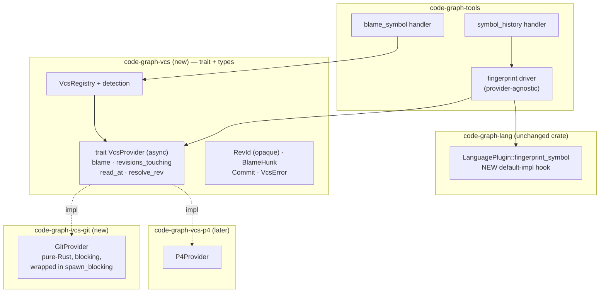
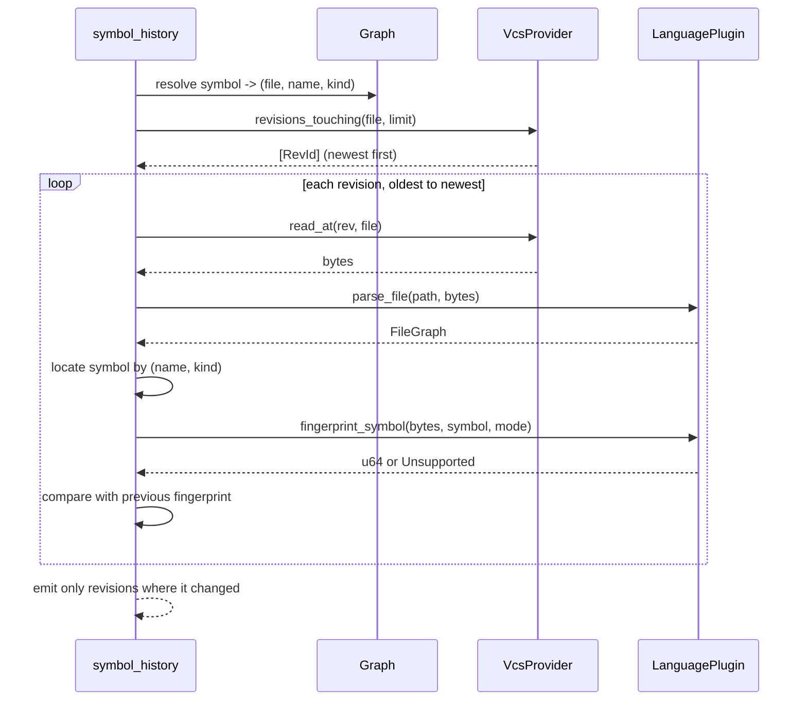

# Version-Control History (Track D)

## Overview

Two capabilities the graph cannot answer today: *who last changed this symbol* and *when did this symbol's logic actually change*. Both need version-control history, and both must work eventually against Perforce as well as git (FR-27 – FR-36, D-0002, D-0004).

The design is three pieces: a narrow provider trait in a new crate, a git implementation in a second crate, and the symbol-history logic — which is provider-agnostic, because it needs bytes at a revision and the existing parsers, not git.

One finding from investigation reshaped the design and is worth stating up front: **`LanguagePlugin::parse_file` returns a `FileGraph` (symbols and edges), not a syntax tree.** The spec's FR-34 presumes AST access for fingerprinting that the plugin interface does not expose. Decision 5 resolves this, and it is the single most consequential decision here.

## Non-Goals

- **No Perforce provider.** This design constrains the abstraction so one can be added; it ships git only (spec Non-Goals).
- **No git dependency outside its own crate.** `code-graph-core`, `-graph`, `-lang`, `-path-trie`, and `-tools` gain nothing (FR-31, NFR-02, AC-23).
- **No history indexing.** Queries go to the provider on demand; no history is pre-computed at index time and `.code-graph-cache.db` is untouched. The fingerprint sidecar of Decision 8 is a separate, disposable cache, not an index.
- **Not a general git wrapper.** Four operations (FR-27). No commit, no diff rendering, no branch management. `git log`-shaped browsing is not in scope even though the provider could support it.
- **No merge/rename tracking.** A symbol that moved between files is a new symbol; following content across renames is a known limitation, not a deliverable.
- **No sub-line attribution.** Spans are line-granular because `Symbol` has no end column.
- **Fingerprints are not a symbol identity.** They answer "did this change", not "is this the same symbol as that one". They never enter `SymbolId` or the graph.

## Architecture

### Components



### Data Flow — symbol history



### Interfaces

```rust
// crates/code-graph-vcs/src/lib.rs

/// Opaque revision identity (D-0002). Never assume hex, length, or hash.
/// Perforce uses changelist numbers and #rev specifiers.
#[derive(Clone, Eq, PartialEq, Hash, Debug, Serialize, Deserialize)]
pub struct RevId(String);

pub struct Commit { pub rev: RevId, pub author: String, pub timestamp_utc: i64, pub summary: String }
pub struct BlameHunk { pub rev: RevId, pub author: String, pub timestamp_utc: i64,
                       pub start_line: u32, pub line_count: u32 }

#[async_trait]
pub trait VcsProvider: Send + Sync {
    fn id(&self) -> &'static str;
    async fn blame(&self, path: &Path, lines: Option<(u32, u32)>, at: Option<&RevId>)
        -> Result<Vec<BlameHunk>, VcsError>;
    async fn revisions_touching(&self, path: &Path, limit: u32)
        -> Result<Vec<Commit>, VcsError>;
    async fn read_at(&self, rev: &RevId, path: &Path) -> Result<Vec<u8>, VcsError>;
    async fn resolve_rev(&self, spec: &str) -> Result<RevId, VcsError>;
}

// crates/code-graph-lang/src/lib.rs — added to LanguagePlugin
pub enum FingerprintMode { Normalized, LiteralInsensitive }

/// Default: normalized source text of the symbol's line span.
/// Returns None when the mode is not supported for this language.
fn fingerprint_symbol(&self, content: &[u8], symbol: &Symbol, mode: FingerprintMode)
    -> Option<u64> { /* default text-based impl */ }
```

## Design Decisions

### Decision 1: Two crates, mirroring the language-plugin split

**Context:** FR-30/FR-31 require a registry-with-detection pattern and a git dependency confined to one crate.

**Decision:** `code-graph-vcs` holds the trait, the shared types, and `VcsRegistry`. `code-graph-vcs-git` holds the git implementation and its dependency. A later `code-graph-vcs-p4` follows the same shape.

**Rationale:** This is exactly the `code-graph-lang` / `code-graph-lang-{cpp,rust,…}` structure already in the workspace — one trait crate, N implementation crates, each owning its heavy dependency — so it needs no new convention and the dependency confinement of AC-23 is enforced by the crate graph rather than by discipline. `LanguageRegistry`'s two-layer map (`by_ext` → `Language` → plugin) has a direct analogue: detection probes the working tree (a `.git` directory, a Perforce client configuration) and selects a provider.

### Decision 2: The trait is async even though every implementation blocks

**Context:** FR-29 requires an async trait. No native-Rust git library offers async local object access — gitoxide is blocking by design, with async limited to network transports — and a Perforce provider will shell out to a network client.

**Decision:** `#[async_trait]` on the trait; the git provider does its work inside `tokio::task::spawn_blocking`.

**Rationale:** The trait's asynchrony is about the *caller* not being blocked, not about the library being async. Both realistic providers block: git on local IO, Perforce on the network. Wrapping in a blocking-task pool satisfies NFR-10 (a slow provider delays only history tools) and is the same mechanism both need, so the abstraction is honest rather than aspirational. `async_trait` is required for `Box<dyn VcsProvider>` dispatch — native async-fn-in-trait is not object-safe — and is a new, small dependency confined to the vcs crates.

### Decision 3: Revision identity is an opaque newtype (FR-28, D-0002)

**Context:** Git identifies revisions by 40-hex SHA; Perforce by changelist number and `#rev`.

**Decision:** `RevId(String)`, constructed only by a provider, never parsed or validated by callers (D-0002).

**Rationale:** D-0002 is `reversibility: one-way` precisely because the cost lands the moment a hash-shaped identifier reaches a persisted field or the MCP wire — after that, relaxing it is a breaking change. A newtype rather than a bare `String` means a compile error, not a code review, catches a caller that starts treating it as a SHA. Neither handler ever inspects the contents; they pass it through and render it.

### Decision 4: Blame-a-symbol is a span lookup plus a line-range blame

**Context:** FR-32. `Symbol` carries `line` and `end_line`.

**Decision:** Resolve `(file, name, kind)` against the graph, take `[line, end_line]`, call `blame(path, Some((line, end_line)), at)`, and return the hunks.

**Rationale:** The span already exists, so this needs no new data and no cache change. Line-granular is a real limitation and is stated in the tool description rather than hidden: a symbol whose span shares a line with another gets that line's authorship attributed to both. The alternative — recomputing spans from a re-parse — buys nothing, since the graph's span is what every other tool already reports.

**Staleness detection, concretely.** The concern is real — if the file changed since indexing, the graph's span refers to a different file state and the attribution would be silently wrong — but "blame at the indexed revision" is not implementable as originally written: nothing in `Symbol`, the graph, or the wire types carries a revision, and Non-Goals rules out storing one.

The mechanism is mtime, which the incremental indexer already tracks per file for cache staleness. Blame is requested for the **working-tree state**, and the handler compares the file's on-disk mtime against the mtime recorded at index time; if they differ, the response is still returned but flagged stale, naming re-indexing as the fix. This needs a small read-only accessor exposing the indexed mtime to the handler — the value is already in the cache, so this is plumbing rather than new state, and it is the one piece of Track D that touches an existing crate beyond the trait hook.

If that accessor proves not to be cheaply reachable, the fallback is to drop the staleness flag entirely and document that blame reflects the working tree — **not** to silently return possibly-wrong attribution while claiming otherwise.

### Decision 5: Fingerprinting is a `LanguagePlugin` hook with a text-based default

**Context:** FR-33/FR-34 want an AST-shaped fingerprint with at least two sensitivities. **`parse_file` returns `FileGraph` — symbols and edges — not a syntax tree.** There is no way to reach the AST from outside a language plugin, and re-parsing with tree-sitter in the vcs layer would pull all six grammar dependencies into it.

**Options considered:** (1) Text-based fingerprint over the symbol's line span, in the vcs layer. (2) Extend `LanguagePlugin` with a fingerprint hook, defaulting to text-based, overridable per language with an AST implementation. (3) Extend `parse_file` to return the tree.

**Decision:** Option 2. Historical bytes are parsed through the existing plugins with no filesystem round-trip (FR-35).

**Rationale:** Option 3 changes the signature every language plugin implements and leaks tree-sitter lifetimes across the crate boundary — a large, invasive change for one feature. Option 1 cannot satisfy FR-34's literal-insensitive mode, which needs to distinguish a literal token from surrounding code, i.e. lexing at minimum. Option 2 matches how the trait already handles optional per-language behaviour — `preprocess`, `synthesize_symbols`, `resolve_call`, and `post_index` are all default-provided hooks that plugins override — so it adds no new pattern, and the fingerprint logic lives where the grammar already is.

The default implementation supports `Normalized` only. `LiteralInsensitive` returns `None` until a plugin implements it, and the handler reports the mode as unsupported for that language rather than silently falling back to `Normalized` — a silent fallback would make "the logic didn't change" mean two different things depending on language, which is worse than an explicit gap.

**Per OQ-D1 and D-0006, that gap is a sequencing step, not the end state.** Both modes are committed for all six languages: the text default gets `Normalized` working everywhere on day one, and step 6 of the rollout adds an AST-backed override per language plugin to enable `LiteralInsensitive`. FR-34 is met in full when step 6 completes, and the `None`-plus-report behaviour is what keeps the intermediate state honest rather than misleading.

**The default implementation must hash with `std` only.** It lives in `code-graph-lang`, one of the four crates NFR-02 forbids adding dependencies to, so the text-based default uses `std::collections::hash_map::DefaultHasher` and nothing else. The spec's Dependencies section anticipates "a hash function for symbol fingerprinting" as a new dependency — that dependency is permitted only in `code-graph-vcs`/`code-graph-vcs-git`, never in the default impl. Reaching for `blake3`, `xxhash`, or `ahash` here would violate NFR-02 the moment it lands, and it would do so invisibly, since nothing about the code would look wrong. Fingerprints are compared for equality within one process against one cache, never published or persisted across versions, so `DefaultHasher`'s unstable-across-releases property is acceptable — but the fingerprint cache (Decision 8) must therefore key on the binary identity too, or be treated as invalid across upgrades.

**The per-revision loop is CPU-bound and must be dispatched off the async runtime.** Decision 2's `spawn_blocking` treatment covers the *provider*; the fingerprint driver is the heavier half — `read_at` → `parse_file` (tree-sitter, synchronous CPU) → `fingerprint_symbol` (a second parse in AST mode), repeated once per revision. Running that inline on a tokio worker would starve the runtime exactly the way NFR-10 forbids, and it would do so on the CPU side rather than the I/O side the design originally reasoned about. The whole per-revision loop therefore runs inside `spawn_blocking`, not just the provider calls within it.

Neither mode touches identifiers or case — see the terminology note in Open Questions, and OQ-D5 for the matching surface that *is* case-sensitive.

### Decision 6: History walks revisions oldest-to-newest and reports transitions

**Context:** FR-33 — report where the symbol *changed*, not every revision touching the file.

**Decision:** Fetch revisions touching the file, walk them oldest to newest, compute the fingerprint at each, and emit an entry only where it differs from the previous: `Introduced` (absent → present), `Modified` (present, different), `Removed` (present → absent).

**Rationale:** Comparing consecutive fingerprints is what makes a pure reformatting invisible (AC-19) and a move within the file invisible (AC-20) — both leave the normalized fingerprint identical. Walking oldest-to-newest means each revision is compared against a known predecessor; newest-first would require a lookahead and gets the `Introduced` boundary wrong at the end of the window.

The window is bounded by the `limit` on `revisions_touching`, so results are "changes within the last N revisions touching this file". The oldest entry in a bounded window cannot be distinguished from an introduction, and the response says which it is rather than mislabelling it.

### Decision 7: A blocking, pure-Rust git provider (FR-47, D-0004)

**Context:** D-0004 requires a pure-Rust backend and no further native library.

**Decision:** gitoxide, blocking, inside `spawn_blocking`, confined to `code-graph-vcs-git`.

**Rationale:** D-0004's argument holds: the workspace already compiles C for the tree-sitter grammars, but those are self-contained generated sources with no external library, whereas libgit2 bindings vendor a large C library and add system-library discovery and cross-compilation burden. AC-56 is the check — the set of native-library dependencies must be unchanged after this lands.

**The four operations are not equally free, and the effort estimate must reflect that.** `blame` is genuinely supplied — gitoxide implements it, including rename tracking and shallow-history handling — so the concern that blame might be immature does not hold up. `read_at` and `resolve_rev` are close to direct API calls. **`revisions_touching` is not.** gitoxide has no first-class equivalent of `git log -- <path>`; delivering it means a manual revwalk with per-commit tree diffing against each parent to decide whether the path changed, filtered and capped. That is real engineering, and it is the operation both features lean on hardest — `blame_symbol` and `symbol_history` each depend on it. Rollout step 2 must be sized for it rather than treated as thin glue around a library call.

### Decision 8: The fingerprint cache is designed here, not deferred (FR-37, AC-46)

**Context:** FR-37 permits caching fingerprints under `<project_root>/.code-graph/`, and AC-46 makes it testable: served from cache on the second invocation, and recomputed — not errored — when the cache is absent or corrupt. This was originally filed as a deferred open question, which was wrong: an in-scope acceptance criterion needs a design, not a measurement.

**Decision:** A content-addressed sidecar cache at `<project_root>/.code-graph/fingerprints/`.

- **Key** — a hash of `(provider id, RevId, repo-relative path, symbol name, symbol kind, mode)`. Because `RevId` identifies immutable content in every VCS worth supporting, **a key can never name two different contents**, so a stale entry cannot be served. That is FR-37's requirement met structurally rather than by an invalidation rule, which is the only kind of cache-correctness argument worth making here.
- **Value** — the `u64` fingerprint, or a tombstone recording that the symbol was absent at that revision. Tombstones matter: "not present" is a real, reusable answer that drives the `Introduced`/`Removed` classification, and without them every history walk re-parses the revisions before a symbol existed.
- **Layout** — one file per shard, sharded on the key's leading bits, so a large history does not produce one directory with a hundred thousand entries.
- **Recovery** — any read failure, decode failure, or key mismatch is treated as a miss. The cache is never authoritative and never fails a query; a corrupt shard is deleted and recomputed.
- **Not the graph cache.** This is a separate sidecar, unrelated to `.code-graph-cache.db`. `CACHE_VERSION` is untouched, and a format change here means deleting a directory, not a re-index.

**Rationale:** The cost being avoided is real — a history walk over N revisions does N reads, N parses, and N fingerprints, and the parse dominates. Revisions are immutable, so the hit rate on a repeated query is effectively total. Keying on `RevId` rather than mtime or content hash is what makes the correctness argument trivial, and it works identically for a Perforce changelist. The tombstone case is the one an implementer would naturally omit and then wonder why history stayed slow.

## Error Handling

| Condition | Behaviour |
|---|---|
| No supported VCS detected | **Success**, reporting history unavailable and why (FR-36, AC-22). Not an error, and no other tool degrades. |
| Symbol not found | Tool error with the existing did-you-mean affordance. |
| File untracked by the VCS | Success, history unavailable for this path — distinct from "no VCS here". |
| Revision unreadable / history truncated | Return what was obtained, flagged partial. A shallow clone is the common cause and is not a failure. |
| Working tree moved since indexing | Report the mismatch (Decision 4). Never silently blame the wrong lines. |
| Fingerprint mode unsupported for the language | Report the mode as unsupported (Decision 5). Never silently fall back. |
| Provider slow or hung | Bounded by a timeout; a timeout degrades only history tools (NFR-10). |
| Parse fails at a historical revision | Skip that revision, flag it in the response. Historical code may not parse with today's grammar — expected, not exceptional. |

Library crates use `thiserror` (`VcsError`), matching `ParseError`/`RegistryError`. `eprintln!` for out-of-handler diagnostics; no `tracing` (NFR-05).

## Testing Strategy

**New test infrastructure is required and is the main hidden cost here.** No test in the workspace creates a git repository — `testdata/` is plain files, and the `external/` submodules are fixtures for parser baselines, not history. A helper that builds a temporary repository with scripted commits, deterministic author and timestamps, is a prerequisite for every meaningful test below.

- **Fingerprint unit tests**, no VCS involved: reformatting yields an unchanged fingerprint (AC-38); a changed literal yields a changed fingerprint under `Normalized` and an unchanged one under `LiteralInsensitive` where supported (AC-39); an unsupported mode returns `None` rather than a wrong answer.
- **History integration**, against a scripted repository: a commit that reformats and a commit that changes logic — only the logic commit is reported (AC-19); a commit that moves the function without changing it is not reported (AC-20).
- **Blame**, oracle-based: per-line attribution matches `git blame --porcelain -L <line>,<end_line>` for the same revision, revision-for-revision and author-for-author (AC-21). The git command is the oracle; nothing is hand-asserted.
- **Provider abstraction**: a test-double provider whose revision identifiers are **integers** implements the trait unchanged, proving Perforce-compatibility on the interface (AC-24). A deliberately slow double proves the async contract does not block (AC-35) and that a concurrent non-history query is unaffected (AC-44). Registering the double alongside git proves detection selects correctly without editing the git provider (AC-36).
- **Trait surface**: a reviewer-checkable assertion that the required operation set is exactly four (AC-34).
- **In-memory parse**: symbol-history parses historical bytes with no temporary file written — assert by watching the temp directory (AC-37).
- **Fingerprint cache** (AC-46): a second identical query is served from cache; deleting the cache directory recomputes the same answer; a deliberately corrupted shard recomputes rather than erroring. Also assert the tombstone path — a revision predating the symbol is cached as absent and not re-parsed.
- **Runtime isolation**: a `symbol_history` call over a large revision window does not delay a concurrent non-history query. This is the CPU-bound counterpart to AC-44, which only exercises a slow provider.
- **Dependency confinement**: `cargo tree` assertion that no VCS crate appears under the four core crates (AC-23), and that native-library dependencies are unchanged (AC-56).
- **No-VCS**: run the history tools in a plain temp directory; unavailability is a success-shaped result and every other tool behaves normally (AC-22).

### Structural Verification

- `cargo clippy --workspace --all-targets -- -D warnings`; `cargo fmt --all --check`; `make verify`.
- No `unsafe`; `miri` not required.
- `cargo tree -i` for the confinement checks above — these are the mechanical enforcement of FR-31 and D-0004, and belong in CI rather than in review.
- Git-fixture tests must be hermetic: explicit `user.name`/`user.email`, fixed timestamps, and `-c commit.gpgsign=false`, or they fail on contributor machines with signing configured.

## Migration / Rollout

Purely additive: two new crates, one new optional trait method with a default implementation, two new tools. No cache change, no wire change to existing tools, nothing for users to migrate.

1. `code-graph-vcs` — trait, types, registry, test double. No git.
2. `code-graph-vcs-git` — provider plus the temp-repo test harness.
3. `LanguagePlugin::fingerprint_symbol` with the default text implementation. Additive: no existing plugin changes, all six inherit the default.
4. `blame_symbol` — the simpler tool, exercising the provider end to end.
5. `symbol_history` — fingerprint driver, transition logic, and the Decision 8 fingerprint cache (FR-37, AC-46). The driver's per-revision loop runs inside `spawn_blocking`.
6. **Required** per-language AST fingerprint overrides, one language at a time, each enabling `LiteralInsensitive` for that language. Six sub-steps, independently shippable, but the step as a whole is committed (OQ-D1) — not optional.

Steps 1–5 deliver FR-32/FR-33 with `Normalized` everywhere; step 6 closes FR-34 language by language. Until a given language's override lands, requesting `LiteralInsensitive` for it reports the mode as unsupported rather than degrading silently. Documentation lands with the code: the two tools in CLAUDE.md's table (taking the count to 24 with Track C), the per-language fingerprint-support matrix, and the line-granularity and rename-tracking limitations under Known cross-cutting limitations.

## Resolved Questions

**OQ-D1 — RESOLVED: both modes are committed deliverables for all six languages.** `Normalized` ships first and is sufficient to start; `LiteralInsensitive` is **not** left as an optional per-language override. Step 6 of the rollout is therefore required rather than opportunistic: six AST-backed `fingerprint_symbol` implementations, one per language plugin, each enabling the literal-insensitive mode. FR-34 stands as written and needs no amendment.

  **Terminology note, recorded because the names invited a misreading.** Neither mode has anything to do with case sensitivity or identifier matching. `Normalized` hashes the symbol's source span with comments stripped and whitespace runs collapsed — identifiers, keywords, and literals all contribute verbatim, and nothing is case-folded. `LiteralInsensitive` additionally excludes the *values* of string and numeric literals, so a changed message or constant does not read as a logic change. "Insensitive" qualifies *literals*, not case. Because these fingerprints are computed within one already-identified symbol's span and are never used to match symbols to each other, they cannot affect symbol resolution. Consider renaming the variants during implementation — `IgnoreFormatting` and `IgnoreLiterals` say what they do and would not have prompted this — but the wire spelling should be settled before the tool description ships, since agents pattern-match on it (NFR-11).

**OQ-D5 — RESOLVED: exact, case-sensitive `(name, kind)` matching.** Decision 6 locates the symbol at each revision by `(name, kind)`, and that lookup is the design's only identifier-matching surface — distinct from the fingerprint modes, which never match symbols to each other. Exact matching is the decision (D-0005). Consequence, which the tool description must state rather than leave to be discovered: **any rename, including a case-only rename (`fooBar` → `FooBar`), reports as `Removed` followed by `Introduced`, not `Modified`.**

  Case-insensitive matching was rejected as actively wrong: `Foo` and `foo` can legitimately coexist as distinct symbols in five of the six supported languages, so folding case would silently interleave two symbols' histories — a worse failure than an honest delete-plus-add, because it produces a plausible answer instead of an obviously incomplete one. Similarity-based rename detection was rejected as materially more work and squarely inside the "no rename tracking" Non-Goal. Exact matching is also defensible on its merits: a renamed function is a different symbol to every caller.

**OQ-D3 — RESOLVED: the cache is designed and lands in this track.** Filed as a deferral, which was a coverage failure: AC-46 is in scope and testable, so it needed a design rather than a measurement. See Decision 8.

## Open Questions

- The default revision-window size for `symbol_history` (OQ-D2) — **non-blocking** — the mechanism, the bound, and the partial-result flag are fixed; only the default is unsettled and it is tunable without touching an interface.
- The timeout applied to a slow VCS provider (OQ-D4) — **non-blocking** — NFR-10's isolation comes from blocking-pool dispatch, which holds at any duration; the specific value is tuning.
