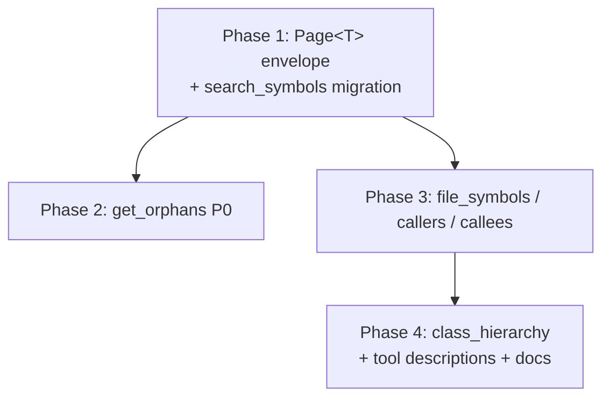

# Pagination Overhaul for UE-Scale Codebases

## Overview

Retrofit a uniform pagination contract across the MCP tool surface so the server stays usable on Unreal Engine-scale codebases (~10k files, ~500k symbols). The Rust rewrite shipped with `search_symbols` as the only paginated tool; first-use feedback revealed `get_orphans` exceeds MCP token limits and several other tools have no defensive cap.

The plan implements `Designs/Pagination` end-to-end:

- One generic `Page<T>` envelope in `handlers/mod.rs`, mirroring `search_symbols`'s existing `{results, total, offset, limit}` shape.
- `get_orphans`, `get_file_symbols`, `get_callers`, `get_callees` gain `limit`/`offset` and wrap their flat-array responses in `Page<T>`.
- `get_class_hierarchy` gains `max_nodes` + `truncated` + `total_nodes_seen`, mirroring `generate_diagram`'s precedent. Diamond inheritance gets correct semantics via a unique-name visited set.
- Eight tools stay untouched (with documented reasons) — `detect_cycles` is deferred until evidence.

This is a single-PR delivery. Phases exist for implementation tracking, not for staged rollout — wire-format changes ship atomically.

## Architecture

Phase 1 is the shared foundation — every subsequent phase consumes `Page<T>`. Phases 2 and 3 are independent but share the same envelope; Phase 3 follows 2 to keep the diff reviewable. Phase 4 closes the loop with the tree-shaped tool plus the cross-cutting cutover work (tool descriptions, CLAUDE.md, README.md, final snapshot review).

The work touches three crates:

- `crates/codegraph-tools/src/handlers/` — every paginated handler.
- `crates/codegraph-tools/src/server.rs` — the `*Args` structs and `#[tool]` descriptions.
- `crates/codegraph-graph/src/algorithms.rs` — only Phase 4 (the `class_hierarchy` budget).

Snapshot suite: 10 existing response snapshots regenerate, ~5 tools-list snapshots regenerate, 7 new response snapshots are added. All approved via `cargo insta review` in Phase 4.

## Key Decisions

Decisions are owned by the design doc (`Designs/Pagination`); the plan inherits them verbatim:

1. **Shared `Page<T>` envelope, not per-tool structs.** One generic, every paginated tool consumes it.
2. **Materialize-then-slice in the handler.** Keeps `total` exact. Performance optimization is a separate project.
3. **`max_nodes` for trees, `limit`/`offset` for lists.** Matches `generate_diagram`'s precedent for trees and `search_symbols`'s for lists.
4. **`get_callers`/`get_callees` sort by `(depth, symbol_id)` ascending.** Deterministic across BFS reruns.
5. **`get_class_hierarchy` `max_nodes` counts unique nodes (not visits).** Diamond hierarchies don't burn budget for shared ancestors.
6. **Defer `detect_cycles`.** UE's include graph discipline keeps real cycles rare; no evidence of need.
7. **Hard-clamp `limit` and `max_nodes` at 1000.** Silent clamp; echoed value reveals the cap.

## Dependencies

- **Existing rmcp + serde wiring** — pagination piggy-backs on the established `Args` struct + `#[serde(default)]` pattern. No new dependencies.
- **`insta` snapshot suite** — required for the wire-format lock. `cargo insta review` is part of Phase 4's verification.
- **No external blockers.** Design `Designs/Pagination` is in `review`; this plan starts only after design status flips to `approved`.
