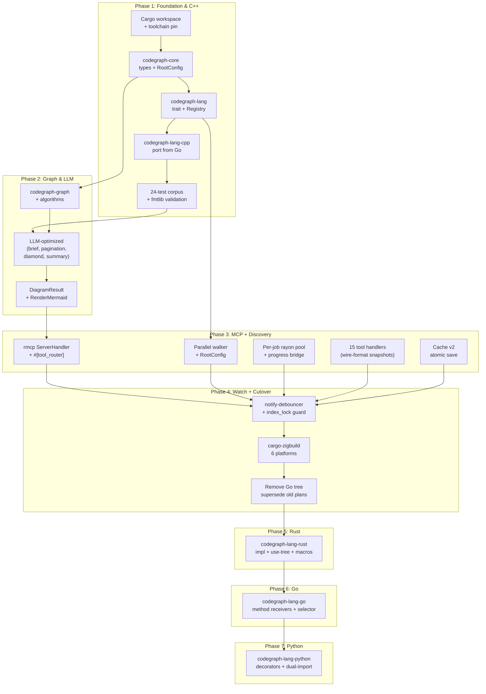

# Rust Rewrite of code-graph-mcp

## Overview

Wholesale port of `code-graph-mcp` from Go (mcp-go + go-tree-sitter via CGo) to Rust (rmcp + native tree-sitter crates). The Go binary is retired; the Rust binary becomes the single supported implementation, feature-complete on day one for everything currently shipped (15 MCP tools, C++ parser, LLM-optimized output, persistence, watch mode, diagram generation, search pagination), and additionally ships the three previously-planned language parsers (Rust, Go, Python) as in-scope deliverables.

Three architectural commitments anchor the plan:

1. **Wire-format preservation.** Every MCP tool's parameters and JSON response shape match the Go binary so existing agent prompts keep working unchanged. A `tests/snapshots/` golden-file suite enforces this.
2. **Multi-language source-tree dispatch as a first-class concept.** A `LanguageRegistry` maps file extensions to `LanguagePlugin` trait objects; symbols are tagged with `Language`; the symbol index is keyed by `(Language, name)` so cross-language collisions are structurally impossible during edge resolution.
3. **Massive-codebase optimization from day one.** A configurable, thread-pool-driven parallel discovery walker (`ignore::WalkBuilder::build_parallel`) and an independently-sized rayon parsing pool, both controlled via `<root>/.code-graph.toml`, with hard-capped concurrency at `available_parallelism()`.

Design source: `Designs/RustRewrite/README.md` (`status: review`). All phases inherit the design's locking rules (`reindex_file` acquires the index lock; watch events received during analyze are dropped via `try_lock`), the `null` vs `[]` wire-format invariant, the diamond-safe per-DFS-path traversal, the UTF-8-safe signature truncation by construction, the rayon→tokio progress notification bridge, and the atomic write-tmp+rename cache save.

## Architecture

## Key Decisions

Carried forward from `Designs/RustRewrite/`:

- **`rmcp 1.5` over hand-rolled JSON-RPC.** Official, post-1.0, macro-driven tool registration via `#[tool_router]`/`#[tool]`, schemars-derived JSON schemas, stdio transport, progress notifications via `peer.notify_progress`. The whole binary is async (tokio); graph and parsing layers stay synchronous behind `spawn_blocking` boundaries.
- **`tree-sitter 0.26` + grammar crates.** `tree-sitter-cpp 0.23.4` (bit-identical to Go), `tree-sitter-rust 0.24`, `tree-sitter-go 0.25`, `tree-sitter-python 0.25`. Vendored C runtime built via `cc-rs` build script — no system tree-sitter, no `pkg-config`, no CGo equivalent.
- **Single in-memory graph with `Language` tag** rather than per-language sharded sub-graphs. Cross-cutting queries stay O(N); language-scoped queries filter cheaply; the "source tree" concept lives in the dispatch layer (`LanguageRegistry`), not in storage.
- **Independent discovery and parsing pools, both `.code-graph.toml`-tunable, hard-capped at `NumCPU`.** I/O-bound discovery and CPU-bound parsing benefit from differently-sized pools; sharing one cannot optimize both. `WalkBuilder::threads(N)` is the discovery knob; `rayon::ThreadPoolBuilder::num_threads(N)` is the parsing knob. Default `0` means auto (NumCPU). Values exceeding NumCPU are clamped at load time with a warning surfaced via the `analyze_codebase` warnings array.
- **`ignore::WalkBuilder` over `walkdir`.** Respects `.gitignore` automatically — fixes a real complaint from the 8,908-file C++ codebase that needed manual exclusion of `build/`, `node_modules/`, etc.
- **Cache version bump 1 → 2.** `FileEntry` widens to carry `Language`. v1 caches (Go-written) trigger a silent re-index. Save uses write-tmp + fsync + rename to close the partial-write window the Go implementation has.
- **Per-language edge resolution.** `LanguagePlugin::resolve_call` and `resolve_include` are trait methods with default scope-aware implementations matching Go behavior; languages override (Python module paths, Rust use trees, Go package paths) so a Python `__init__` cannot collide with a C++ `init` during call resolution.
- **Wire-format guarantee enforced by snapshot tests** (`cargo insta`) over every tool's response shape. A divergence is a deliberate decision, not drift.

Phase ordering decisions:

- **C++ first** is non-negotiable: it's the only language with an existing test corpus and known-good baseline; getting it green proves the architecture before any new parsing work.
- **Foundation merged with Phase 1 (C++)** rather than a standalone scaffold phase. The scaffold is small enough (workspace, types, trait, registry, RootConfig) that it doesn't merit its own phase; merging keeps total phase count at 7.
- **Phase 3 deliberately bundles MCP server + tools + persistence + parallel discovery.** Splitting them produces phases that can't be verified in isolation (tools need persistence; persistence needs the indexer; the indexer needs discovery). One large phase with seven well-scoped tasks beats three tiny phases that block on each other.
- **Phase 4 is the cutover boundary.** After Phase 4 ships green, the Go source tree is removed in a single commit — no co-existence period, no feature flag, no parallel-run-and-compare. Phases 5-7 then add languages incrementally, each independently shippable behind the now-stable Rust binary.
- **Phases 5-7 are sequenced Rust → Go → Python per the user's explicit priority.** Rust second is a deliberate dogfooding choice: the Rust binary indexes its own source code as part of Phase 5 validation.

## Dependencies

External crates pinned per `Designs/RustRewrite/` Recommended Stack:

- `rmcp = "=1.5.0"` (server, macros, transport-io, schemars features)
- `tree-sitter = "0.26"` (vendored C runtime, no system lib)
- `tree-sitter-cpp = "=0.23.4"` (Phase 1 — pinned exactly to match Go behavior)
- `tree-sitter-rust = "0.24"` (Phase 5)
- `tree-sitter-go = "0.25"` (Phase 6)
- `tree-sitter-python = "0.25"` (Phase 7)
- `tokio = "1.52"` (full features)
- `rayon = "1.12"`
- `parking_lot = "0.12"`
- `notify-debouncer-full = "0.7"`
- `ignore = "0.4"`, `globset = "0.4"`
- `crossbeam-channel = "0.5"`
- `serde = "1.0"`, `serde_json = "1.0"`, `toml = "0.8"`
- `regex = "1.12"`
- `streaming-iterator = "0.1"` (required by tree-sitter query iteration)
- `anyhow = "1"`, `thiserror = "2"` (errors)
- `schemars = "0.8"` (JSON schema derivation for rmcp tools)
- `insta = "1"` (snapshot tests; dev-dependency)
- `pretty_assertions = "1"`, `rstest = "0.21"` (test ergonomics; dev-dependencies)

Build-time:

- C compiler (`cc` / `clang` / MSVC) — required by `cc-rs` to compile each grammar's bundled C parser. No system `libtree-sitter` or `pkg-config` needed.
- `cargo-zigbuild` (Phase 4 only) — universal cross-compiler toolchain for producing the 6 platform binaries from a single Linux host.

Toolchain:

- `rust-toolchain.toml` pinned to a stable Rust release (decided in Phase 1, task 1.1; expected `1.84+` so `std::fs::rename` atomicity guarantees on Windows are explicit).

Inputs from existing artifacts (consumed, then superseded as part of the cutover in Phase 4):

- `Designs/CodeGraphMCP/README.md` (status: implemented → will become superseded)
- `Designs/LLMOptimization/README.md` + debrief notes (implemented → superseded)
- `Plans/CodeGraphMCP/` (complete Go phases, port targets)
- `Plans/{RustParser,GoParser,PythonParser}/` (draft Go-targeted plans, replaced by Phases 5-7 of this plan)
- `Research/multi-language-parsers.md` (still active reference)
- `internal/lang/cpp/cpp.go`, `internal/lang/cpp/queries.go`, `internal/graph/*.go`, `internal/tools/*.go`, `internal/parser/*.go` (the source-of-truth Go code being ported)
- `testdata/cpp/` (preserved unchanged for Phase 1 validation)

External validation projects (already used by Go phases; reused here):

- `fmtlib/fmt` — Phase 1 real-world C++ validation gate (32 symbols, 244 edges, 0 crashes — same baseline)
- This Rust workspace itself — Phase 5 dogfooding gate for the Rust parser
- `sirupsen/logrus@v1.9.3` — Phase 6 dogfooding gate for the Go parser
- `psf/requests@v2.32.3` — Phase 7 dogfooding gate for the Python parser

## Successor Plan (deferred until this rewrite ships)

After this plan reaches `status: complete` and soaks against real polyglot workloads, the next planned body of work is **multi-tenant graph sharing across Claude sessions**. The architecture is captured in `Designs/SharedDaemon/` (status: draft, deferred). It replaces the one-process-per-session stdio model with a long-running daemon that:

- holds **one in-memory graph per indexed root path**, shared across all sessions that point at that path — two Claude tabs on the same project never re-index from scratch;
- isolates **multiple workspaces inside one daemon** — git worktrees, Perforce streams, branch clones each get their own graph because their absolute paths differ, and the tenancy key falls out without VCS-specific code;
- adds two new tools (`list_workspaces`, `select_workspace`) and watch-mode notification fan-out so multiple sessions can subscribe to the same workspace's edits.

The `Workspace`-vs-`ServerInner` refactor that SharedDaemon needs is **not** retrofitted into this rewrite. Specifically, this rewrite:

- ships single-tenant, stdio-only;
- bakes wire-format snapshots that may need to rebaseline for the SharedDaemon vNext (the two new tools and a new `cache_status` field on `analyze_codebase`);
- keeps `ServerInner` the way the design describes today.

The reason for the carve-out is risk concentration: doing both the language port and the daemon-ization in one project compounds risk without compounding value. SharedDaemon picks up cleanly once this plan reaches `status: complete` — it inherits a working, validated, multi-language Rust binary as its starting point and only changes the transport and tenancy layers on top.

When this plan reaches `status: complete`, the next step is `/planner:plan` against `Designs/SharedDaemon/` to produce the implementation plan for that work.
