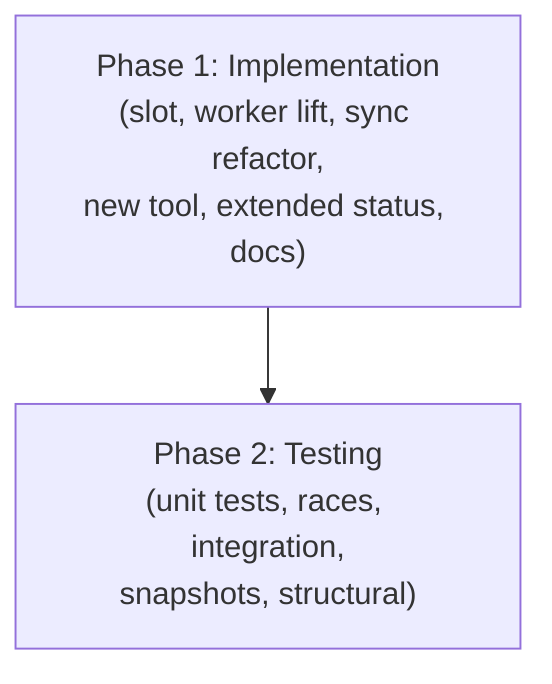
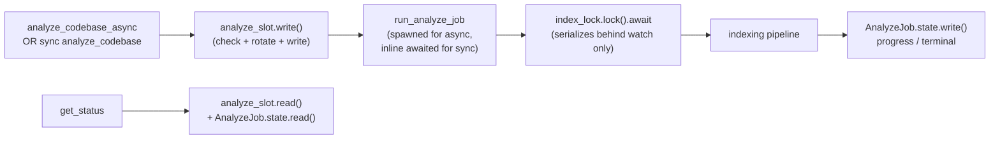

# Async analyze_codebase with Poll-Based Status

## Overview

Delivers the structural fix for `MCP_TOOL_TIMEOUT` killing long `analyze_codebase` calls: a new `analyze_codebase_async` tool that returns immediately with a `job_id`, plus an extended `get_status` that surfaces the in-flight or most-recent job's progress and result. Sync `analyze_codebase` is preserved at the wire but rewritten internally to share the same job-state machinery so `get_status` reports its progress identically.

The full design — single-flight model, slot rotation, locking protocol, eight numbered design decisions — lives in `Designs/AnalyzeCodebaseAsync/README.md` (status: `review`). This plan executes that design with no scope additions.

## Architecture

Phase dependency:

End-state data flow (from the design, condensed):

Two phases — code first, then tests + verification. The split is intentional: the implementation phase produces a working but lightly-tested feature; the testing phase produces the confidence-building race coverage, integration coverage, snapshot rebaseline, and clippy/fmt/structural pass before merge.

## Key Decisions

`Designs/AnalyzeCodebaseAsync/README.md` owns Decisions 1–9 (slot as single-flight gate, two-slot grace window, duplicate kickoff returns existing, all-inside-PlRwLock state, fan-out progress sink, timestamp job_id, sync waits for watch instead of erroring, etc.). This plan inherits them all and adds two execution-level decisions:

- **Phase split — 2 phases, not 3.** Per `ARGUMENTS` from the planner invocation. The original 3-phase split in the design (slot+sync, async tool+status, descriptions+integration) collapses cleanly into Implementation + Testing because every implementation step has a single well-known test surface and the integration test naturally lives in the Testing phase. No semantic dependencies are violated: Phase 1's tasks are internally ordered to land the slot first, then the worker, then the handlers; Phase 2 fans tests across all of them.
- **Tool description landing.** The agent-facing `#[tool(description = …)]` strings are production behavior (per the "Agent-facing tool descriptions" lens in CLAUDE.md). They land in Phase 1 alongside the handler that exposes them, so the implementation phase produces a self-contained, agent-usable feature. Tests in Phase 2 then exercise it through the same tool surface the agent will see.

## Dependencies

- The design at `Designs/AnalyzeCodebaseAsync/README.md` must reach `approved` status before Phase 1 begins. (Currently `review` — pending user sign-off after the plan-reviewer round.)
- No external crate additions. Decision 6 deliberately uses the existing `now_nanos_u64()` helper for `job_id` rather than `ulid`/`uuid`, preserving the workspace's slim-dep posture.
- No `CACHE_VERSION` bump. The on-disk cache shape is untouched.
- The recently-shipped forwarder time-bound fix (commit `0d32b55`) stays intact — Decision 8 (fan-out progress sink) explicitly preserves the sync mpsc + forwarder path so the per-call `notify_progress` timeout that fix added is not refactored under this plan.
