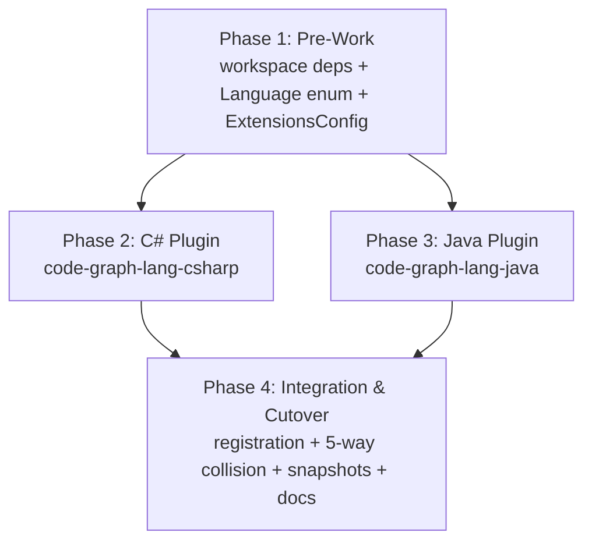
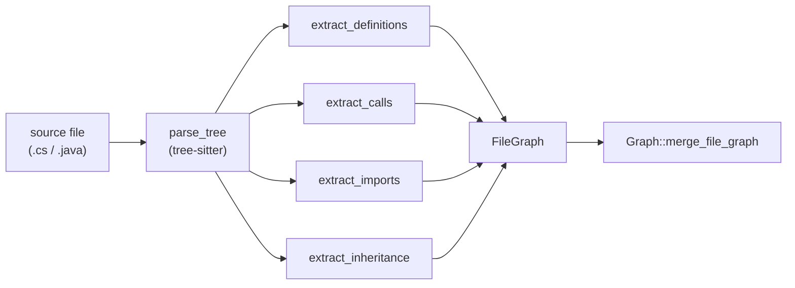

# C# and Java Language Plugin Support

## Overview

Add C# (`.cs`) and Java (`.java`) language plugins to the four-language MCP shipped via the RustRewrite plan on 2026-05-07. Each plugin parses with `tree-sitter` (`tree-sitter-c-sharp` and `tree-sitter-java`), registers via `LanguageRegistry`, and emits the same Symbol/Edge graph shape as the existing four. The supported-languages count grows from 4 → 6.

The plan tests the architecture's "adding a new language slots in cleanly" claim from the Phase 7 retro by running C# and Java as **two parallel plugin phases** dispatched after a small pre-work phase. The plugin crates share no source code beyond the consolidated helpers in `code-graph-lang::helpers` (`truncate_signature`, `find_enclosing_kind`); they only collide at registration, which lands sequentially after both parser bodies are merged.

What's intentionally **not** in scope: Kotlin, Scala, F#, type-resolution-based call dispatch, build-system integration (`.csproj`, `pom.xml`, Maven coordinates). All call resolution remains scope-aware-heuristic; all imports record the dotted path verbatim.

## Architecture

Phases 2 and 3 dispatch in parallel. Each phase mirrors the Phase 7 (Python) shape from RustRewrite — 7 tasks: scaffold → definitions → calls → imports → inheritance → testdata+corpus+watch+dogfood → structural verification. Phase 4 lands sequentially because all four of its tasks touch shared integration files (`main.rs`, `parse-test/main.rs`, `mixed_language.rs`, `CLAUDE.md`).

### Per-Plugin Data Flow (matches the four shipped plugins)

Both plugins emit all four edge categories: `Function/Method/Class/Struct/Enum/Interface` symbols, `Calls` edges, `Includes` edges, `Inherits` edges. Unlike Go (structural, zero `Inherits`), both new plugins emit `Inherits` for class extension AND interface implementation.

## Key Decisions

The full decision set lives in `Designs/CSharpJavaSupport/README.md` (12 decisions, D1–D12). Highlights that shape this plan's task structure:

| # | Decision | Plan impact |
|---|----------|-------------|
| D1 | Two parallel plugin phases | Phases 2 and 3 dispatch concurrently after Phase 1 |
| D2 | `Inherits` for class extension AND interface implementation | Same edge kind for both — no new `Implements` edge |
| D3 | C# partial classes — one Class symbol per declaration | 2.6 watch-mode regression covers add/remove of partial declarations |
| D4 | Java anonymous classes — invisible (methods take enclosing named entity as parent) | 3.2 fixture covers anonymous class inside method |
| D11 | Java `default` interface methods extract as `Function`, not `Method` | 3.2 cites Rust's trait-default-method contract from Phase 5 |
| D12 | Java enum methods extract as `Method` with parent = enum type; constants skipped | 3.2 fixture for `Planet` (constants + abstract method + per-constant method body) |

### Conventions baked in from PLANNER_IMPROVEMENTS.md

1. **No numeric baseline estimates.** Tasks 2.6 and 3.6 use `expected baseline: TBD; populated on first dogfood run, gated at ±10%`.
2. **Brief-vs-shipped-state contracts cite file:line.** Inheritance tasks (2.5, 3.5) reference the bare-class-name `from`-field rule from Phase 1 and Phase 5 by file path, not by re-deriving from prose.
3. **Sequential-dispatch heuristic stated explicitly.** Within Phase 2 and Phase 3, tasks 2.2–2.6 and 3.2–3.6 each extend `parse_to_filegraph`'s extractor call chain; parallel dispatch within a language produces merge conflicts on the shared entry point. Tasks within a phase are sequential.
4. **`/planner:refresh-brief` is a hard prerequisite before `/planner:implement`** for Phases 2, 3, and 4. Each phase doc states this in its overview.
5. **Asymmetric assertions** required in 4.2's 5-way collision regression — both positive ("X IS in B's callers") and negative ("X IS NOT in B's callers") for every cross-language pair.
6. **Recovered-symbol count, not zero, for `broken.cs`/`broken.java` fixtures.** Pinned in 2.6 and 3.6 — run and record; do not guess. Mirrors the Phase 7 `broken.py` discovery.

## Dependencies

### External

- `tree-sitter-c-sharp` — strict-pinned (`=X.Y.Z`) at implementation time; must compile against `tree-sitter` core 0.26
- `tree-sitter-java` — strict-pinned (`=X.Y.Z`) at implementation time; must compile against `tree-sitter` core 0.26
- `external/efcore` git submodule (dotnet/efcore, pinned to a v8.x LTS tag) for the C# dogfood baseline test
- `external/commons-lang` git submodule (apache/commons-lang, pinned to latest stable `LANG_3_X_X` tag) for the Java dogfood baseline test

### Internal

- The four shipped language plugins (cpp/rust/go/python) and the `code-graph-lang::helpers` module are unchanged by this plan. The `LanguageRegistry`, `Symbol`/`Edge` core types, watcher, and `analyze_codebase` indexer are reused without modification.
- The `Language` enum's `#[non_exhaustive]` annotation makes the new variants non-breaking for downstream consumers.
- The `ExtensionsConfig` widening (1.2) is the only change to a shared crate that the plugin crates depend on at compile time. Phase 1 must merge before Phases 2 or 3 compile.

### Risks

- **Grammar version compatibility.** The grammar crates' compatibility with the workspace's `tree-sitter` core (currently 0.26) must be verified at implementation time. If neither grammar has a 0.26-compatible release, this plan is blocked until they do.
- **`broken.cs`/`broken.java` recovered-symbol counts are unknown.** The design mandates pinning the recovered count (not assuming zero). Tasks 2.6 and 3.6 say "run and record; do not guess."
- **`efcore` submodule subdirectory layout** may differ from the documented `src/EFCore` path at the pinned SHA. Verify at 2.6 implementation time.
- **`tree-sitter-java` `default` method node type** for interface default methods is unverified. Decision 11 relies on it matching `function_definition`; confirm against the grammar's actual node types before writing the 3.2 query.
