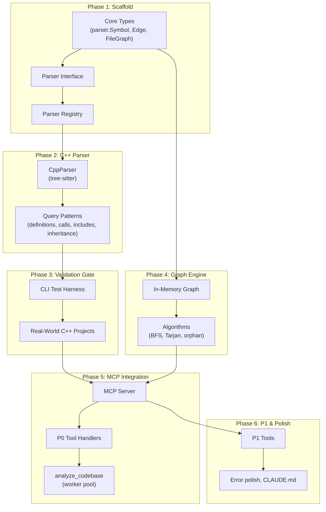

# Code Graph MCP Server

## Overview

Build a Go MCP server that constructs an in-memory semantic code graph from source files using tree-sitter, exposing graph query tools over stdio. Enables AI agents to query callers, callees, dependencies, and class hierarchies in real time instead of exhaustive file searching.

The plan is structured so that the parser layer is built and validated against real-world C++ code **before** the MCP integration is wired up. This ensures query pattern accuracy before anything depends on it.

## Architecture

## Key Decisions

- **Parser-first development:** Phases 2-3 are fully testable without MCP. A CLI harness lets us inspect parsed output and fix queries before building the graph or server.
- **Phase 4 parallel to Phase 2-3:** The graph engine depends only on Phase 1 types, not on the parser implementation. It can be developed in parallel with parser validation.
- **Validation gate (Phase 3):** Explicit checkpoint where parser accuracy is confirmed against real C++ code. No MCP work starts until this passes.

## Dependencies

- `github.com/mark3labs/mcp-go` v0.45+ — MCP server framework
- `github.com/tree-sitter/go-tree-sitter` — Official tree-sitter Go bindings (CGo)
- `github.com/tree-sitter/tree-sitter-cpp/bindings/go` — C++ grammar
- CGo toolchain (C compiler) required at build time
