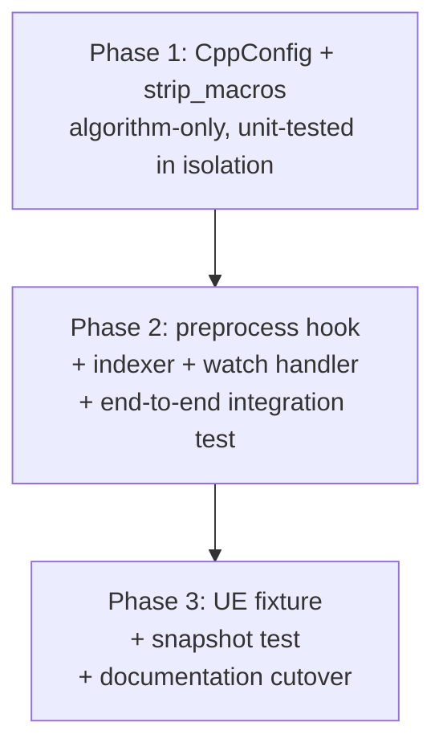

# C++ Macro-Strip — recover class extraction from API-export macros

## Overview

Restores C++ class extraction for declarations like `class CORE_API MyClass : public UObject {};`. Tree-sitter-cpp's grammar (v0.23.4, final release) parses the API-export macro into the `name: (type_identifier)` slot, leaves the rest as an `ERROR` node, and the existing `has_error()` guard correctly drops the broken capture — so the class is invisible to every downstream tool. This plan implements the design at `Designs/CppMacroStrip`: a `[cpp].macro_strip` config field listing identifier tokens to remove from C++ source bytes (replaced with same-length spaces, preserving offsets) before tree-sitter parses.

The user-reported failure is the second half of the issues observed on a generic UE project (the first half was the `get_orphans` token-bloat, closed by PaginationOverhaul). After this plan ships, `get_class_hierarchy`, `get_callers`, `get_callees`, `get_orphans { kind: class }`, and `generate_diagram` all work correctly on UE codebases for users who opt in via `macro_strip`.

Single-PR delivery (commit-per-phase) following the PaginationOverhaul cadence.

## Architecture

The work touches three crates:

- `crates/codegraph-core` — Phase 1: new `CppConfig` struct + `RootConfig::cpp` field + empty-string filter at config-load.
- `crates/codegraph-lang` — Phase 2: `preprocess` hook added to `LanguagePlugin` trait with default impl.
- `crates/codegraph-lang-cpp` — Phase 1 (substitution algorithm) + Phase 2 (override `preprocess`).
- `crates/codegraph-tools` — Phase 2: indexer + watch handler call-site updates + end-to-end test.

Plus a new fixture (`testdata/ue/MyActor.h`) and documentation surfaces (`CLAUDE.md`, sample `.code-graph.toml`, `lib.rs` doc comments) in Phase 3.

## Key Decisions

Decisions are owned by the design (`Designs/CppMacroStrip`); the plan inherits them verbatim:

1. **Pre-parse byte substitution, not query-level recovery.** The broken AST has no well-formed sibling structure to query against.
2. **Literal token list, not regex.** Explicit user control; no false positives on real identifiers like `OPENAL_API`.
3. **Replace with spaces (same byte count).** Preserves all line/column reporting in extracted symbols.
4. **`preprocess` hook on `LanguagePlugin` with default impl, NOT a `parse_file` signature change.** Strictly additive trait extension; only the C++ plugin overrides; three production plugins and two test stubs need zero changes.
5. **Empty default; opt-in only.** A non-empty default would silently strip identifiers in non-UE codebases that happen to use the same names.
6. **Single flat `[cpp]` section.** YAGNI on pre-emptive nesting.
7. **Empty-string macro entries filtered at config-load** (not `debug_assert`) — empty pattern would infinite-loop the substitution loop in production.

## Dependencies

- **Existing `RootConfig` + `LanguagePlugin` infrastructure** — pagination-style additive extension, no new external dependencies.
- **`insta` snapshot suite** for the new UE-fixture snapshot in Phase 3.
- **No external blockers.** Design `Designs/CppMacroStrip` is in `review`; this plan starts only after design status flips to `approved`.
