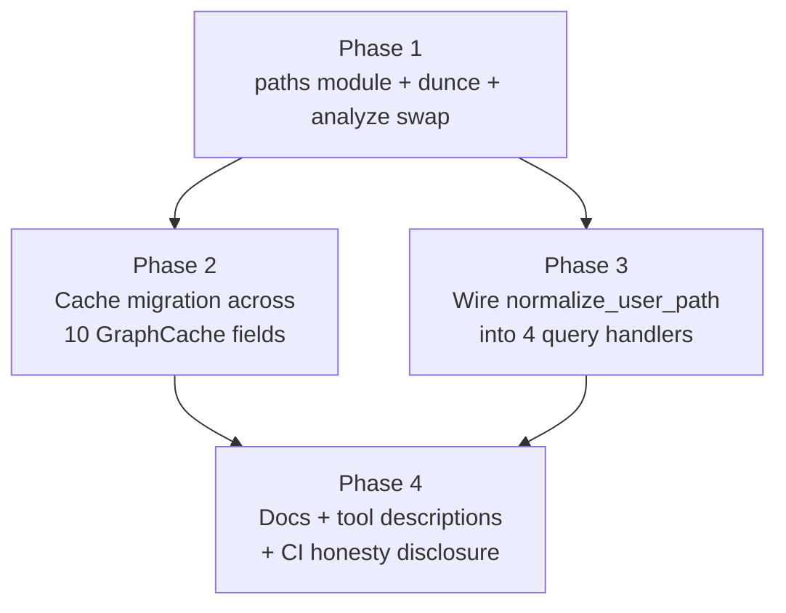

# Path Normalization

## Overview

Running against a generic UE4 project showed Windows extended-path notation (`\\?\D:\…`) leaks into every symbol ID, every Mermaid output, and `analyze_codebase`'s `root_path` response — *and* incoming file-path arguments (`get_file_symbols`, `get_coupling`, `get_dependencies`, `generate_diagram(file=…)`) are not canonicalized to match the form stored in the graph. The result on Windows: a user pastes `D:\…\Object.h` from `search_symbols` into `get_file_symbols` and gets "no symbols found in file" — the call silently fails on path-form mismatch.

This plan delivers the two-touch-point fix from `Designs/PathNormalization`:
1. **Canonicalize once at index time** using the `dunce` crate (returns the short `D:\…` form whenever the path doesn't actually require the extended form). All symbol IDs, graph keys, and `root_path` responses come out clean.
2. **Normalize every incoming file-path argument** through a shared `normalize_user_path` helper before lookup. Users can paste paths in their natural form.

Both changes are no-ops on Linux/macOS — the `dunce` crate compiles to identity wrappers there. The fix is Windows-only in effect, cross-platform in code path.

A migration helper rewrites existing on-disk caches (which contain `\\?\D:\…` strings throughout 10 distinct path-bearing fields) in place during `Graph::load`, so users don't have to re-index a multi-minute UE codebase post-upgrade.

## Architecture

Index-time canonicalization at the analyze entry point, plus a shared helper at every query-handler boundary that touches a user-supplied file path:

```mermaid
flowchart TD
    User1[User: 'D:\\proj' OR '\\\\?\\D:\\proj'] --> Analyze[analyze_codebase handler]
    Analyze -->|paths::canonicalize NEW| Abs["D:\\proj &#40;short form&#41;"]
    Abs --> Indexer[parallel indexer]
    Indexer --> Parser[language plugin]
    Parser --> Symbol["Symbol.file = 'D:\\proj\\Object.h'"]
    Symbol --> ID["symbol_id = 'D:\\proj\\Object.h:UObject'"]
    ID --> Cache[(JSON cache)]
    ID --> Graph[(In-memory graph)]

    User2[User: 'D:\\proj\\Object.h'] --> QH[get_file_symbols / get_coupling /<br/>get_dependencies / generate_diagram&#40;file=…&#41;]
    QH -->|paths::normalize_user_path NEW| Lookup[Graph::file_symbols&#40;normalized&#41;]
    Lookup --> Graph

    OldCache[(Old cache with<br/>'\\\\?\\' prefixes)] -->|Graph::load + simplify_cache NEW| Graph
```

Phase dependency graph:

Phases 2 and 3 can run in parallel after Phase 1 lands. Phase 4 sweeps docs after both are wired.

## Key Decisions

The original `Designs/PathNormalization/README.md` (status: `approved`) owns Decisions 1–6. This plan inherits them and adds two execution-level decisions:

**D7 — Phase 2 and Phase 3 ship as separate PRs but can be developed in parallel.** Phase 2 (cache migration) only touches `code-graph-graph/src/persist.rs` plus a fixture test. Phase 3 (query handlers) only touches `code-graph-tools/src/handlers/*`. The two PRs cannot conflict at the merge level; sequencing them serially would slow shipping for no benefit. Phase 4 (docs) lands after both because the CLAUDE.md updates need to describe the final end-to-end state.

**D8 — The deferred "watch event path re-contamination" fix is filed as a separate plan, not bundled here.** The design explicitly marks this as a Non-Goal (the watch handler receives paths from `notify-debouncer-full` which may arrive with `\\?\` prefixes on Windows, re-contaminating a clean post-fix graph). Bundling would force this plan to grow scope into watch-mode internals + filesystem-event test infrastructure. Phase 4 task 4.4 records a one-line "known limitation" pointer in CLAUDE.md so future readers see the gap; the follow-up plan is spun up when Windows watch-mode users surface it.

## Dependencies

- **External: `dunce` crate** (~60 lines, frozen since 2022). Added as an unconditional workspace dependency; compiles to identity wrappers on Linux/macOS.
- **`Designs/PathNormalization/README.md`** (status: `approved`) is the canonical source of design decisions; this plan references it for Decision 1–6 rationale.
- **No blockers from other plans.** `PaginatedResponseSizeSafety` is complete; no overlap with active work.
- **CI matrix is Linux-only at the time of this plan.** The Windows-specific behavior the fix repairs is **not** verifiable on the existing CI. Phase 4 task 4.3 documents this gap honestly in the PR description; a separate infrastructure task (out of scope here) would add `windows-latest` to the matrix. Until then, the load-bearing regression check is the `#[cfg(windows)]`-gated unit test in Phase 1 (visible only when a developer runs `cargo test` locally on Windows) plus the manual smoke step before each release.
