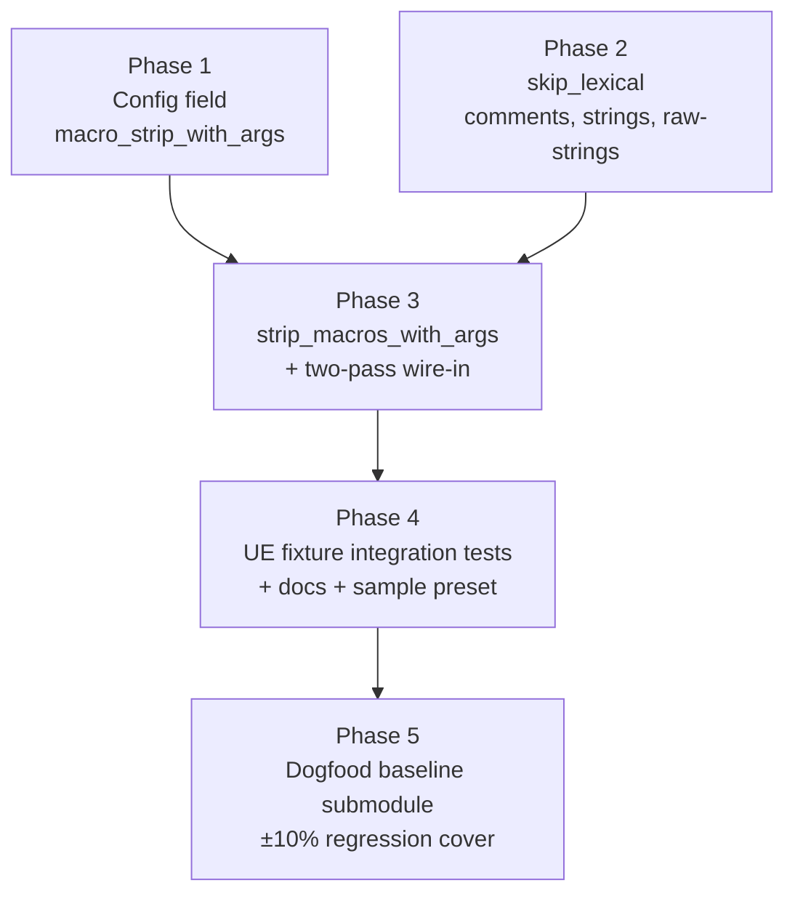

# UE Macro Support

## Overview

Running against a generic UE 4.27 project (81k files, 4.4M edges) revealed that the most important UE symbols — `AActor`, `UObject`, `UActorComponent`, `AActor::Tick` — are silently absent from the symbol index even though derived classes reference them as base classes (leaving dangling `Inherits` edges). The cause: UE wraps every class and class member in parameterized preprocessor macros (`UCLASS(BlueprintType, ...)`, `UFUNCTION(...)`, `UPROPERTY(...)`, `GENERATED_BODY()`, etc.) that tree-sitter-cpp can't parse — the unknown identifier-plus-parens lands in unexpected grammar positions and the surrounding declaration becomes an `ERROR` node.

`CppMacroStrip` (already shipped) handles **bare** identifier-shaped macros (`ENGINE_API`, `CORE_API`) via whole-word replacement. This plan extends that mechanism with a sibling `[cpp].macro_strip_with_args` config field and a new balanced-paren scanner that strips `IDENT(...)` — identifier plus its parenthesized argument list — preserving every byte offset via space-substitution. The default value is an empty list; non-UE users see zero behavior change. UE users opt in by listing their reflection macros (a recommended preset ships in `.code-graph.toml.example`).

The scanner needs to know where strings, char literals, comments, and raw-string regions live so it doesn't rewrite inside them. The existing `strip_macros` (whole-word) has no such lexer because whole-word replacement inside a string is harmless; the parameterized scanner needs one written from scratch. The design specifies `skip_lexical` rigorously; this plan implements it as a focused, independently-testable phase before the scanner that depends on it.

A UE-style integration test pins the end-to-end fix; an anti-regression test pins today's broken behavior (zero symbols for `AActor` without the preset) so the test itself documents the diff. A dogfood baseline submodule (a small public UE plugin) provides ongoing ±10% symbol-count regression coverage parallel to the existing `fmt`/`curl`/`abseil-cpp` C++ baselines.

## Architecture

Two-pass preprocess inside the C++ language plugin, with one new lexer helper and one new scanner:

```mermaid
flowchart LR
    A[content: bytes] --> B[CppParser::preprocess]
    B --> C[Pass 1: strip_macros<br/>whole-word identifier replacement<br/>existing, unchanged]
    C --> D[Pass 2: strip_macros_with_args<br/>balanced-paren scan using skip_lexical<br/>NEW this plan]
    D --> E[cleaned: Cow&lt;[u8]&gt;]
    E --> F[tree-sitter parse]
    F --> G[FileGraph]
```

Phase dependency graph:



Phases 1 and 2 are parallel-safe. Phase 3 fans in to consume both. Phases 4 and 5 are serial after 3.

## Key Decisions

`Designs/UeMacroSupport/README.md` (status: `approved`) owns Decisions 1–5 (separate config field, strict bail-on-unbalanced, whole-word pass first, config conflict rejection, cache invalidation via `force=true`). This plan inherits them and adds two execution-level decisions:

**D6 — `.code-graph.toml.example` preset update lands in Phase 4, not Phase 1.** The design's PR 1 grouped the config field with the sample preset. Splitting it: Phase 1 ships the field as a no-op (parser doesn't consume it yet); the example update lives with CLAUDE.md and the other docs in Phase 4 once the feature is actually functional. Showing a user a config that does nothing for two PRs would invite confusion. By Phase 4, copy-pasting the preset and re-running `analyze_codebase` produces working extraction immediately.

**D7 — Phase 5 (dogfood baseline) is in-scope, not deferred.** Unlike PathNormalization's "watch re-contamination" follow-up (which sat in different code), the UE dogfood baseline lives in the exact same submodule + baseline-file pattern this plan already touches. Including it as a stretch phase costs little (submodule pin + ~10 lines of test code) and gives us long-term regression cover — without it, a future tree-sitter-cpp bump or scanner refactor could silently regress UE extraction by 30% and only the explicit baseline would catch it.

## Dependencies

- **`Designs/UeMacroSupport/README.md`** (status: `approved`) — the canonical source for design decisions; this plan implements it.
- **`CppMacroStrip` is shipped.** The whole-word `strip_macros` function in `crates/code-graph-lang-cpp/src/preprocess.rs` and the `LanguagePlugin::preprocess` trait hook are in place; Phase 3's two-pass wiring builds on them.
- **No external crate dependencies.** The scanner is plain Rust over `&mut [u8]`. `HashSet<Vec<u8>>` from `std::collections`.
- **No `PathNormalization` ordering dependency.** Both plans touch disjoint code surfaces. They can ship in either order.
- **Phase 5 needs a chosen UE-flavored public submodule.** Candidate shortlist (small, public, license-permissive, has UE reflection macros): `OpenPF2-Game/OpenPF2Core` (UE 5 plugin, MIT), a small UE Marketplace open-source plugin, or a stripped UE-style sample written by an open community project. Exact pick deferred to Phase 5 Task 5.1; reviewer should suggest if a stronger candidate exists.
