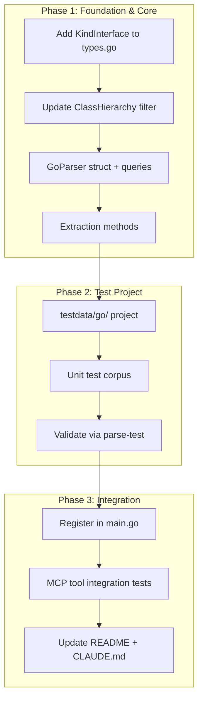

# Go Language Parser

## Overview

Add Go language support to code-graph-mcp. This is the first non-C++ parser and also introduces shared type additions (KindInterface) used by subsequent language parsers.

## Architecture

## Key Decisions

- **Reuse `EdgeIncludes`** for Go imports — semantically different from C++ `#include` but functionally equivalent for the graph. `To` value is the import path string (e.g., `"fmt"`, `"os/exec"`).
- **No inheritance edges** for Go — interfaces are structural. `ClassHierarchy` will return the interface but no bases/derived since that requires type checking.
- **Package name as Namespace** — extracted from `package_clause`.
- **Method receiver as Parent** — `method_declaration`'s receiver type becomes `Symbol.Parent`.

## Dependencies

- `github.com/tree-sitter/tree-sitter-go/bindings/go` v0.25.0
- Existing `go-tree-sitter v0.25.0` runtime (already in project)
