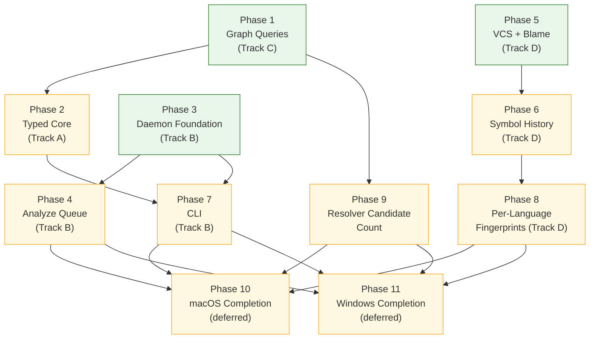
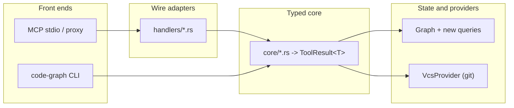

# Graph Platform Expansion

## Overview
Five tracks that lift three constraints on the code graph: it is reachable only from an MCP client, only one session at a time can hold it, and it knows nothing about history. Delivered as eleven phases that interleave the implementation tracks, complete a fully supported Linux MVP first, and defer native macOS/Windows completion behind explicit platform seams.

- **Track A** (phase 2) — a typed core beneath the MCP handlers, so a CLI or socket front-end can reach structured results.
- **Track B** (phases 3, 4, 7) — a repository-local daemon sharing one graph across sessions, an analyze queue, and a CLI.
- **Track C** (phase 1) — three graph queries the current surface cannot answer at all.
- **Track D** (phases 5, 6, 8) — version-control history behind a provider trait, git first, Perforce-ready.
- **Track E** (phases 10, 11) — deferred native macOS and Windows completion after the Linux MVP, activating the transport/path/process/permission seams without reopening Linux semantics.

Phases 1, 3, and 5 have no dependencies on each other and may run concurrently in separate worktrees. Phase 2 follows phase 1 rather than running beside it: both edit `handlers/{query,symbols,structure}.rs` — phase 1 adds three handlers to them, phase 2 empties all three into `core/` — so concurrent worktrees would collide on every one of those files. Sequencing them also closes a coverage gap, since phase 2's migration is what puts the three new queries in the typed core where the CLI can reach them (AC-33, FR-17).

Phases 4, 6, 7, and 8 are gated by their predecessors. Phases 10 and 11 are deliberately deferred until the Linux implementation phases they certify are complete. The phase numbering is a suggested order; `depends_on` is the real constraint.

## Current State
*Written for a cold start. Last updated 2026-08-13.*

| Phase | Status | Where it stands |
|---|---|---|
| 1 Graph Queries | tasks complete, phase `in-progress` | 3 tools shipped (19→22). Two review cycles, 9 findings, all resolved. |
| 2 Typed Core Layering | tasks complete, phase `in-progress` | 6 modules migrated. One review cycle, 2 findings, both resolved. |
| 3 Daemon Foundation | complete / frozen reviewed | Linux daemon MVP is implemented through project-root inode ownership and metadata-temp cleanup (`dfc3884`), measured on two corpora, and frozen reviewed. Native platform completion remains deferred to phases 10/11. |
| 4 Analyze Queue | replacement plan active | The committed generic-job/config-provenance/async-community implementation is being rolled back. The active target is an analyze-only, 32-entry, path-compacting pending FIFO with force OR and follower completion. |
| 5 VCS Foundation and Blame | planned | Independent — can run in parallel with 3. |
| 6 Symbol History | planned | Gated on 5. |
| 7 CLI | planned | Gated on 1, 2, 3. Opens with a design task, not code. |
| 8 Per-Language Fingerprints | planned | Gated on 6. Six sub-tasks, one per language. |
| 9 Resolver Candidate Count | planned | Added mid-flight from phase 1's review. Gated on 1. |
| 10 macOS Platform Completion | deferred | Activates and certifies macOS seams after the Linux MVP; not part of current support acceptance. |
| 11 Windows Platform Completion | deferred | Activates named-pipe, ACL, path, and Windows runtime seams after the Linux MVP; not part of current support acceptance. |

### Why phases 1 and 2 are `in-progress` with every task complete

Phase completion requires a four-lane review returning Aligned on all four lanes. Both phases had findings fixed *after* their last review, and a material change supersedes a review — so certifying either needs a fresh cycle. That was skipped by explicit decision: the returns were diminishing and seven phases remained. Both phases are code-complete, fully evidenced, and reviewed; neither is certified, and `Phase Completion Evidence` in each stays pending rather than claiming a gate that was not run.

If certification matters later, run a fresh four-lane review of each phase's full range and write the Aligned artifact. Nothing else is outstanding.

### Work added after approval

- **Phase 9** and **FR-48 / AC-57** — candidate count. Phase 1's review asked whether `PathHop.entered_by` violated FR-23; reframing it around what an agent actually does with the field produced D-0007 and a better signal. The resolver knows how many candidates competed and discards it; recovering that needs a resolver change and a cache-format bump, so it is its own phase.
- **Task 4.4** and **FR-49 / AC-58** — async whole-graph queries. `detect_communities` holds the read lock across label propagation, and `spawn_blocking` does not extend the client's wall-clock timeout. Landed in phase 4 because 4.1 already reshapes the job slot.

### Corrections made to approved artifacts

Each is a reconciliation event, not drift — the code was right and the document was wrong:

- **AC-41** claimed `tracing` appears nowhere in the dependency graph. It does, transitively via `rmcp`. Restated as "no direct dependency".
- **Decision 8** said "16 gated call sites"; phase 1's tools made it 19 sites over 18 functions. Restated as a set-equality invariant.
- **`PathResult`** shipped with two fields where the design sketched four; the design was reconciled to the code.
- **CLAUDE.md** carried three stale claims found incidentally: the cache is v10 not v8, `EdgeKind` has four variants not three, and the workspace is *not* C-compiler-free (the tree-sitter grammars compile C via the `cc` crate). The last of these had already been recorded as a decision on the false premise, so D-0004 restates it on the argument that actually holds — add no *further* native library, rather than stay C-free.

### What a cold start should know before writing code

- **`make verify` is the gate** and includes a plugin-mirror drift check; run it per task, not per phase.
- **Tests live inside `code-graph-tools`**, which means they cannot exercise the `#[tool]` wrapper or any cross-crate contract. Both Major findings so far lived in exactly that blind spot.
- **The intent-blind review lane has found the real bug in both phases**, after the three plan-aware lanes passed the same code. Do not skip it.
- **Batch fixes before re-reviewing.** Phase 1 spent two cycles fixing findings piecemeal; phase 2 spent one.
- **Deterministic output matters more than it looks.** `Graph.nodes`/`adj`/`radj` are `HashMap` with a random seed; `files`/`includes` are a `PathTrie` that iterates sorted. Anything whose output is snapshotted must drive iteration from the trie and use keyed lookups only.

## Non-Goals
Carried forward from `Specs/GraphPlatformExpansion`:

- **No system-wide or multi-tenant daemon.** One daemon per project root, all state inside the repository (D-0001).
- **No full-text or regex search over file contents.** The graph stores symbols, edges, and paths, not bodies. Free-text search remains Grep's job.
- **No precise (scope-proof) name resolution.** Call resolution stays the documented syntactic heuristic; ambiguity is surfaced, not hidden.
- **No semantic or embedding-based search.**
- **No consolidation of the flat tool surface into mode-dispatched tools.** Deferred to a separate decision.
- **No database replacing the in-memory graph.**
- **No Perforce provider.** The abstraction is constrained so one can be added (D-0002); this plan ships git only.

Decided during planning:

- **No migration of the ~306 existing wire-level test assertions** (Designs/TypedCoreLayering Decision 6). They keep testing the adapter, which is exactly what needs testing during Track A.
- **No rename tracking in history.** A renamed symbol reports as removed-plus-introduced (Designs/VcsHistory OQ-D5).
- **No history indexing and no change to `.code-graph-cache.db`.** The fingerprint sidecar is disposable and separate.
- **No CLI command-surface design in phase 3.** It is a task inside phase 7, once Track A's signatures exist.
- **No native macOS or Windows support claim in phases 1–9.** Those phases deliver the Linux MVP while preserving explicit platform seams; phases 10/11 own native enablement and acceptance.

## Architecture

Layering the phases build toward:

## Key Decisions
- **Historical generic-job projection** (D-0009). It describes the superseded generic scheduler and remains historical only.
- **Phase 4 queue policy** (D-0011). `get_analyze_status(job_id)` polls canonical or follower aliases; every non-terminal pending request, including followers, counts against the 32-request bound. The queue remains analyze-only and path-compacting. **Pagination continuation** (D-0013): `truncated=true` means more matching results remain after either a count or byte cap, and `next_offset` resumes the page.
- **Deferred async whole-graph scope.** FR-49 and AC-58 are explicitly deferred; Phase 4 does not provide `detect_communities_async` or generic long-running jobs. The absence is intentional and is the required plan coverage for FR-49 / AC-58.

- **Repository-local daemon, not multi-tenant** (D-0001). `ServerInner` is reused verbatim because one-daemon-per-root means a keyed workspace registry cannot arise.
- **Opaque revision identity** (D-0002). `RevId` is a newtype over `String`; nothing assumes a hash, a length, or hex, so Perforce changelists fit without reshaping anything.
- **Pure-Rust git backend, no further native library** (D-0004). The workspace already compiles C for the tree-sitter grammars; the constraint is adding no vendored library on top.
- **The typed core is a new module, not an in-place rewrite** (Designs/TypedCoreLayering Decision 3). `server.rs` is never modified and the existing assertions never move, which is what makes Track A eight mechanical commits instead of a sweep.
- **The daemon client is a byte proxy** (Designs/RepoLocalDaemon Decision 2). Both stdio and socket transports frame through the same `JsonRpcMessageCodec`, so forwarding preserves message boundaries without parsing MCP.
- **Symbol history matches by exact, case-sensitive `(name, kind)`** (D-0005). A rename, including a case-only rename, reports as removed-plus-introduced; case-folding would interleave two symbols' histories in the five case-sensitive languages.
- **Both fingerprint sensitivities ship for all six languages** (D-0006). `LiteralInsensitive` is a required rollout step, not an opportunistic per-language override.
- **A response field earns its place by removing a round-trip** (D-0007). These responses are consumed by agents; an indicator that only changes hedging language is close to worthless, while one that lets the agent skip a query or names the next action changes behaviour. This is why per-hop resolution detail stays on `find_path` and why candidate count (FR-48, phase 9) is specified properly rather than approximated by the existing one-bit tag.
- **Community detection runs at file granularity** (Designs/GraphQueries Decision 4). The `files` PathTrie iterates deterministically, which gives FR-25 for free; walking `nodes` would not.
- **Validation is initiative-scoped for implementation gating** (D-0008). Diagnostics in this plan and its directly governing GraphPlatformExpansion spec/designs block progression; unrelated legacy-artifact diagnostics reached through transitive links are reported but do not.

## Dependencies
- **New third-party crates**, all outside the four protected core crates: `clap` (phase 7), a pure-Rust git library (phase 5), `async_trait` (phase 5). The `code-graph-lang` default fingerprint hook uses `std` hashing only — a non-std hash there would violate NFR-02.
- **No new dependency for the daemon transport.** `tokio` is already present with `features = ["full"]`.
- **Dogfood submodules initialised** for the phase 1 and phase 3 performance measurements (`external/ripgrep`, `external/abseil-cpp`).
- **A C compiler**, as today — the tree-sitter grammars compile `parser.c` via the `cc` crate. Unchanged by this plan (D-0004).
- **Git fixture harness** (phase 5) — no test in the workspace currently creates a temporary git repository.

## Plan Completion Evidence
Pending — not complete.

## Open Questions
- Default idle timeout of 1800s for the daemon — **non-blocking** — the config key, the `0` sentinel, and the timer semantics are fixed; only the number is a guess and it is tunable without touching an interface.
- Whether the CLI auto-spawns a daemon or only attaches to a running one — **non-blocking** — FR-18 requires identical output in both modes either way, so this is latency, not correctness.
- Default revision-window size for `symbol_history` — **non-blocking** — the bound and the partial-result flag are fixed; only the default is unsettled.
- Timeout for a slow VCS provider — **non-blocking** — NFR-10's isolation comes from blocking-pool dispatch, which holds at any duration.
- Whether `ToolError` gains a machine-readable code — **non-blocking** — the adapter renders the message identically either way and the CLI maps exit status without it; adding a field later is additive.
- Whether shared response types move out of `handlers/mod.rs` — **non-blocking** — file organisation only; the layering is correct in either location.
- Whether `get_symbol_at` accepts a column argument — **non-blocking** — `Symbol` has no end column, so a column cannot sharpen enclosure; adding an optional argument later changes no existing behaviour.
