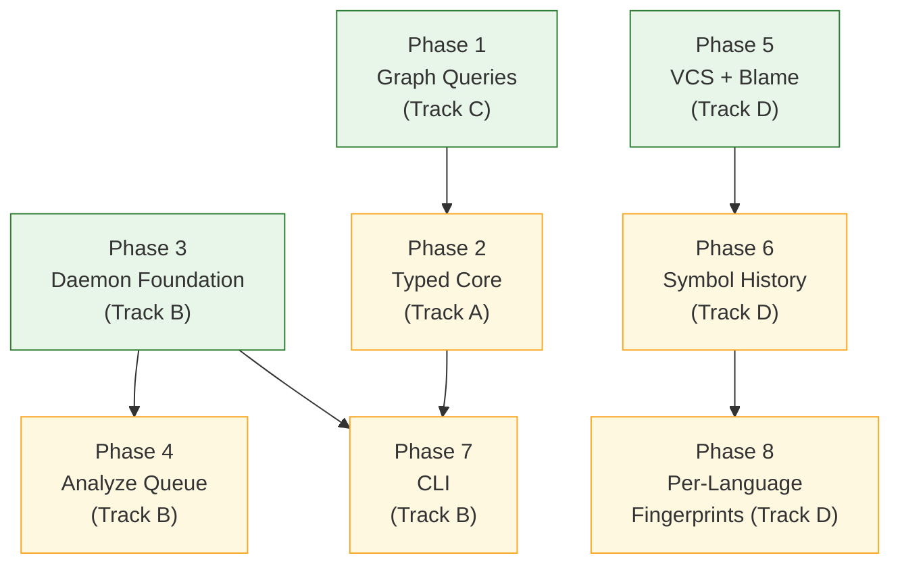
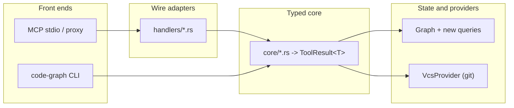

# Graph Platform Expansion

## Overview

Four tracks that lift three constraints on the code graph: it is reachable only from an MCP client, only one session at a time can hold it, and it knows nothing about history. Delivered as eight phases that interleave the tracks rather than running them end to end.

- **Track A** (phase 2) — a typed core beneath the MCP handlers, so a CLI or socket front-end can reach structured results.
- **Track B** (phases 3, 4, 7) — a repository-local daemon sharing one graph across sessions, an analyze queue, and a CLI.
- **Track C** (phase 1) — three graph queries the current surface cannot answer at all.
- **Track D** (phases 5, 6, 8) — version-control history behind a provider trait, git first, Perforce-ready.

Phases 1, 3, and 5 have no dependencies on each other and may run concurrently in separate worktrees. Phase 2 follows phase 1 rather than running beside it: both edit `handlers/{query,symbols,structure}.rs` — phase 1 adds three handlers to them, phase 2 empties all three into `core/` — so concurrent worktrees would collide on every one of those files. Sequencing them also closes a coverage gap, since phase 2's migration is what puts the three new queries in the typed core where the CLI can reach them (AC-33, FR-17).

Phases 4, 6, 7, and 8 are gated by their predecessors. The phase numbering is a suggested order; `depends_on` is the real constraint.

## Non-Goals

Carried forward from `Specs/GraphPlatformExpansion`:

- **No system-wide or multi-tenant daemon.** One daemon per project root, all state inside the repository (D-0001).
- **No full-text or regex search over file contents.** The graph stores symbols, edges, and paths, not bodies. Free-text search remains Grep's job.
- **No precise (scope-proof) name resolution.** Call resolution stays the documented syntactic heuristic; ambiguity is surfaced, not hidden.
- **No semantic or embedding-based search.**
- **No consolidation of the flat tool surface into mode-dispatched tools.** Deferred to a separate decision.
- **No database replacing the in-memory graph.**
- **No Perforce provider.** The abstraction is constrained so one can be added (D-0002); this plan ships git only.

Decided during planning:

- **No migration of the ~306 existing wire-level test assertions** (Designs/TypedCoreLayering Decision 6). They keep testing the adapter, which is exactly what needs testing during Track A.
- **No rename tracking in history.** A renamed symbol reports as removed-plus-introduced (Designs/VcsHistory OQ-D5).
- **No history indexing and no change to `.code-graph-cache.db`.** The fingerprint sidecar is disposable and separate.
- **No CLI command-surface design in phase 3.** It is a task inside phase 7, once Track A's signatures exist.

## Architecture

Layering the phases build toward:

## Key Decisions

- **Repository-local daemon, not multi-tenant** (D-0001). `ServerInner` is reused verbatim because one-daemon-per-root means a keyed workspace registry cannot arise.
- **Opaque revision identity** (D-0002). `RevId` is a newtype over `String`; nothing assumes a hash, a length, or hex, so Perforce changelists fit without reshaping anything.
- **Pure-Rust git backend, no further native library** (D-0004). The workspace already compiles C for the tree-sitter grammars; the constraint is adding no vendored library on top.
- **The typed core is a new module, not an in-place rewrite** (Designs/TypedCoreLayering Decision 3). `server.rs` is never modified and the existing assertions never move, which is what makes Track A eight mechanical commits instead of a sweep.
- **The daemon client is a byte proxy** (Designs/RepoLocalDaemon Decision 2). Both stdio and socket transports frame through the same `JsonRpcMessageCodec`, so forwarding preserves message boundaries without parsing MCP.
- **Symbol history matches by exact, case-sensitive `(name, kind)`** (D-0005). A rename, including a case-only rename, reports as removed-plus-introduced; case-folding would interleave two symbols' histories in the five case-sensitive languages.
- **Both fingerprint sensitivities ship for all six languages** (D-0006). `LiteralInsensitive` is a required rollout step, not an opportunistic per-language override.
- **Community detection runs at file granularity** (Designs/GraphQueries Decision 4). The `files` PathTrie iterates deterministically, which gives FR-25 for free; walking `nodes` would not.

## Dependencies

- **New third-party crates**, all outside the four protected core crates: `clap` (phase 7), a pure-Rust git library (phase 5), `async_trait` (phase 5). The `code-graph-lang` default fingerprint hook uses `std` hashing only — a non-std hash there would violate NFR-02.
- **No new dependency for the daemon transport.** `tokio` is already present with `features = ["full"]`.
- **Dogfood submodules initialised** for the phase 1 and phase 3 performance measurements (`external/ripgrep`, `external/abseil-cpp`).
- **A C compiler**, as today — the tree-sitter grammars compile `parser.c` via the `cc` crate. Unchanged by this plan (D-0004).
- **Git fixture harness** (phase 5) — no test in the workspace currently creates a temporary git repository.

## Plan Completion Evidence

Pending — not complete.

## Open Questions

- Default idle timeout of 1800s for the daemon — **non-blocking** — the config key, the `0` sentinel, and the timer semantics are fixed; only the number is a guess and it is tunable without touching an interface.
- Whether the CLI auto-spawns a daemon or only attaches to a running one — **non-blocking** — FR-18 requires identical output in both modes either way, so this is latency, not correctness.
- Default revision-window size for `symbol_history` — **non-blocking** — the bound and the partial-result flag are fixed; only the default is unsettled.
- Timeout for a slow VCS provider — **non-blocking** — NFR-10's isolation comes from blocking-pool dispatch, which holds at any duration.
- Whether `ToolError` gains a machine-readable code — **non-blocking** — the adapter renders the message identically either way and the CLI maps exit status without it; adding a field later is additive.
- Whether shared response types move out of `handlers/mod.rs` — **non-blocking** — file organisation only; the layering is correct in either location.
- Whether `get_symbol_at` accepts a column argument — **non-blocking** — `Symbol` has no end column, so a column cannot sharpen enclosure; adding an optional argument later changes no existing behaviour.
