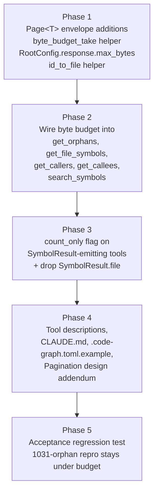
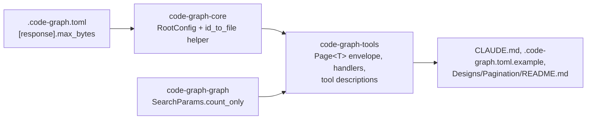

# Paginated Response Size Safety

## Overview

The shipped `Page<T>` envelope caps results by record count, not by bytes. On a real 71-file / 1,759-symbol Rust repo, `get_orphans(limit=1000)` returned 1,031 records as a 297,266-character single-line JSON payload (~74K tokens). Claude Code's harness rejected the response and spilled it to disk, making the call effectively unusable. The same envelope shape is shared by `search_symbols`, `get_file_symbols`, `get_callers`, and `get_callees` — all are exposed to the same failure mode as codebases grow.

This plan layers byte-budget truncation on top of the existing pagination contract delivered by `PaginationOverhaul`, adds a `count_only` shortcut for stats-only callers, and slims per-record payloads by dropping a redundant `file` field from `SymbolResult`. The defaults work out of the box; teams running on unusually-large indexes can lift the cap via `.code-graph.toml`.

## Architecture

The work touches three crates plus docs and one config example:

Snapshot suite: 16 response snapshots regenerate (envelope gains 2 fields in Phase 2, records lose `file` in Phase 3 — same files touched twice, Phase 3's regeneration supersedes Phase 2's); 5 tools-list snapshots regenerate (new `count_only` arg + rewritten descriptions); ~12 new snapshots are added across phases 2 and 3 (oversized-page + count_only scenarios per tool).

`search_symbols` is architecturally different from the other 4 paginated tools — it delegates pagination into `Graph::search` via `SearchParams { limit, offset }`. Byte-budget truncation lives at the handler layer (trim the already-sliced page); `count_only` is the only field threaded into `SearchParams` itself so `Graph::search` can skip its `BinaryHeap<TopEntry>` materialization entirely.

## Key Decisions

The original `Designs/Pagination/README.md` (status: `review`) owns Decisions 1–7. This plan extends with Decisions 8–13. Phase 4 appends them back to the design doc.

**D8 — Byte cap default 100 KB, configurable via `[response].max_bytes`.** Picked over tokenizer-based budgeting for determinism and zero added dependencies. `.code-graph.toml` exposure means teams running on Unreal-scale indexes can raise it without a rebuild; default is conservative enough that Claude Code's harness accepts every response. Truncation surfaces via `truncated: bool` + `next_offset: Option<u32>` on the envelope.

**D9 — `count_only: bool` on the three `SymbolResult`-emitting tools.** Applies to `get_orphans`, `search_symbols`, `get_file_symbols`. `get_callers`/`get_callees` are excluded; their depth/limit combination already makes "how many?" cheap. `count_only` is threaded into `SearchParams` for `search_symbols` so `Graph::search` skips materialization, not faked at the handler with `limit: 0`.

**D10 — `SymbolResult.file` dropped universally.** The id format `file:name` or `file:Parent::name` makes the separate `file` field strictly redundant on `SymbolResult`. Agents recover it via a documented `id_to_file` helper. Uniform record shape across all three tools, no hoist-when-uniform special case. Halves brief-mode record byte count on real-world inputs.

**D11 — `CallChain.file` retained.** Researcher caught that `CallChain.file` is the call-site file, NOT the definition file encoded in `symbol_id`. Dropping it would lose information. Not a candidate for slimming.

**D12 — `search_symbols` byte-budget at handler layer, not in `Graph::search`.** Keeps `Graph::search` byte-blind. Already-sliced page returns from Graph; if it serializes past budget, handler trims and sets `next_offset = original_offset + truncation_index`. `total` from `Graph::search` (pre-pagination match count) is preserved.

**D13 — Limit ceiling (1000) NOT lowered.** Byte budget self-enforces the actual cap. Agents discover the cap via `truncated=true` + `next_offset` rather than via a documented `limit` ceiling. Avoids re-litigating Decision 7. Tool descriptions document `limit` as "≤ this many records" rather than an exact guarantee.

## Dependencies

- **Existing rmcp + serde wiring.** No new dependencies.
- **`PaginationOverhaul` completed.** `Page<T>` envelope and the materialize-then-sort-then-slice pattern are already established at `crates/code-graph-tools/src/handlers/mod.rs`. This plan extends those, not rewrites them.
- **`insta` snapshot suite.** All wire-format changes flow through `cargo insta review` and `make snapshot-clean`. Pre-commit hook enforces.
- **`Designs/Pagination/README.md`** stays in `review` status; Phase 4 appends Decisions 8–13 and bumps `updated:`. No blocker on flipping to `approved` either before or after this plan.
- **No external blockers.**
