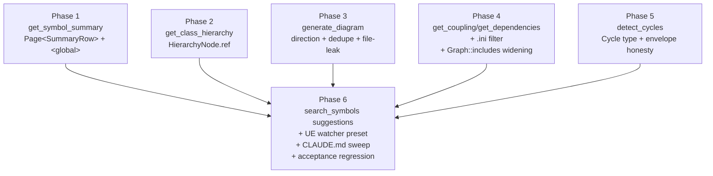
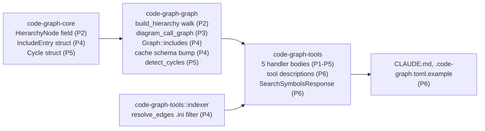

# Response Shape Polish

## Overview

Running against a generic UE4 project surfaced five "significant" response-shape gaps plus several polish items. The Rust rewrite shipped a clean `Page<T>` envelope for a subset of tools (per `Plans/PaginatedResponseSizeSafety`); this plan extends the contract to the remaining tools and fixes a handful of related ergonomics issues that compound the UE experience:

| Tool / area | Today | After this plan |
|---|---|---|
| `get_symbol_summary` | `HashMap<String, HashMap<&str, u32>>`; no pagination; 196 KB on UE | `Page<SummaryRow>`; `<global>` rename for empty namespace |
| `get_class_hierarchy` | Diamond inheritance duplicates sub-trees inline | `HierarchyNode.ref: Option<bool>`; subsequent visits emit `{name, ref: true}` stub |
| `generate_diagram(symbol=…)` | Mixed callers/callees with no direction labels; file-name fallback leaks; same-pair duplicates | `direction: "callees"\|"callers"\|"both"`; `DiagramEdge.direction` tag; rendered-label dedupe; unresolved targets dropped |
| `get_coupling` | Flat `{path: count}`; no incoming/outgoing split; `.ini` false-positives | `CouplingBoth { incoming, outgoing }` or `Page<CouplingEntry>`; `.ini` filter at indexer layer |
| `get_dependencies` | `Vec<String>` of file paths | `Page<DependencyEntry { file, kind, line }>`; `Graph::includes` widened to preserve line |
| `detect_cycles` | Doc claims `truncated` always false; impl secretly paginates by count | `Page<Cycle { files, truncated, original_len }>`; honest envelope; per-cycle cap |
| `search_symbols` anchored zero | `Page<SymbolResult>` with empty results | Same shape + optional `suggestions: Vec<String>` field for `^…$` queries with no hits |
| UE watcher preset | Naive watch on UE root re-indexes on every build | Recommended `[discovery].extra_ignores` preset for UE engine-side scratch dirs |

This plan inherits `Designs/ResponseShapePolish/README.md` (status: `approved`) wholesale — Decisions 1–8 there are this plan's contract.

The code is still pre-1.0; **no backwards-compat layers ship with this plan.** Cache schema breaks force re-index on load (Phase 4); response-shape breaks update the tool descriptions in the same PR so agents reading the current contract see the current shape. No deprecation aliases, no double-serialization, no transparent migration.

## Architecture

Six independent tool-change phases, all fanning into a docs-and-polish phase:

Phases 1–5 are independent of each other (different files, different tool surfaces). Any pair can develop in parallel. Phase 6 fans in because the CLAUDE.md sweep needs to describe the final aggregate state.

Crate surface affected:

## Key Decisions

`Designs/ResponseShapePolish/README.md` owns Decisions 1–8. This plan adds three execution-level decisions:

**D9 — Phases 1–5 ship as separate PRs but develop in parallel.** Each touches a disjoint code surface (different handler files, different graph methods); merge conflicts are impossible at the file level. Sequencing them serially would slow shipping for no benefit. Phase 6 waits because docs must describe final state.

**D10 — Cache schema break in Phase 4 forces re-index on old caches.** `Graph::includes` widens from `HashMap<PathBuf, Vec<PathBuf>>` to `HashMap<PathBuf, Vec<IncludeEntry>>`. Bumping `CACHE_VERSION` is the simplest correct path; old caches mismatch → `Graph::load` returns `Ok(false)` → `analyze_codebase` falls through to a full re-index. Pre-1.0 codebase; one-time multi-minute re-index is acceptable. No transparent-migration layer.

**D11 — Acceptance regression uses a synthetic high-fanout fixture in `tests/`, not a real UE codebase.** The generic UE tree exercised during dogfooding is in a private Perforce server (81k files); we cannot ship it. A synthetic fixture engineered to exercise the same response-size and shape pain points (deep hierarchy with diamond inheritance, a function with high fan-out, a global symbol summary that would be large enough to trigger the 100 KB cap) lives in-tree, runs deterministically, and pins the regression. The fixture is more useful than a one-shot UE smoke test because it can be expanded by future contributors.

## Dependencies

- **`Designs/ResponseShapePolish/README.md`** (status: `approved`) — canonical source for the 8 design decisions and the 7-tool shape table.
- **`Plans/PaginatedResponseSizeSafety`** — already shipped the `Page<T>` envelope, the `byte_budget_take` helper, and the `count_only` sentinel pattern. This plan extends the same primitives to the remaining 5 tools without rewriting them.
- **No dependency on `PathNormalization`** — both plans touch disjoint code surfaces. Either can ship first.
- **No dependency on `UeMacroSupport`** — but Phase 3's "drop unresolved targets" change is most useful AFTER `UeMacroSupport` lands (because fewer unresolved targets means fewer edges affected by the file-leak fallback). Order doesn't matter for correctness; the design notes the synergy.
- **No external crate dependencies.** All work is internal: type definitions, handler refactors, indexer logic, docs.
