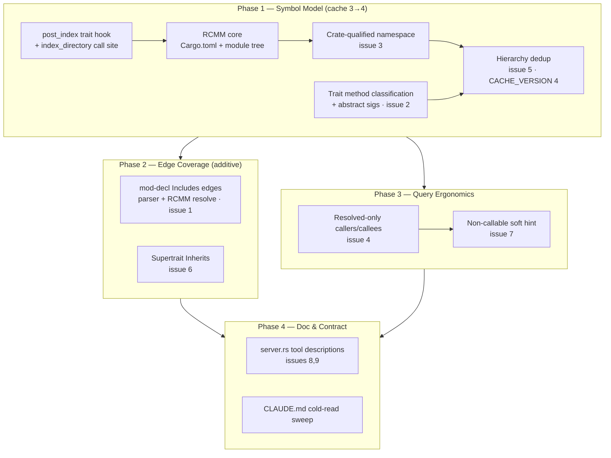

# Rust Support Gaps — Semantic Fidelity Remediation

## Overview

Implements `Designs/RustSupportGaps/README.md` (status: approved). Dogfooding
`code-graph-mcp` against the Rust crate `ark-core` surfaced 9 defects where Rust analysis is
silently wrong, silently empty, or undocumented. This plan delivers all 9 fixes in four
phases ordered by dependency and cache-version coupling.

The remediation spine is a new index-time component — the **Rust Crate Module Model (RCMM)**
— that gives the otherwise per-file, crate-blind parser knowledge of crate root, module
tree, and `mod`→file mapping. Issues 1, 3, and 5 are all views over that one model.

| Phase | Issues | Cache | Depends |
|---|---|---|---|
| 1 — Symbol Model & Crate Module Foundation | 2, 3, 5 | **bump 3→4** | — |
| 2 — Edge Coverage | 1, 6 | none (additive) | 1 |
| 3 — Query Ergonomics | 4, 7 | none | 1 |
| 4 — Documentation & Contract Sweep | 8, 9 | none | 1, 2, 3 |

Phases 2 and 3 both depend only on Phase 1 (not on each other) — they may be implemented
concurrently after Phase 1 lands. Phase 4 closes out documentation consistency after all
behavior is in place.

## Architecture

The RCMM is consumed two ways, both inside `RustParser::post_index` (it stores no state on
`&self`; all crate-aware work is eager and written into the `FileGraph` slice in place):
namespace rewrite (Phase 1) and `mod`-edge target resolution (Phase 2).

## Key Decisions

Authoritative rationale lives in the design's Decisions 1–10. Load-bearing ones for
implementation:

- **D2 — `post_index` trait hook (flagged trait-shape change).** New object-safe
  `LanguagePlugin::post_index(&self, &mut [FileGraph], &FileIndex)`, default no-op, invoked
  on **both** re-index paths over each path's complete graph set: the analyze path (the full
  freshly-parsed `Vec<FileGraph>` returned by `index_directory` — `index_directory` has no
  cache merge; a stale analyze re-parses every file, so its output is already the complete
  set) and the watch path (`handlers/watch.rs` `try_reindex_file`, over its existing+new
  graph set, before the resolve loop). Plan task 1.1 owns both call sites + a new
  `LanguageRegistry::plugins()` iterator. This is a deliberate change to the most
  load-bearing trait in the workspace; it was approved as part of the design. Fallback if
  trait churn is later rejected: an indexer-side, `Language::Rust`-gated free function (same
  behavior, weaker separation).
- **D3 — `mod` resolved in `post_index`, not `resolve_include`.** Parser emits a provisional
  `Includes` edge (`from`=declaring file, `to`=bare modname token, plus `mod` line); RCMM
  rewrites `to` to the absolute child file path (sibling `dir/foo.rs` → `dir/foo/mod.rs` →
  `#[path]`), or drops it. `resolve_include` becomes a stateless pass-through. No
  `FileIndex` exact-path map needed. `use`/`extern crate` stay unresolved by design.
- **D4 — trait methods → `Method`, parent=trait; abstract signatures extracted too.** No new
  `SymbolKind` variant. Deliberate Rust-scoped exception to the cross-language
  "forward declarations excluded" invariant — must be documented as such.
- **D5 — issue 5 = namespace fix (cause) + hierarchy dedup (defense).** Dedup key = target
  name string; first-encountered wins.
- **D7 — resolved-only filter inside `Graph::callers`/`callees`.** Reason is BFS
  `visited`-set integrity at depth ≥ 2, not `total` arithmetic.
- **D10 — single CACHE_VERSION bump 3→4** (issues 2, 3 change cached symbol shape). The
  forced silent re-index also materializes Phase 2's additive edges with no `force=true`.

## Dependencies

- No new crates. Workspace has **no `tracing`** — out-of-handler diagnostics use `eprintln!`.
- `EdgeKind` stays exactly `{Calls, Includes, Inherits}`; `SymbolKind` gains no variant.
- Dogfood baseline submodule `external/ripgrep` should be initialized
  (`make submodules`) before Phase 1's verification task so the baseline can be re-measured;
  the test auto-skips if absent but the symbol-count shift from issues 2/3 must be recorded.
- Pre-commit hook runs `make snapshot-clean`; intentional snapshot changes must be
  `cargo insta accept`-ed per phase so no `*.snap.new` remains.
- Per-phase CLAUDE.md edits are part of each phase's hardening task (CLAUDE.md
  "Documentation read cold" lens); Phase 4 is the final cross-section consistency sweep.
