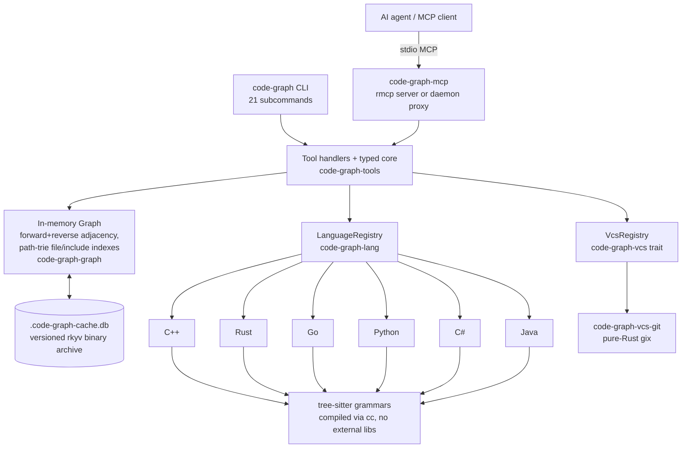
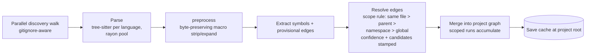
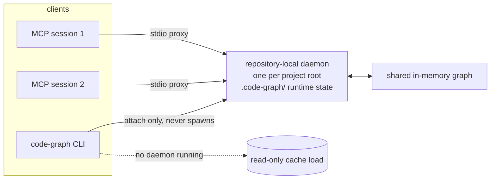

# code-graph-mcp

An MCP server that builds an in-memory semantic code graph from C++, Rust, Go, Python, C#, and Java source files using [tree-sitter](https://tree-sitter.github.io/), exposing 25 query tools to AI agents over stdio -- plus a `code-graph` CLI that answers the same queries from a terminal. Instead of an agent burning tokens grepping files to understand how code is connected, it calls `analyze_codebase` once and then issues targeted queries like `get_callers`, `find_path`, `get_class_hierarchy`, or `blame_symbol` to navigate the codebase instantly.

## Supported languages

| Language | Extensions | Plugin crate |
|----------|------------|--------------|
| C++      | `.cpp`, `.cc`, `.cxx`, `.c`, `.h`, `.hpp`, `.hxx` | `code-graph-lang-cpp` |
| Rust     | `.rs`      | `code-graph-lang-rust` |
| Go       | `.go`      | `code-graph-lang-go` |
| Python   | `.py`, `.pyi` | `code-graph-lang-python` |
| C#       | `.cs`      | `code-graph-lang-csharp` |
| Java     | `.java`    | `code-graph-lang-java` |

Extension-to-language mapping is configurable -- see `[extensions]` in the configuration section.

## Installation

Build from source on whichever platform you need the binaries for -- there is no cross-compile pipeline and no prebuilt binaries are published. A C compiler is required (the six tree-sitter grammar crates compile their generated `parser.c`/`scanner.c` through the `cc` crate); nothing links against an external C library and no `pkg-config` is needed.

### Via `cargo install`

```bash
git clone https://github.com/danweinerdev/code-graph-mcp.git
cd code-graph-mcp
cargo install --path crates/code-graph-mcp   # the MCP server
cargo install --path crates/code-graph-cli   # the `code-graph` CLI (optional)
```

This installs `code-graph-mcp` (and optionally `code-graph`) to `~/.cargo/bin/`.

### Via `make`

```bash
git clone https://github.com/danweinerdev/code-graph-mcp.git
cd code-graph-mcp
make build    # cargo build --release -p code-graph-mcp
```

The binaries land in `target/release/`. Symlink or copy them onto your PATH.

## Harness integrations

Three agent-harness plugin trees ship in this repo. All of them need the `code-graph-mcp` binary on `PATH` (or an absolute path in the MCP config). The MCP server registration name must stay `code-graph` -- the skills reference `mcp__code-graph__*` tool names, which will not resolve under a different name.

### Claude Code

The plugin at [`plugin/`](plugin/) bundles seven skills, six slash commands (`/cg`, `/cg-index`, `/cg-impact`, `/cg-deps`, `/cg-survey`, `/cg-status`), and a non-blocking `PreToolUse` nudge that steers symbol-shaped Grep/Glob searches toward the graph tools.

Load it directly (no install step, no writes under `~/.claude`):

```bash
claude --plugin-dir /path/to/code-graph-mcp/plugin
```

Or install via the marketplace manifest: `claude plugin marketplace add <repo-root>` then `claude plugin install code-graph@code-graph-mcp` (or the interactive `/plugin` menu). Register the MCP server in your Claude Code MCP config:

```json
{ "mcpServers": { "code-graph": { "type": "stdio",
  "command": "/path/to/code-graph-mcp", "args": [] } } }
```

If long `analyze_codebase` runs on very large trees hit the client tool timeout, either set `MCP_TOOL_TIMEOUT=900000` or prefer `analyze_codebase_async` + `get_analyze_status` polling (every individual call is sub-second).

### Codex

The generated tree at [`.codex-plugin/`](.codex-plugin/) carries the same skills and commands plus a `plugin.json` that declares the `code-graph` MCP server (spawning `code-graph-mcp` from `PATH`). Point Codex at the directory per your Codex plugin configuration (e.g. add the tree under your Codex plugins location, or reference the checkout directly). The session-start hook emits an orientation blob; all hook scripts fail open.

### OpenCode

The npm package tree at [`opencode-plugin/`](opencode-plugin/) (`code-graph-opencode`) registers the MCP server, skills, and a session-start cache check. It ships `/cg`, `/cg-index`, `/cg-impact`, `/cg-deps`, `/cg-survey`, and `/cg-status` command files; copy or symlink them into `~/.config/opencode/commands/` (or `.opencode/commands/` for a project) for OpenCode to discover them. Add the plugin to your `opencode.json` (global or project):

```json
{ "plugin": ["code-graph-opencode@latest"] }
```

Restart OpenCode. If `code-graph-mcp` is not on `PATH`, point the plugin at it with `CODE_GRAPH_MCP_BIN=/path/to/code-graph-mcp`.

### Any other MCP client

The server speaks stdio MCP with no required flags -- register the binary as a stdio server named `code-graph` and call `analyze_codebase` first. For Claude Desktop, add the block above to `claude_desktop_config.json`.

`plugin/` is the canonical source for all three trees; `.codex-plugin/` and `opencode-plugin/` skills/commands are generated by `make plugin-sync` and must not be hand-edited.

## Command-line interface

The `code-graph` binary (crate `code-graph-cli`) is a second front-end over the same query engine -- same defaults, same payloads, never a place where behavior can fork. Subcommands mirror the MCP tool names kebab-cased, 21 in total (`analyze-codebase`, `get-status`, `get-file-symbols`, `search-symbols`, `get-symbol-detail`, `get-symbol-summary`, `get-symbol-at`, `get-callers`, `get-callees`, `find-overrides`, `find-class-candidates`, `find-path`, `get-dependencies`, `detect-cycles`, `get-orphans`, `get-class-hierarchy`, `get-coupling`, `detect-communities`, `generate-diagram`, `blame-symbol`, `symbol-history`).

```bash
code-graph analyze-codebase                      # index the current directory
code-graph search-symbols '^MyClass$' --json     # --json = the MCP payload byte-for-byte
code-graph get-callers 'src/lib.rs:handle' --limit 20
code-graph find-path 'src/main.rs:main' 'src/io.rs:flush'
code-graph blame-symbol 'src/lib.rs:handle'
```

- **`--json`** prints exactly what the MCP tool would return; the default human mode renders aligned tables/trees from that same payload.
- **Exit statuses:** `0` success (including success-shaped negatives like `found: false` or empty pages), `1` tool error (unknown symbol, bad argument, unindexed repo), `2` operational failure.
- **Daemon-aware:** when a repository daemon is running the CLI attaches to it (it never spawns or replaces one); otherwise it answers read-only from the on-disk cache. `watch-start`/`watch-stop` and the async-analyze pair are MCP-only (a one-shot CLI cannot own a watcher, and `analyze-codebase` just blocks).

## Repository-local daemon

By default the stdio binary attaches to (or starts) one daemon per project root so multiple sessions share a single in-memory graph. Runtime state lives under `<project_root>/.code-graph/` (gitignored). Transports: Unix domain socket on Unix, named pipe on Windows, authenticated loopback TCP as the fallback. `--no-daemon` (or `[daemon] enabled = false`) serves in-process instead; `--serve` runs the daemon itself. Idle daemons save the cache and exit after `[daemon] idle_timeout_secs` (default 1800; `0` = never).

## Configuration

Place a `.code-graph.toml` at your project root. `analyze_codebase` walks upward from the invocation path to the nearest `.code-graph.toml` -- the same convention cargo, git, rustfmt, and editorconfig use. Whichever directory contains that file becomes the **project root**: the discovered config applies, the project-wide cache (`.code-graph-cache.db`, a versioned rkyv binary archive) lives there, and scoped invocations against subdirectories accumulate into the same cache. See [`.code-graph.toml.example`](.code-graph.toml.example) for the fully documented schema.

Schema overview (all keys optional):

```toml
[discovery]
max_threads = 0           # 0 = auto (num CPUs); over-cap values clamped
respect_gitignore = true  # honor .gitignore / .ignore / global ignore files
follow_symlinks = false
extra_ignore = []         # additional gitignore-style globs

[parsing]
max_threads = 0           # 0 = auto; discovery+parsing share the CPU budget

[daemon]
enabled = true            # one repository-local daemon per project root
idle_timeout_secs = 1800  # 0 = never exit automatically

[response]
max_bytes = 102400        # byte cap on paginated responses (truncated/next_offset resume)

[cpp]
macro_strip = []            # e.g. ["CORE_API"] -- bare API-export macros
macro_strip_with_args = []  # e.g. ["UCLASS", "UFUNCTION", "GENERATED_BODY"]
macro_define_function = []  # synthesize Function symbols from token-pasting macros
macro_define_type = []      # expand struct/class-wrapping macros in place

[extensions]
disabled = []             # suppress extensions entirely
cpp = []                  # add extensions per language, e.g. [".ipp"]
# rust / go / python / csharp / java likewise
```

The discovery walk stops at the first `.code-graph.toml` it finds (no merging across nested files -- a nested toml marks that subtree as its own project). No toml anywhere -> built-in defaults plus a warning naming the consequence (engine-style `class CORE_API Foo` declarations will not extract until `[cpp].macro_strip` is configured). Malformed TOML -> `analyze_codebase` fails with a parse error. The `[cpp]` and `[extensions]` sections make UE-scale engine code extract correctly -- see the example file for the Unreal-tuned starting point.

## Tools

The server exposes 25 tools. The `#[tool(description = "...")]` strings in `crates/code-graph-tools/src/server.rs` are the source of truth (and are themselves agent-facing documentation); the table below is a one-line orientation per tool.

### Indexing & status

| Tool | Summary |
|------|---------|
| `analyze_codebase` | Index a directory tree and build the graph. Incremental by mtime against the binary cache; `force=true` rebuilds. Must run before any query tool. |
| `analyze_codebase_async` | Same indexing pipeline, returns immediately with a `job_id` -- the answer to client-side tool timeouts on huge trees. |
| `get_analyze_status` | Poll an async analyze job by ID (`running`/`completed`/`failed`, progress counters, final result). |
| `get_status` | Server + index diagnostics: binary identity, config path, graph stats, last analyze, current/previous analyze job. |

### Symbol queries

| Tool | Summary |
|------|---------|
| `get_file_symbols` | List symbols defined in a file (paginated; `top_level_only`, `brief`, `count_only`). |
| `search_symbols` | Regex/substring symbol search with `namespace` + `subtree` filters and did-you-mean suggestions. |
| `get_symbol_detail` | Full record for one symbol ID. |
| `get_symbol_summary` | Symbol counts grouped by namespace and kind -- codebase orientation. |
| `get_symbol_at` | Symbols enclosing a `file` + `line` (innermost first). Span containment, not goto-definition. |
| `find_class_candidates` | Exact-name class lookup for disambiguation (partial classes, same-named classes). |

Symbol IDs use `file:name` for free functions and `file:Parent::name` for methods (e.g. `/path/engine.cpp:Engine::update`).

### Call graph

| Tool | Summary |
|------|---------|
| `get_callers` | Upstream call chains (BFS by depth, closest first; `min_confidence` filter). |
| `get_callees` | Downstream call chains (same envelope and filters). |
| `find_overrides` | Methods overriding a virtual/abstract method (reverse `Overrides` edges). |
| `find_path` | Shortest `Calls`-edge chain between two symbols; `found`/`cap_reached` discriminate "no path" from "search gave up". |

Call/inherits/overrides edges carry a `confidence` tag (`resolved`/`heuristic`) and a `candidates` count (how many same-named definitions competed at resolve time). Resolution is syntactic -- a returned path is evidence, not proof.

### Dependencies & structure

| Tool | Summary |
|------|---------|
| `get_dependencies` | Files included/imported by a file (all languages map to `"includes"`). |
| `detect_cycles` | Circular file-dependency groups (count-paginated; per-cycle size cap). |
| `get_orphans` | Symbols with no incoming calls (`kind`, `subtree`, `reliability` filters). |
| `get_class_hierarchy` | Inheritance tree walked both directions with diamond-safe `ref` stubs. |
| `get_coupling` | Cross-file dependency counts (`outgoing`/`incoming`/`both`). |
| `detect_communities` | File-granularity label-propagation clustering over the call+include graph. |

### Visualization

| Tool | Summary |
|------|---------|
| `generate_diagram` | Call graph (`symbol=`), file deps (`file=`), or inheritance (`class=`) as JSON edges or Mermaid. |

### History (VCS-backed)

| Tool | Summary |
|------|---------|
| `blame_symbol` | Who last changed a symbol: graph span + line-range blame at a revision (git today; provider-pluggable). Unavailability (no VCS, untracked path) is a success shape, not an error. |
| `symbol_history` | When a symbol's *content* changed: AST fingerprints across revisions, transitions only (`introduced`/`modified`/`removed`); reformat-only commits invisible. |

### Watch mode

| Tool | Summary |
|------|---------|
| `watch_start` | Watch the indexed tree and auto-reindex changed files (250ms debounce). |
| `watch_stop` | Stop watching. |

### Response conventions

Paginated tools share the `{results, total, offset, limit, truncated, next_offset}` envelope with `limit`/`offset` paging (default 100, max 1000) and a byte budget (`[response].max_bytes`). `truncated: true` + `next_offset` is the resume signal; `limit` is an upper bound, not a promise of exact page size. Enum values serialize as readable strings (`"function"`, `"calls"`).

## Parser support and limitations

All six parsers share the same architecture and the same honest boundaries:

- **Call resolution is heuristic everywhere** -- scope-aware syntactic matching (same file > same parent > same namespace > global), not semantic analysis. Overloads and dynamic dispatch can misresolve; the per-edge `candidates` count tells you when N definitions competed.
- **Forward declarations are excluded** in every language that has them (Rust trait signatures inside `trait` blocks are the one deliberate exception -- they extract as abstract `Method`s).
- **Generic identity is verbatim** -- `Inherits.from` keeps `Foo<T>` while symbol names are bare `Foo`, so hierarchy walks over generic classes can return leaf-only results (Rust, C#, Java).

Per-language highlights (see [`CLAUDE.md`](CLAUDE.md) for the exhaustive per-language sections):

| | Extracts | Notable limitations |
|---|---|---|
| **C++** (tree-sitter-cpp 0.23.4) | Free/qualified/inline methods, classes/structs/enums/typedefs, operators, lambdas, all call forms | Macro-generated definitions invisible by default -- recoverable via `[cpp].macro_strip`, `macro_strip_with_args`, `macro_define_function`, `macro_define_type`; casts filtered; heavy template metaprogramming degrades gracefully |
| **Rust** (tree-sitter-rust 0.24.2) | Functions, impl/trait methods, structs/enums/traits/aliases, crate-qualified namespaces, `mod`-declaration file edges, trait-impl + supertrait `Inherits` | `macro_rules!` definitions are not symbols; `#[derive]` produces no call edges; `use` paths drop at resolve (intra-crate `mod` is the file-dep signal) |
| **Go** (tree-sitter-go 0.25.0) | Functions, receiver methods, structs/interfaces/type aliases, generics, module-qualified namespaces from `go.mod` | Structural interface satisfaction and embedded fields produce zero `Inherits` edges; cross-module imports not resolved to files |
| **Python** (tree-sitter-python 0.25.0) | Functions/methods/classes incl. `async def`, multi-base inheritance, decorators transparently, all import forms | Dynamic typing makes call resolution especially noisy; type hints and conditional imports produce no edges |
| **C#** (tree-sitter-c-sharp 0.23.5) | Classes incl. partial (one symbol per declaration), records (as `Class`), default interface methods, extension methods, all `using` forms | `nameof()` filtered; record positional components invisible; partial-class searches return one result per declaration file |
| **Java** (tree-sitter-java 0.23.5) | Classes/interfaces/enums/records, default/static/private interface methods, enum + per-constant methods, method references, all import forms | Anonymous classes are invisible to the symbol index (methods attribute to the enclosing named entity); `Type::new` constructor refs produce no call edges |

## Architecture

### System shape



Both front-ends -- the MCP server and the CLI -- call the same typed core, so defaults, clamps, and payloads can never fork. The VCS layer is provider-pluggable behind an async four-op trait (blame, revision window, read-at-revision, resolve-revision); git ships today, a Perforce CLI provider is specced (`.plans/Specs/PerforceVcsProvider/`).

### Indexing pipeline



Incremental by mtime: unchanged files load from the cache, only modified files re-parse. Scoped invocations (`analyze_codebase(<subtree>)`) merge rather than clobber, so sibling subtrees accumulate into one project graph.

### Daemon and client attach



Transport is UDS on Unix, named pipe on Windows, authenticated loopback TCP as fallback -- every transport delivers a `CG-OK` admission prelude. Binary-identity mismatch triggers a graceful replacement protocol; idle daemons save the cache and exit.

### Workspace map

| Crate | Responsibility |
|---|---|
| `code-graph-mcp` | Binary: rmcp stdio server, daemon runtime, proxy |
| `code-graph-cli` | Binary `code-graph`: CLI front-end over the typed core |
| `code-graph-tools` | Tool handlers, parallel discovery+indexer, watcher |
| `code-graph-core` | `Symbol`, `Edge`, `Confidence`, config (`RootConfig`), path canonicalization |
| `code-graph-graph` | In-memory graph, rkyv cache persistence |
| `code-graph-path-trie` | Segment-keyed Patricia trie backing the file/include indexes |
| `code-graph-lang` | `LanguagePlugin` trait, registry, symbol index, AST fingerprints |
| `code-graph-lang-{cpp,rust,go,python,csharp,java}` | Per-language tree-sitter parsers |
| `code-graph-vcs` | Provider-agnostic VCS trait + registry (no backend deps) |
| `code-graph-vcs-git` | Pure-Rust git provider (gix) |
| `code-graph-parse-test` | Dev harnesses: parser corpus + repo-agnostic bench |

## Development

```bash
make build      # release build of the server
make test       # cargo test --workspace
make lint       # clippy with -D warnings
make verify     # the full gate: fmt, lint, tests, snapshots, plugin-mirror sync
```

Watch-mode and incremental-cache behavior have automated coverage in `crates/code-graph-tools/tests/`. For end-to-end validation against an MCP client, see [`docs/SMOKE_TEST.md`](docs/SMOKE_TEST.md). Optional per-language baseline tests parse pinned upstream repos (ripgrep, fmt, curl, abseil, logrus, requests, efcore, commons-lang) -- `make submodules` initializes them; they auto-skip when absent.

## License

See [LICENSE](LICENSE).
